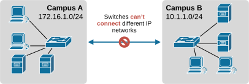
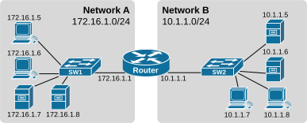
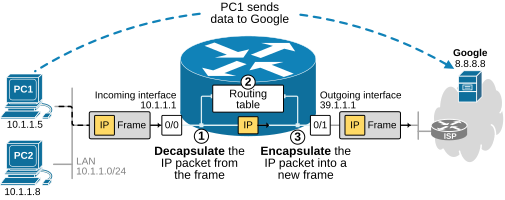
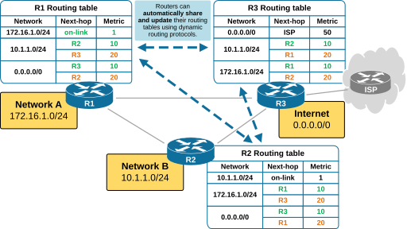
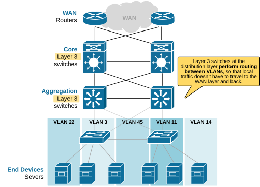

[Routers and L3 Switches](https://www.networkacademy.io/ccna/network-fundamentals/routers-layer3-switches)
==========

In this lesson, we examine the network devices **that operate at Layer 3 of the OSI model**. We start with the introduction of the network router and go all the way to modern layer 3 switches that are capable of performing IP routing at line rate.

Why do we need a network router?
--------------------------------

Let's go back to the 1980s. People were starting to build small local networks with a few devices. Eventually, they realized **these networks could be connected to each other** to exchange resources. But at the same time, switches can connect devices within the same network, but they can't connect different IP networks.

Figure 1. Two separate IP networks.

A switch operates within a single VLAN and broadcast domain, which matches one IP subnet. It uses **a flood-and-learn process** to flood frames with unknown MAC addresses to all devices within the VLAN.

A switch **does not read the IP header of packets**, so it doesn't know the source and destination IP addresses and cannot figure out how to send the packet to a different network. Since it operates at Layer 2, it cannot forward packets between different subnets.

Connecting two separate IP networks requires a device capable of reading and interpreting the IP headers of packets. That's what **the router** was invented to do.

What is a router?
-----------------

A router connects multiple switches and their networks to create a larger, interconnected IP network. In short, **a router enables communication between IP networks**, while a switch handles the communication within a local Ethernet network.

For example, we have two networks: 172.16.1.0/24 (A) and 10.1.1.0/24 (B). To link them, we use a router with one interface connected to each network.

Figure 2. Router connecting two networks.

The most common use case is your router at home that connects your local network (like 192.168.1.0/24) to the Internet Service Provider (ISP), which is another network (hence connecting networks).

**KEY NOTE:** End devices, like computers and servers, do not connect directly to a router. They connect to a switch, and the switch connects to a router (directly or via another switch).

How does a router work?
-----------------------

A router works by using destination IP addresses to decide where to send data between different networks. Every router has two main components:

- **Interfaces** — These are the physical or virtual ports that connect the router to different networks. Each interface belongs to a different subnet and has its own IP address. A router **can have only one interface in a network** because it is the device that separates networks.
- **Routing table** — This is a table inside the router that tells it where to send packets. Each entry shows a destination network, the next hop (or exit interface), and a metric or cost. The table can be built manually (static routes) or automatically (dynamic routing protocols).

Let's use the following diagram as an example. On the left, the router is connected to the network 10.1.1.0/24 with its 0/0 interface that has IP 10.1.1.1. On the right, it connects to the ISP with its 0/1 interface and IP 39.1.1.1. 

Figure 3. How does a router work?

Now, let's see what happens when PC1 sends data to Google:

1. The router receives a frame on the interface connected to the local LAN. It first **removes the frame and pulls the IP packet**. It then reads the IP header of the packet.
2. Once it knows the destination IP address, **it compares it against the entries in its routing table**. The routing table tells where to send the packet.
3. Once the router knows which interface it must use to forward the packet to the next hop, **it encapsulates it in a new frame** destined to the destination MAC address of the next hop device.

### IP routing starts at the host

The very first routing decision happens **before the IP packet even touches the network**. The host that originates the data creates an IP packet with a source and destination IP address. While doing it, it uses its own configured IP address, subnet mask, and the destination IP to figure out one of the following two scenarios: 

- **If the destination IP is on the same network**, it sends the packet directly to that device using ARP to find its MAC address. No router needed.
- **If the destination is on a different network**, the host knows it must send the IP packet to its configured default gateway — usually a router connected to the local network. It wraps the packet in a frame addressed to the router's MAC address and places it on the LAN.

Figure 4. Host IP routing.

**KEY NOTE:** It is essential to understand and remember that hosts begin the IP routing process.

### What is IP routing?

Routers forward traffic **according to their IP routing tables**. IP routing is the process of moving packets from one network to another using IP addresses as the "destination labels." A router looks at the destination IP in each packet, checks its routing table, and decides the best path to send that packet toward its destination.

Figure 5. Dynamic routing.

A router can build its routing table using two different methods:

- **Static routing** is when an administrator manually configures routes. The router uses these fixed routes to forward packets, and they do not change unless the administrator updates them.
- **Dynamic routing** uses routing protocols to learn and update routes automatically. Routers exchange information about network paths and choose the best routes based on metrics such as distance, cost, or speed.

Why do we need layer 3 switches?
--------------------------------

With the evolution of network designs, people realized that relying only on routers to perform IP routing is a disadvantage at a large scale. In the past, a switch could not route traffic between VLANs, so a router was required. However, sending all inter-VLAN traffic **up to the WAN layer through a router and back down to the access layer** is very inefficient.

Figure 6. Why do we need layer 3 switches?

A Layer 3 switch solves this by **performing routing directly in the switching hardware**, which is much faster than traditional software-based routing. This provides the flexibility of a router with the speed of a switch.

What is a Layer 3 switch?
-------------------------

A Layer 3 switch is a network device that **combines the functions of a switch and a router in one unit**.

Figure 7. What is a Layer 3 Switch?

Like a regular switch, it can forward frames at Layer 2 based on MAC addresses. At the same time, it can perform Layer 3 routing between VLANs or IP subnets using IP addresses, just like a router.

Key Takeaways
-------------

- Switches operate at Layer 2 and **forward frames within a single VLAN/subnet**. They cannot connect different IP networks.
- Routers operate at Layer 3 and **connect multiple IP networks** by reading IP headers and using routing tables to forward packets.
- **Hosts make the first routing decision**: if the destination is outside the local subnet, they send the packet to their default gateway (a router).
- IP routing can be static (manually configured routes) or dynamic (routes learned via routing protocols).
- Layer 3 switches combine switching and routing in one device, enabling high-speed inter-VLAN routing directly in hardware without relying on external routers.