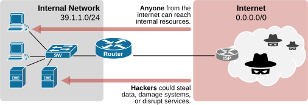
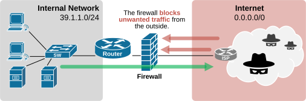
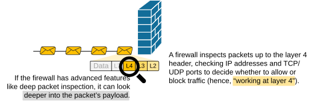
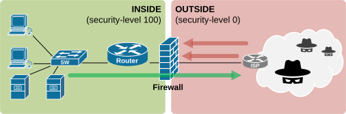
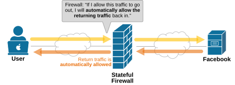
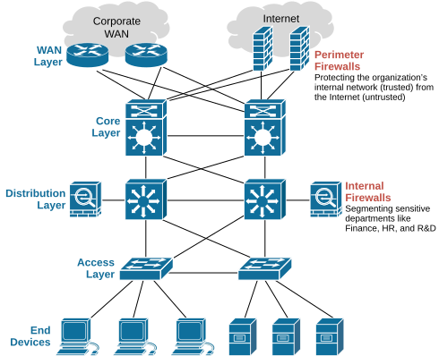

[Firewalls](https://www.networkacademy.io/ccna/network-fundamentals/firewalls)
==========

In this lesson, we examine the network firewall — a security device that operates **at Layer 4 of the OSI model** and guards the perimeter of the network.

Why do we need a firewall?
--------------------------

The Internet is not a friendly place. Every device connected to it is exposed **to millions of unknown systems and users**. Some of these are harmless, but many can try to steal data, disrupt services, or take control of the organization's internal systems.

The following diagram shows a small internal network connected directly to the Internet **without any protection**. Switches and routers are designed to move network traffic, not to stop attacks.



Figure 2. Why do we need a firewall?

A firewall acts as the first line of defense, most commonly at the perimeter of the network. It helps ensure that **only trusted traffic is allowed**, and suspicious or dangerous traffic is blocked before it reaches the internal network.



Figure 3. Firewall blocks unwanted traffic.

It checks network packets against the configured security rules to determine whether each packet should pass or be blocked.

How does a firewall work?
-------------------------

A firewall works at Layer 4 of the OSI model. This means it reads the headers from Layer 2, Layer 3, and Layer 4. It has all the information at its disposal, such as MAC addresses, IP addresses, and port numbers, and the transport protocol used (TCP or UDP). 



Figure 4. How does a firewall work.

With this information, the firewall makes the so-called **"6-tuple"** — a set of six key values from a packet's headers that a firewall can use to uniquely identify a specific network flow:

```
(Source IP,   Destination IP, Source Port, Destination Port, Protocol, Direction)
(192.168.1.10,  23.0.13.20,   51514,       443,               TCP,      Outbound)
```

### Inside and Outside zones

Another essential aspect is that a firewall works by separating the network into an inside (trusted) and outside (untrusted) zone:

- **The inside** is the trusted side. This is usually the organization's internal network.
- **The outside** is the untrusted side. This typically refers to the Internet or any network that the organization doesn't control.



Figure 5. Firewall zones.

Many firewalls, especially in Cisco networks, use a security-level value to define how trusted an interface is. Security levels range from 0 to 100:

- **Inside** interfaces are usually set to 100 (most trusted).
- **Outside** interfaces are usually set to 0 (least trusted).
- Any other network, like a **DMZ**, might be set somewhere in between (e.g., 50).

By default, **traffic is allowed to flow from higher security levels to lower ones** (inside to outside) but is blocked in the opposite direction (outside to inside) unless specific rules permit it.

### Stateful inspection

The firewall zoning with security levels is combined with another technique called **stateful inspection**. It means the firewall doesn't just look at each packet in isolation — **it tracks the state of active connections**.

- When a new connection is initiated (for example, a user opens a website), the firewall allows it because it comes from a higher security level (100) to a lower security level (0).
- When the traffic goes out, the firewall creates an entry in a state table with details like source/destination IP, ports, and protocol.
- Return traffic that matches this entry is automatically allowed, even if there's no explicit rule for it.



Figure 6. Stateful Firewall.

When the connection ends or times out, the entry is removed, and any further packets are blocked unless a new session is allowed.

Firewall use-cases
------------------

The most common place to deploy a firewall is **at the network perimeter** — between the organization's internal network (trusted) and the internet (untrusted).



Figure 7. Firewall placement.

Most organizations also use internal firewalls to segment the network. For example, an organization places a firewall between user networks and sensitive departments like finance or R&D.

Key Takeaways
-------------

- A firewall is **a Layer 4 security device** that protects the network perimeter by filtering traffic based on IP addresses, ports, and protocols.
- It separates the network into zones, usually **inside (trusted)** and **outside (untrusted)**, and can also include intermediate zones like a DMZ.
- Cisco firewalls use **security levels (0–100) to define trust**. 
    - By default, traffic is allowed from higher to lower levels, but blocked in the opposite direction. 
    - This provides out-of-the-box protection even without custom rules.
- **Stateful inspection** lets the firewall track active connections, automatically allowing return traffic while blocking unsolicited packets.
- Firewalls can be placed **at the perimeter** to filter Internet traffic or **inside** the network to segment and protect sensitive areas.