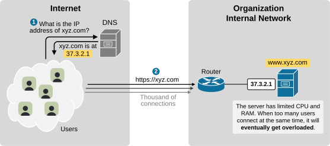
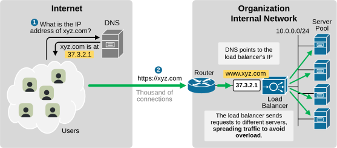
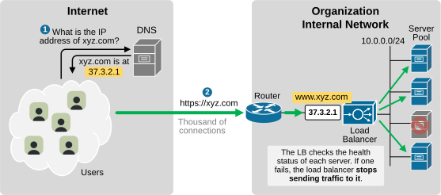
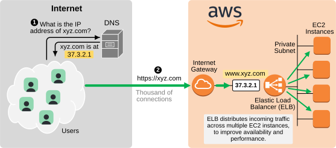

[Load Balancers](https://www.networkacademy.io/ccna/network-fundamentals/load-balancer)
==========

In this lesson, we will quickly discuss a common network device that operates at Layer 7 of the OSI model, called a Load Balancer. Although it is not part of the CCNA blueprint as of the latest version, the load balancer typically falls under the responsibility of the organization's network team.

Why do we need a Load Balancer?
-------------------------------

To understand why we need specialized network devices such as the load balancer, let's walk through the following example. Imagine that a company has an e-commerce web application (online store). The web address of the store is www.xyz.com.

Now, imagine that the web app runs on a single, very large and powerful server.

Figure 1. Why do we need a network load balancer?

It is evident that this design has several significant drawbacks — **it is not highly available and lacks scalability**. For example, if the server encounters a hardware problem and goes down, the online store goes offline.

Additionally, even if the server is perfectly healthy, **it will eventually get overloaded**. It has limited CPU, RAM, and network capacity. When too many users connect at the same time, it will become slow or unresponsive.

The first thing that comes to mind is to run the web application on multiple servers. But there's a problem: 

- Users access the online store via its domain name xyz.com. Before a user opens the web app, their PC first **resolves the domain name to an IP address** using DNS.
- However, DNS can only resolve a domain name **to a single IP address**. The URL xyz.com resolves to 37.3.2.1.

So if you have 100 servers, **where do you place the IP address 37.3.2.1** that the store's domain name resolves to?

A load balancer is a network device that is designed to solve this problem.

Figure 2. What is a network load balancer?

The solution is to place the e-commerce web app's IP address on the load balancer. DNS points to the load balancer's IP. All user HTTPS connections terminate at the load balancer. It then forwards each incoming connection to one of the backend servers. This **spreads the traffic across all servers**, preventing any single server from getting overloaded.

How does the load balancer work?
--------------------------------

A load balancer's main job is **to distribute incoming connections across a group of servers**. Because most traffic today is TLS-encrypted, the load balancer first handles HTTPS decryption by presenting the site's SSL certificate to clients. After that, it selects a backend server using a scheduling method such as Round Robin or Least Connections.

However, nowadays, a load balancer does many more functions than just spreading traffic across servers and performing TLS termination:

- **Health checking:** It monitors the status of servers and only sends traffic to healthy ones. If a server goes down, the load balancer automatically removes it from rotation.

Figure 3. Load Balancer High Availability.

- **Failover:** If one or more servers have to be taken offline for maintenance, it can redirect traffic to backup servers or even another data center.
- **Traffic shaping and routing:** It can direct requests based on rules, like sending certain types of traffic to the nearest geographic location.
- **Security functions:** It can block suspicious traffic and hide backend servers from the public network.
- **Horizontal Scalability:** A load balancer makes it possible to add or remove servers without disrupting users.

Popular Load Balancers
----------------------

### Hardware Load Balancers

The most popular and widespread vendor of hardware load balancers is F5. F5 appliances have been widely used in data centers for many years to handle large volumes of traffic and provide advanced features like SSL offloading, application firewall, and traffic shaping.

Figure 4. Popular Hardware Load Balancers.

Other known brands include Citrix (NetScaler) and A10 Networks.

### Virtual Load Balancers

Most modern load balancers are no longer physical hardware devices. Today, **most load balancers are virtual**. They run as software in the cloud or on virtual machines. For example, AWS Elastic Load Balancer (ELB) is not a physical device — it's a managed service.

Figure 5. AWS Elastic Load Balancer.

Key Takeaways
-------------

- Load balancers distribute traffic across multiple servers. They prevent overload and ensure high availability.
- They offload TLS decryption from servers.
- They perform health checks and route traffic only to healthy servers.
- They support failover and traffic shaping.
- They improve scalability, performance, and security.
- Popular vendors include F5, Citrix, A10, and AWS.