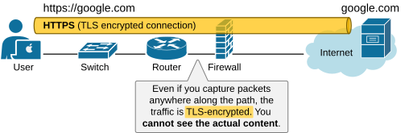
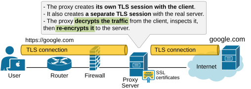
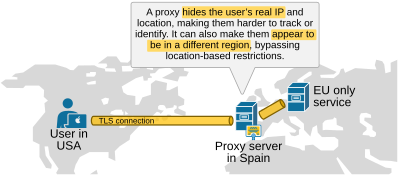
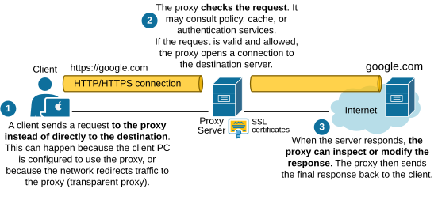
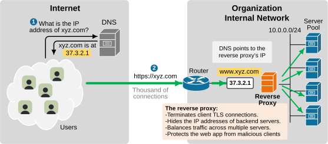
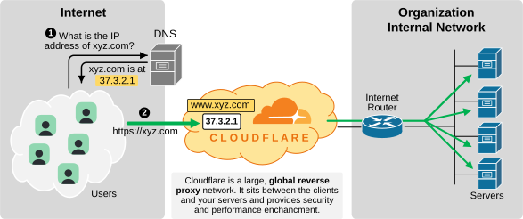

[Proxy Servers](https://www.networkacademy.io/ccna/network-fundamentals/proxy-servers)
==========

In this lesson, we explore another **specialized device** that often falls under the responsibility of the network or network security team in the organization. It is called a Proxy or Proxy Server.

Why do we need a Proxy Server?
-------------------------------

There are two main reasons people use a proxy. Let's go through each one with a simple high-level example.

### Security

Let's use a simple example to see why a proxy server is needed. Imagine you manage a company's infrastructure. Your job is **to protect sensitive data from being stolen**.

- Protecting against outside threats is straightforward — you can use firewalls **to block incoming connections** from unknown or unauthorized sources.
- But what about threats from the inside? How do you stop an employee from secretly uploading sensitive data to an external server?

To prevent that, you need a way to inspect user traffic and detect suspicious activity. The problem is that users connect to external servers over encrypted TLS connections. Even if you capture their traffic anywhere along the path, **you won't be able to see what they're doing.** The data is encrypted.

Figure 1. Why do we need a Proxy Server?

The only way to see the decrypted content is if you have a device that **terminates the TLS session in the middle**. One of the primary functions of proxy servers is to decrypt the TLS traffic, inspect it, and then re-encrypt it for transmission to the outside server.

Figure 2. Proxy Server terminating TLS connections.

Proxies allow organizations **to enforce corporate security policies on TLS-encrypted connections.** They can block categories of websites and log user activity for audits.

### Privacy and Anonymity

Privacy and anonymity are also reasons to use proxies. A forward proxy can hide client IP addresses from outside servers.

Figure 3. Proxy server providing privacy and anonymity.

### Performance

Finally, proxies help with performance as well. **A proxy can cache responses**. If many users request the same content, the proxy can serve it from cache. This reduces bandwidth use and speeds up user access.

How Does a Proxy Work?
----------------------

The most important property of a proxy is that it always sits between the client and the server, relaying requests.

Figure 4. How does a proxy work?

- A client sends a request to the proxy instead of directly to the destination.
- The proxy checks the request. It may consult policy, cache, or authentication services. 
    - If the requested content is in cache and is valid, the proxy returns it immediately. 
    - If not, the proxy opens a connection to the destination server and forwards the request. 
- When the server responds, the proxy can inspect or modify the response. The proxy then sends the final response back to the client.

### Types of Proxy Servers

- A **forward proxy** represents one or more CLIENTS to the outside world. **It handles outbound requests** and can enforce corporate policies. 
- A **reverse proxy** represents one or more SERVERS to outside clients. **It handles inbound requests** and can provide load balancing, TLS termination, and web application security.

Also, proxies can be classified as explicit or transparent:

- In **explicit** mode, clients are explicitly configured to use the proxy. **Clients know the proxy exists**.
- In **transparent** mode, the network redirects traffic to the proxy **without client configuration**.

What is a reverse proxy?
------------------------

Let's pay special attention to the type of proxy that handles inbound requests — the reverse proxy. It is a server that sits in front of web servers and forwards client requests to them.

Figure 5. What is a reverse proxy?

It hides the identity of backend servers from clients and can distribute traffic among multiple servers. Reverse proxies are often used for load balancing, security, and caching.

Where Does a Proxy Fit in Modern Network Designs?
-------------------------------------------------

- **A forward proxy** for web access typically sits at the network edge, between the internal LAN and the Internet.
- **A reverse proxy** sits at the perimeter facing the internet. It often lives in the DMZ.

### Cloud Reverse Proxy

Most modern reverse proxy functionalities are now consumed as SaaS. For example, Cloudflare is the most widely adopted global reverse proxy that lives in the cloud.

Figure 6. Cloudflare - Global Reverse Proxy.

Reverse Proxy vs. Load Balancer
-------------------------------

From a functionality point of view, a reverse proxy and a load balancer partially overlap, but each is specialized in its domain:

- The load balancer specializes in **spreading the traffic to backend servers**.
- The reverse proxy specializes in **inspecting and protecting the backend servers** from rogue clients.

Key Takeaways
-------------

- A proxy is a middleman between clients and servers, relaying requests.
- Proxies improve security by decrypting and inspecting TLS traffic.
- They provide privacy by hiding client IPs and bypassing geo-restrictions.
- Proxies boost performance with caching to reduce bandwidth use.
- **Forward proxies** control outbound access.
- **Reverse proxies** protect inbound servers.
- Cloud-based reverse proxies (e.g., Cloudflare) add global security and speed.