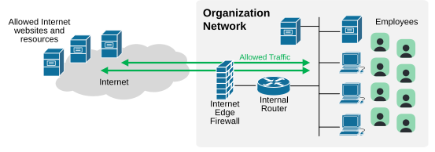
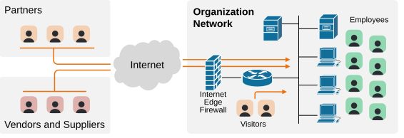
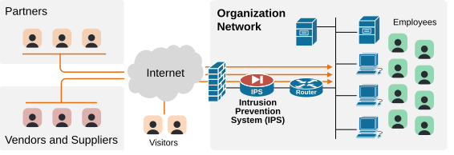
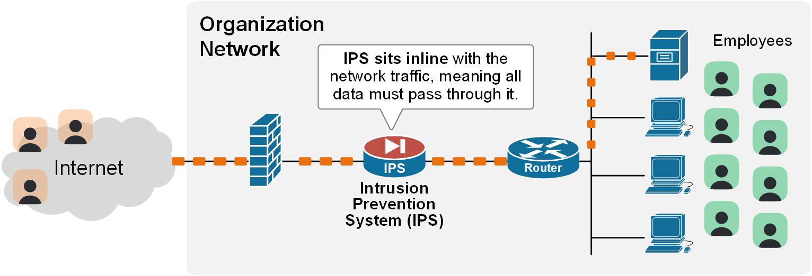
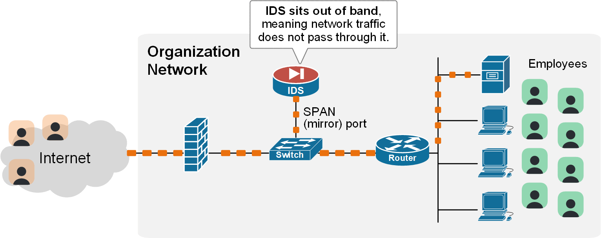
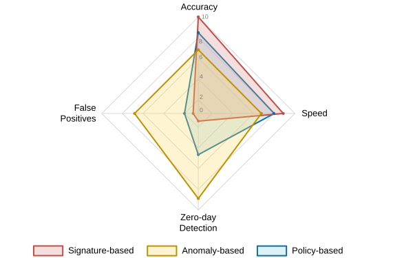

[Intrusion Prevention System (IPS)](https://www.networkacademy.io/ccna/network-fundamentals/intrusion-prevention-system-ips)
==========

In this lesson, we are discussing a specialized network security device called an Intrusion Prevention System (IPS). It is part of the latest CCNA blueprint and a crucial part of the modern network security portfolio.

Why do we need an IPS?
----------------------

When an organization is small, it typically has only a small number of internal employees accessing its infrastructure. In that case, protecting the business-critical infrastructure and data is simpler. You can probably get away with only a firewall that does inspection on the edge of the network.

Figure 1. Small Organization.

However, when the organization grows bigger, **so does the number of different people who access the infrastructure**. They are not only employees anymore — you have partners, vendors, contractors, suppliers, visitors, and so on. The attack surface grows significantly.

The result of this larger attack surface is that the network security team punches many holes in the edge firewall to allow connections from the outside.

Figure 2. Large Organization giving access to 3rd party.

When you give network access to third-party organizations, you are **opening your infrastructure to several risks**. Third-party computers, laptops, and servers **may be infected with malware or viruses.** Additionally, you cannot be fully sure that the person logging in is actually the one you approved.

However, at the same time, your Internet-edge firewall has **no way of differentiating between legitimate and malicious login attempts**. The firewall lets all login attempts through. Its job is to check if the traffic is "allowed," not to decide if the person sending it and their behavior is suspicious. 

That's where the Intrusion Prevention System comes into play. 

What is an Intrusion Prevention System (IPS)?
---------------------------------------------

First, let's emphasize that networks nowadays are under constant attack. Malware and bots are automated and operate 24/7. With the advancement of AI agents, it will only get worse. 

Firewalls are effective at controlling traffic based on IP addresses, ports, and protocols, but **they are not designed to detect patterns of attacks that utilize explicitly allowed connections**. For example, the firewall allows port 22 (for SSH). It cannot detect an attacker trying to infiltrate the SQL database through an SSH connection.

An IPS fills this gap. An Intrusion Prevention System (IPS) is a network security device that sits inline with network traffic.

Figure 3. What is an IPS?

The IPS understands Layer 3, 4, and 7 packet headers, packet content, and traffic behavior. **It can automatically block malicious activity** in real-time if it detects that the user or connection behaves abnormally or matches a known attack pattern.

### Types of Intrusion Systems — IPS vs IDS

Every modern security system that performs the functions we explained so far is actually called an IDPS (Intrusion Detection and Prevention System). That's because it can be configured to operate in two modes: 

- IDS (Intrusion Detection System) mode.
- IPS (Intrusion Prevention System) mode.

A **false positive** is when a security system wrongly identifies normal, legitimate traffic or activity as malicious.

#### IPS mode

In IPS mode, the device sits inline with the traffic, so **all packets pass through it**.

Figure 4. What is an Intrusion Prevention System (IPS)?

If an IPS detects an attack, it blocks the traffic right away. Hence, it is most useful in places **where security outweighs the risk of false positives**. For example, at the network edge, in data centers, or in environments with strict compliance requirements.

However, the other side of the coin is that an IPS will inevitably block some legitimate connections. The algorithm will always have some percentage of false positive alarms.

#### IDS mode

On the other hand, an IDS (Intrusion Detection System) only monitors traffic. It sits out of the way of network traffic, reads a traffic copy, and alerts security admins when it sees suspicious activity. It does not stop the traffic itself.

Figure 5. What is an Intrusion Detection System (IDS)?

IDS is useful in cases where you want visibility but don't want the risk of blocking legitimate traffic because of false positives. Since IDS only alerts and doesn't sit in line, it won't affect production traffic.

How does an IPS work?
---------------------

An IPS uses several methods to identify and block threats. It typically uses three different methods:

Figure 6. IPS Pillars of detection.

1. **Signature-Based Detection** — The IPS has a database of signatures (unique patterns) for known attacks. If a packet's content matches a known signature, the IPS immediately flags it as malicious. Very accurate and fast, but can't stop zero-day attacks.

2. **Anomaly-Based Detection** — The IPS builds a baseline of typical traffic patterns. Once it understands the baseline, it identifies behavior that deviates from the norm. Excellent for catching zero-day threats, but can have many false positives.

3. **Policy-Based Detection** — The IPS enforces rules that define what traffic is allowed or not allowed based on organizational security policies.

### What Actions Can an IPS Take?

- **Alert and Log:** Creates a syslog entry and sends an alert.
- **Drop the Packet:** Discards the malicious packet.
- **Reset the Connection:** Sends a TCP reset packet to both sides.
- **Block the Source (Quarantine):** Adds the source IP to a block list.

Why is an IPS important?
------------------------

- **Stops Zero-Day attacks:** A modern IPS can provide crucial protection against attacks that have never been seen before (which a firewall cannot).
- **Stop insider threats:** Anomaly detection can also spot a compromised user account (which a firewall cannot).
- **Ensures compliance:** Many regulatory requirements, like PCI DSS and HIPAA, require IDPS systems.

Key Takeaways
-------------

- An IPS is a proactive security tool that sits inline with traffic and **actively stops threats**.
- On the other hand, IDS sits out of the traffic way and **only detects attacks**.
- The three IDPS primary detection methods are:
    - Signature-based.
    - Anomaly-based.
    - Policy-based.
- Common IPS actions include dropping packets, resetting connections, and blocking source IP addresses.
- An IPS provides a crucial layer of defense, especially against zero-day attacks, and is usually **required for regulatory compliance**.