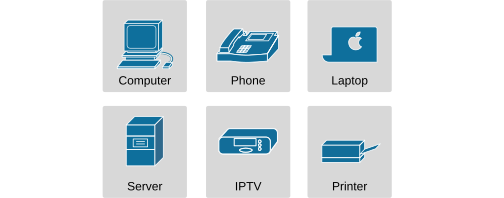
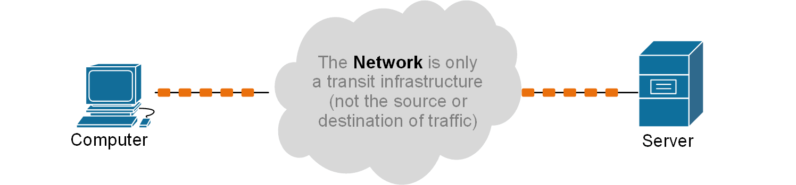
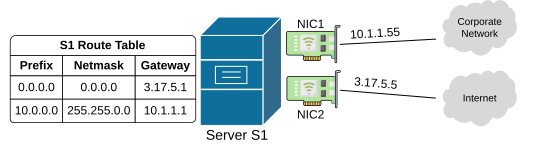
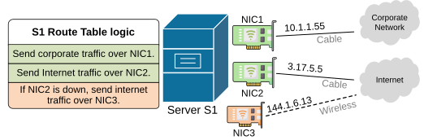
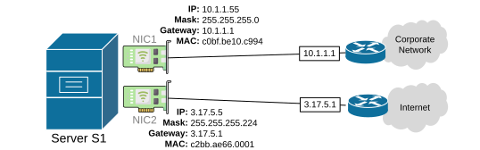

[Endpoints (End Devices)](https://www.networkacademy.io/ccna/network-fundamentals/end-devices)
==========

This lesson covers the topic of end devices, also referred to as endpoints in the CCNA blueprint.

What are end devices (endpoints)?
---------------------------------

First, let's start with the fact that we are going to use the terms "end devices" and "endpoints" interchangeably in this lesson. Sometimes, we will also throw in the term "end hosts" as well.

End devices refer to all computers and gadgets located at the edge of the network. Common ones include PCs and laptops, servers (web, mail, file, database), mobile devices (smartphones and tablets), VoIP phones, printers, and IoT devices such as cameras and sensors. 



Figure 1. End Devices Icons.

### Endpoints are source and destination of traffic

Cisco chooses to use the term "endpoints" to emphasize that **end devices are the source and destination of traffic**. Traffic originates and ends at an end device (hence the term end-point). The network just serves as a transit infrastructure that transports data between endpoints.



Figure 2. Endpoint are the source and destination of traffic.

Think of the network as a nationwide road network. The roads and highways are essential, **but nobody travels just to "be on the road."** You don't get in your car and say, "Today, I want to reach Road 45." Instead, you want to visit a friend, go to a store, or reach a workplace.

Networks are the same. Routers, switches, cabling, and wireless links are like highways, roads, and crossings. The actual **destinations are the endpoints** — laptops, web servers, printers, phones, or other connected gadgets.

### Endpoints have one or more network cards (NICs)

Each endpoint connects to the network **by Network Interface Cards (NICs)**. Most CCNA students assume that one end device has one NIC and one network attachment. However, some devices have more than one network interface.



Figure 3. Server with multiple NIC cards.

This shift in perspective opens the door for many subsequent questions. For example, if a server has two NICs connected to two networks, how does it know where to send different kinds of traffic?

### Routing starts at endpoints

Remember — every endpoint has routing logic. It doesn't matter if it is a laptop or a simple gadget connected to the WiFi. It has a routing table. It is usually straightforward, but it still involves routing. Most hosts use a routing table with at least a local network entry and a default route that points to the default gateway. 

But hosts can have more than just a default gateway. A host can have static routes. It can have a VPN that pushes routes to it. It can also use multiple interfaces with different routing behaviors.



Figure 4. Endpoint routing logic.

**KEY POINT:** Routing starts at endpoints. They choose the first hop in the network.

The following shows a real output of a Windows 11 workstation's routing table:

```
C:\> route print

IPv4 Route Table
===========================================================================
Active Routes:
Network Destination        Netmask          Gateway       Interface  Metric
          0.0.0.0          0.0.0.0       3.17.5.1       3.17.5.5      35
          0.0.0.0          0.0.0.0      144.1.6.1      144.1.6.13     200
          10.0.0.0         255.0.0.0     10.1.1.1       10.1.1.55     25
        10.1.1.0    255.255.255.0       On-link        10.1.1.55      35
       10.1.1.55  255.255.255.255       On-link        10.1.1.55      35
      10.1.1.255  255.255.255.255       On-link        10.1.1.55      35
        3.17.5.0    255.255.255.0       On-link         3.17.5.5      45
        3.17.5.5  255.255.255.255       On-link         3.17.5.5      45
      3.17.5.255  255.255.255.255       On-link         3.17.5.5      45
      144.1.6.0    255.255.255.0       On-link        144.1.6.13      25
     144.1.6.13  255.255.255.255       On-link        144.1.6.13      25
    144.1.6.255  255.255.255.255       On-link        144.1.6.13      25
        127.0.0.0    255.0.0.0          On-link        127.0.0.1     331
        127.0.0.1  255.255.255.255      On-link        127.0.0.1     331
  127.255.255.255  255.255.255.255      On-link        127.0.0.1     331
===========================================================================
```

#### Addressing and identification of end devices

Another important aspect of endpoints is that they participate in addressing. Every device connected to the network needs a unique identity. 

- At Layer 2, each NIC interface has a MAC address. The MAC is hardware-based and unique per port.
- At Layer 3, each NIC interface has an IP address. IP addresses can be static or assigned by a DHCP server. 



Figure 5. Endpoint addressing.

Additionally, modern identity can also include **hostnames, device certificates, and OS-based signatures**.

For CCNA, we focus on MAC addresses, IP addresses, and hostnames. They are the primary identifiers you will use when troubleshooting issues related to end hosts.

Endpoint security
-----------------

Endpoints are the most common targets of cyber attacks. Additionally, they are the hardest to protect because they move between trusted and untrusted networks. They can be stolen or misconfigured.

**KEY POINT:** Corporate security begins at the endpoints.

Some of the common security measures that we implement on the network include:

- DHCP snooping, dynamic ARP inspection, and IP source guard to limit attacks that originate from endpoints. 
- 802.1X to force device authentication before network access. 
- VLANs to segment different device types. 
- ACLs and firewall rules to block untrusted traffic.

Key takeaways
-------------

Endpoints are the start and end of all communication. They create and consume packets. They decide the first routing hop. That first hop might be the default gateway or a different Layer 3 next hop from a static route or VPN. Endpoints maintain routing and ARP tables. They have MAC, IP, and hostname identities. They are common security targets and must be secured and monitored.

Remember that switching and routing begin at the edge, not at switches and routers.