[Generic topologies - Ring, Star, Bus](https://www.networkacademy.io/ccna/network-fundamentals/generic-topologies-ring-star-bus)
==========

What are the generic network topologies, like Ring, Star, Bus, Tree, etc? Are they really a thing? The short answer is yes, they are a thing, but practically speaking, they are not really a thing. They are contextual phrases that were used in the old days to describe how several devices are interconnected.

Generic Topologies — Ring, Star, and Bus
----------------------------------------

Topology means how nodes in a network connect to each other — the network topology. In networking, it describes how computers, switches, routers, and other devices are arranged and how data flows between them.

### Physical vs Logical Topology

We separate the networking topology into physical and logical ones.

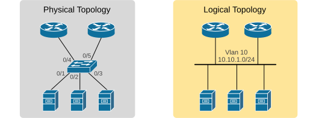

Figure 1. Physical vs. Logical Topology.

- **Physical topology** is what you can see — the cables, switches, routers, and how they are physically connected.
- **Logical topology** is about how data actually flows between devices.

In modern networks, **we often have one physical topology and a completely different logical one**. When you read "topology" in the Cisco exam environment, always ask yourself — are they talking about the physical connections or the logical flow of traffic?

### Network Topology Types

Let's say we have six nodes numbered 1 through 6.

Figure 2. Six nodes to interconnect.

The terms Ring, Star, and Bus refer to the most fundamental ways of interconnecting them.

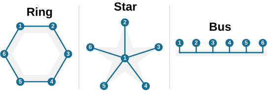

Figure 3. Ring, Star and Bus topologies.

### Ring

In a ring topology, each device connects **to exactly two others** — forming a closed loop or ring. Data travels in both directions from one device to the next until it reaches its destination.

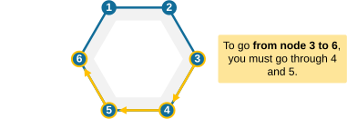

Figure 4. Ring topology traffic path.

Ring topologies first appeared with Token Ring, an old IBM technology from the 1980s. In Token Ring, a special "token" circulates around the ring, and **only the device holding the token can send data**. Token Ring is a thing of the past.

#### Ring topologies in modern networks

Where can you encounter a ring topology in the modern world? One use case is oil and gas pipelines over vast distances and underground tunnels of mines. A fiber-optic cable is usually installed along with the pipeline.

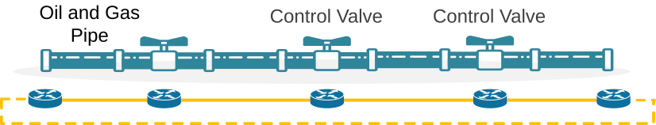

Figure 5. Oil Pipe.

Because of the availability of only a single fiber cable, **you cannot really connect the routers in any other way** other than a ring topology.

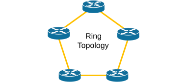

Figure 6. Ring — real world example.

Challenges: harder to reconfigure or scale; fault detection can be slow; a single fiber cut can break the ring; adding/removing devices causes interruption of the entire ring.

### Star

The star topology is **by far the most common in modern LANs**. Every device connects to a central device, like an aggregation switch.

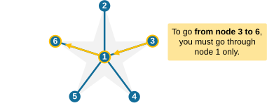

Figure 7. A star topology example.

If one device fails, it doesn't affect others. However, if the central switch fails, the whole network is down — that's the single point of failure (SPOF).

Ethernet switched networks today are essentially star topologies.

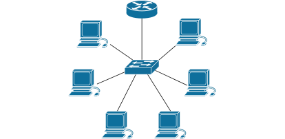

Figure 8. Example of a star topology.

Advantages: **you can easily add or remove devices** without interrupting other connected nodes; one link failure **affects only one device**. Disadvantage: **it requires more cables**.

### Bus

In a bus network, all devices share a single communication line — the "bus." It is a thing of the past when coaxial cables and hubs connected multiple devices.

The main property of the bus is that every node can communicate with every other "directly," without passing through any intermediate node.

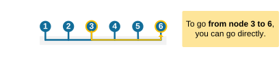

Figure 9. Bus.

Today, we don't use bus topology in modern LANs. Bus topology nowadays **refers only to the logical Ethernet/VLAN topologies**.

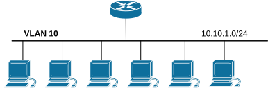

Figure 10. Bus example.

More complex topologies
-----------------------

### Tree

The tree topology (also called a hierarchical topology) combines characteristics of multiple stars.

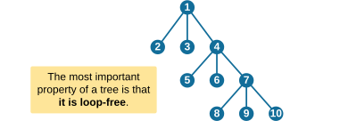

Figure 11. Tree topology.

Each branch can have its own star-like structure, connected to the layer above it. This design makes it scalable. The tree topology is found everywhere — from spanning-tree loop-free topology to multicast distribution trees.

### Mesh

In a mesh network, every device is connected to every other device, providing several possible paths for data to travel.

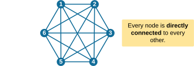

Figure 12. Full-mesh.

- **Full Mesh** — every device is connected directly to every other device. Complete redundancy, but the number of links increases rapidly: n(n–1)/2.
- **Partial Mesh** — only some devices have multiple connections.

Mesh topologies are common in WANs and data centers. The Internet itself is a massive partial mesh.

Key Takeaways
-------------

- **Bus:** One shared segment — each hop can communicate directly with the others.
- **Ring:** Closed loop — predictable but fragile. Hard to add/remove devices.
- **Star:** Central device — simple and reliable for LANs. Easy to add/remove devices.
- **Tree:** Hierarchical — scalable and organized. Loop-free.
- **Mesh:** Redundant — great for reliability, expensive to scale.
- **Physical vs Logical:** One shows cables, ports, connections; the other shows logical data flow.