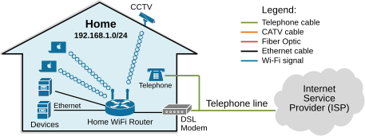
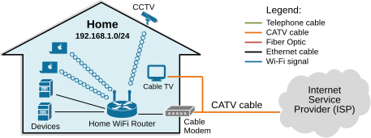
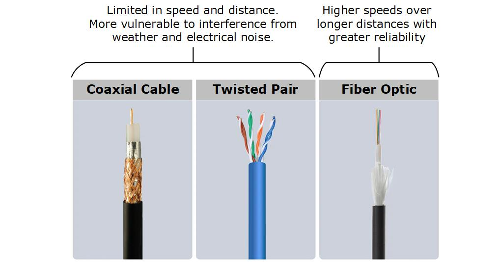
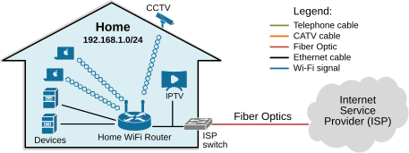
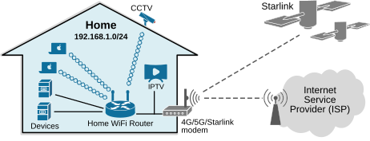
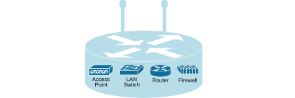
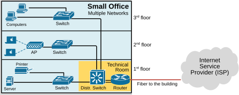
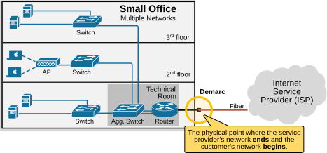

[Small Office Home Office (SOHO)](https://www.networkacademy.io/ccna/network-fundamentals/soho)
==========

In this lesson, we will explore the various technologies and devices utilized by Small Office Home Office (SOHO) networks.

The Home Network
----------------

For some people, the home network is synonymous with their home Wi-Fi router. Others don't even think about the network at all. However, as a CCNA candidate, it is important to start noticing the different types of home networks through the eyes of a network engineer.

### Legacy Home Internet Technologies

#### DSL (Digital Subscriber Line)

DSL is a technology that provides Internet access using the existing telephone line in a house.

Figure 1. DSL Home Internet.

DSL works using **a modem** that connects to the telephone jack in the house. On the other end of the telephone line, at the service provider's location, special equipment separates the voice and data traffic:

- **Voice** traffic uses the lower frequencies on the line.
- **Data** traffic uses the higher frequencies on the line.

This means you can talk on the telephone and use the Internet at the same time without interference.

DSL is still widely used today in some parts of the world, but will eventually be replaced by faster technologies.

#### Cable Internet

Cable Internet uses the existing cable TV infrastructure (coaxial cable) to provide high-speed Internet.

Figure 2. CATV Home Internet.

The coaxial cable is plugged into **a cable modem**. The modem separates the TV signals from the data signals. On the provider's side, the coaxial cable connects to a Cable Modem Termination System (CMTS). Cable Internet is usually much faster than DSL, with speeds of up to 1-2 Gbps.

### Modern Home Internet Technologies

Both DSL and Cable Internet rely on copper cables. However, copper is sensitive to outside conditions and has distance limitations.

Figure 3. Copper vs. Fiber cables.

Fiber uses glass instead of copper, making it immune to electrical interference, storms, and lightning. Fiber can carry data over much greater distances without losing signal quality.

#### Fiber to the Home (FTTH)

With Fiber to the Home (FTTH), the fiber-optic line runs all the way from the provider directly into your home.

Figure 4. Fiber-to-the-home (FTTH) Internet.

The fiber can terminate on an ISP-owned switch or media converter, or can connect directly to your home Wi-Fi router.

#### 5G and LEO Satellites

Starlink is a satellite Internet service that uses thousands of small satellites in low Earth orbit (LEO). 5G Internet uses the same 5G mobile technology to provide Internet for an entire home.

Figure 5. Wireless Modern Home Internet.

### The Home Wi-Fi Router

A typical home office network usually has just one main device: the home Wi-Fi router. This single box works as a switch, router, firewall, and wireless access point all in one.

Figure 6. Home Wi-Fi routers.

Office networks usually have more devices, **each serving a specific function** — separate switches, routers, firewalls, and access points.

Small Office network
--------------------

In an office building, the LANs usually start with switches placed in wiring closets. From there, Ethernet cables run to cubicles and meeting rooms. Most offices also set up wireless LANs in the same spaces.

Figure 7. Small Office.

The diagram shows how a LAN connects to a WAN using a router. On the LAN side, the router uses a regular Ethernet copper cable. On the WAN side, the router uses fiber to connect to the ISP.

### What is a Demarcation Point?

The demarcation point (or demarc) is the physical point where **the service provider's network ends and the customer's network begins**.

Figure 8. What is a demarcation point?

In an office, the provider might bring in a fiber or copper line to a technical room, and from that **demarc** point, the company's IT team connects it to their own routers, switches, and LAN infrastructure.

Key Takeaways
-------------

The goal of this lesson is to give you **an introduction to the different types of small networks**. Think about the home networks you've used — each one probably relied on a different technology: DSL, cable Internet, fiber, or mobile networks. Start making a habit of noticing what kind of network is around you when you visit new places.