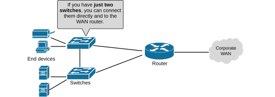
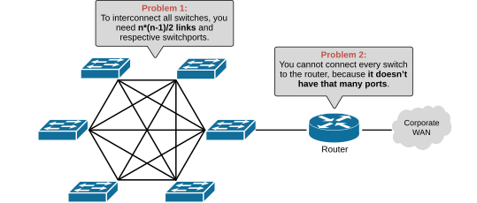
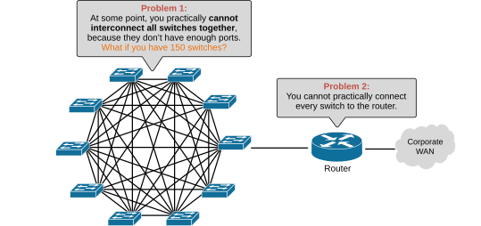
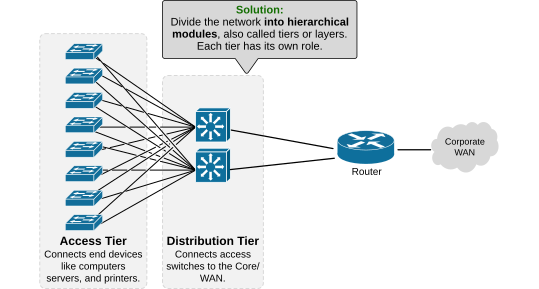
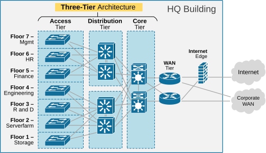
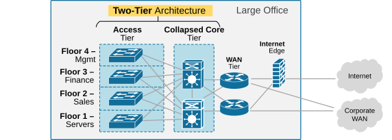

[Three-Tier Architecture](https://www.networkacademy.io/ccna/network-fundamentals/three-tier-architecture)
==========

In this lesson, we explore the network design of Enterprise local area networks (LANs). We cover only the high-level fundamentals of the network structure.

Why do we need Hierarchical (Modular) Network Designs?
------------------------------------------------------

### Different problems at different scales

Some problems only show up at a specific scale. There is no universal standard for "small, medium, large, and very large" network sizes. Here's a practical breakdown:

- **Small-scale** (SOHO): up to 50 devices.
- **Medium-scale** (Average company): 50–500 devices.
- **Large-scale** (Enterprise): 500–5,000 devices.
- **Very large-scale** (Service Provider): 5,000–50,000+ devices.
- **Hyperscalers** (AWS, Azure, Google): Millions of devices across global data centers.

#### Network with two switches

Suppose you are responsible for designing **a network with one or two switches** and one router connected to the Internet.

Figure 1. Network with two switches.

You can connect them however you want, and the network will work just fine.

#### Network with six switches

Let's introduce several more devices.

Figure 2. Network with six switches.

Even though we only increased the number of devices by a few, some problems started to show up. If you interconnected all the switches in a full mesh, you would need 15 links and 5 ports on each switch.

#### Network with ten switches

If you have 10 switches, a full mesh needs 10*9/2 = 45 links.

Figure 3. Network with ten switches.

If you have 150 switches and want to connect them in a full mesh, you will need 150*149/2 = 11,175 links and 149 ports on each switch. Obviously, it is impossible.

**KEY NOTE:** Some network problems only show up at a particular scale. As the network grows, problems become much more serious, and a proper network design is a must.

#### The solution

The solution is to use a modular (hierarchical) network design. Instead of building a giant mesh, the network is broken into layers (also called tiers or modules).

Figure 4. Network Tiers (Layers).

This structure means each access switch only needs two uplinks to connect to the distribution layer, no matter how many access switches you add.

### Three-Tier Architecture

The Cisco three-tier architecture divides the full-mesh network into distinct layers (also called tiers or modules).

Figure 5. Three-Tier Hierarchical Architecture.

As the name implies, the three-tier architecture has three layers: **access**, **distribution**, and **core**. 

- **The access layer** is where end devices like computers, servers, and printers connect to the network. 
- **The distribution layer** sits in the middle and connects all the access switches together. It is also where routing, VLAN communication, and security policies are usually handled. 
- **The core layer** is the backbone of the network. It links multiple distribution switches, often spread across buildings. Its main job is to move traffic very quickly and reliably.

In the three-tier design, each switch only needs two uplinks, so cabling and switchport costs are much lower. The layout is clear and structured, which makes it easier to design and maintain.

**Complex fails, simple scales.**

### Two-Tier Architecture

The two-tier architecture, also called **a collapsed core**, is a simpler version of the three-tier design, where the distribution layer and the core layer are combined into one.

Figure 6. Two-Tier Hierarchical Architecture.

- **The access layer** is still where devices connect. 
- **The collapsed core layer** handles both roles of distribution and core.

This design is usually used in small and medium-sized networks where the cost and complexity of a separate core layer are not needed.

Key Takeaways
-------------

- At a small scale, any design works, but as the number of switches grows, a full mesh becomes wasteful and unmanageable. 
- Hierarchical (modular) network design solves the scalability issues of a full mesh network by dividing it into two or three layers.
- The **two-tier** (collapsed core) architecture simplifies the design for smaller networks by combining distribution and core into one layer.
- The **three-tier** architecture separates access, distribution, and core layers, making networks scalable, efficient, and easier to troubleshoot.