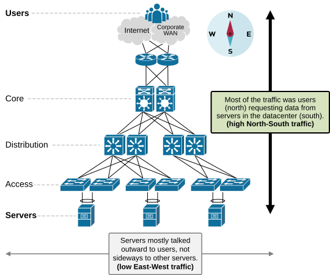
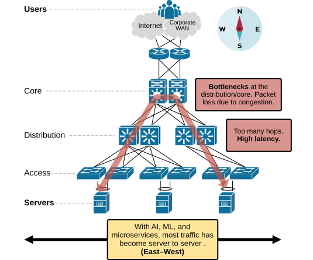
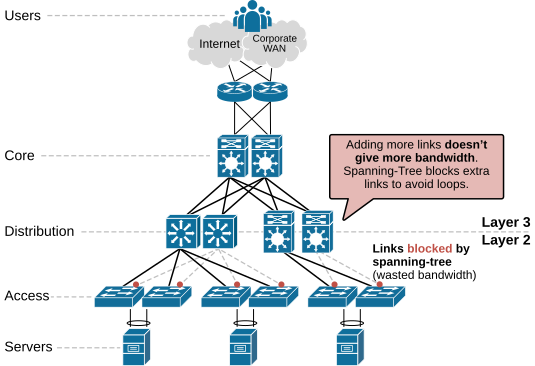
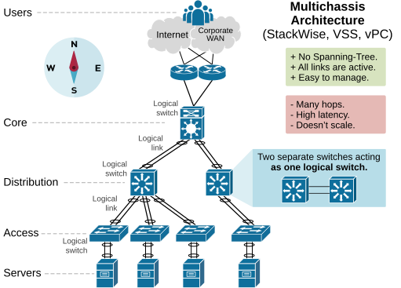
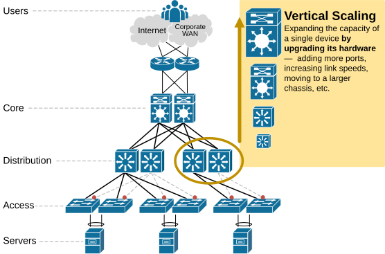
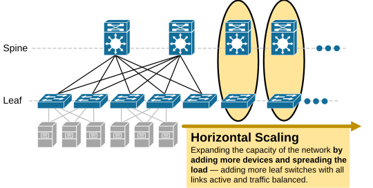
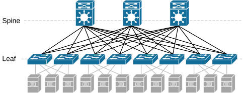
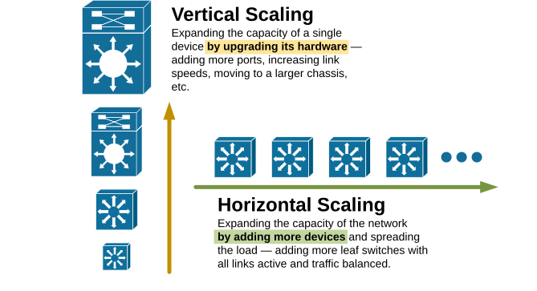

[Leaf-Spine Architecture](https://www.networkacademy.io/ccna/network-fundamentals/leaf-spine-architecture)
==========

In this lesson, we explore the most modern data center network design called the Leaf-Spine architecture. It is currently the most widely adopted data center LAN topology.

Different problems at different scales
--------------------------------------

One key thing to remember about network architecture is that some problems only appear at certain scales. When you learn a new technology or design, always ask yourself — **How does this technology scale?**

For our lesson, we'll use the following practical numbers:

- **Small-scale** (SOHO): up to 50 devices.
- **Medium-scale** (average company): 50–500 devices.
- **Large-scale** (enterprise): 500–5,000 devices.
- **Very large-scale** (service provider): 5,000–50,000+ devices.
- **Hyperscalers** (AWS, Azure, Google): millions of devices across the globe.

A flat OSPF design works fine in a small network with 1-100 devices. But what happens if you have 200 routers? Suddenly, a flat design won't work — you need to break the network into OSPF areas.

**Some network problems show up only at a certain scale.**

Why do we need Leaf-Spine architecture?
---------------------------------------

### The three-tier design at scale

The leaf-spine architecture was introduced **because the three-tier design doesn't scale** in the modern data center.

#### The modern datacenter traffic pattern

In the past, before virtualization, cloud computing, ML, and AI, most business applications were monolithic. This was the **client-server era**. Almost all traffic went in and out of the data center (North–South traffic).

Figure 1. Three-Tier architecture typical traffic.

Then, cloud and microservices arrived. Applications evolved from monolithic blocks to microservices that **began communicating with each other** within the data center. This shifted the traffic pattern **from mostly North–South to mostly East–West**.

Figure 2. Three-Tier architecture inefficiencies.

For example, a server on the left wants to talk to a server on the right. The traffic goes up from Access → Distribution → Core → back down to the other Distribution → Access. This adds multiple extra hops, more latency, and possible bottlenecks.

#### Bandwidth Efficiency and Growth Speed

Another problem of the three-tier design is its inability to use all available bandwidth. The access tier connects to the distribution at layer 2, using Spanning Tree Protocol (STP) to prevent loops. STP blocks some of the redundant links, so not all physical links carry traffic at the same time.

Figure 3. Three-Tier architecture, STP problem.

### Modern Three-Tier (Multichassis architecture)

In a multichassis three-tier design, **every pair of switches is combined into a single logical switch** using technologies like VSS or StackWise Virtual.

Figure 4. Multichassis architecture.

Because every pair of switches and cables appears as one logical system, STP does not need to block any of the links. However, the three-tier design still scales only vertically (scale-up), which is slow and expensive.

What is Scalability?
--------------------

Scalability is **the ability of a network to handle more traffic as demand grows**. There are two main ways to scale:

### Vertical Scaling (Scaling Up)

Vertical scaling means making a single switch more powerful. You replace existing switches with more powerful ones.

Figure 5. What is Vertical Scaling?

### Horizontal Scaling (Scaling Out)

Horizontal scaling involves increasing network capacity by adding more switches rather than upgrading existing platforms.

Figure 7. What is Horizontal Scaling?

- Vertical scaling = upgrade some switches to more powerful platforms.
- Horizontal scaling = add more leaf switches.

Leaf-Spine Architecture
-----------------------

The leaf–spine design solves the inefficiencies of the three-tier design by:

- Collapsing the three tiers into two tiers (leaf and spine).
- Removing STP by using IP routing on all links.
- Using horizontal scaling (scale-out) instead of vertical (scale-up).

Figure 6. Leaf-Spine Architecture.

**Every Leaf switch connects to every Spine switch.** This makes the path between two servers predictable — always two hops.

### Horizontal Scaling

Horizontal scaling involves increasing network capacity by adding more switches rather than upgrading existing platforms. The load is spread across multiple devices and links. This makes the network not only scalable but also more reliable.

Figure 8. Comparing horizontal and vertical scaling.

Key Takeaways
-------------

- Leaf-Spine is the leading modern data center design for high-speed east–west traffic.
- It replaces the three-tier architecture, which struggles with server-to-server communication and bandwidth inefficiency.
- Three-tier **relies on vertical scaling and Spanning Tree**, causing bottlenecks and blocked links.
- Leaf-Spine collapses core, distribution, and access into two tiers and removes STP using IP routing.
- **Every leaf switch connects to every spine switch**, ensuring predictable two-hop paths.
- Horizontal scaling allows adding more leaf switches for growth, redundancy, and efficient bandwidth use.