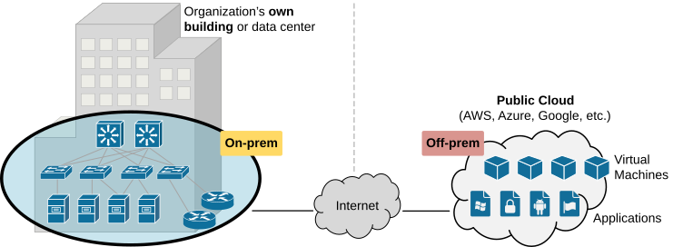
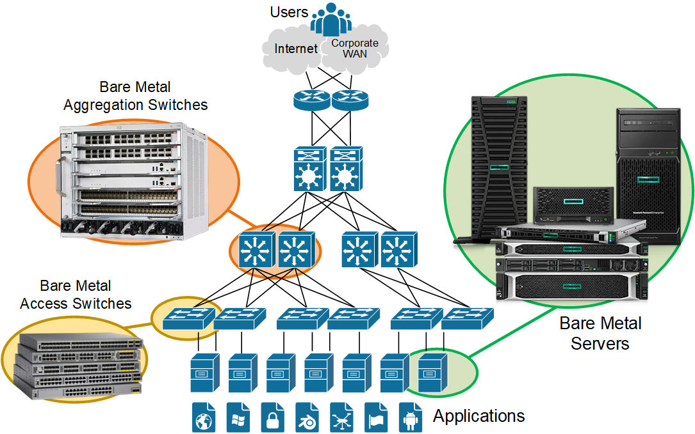
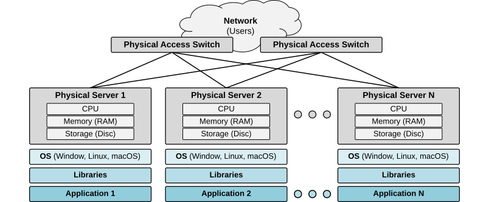
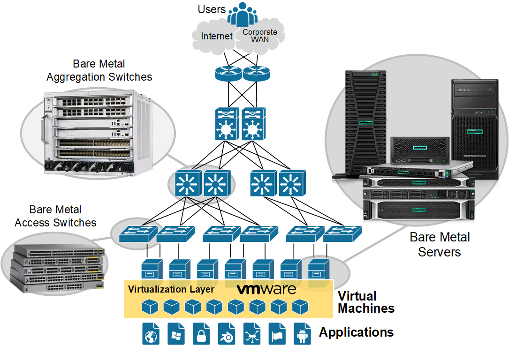
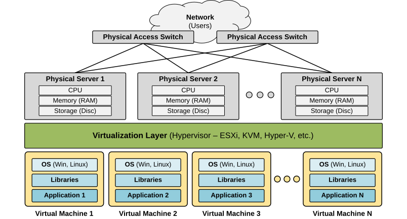
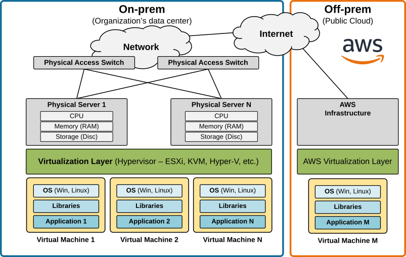
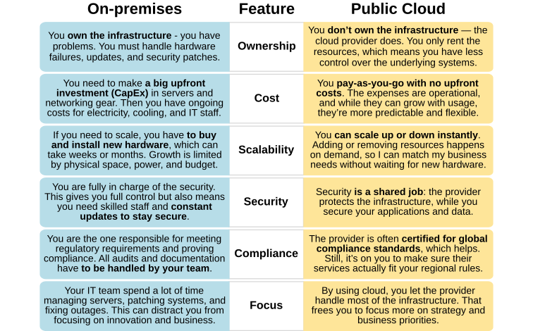
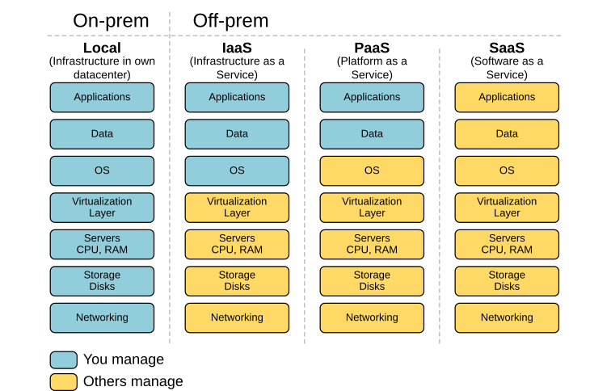
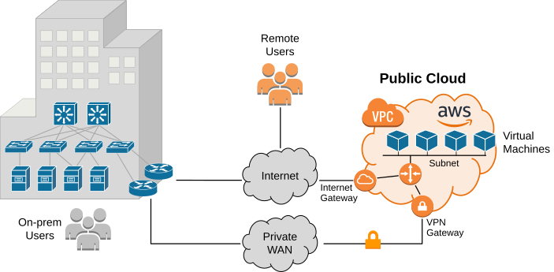

[On-prem and Cloud](https://www.networkacademy.io/ccna/network-fundamentals/on-prem-and-cloud)
==========

In this final lesson of this section, we will discuss what the public cloud is and how it fits into an organization's network and computing infrastructure. 

What is On-prem?
----------------

On-prem (short for on-premises) means IT infrastructure, like servers, storage, networking, and software, that is installed and managed locally inside an organization's own building or data center.

Figure 1. On-prem vs. Off-prem.

On the other hand, off-prem means that the equipment or service is not located on the organization's own premises.

### What is Bare Metal?

Bare metal refers to the actual, physical hardware of a computer or server that runs without any virtualization layer. Your personal computer or laptop is a good example of a bare-metal machine.

In an enterprise infrastructure, bare-metal means that all devices and servers are not virtualized. Applications are installed directly on physical servers.

Figure 2. On-Prem Infrastructure.

In the 1990s and 2000s, all business applications were installed on bare metal. If an organization needed to run a new app, it often had to buy and deploy multiple additional servers. **It was normal to take months** for the deployment or relocation of a single app.

### Virtualization

Organizations recognized a significant issue with bare metal servers: **An app is bound to its physical server**. Each physical server typically ran a single application, with its CPU and memory usage often remaining very low — below 10%. This meant a significant amount of resources was wasted.

Figure 3. Bare Metal Infrastructure.

This challenge triggered the development of virtualization. A hypervisor was introduced **to separate the operating system from the physical hardware**, making it possible to run multiple virtual machines (VMs) on the same hardware.

Figure 4. On-prem Virtualization.

With virtualization, **an application no longer runs directly on physical hardware.** Instead, it runs inside a virtual machine (VM), which is completely software-defined.

Figure 5. What is virtualization?

Because a VM is just software, you can back it up like a file, move it between servers, or copy it easily.

What is Public Cloud?
---------------------

Virtualization made applications portable. It allowed organizations to shift some of their servers and applications from local physical machines to the public cloud.

Figure 6. Migrating Workloads to the Public Cloud.

### Why would someone migrate applications to the cloud?

For some applications, it may be more beneficial to be hosted on-prem, while for others, it makes more sense to be migrated to the public cloud.

Figure 7. On-premises vs. Public Cloud.

For example:
- A **payment system** is better on-premises (full control, security, compliance).
- A **web platform** with variable traffic is a perfect candidate for the cloud (scale instantly, pay per use).

### IaaS vs PaaS vs SaaS

- **IaaS (Infrastructure as a Service)**: You move servers into provider's VMs. You manage the OS and apps. Example: Amazon EC2.
- **PaaS (Platform as a Service)**: The provider gives you a ready-made environment to deploy apps. Example: AWS Lambda.
- **SaaS (Software as a Service)**: You just use the application. Example: Office 365, Google Workspace.

Figure 8. IaaS vs. PaaS vs. SaaS.

Connectivity to the cloud
-------------------------

Most commonly, connectivity to the cloud happens over the Internet.

Figure 9. Connectivity to the cloud (simplified).

For critical workloads, cloud providers allow you to build a dedicated private link from your data center to the cloud, bypassing the public internet.

Key Takeaways
-------------

- On-prem means IT infrastructure is hosted locally and fully managed by the organization.
- Off-prem and public cloud shift infrastructure to external providers.
- Bare metal servers run apps directly on hardware but are costly and inflexible.
- Virtualization improved efficiency by running multiple VMs on the same hardware.
- Public cloud leverages virtualization to move apps outside the data center.
- IaaS gives control of virtual servers, PaaS provides a ready-to-use platform, SaaS delivers complete applications.
- Cloud connectivity can be via the internet or private links for reliability and performance.