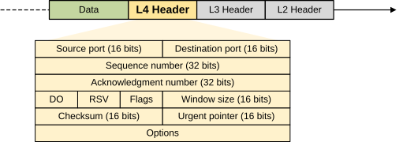
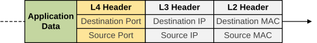
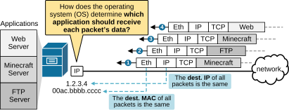
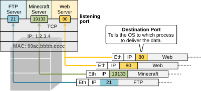
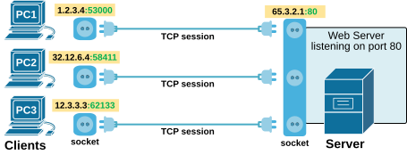
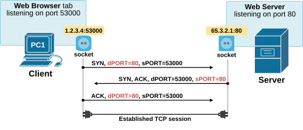
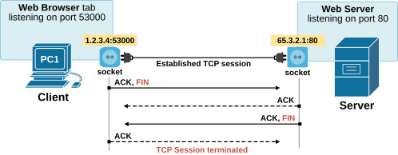
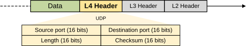

[TCP and UDP essentials](https://www.networkacademy.io/ccna/network-security/tcp-and-udp-essentials)
==========

This lesson begins our discussions on the fundamentals of Layer 4 (Transport Layer) and Layer 7 (Application Layer) protocols. This knowledge will serve you **as a context required to understand how Access Control Lists (ACLs) work**. ACLs often filter traffic based on Layer 4 information like TCP and UDP ports or even Layer 7 details, such as specific application parameters. 


## Transmission Control Protocol (TCP)


Let's start discussing the layer 4 protocols with the Transmission Control Protocol (TCP). The following diagram shows the TCP header format. Pay special attention to the source and destination port fields, which are 16 bits long. This gives 2^16 (65,536) possible port numbers.




*Figure 1. TCP Header Format.*


In the context of ACLs, the most important fields in a packet are the source and destination MAC addresses, source and destination IP addresses, and source and destination port numbers, as shown in the diagram below.




*Figure 2. Important fields in context of ACLs.*


- The **destination MAC and IP** address help network devices send the packet to the correct device. 
- The **destination Port number** helps the receiving device deliver the data to the correct application.

ACLs use these fields to decide whether to allow or block traffic. For example, an ACL can block traffic from a specific IP address or allow traffic only to a certain port, like TCP port 80 for web access.


### Why do we need TCP port numbers?


To understand the layer 4 protocols, let's first discuss why we need to have TCP/UDP ports in the layer 4 header. Let's look at the example shown in the diagram below. We have a server that runs many applications at the same time. For example, it runs a Web server, a Minecraft server, and an FTP server **all at once**. 




*Figure 3. Why do we need TCP ports?*


Now, let's see what happens when the server receives many packets at once. All packets have the same destination MAC address (the MAC of the server's NIC card) and the same IP address (the IP address of the server's NIC card). Hence, based on the Layer 2 and Layer 3 headers, the server's operating system **cannot understand**** which application the packet's data belongs to**. 


For example, packet 1 holds Minecraft data. When the server receives this packet, it must somehow understand that this data must be delivered to the Minecraft process and not to the Web Server process or the FTP process. The same applies to packet 2, which holds FTP data. The OS must have a way to quickly understand that this data must be delivered to the FTP process.


Here is where **the destination port number** in the Layer 4 header comes into play. It immediately tells the OS (at line rate speed) to which application the packet's data must be delivered. This process is called Multiplexing.


Without port numbers, the device wouldn’t know where to deliver the data once it arrived. The OS would have had to deliver the data of each packet to every process that runs, which would have been very inefficient.


### Multiplexing using port numbers


Multiplexing using port numbers allows devices to handle many connections at the same time. When packets arrive at a device, the port number helps the device determine which application should receive the data, as shown in the diagram below.




*Figure 4. Multiplexing using TCP ports.*


Each process that runs on the server "listens" for incoming data on a specific TCP port, as shown in the output below. For example, the Web Server listens on port 80, while the FTP Server listens on port 21.


```
`Microsoft Windows [Version 11.0.25621.5339]
(c) Microsoft Corporation. All rights reserved.

C:\> **netstat -a -n**

Active Connections
**  Proto  Local Address          Foreign Address        State**
TCP    1.2.3.4:21             0.0.0.0:0              LISTENING
TCP    1.2.3.4:80             0.0.0.0:0              LISTENING
TCP    1.2.3.4:443            0.0.0.0:0              LISTENING
TCP    1.2.3.4:19133          0.0.0.0:0              LISTENING`
```

When packets arrive at the server, the operating system examines the destination port number in the Layer 4 header. It forwards the data **to the process that listens to that port number**. For instance, the OS delivers the packets with destination port 80 to the web server process.


### Well-known, Registered, and Dynamic Ports


The next important thing is that the port numbers in the layer 4 header of packets are not random. The Internet Assigned Numbers Authority (IANA) manages the global assignment of port numbers. It divides them into three main groups:


- **Well-Known Ports (0–1023):** These are assigned by IANA for common services like HTTP (port 80) or FTP (port 21). Getting a new port in this range requires a strict review.
- **Registered (User) Ports (1024–49151):** These are also assigned by IANA, but the process is easier than for well-known ports.
- **Dynamic or Ephemeral Ports (49152–65535):** These are not assigned by IANA. They are used by client apps for temporary connections. The OS picks these ports when needed.

For example, your computer might open several applications at once. Each app will use a different dynamic port so the OS can keep the connections separate. Servers, on the other hand, use well-known or user ports so clients know where to connect.


### What is a socket? What is a TCP Session?


Now that we have seen what the port number is, let's take a closer look at another term: a socket. A socket is the combination of an IP address and a port number. It **identifies one end of a connection** between two devices. For example, 1.2.3.4:53000 is a socket where 1.2.3.4 is the IP address and 53000 is the TCP port.


Sockets allow devices to know where to send and receive the actual data in the packet's payload. A pair of sockets defines a unique TCP connection called **a TCP session**, as shown in the diagram below.




*Figure 5. What is a socket?*


For example, the TCP session between PC1 and the server can be uniquely identified as highlighted below:


```
`Microsoft Windows [Version 11.0.25621.5339]
(c) Microsoft Corporation. All rights reserved.

C:\> **netstat -a -n**

Active Connections
Proto  Local Address          Foreign Address        State
TCP    1.2.3.4:53000          65.3.2.1:80        ESTABLISHED`
```

Note an important concept here. Most internet communications use the Client-Server model.


- **The client **is the application that sends a request. For example, a web browser requests a web page. Notice that the client uses a randomly assigned** ****dynamic port number**.
- **The server **is the application that waits for requests and provides a service. For example, a web server that sends back the requested web page. Notice that the server uses a **well-known port number**.

The concept of port numbers and sockets enables multiple applications to operate simultaneously without being mixed up at the network layer. Both TCP and UDP employ this same idea.


### Establishing a TCP session


Now let's shift our focus to the connection establishment process. During this step, the client and the server agree on port numbers and set up the sequence and acknowledgment numbers so they can track the data they send and receive.


The setup process is called **the three-way handshake**. The following diagram visualizes how it works:




*Figure 6. What is a TCP session?*


- The client sends a SYN message to the server to start the connection.
- The server replies with a SYN-ACK message to agree and acknowledge.
- The client answers back with an ACK message.

Once this handshake is done, data can start flowing between the client and server. The connection is defined by the sockets on both sides.


When it’s time to end the connection, TCP uses a four-step process called termination, as shown in the diagram below:




*Figure 7. TCP Session Termination.*


- One device sends a FIN message to indicate that it has finished sending data.
- The other device replies with an ACK.
- That device then sends its own FIN message to close the connection.
- The first device replies with a final ACK.

The FIN bit (short for “finish”) marks the end of the connection from one side.


## TCP vs UDP


Now, let's shift our focus to UDP by first comparing the two protocols. UDP does not establish or terminate connections using the three-way handshake. 


- That’s why TCP is called **a connection-oriented protocol**—it sets up and manages connections. 
- UDP is referred to as **a connectionless** protocol because it sends data without first establishing a connection.

The following diagram compares the two protocols. Note the header size of each one. It is one of the primary differences.


*Figure 8. TCP vs. UDP.*


You can clearly see that TCP offers more services to applications. UDP does not provide these extra features. However, just because UDP provides fewer services doesn’t mean it’s worse than TCP. Since UDP has a smaller header, **it adds less overhead to the network**. UDP also doesn’t slow down data like TCP might do on purpose. Some applications, like Voice over IP (VoIP) or video over IP, don’t need error recovery, so they use UDP. This makes UDP important for certain types of traffic on today’s networks.


## User Datagram Protocol (UDP)


Unlike TCP, UDP is connectionless. It does not provide reliability, error recovery, data reordering, or breaking large data into smaller parts for transmission. It is faster and more efficient due to the smaller header size, as shown in the diagram below.




*Figure 9. UDP Header Format.*


Although UDP is simpler, it still utilizes port numbers to facilitate data transfer and multiplexing, just like TCP. The primary advantage is that UDP has less overhead and requires less processing, as it doesn’t handle all the extra work that TCP does.


With UDP, data is sent without verifying whether it arrives or if it’s in the correct order. This works well for applications that can tolerate losing some data or have their own mechanisms for recovering it. For example:


- VoIP (Voice over IP) uses UDP because retransmitting a lost voice packet would be too slow and would disrupt the call.
- DNS uses UDP because if a request fails, the client can simply try again.
- NFS (Network File System) can use UDP because it handles recovery at the application layer.

The UDP header is small—just 8 bytes—because it does less work than TCP. Like TCP, it includes source and destination port numbers to direct the data to the right application.


### Full Content Access is for Subscribed Users Only...


- **Learn any CCNA, CCIE or Network Automation topic** with animated explanation.
- **We focus on simplicity.** Networking tutorials and examples written in simple, understandable language.

Sign up for free ►
