[HTTP and DNS essentials](https://www.networkacademy.io/ccna/network-security/http-and-dns-essentials)
==========

This lesson continues our exploration of TCP/IP protocols that are important in the context of Access Control Lists (ACLs). It explores the most common use of the Internet: browsing the World Wide Web (www). Along the way, we discuss some of the most commonly used protocols, including HTTP, HTTPS, and DNS. 

Web browsing relies on the network to transport data between a client and a server. Hence, it uses the client-server model. In the example that happens right now, the client is your device, and the server is networkcademy.io, hosted on Amazon AWS, as shown in the diagram below.

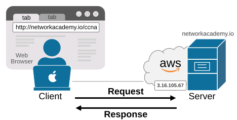

*Figure 1. Web Browsing, Client-Server model.*

- The client is typically a computer, laptop, phone, or tablet with **a web browser**. It initiates the connection to the server.
- The server is a remote system that hosts some **web resources**. It listens for connections from clients.

The process is pretty well known to everyone and doesn't need any special explanation on how it works. However, let's zoom in on the client side and discuss the protocol that the web browser uses to resolve the web addresses that users type in.

## DNS (Domain Name System)

The most important aspect of the client side is that the user is an actual human being. **Humans are not good at remembering numbers**, especially IP addresses. That's why web browsing is designed to use web addresses in human-readable text instead of IP addresses, as shown below. 

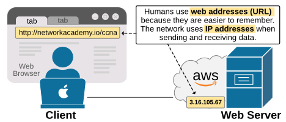

*Figure 2. Why do we need DNS?*

However, at the same time, the network transports data between clients and servers based on IP addresses. So, how does that work out? Let's zoom in.

First, the user provides the browser with the name of the web page they want to see. Let's say the user opens networkacademy.io. Here is what happens when the users type the web address and press Enter:

- The browser immediately sends **a DNS request** to the configured DNS server asking for the IP address of networkacademy.io. The DNS request is a UDP message on destination port 53.
- The **DNS server** replies with the corresponding IP address of that website: 3.16.105.67. The reply is UDP with a source port of 53, because the DNS server is sending the reply.
- Now the browser can send **a TCP connection request (SYN)** to that IP address. It sends the request using port 80, the standard port for HTTP. 
- After **the TCP three-way handshake (SYN, SYN-ACK, ACK)** completes successfully, the browser then starts downloading the requested web page.

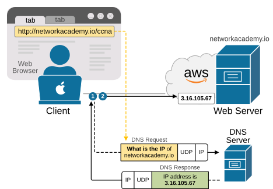

*Figure 3. DNS Resolution.*

In the end, the web browser displays the downloaded web page to the user. Note that the end user is typically not aware that the browser first resolves the web page's URL to an IP address using DNS. The DNS process happens in the background while the browser shows the page as loading. 

Now, let's focus on the following statement: "*The browser opens the requested web page*." How do we differentiate which part of the web address is the server's name and which is the requested resource on the server? That's where the URI comes into play.

### What is URI?

URI stands for Uniform Resource Identifier (URI). A URI tells the browser which server to connect to and what page to load. The following diagram shows the structure of a URI.

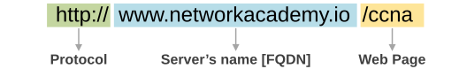

*Figure 4. Structure of URI.*

A URI usually has three parts as follows:

- The **protocol **(in our example HTTP), but it can be HTTPS, FTP, SCP, and so on.
- The **server name**, also called FQDN (like www.networkacademy.io).
- The **requested web page** or resource (in our example, /ccna).

**Note:** People often use “web address”, “URL,” and "URI" interchangeably. However, URI is the more accurate term. A URL is a type of URI, whereas "web address" is an everyday term.

In the URI example http://www.networkacademy.io/ccna, the browser knows to use HTTP, connect to the server www.networkacademy.io, and load the page ccna.

Most websites have many pages. When you click links on a site like networkacademy.io, you’re going from one page to another. Each link leads to a different URI behind the scenes. For example, the website's root or **default home page** is at the web page **/** (forward slash), as shown in the diagram below.

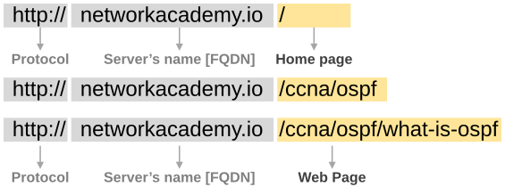

*Figure 5. URI Examples.*

Then, each internal web page has a URI, as you can see in the examples above.

### What happens if the Client's DNS can't resolve the URI?

Sometimes the local DNS server doesn’t already know the answer to the DNS Request. When that happens, it uses a process called **recursive DNS lookup**, where it asks other DNS servers for help. The diagram below breaks down the process into five steps:

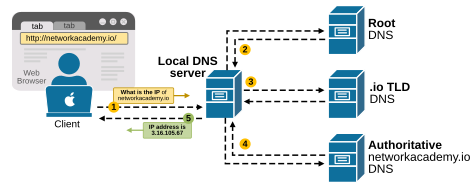

*Figure 6. Recursive DNS lookup.*

- **Step 1: **The client sends a DNS request for **networkacademy.io** to its locally configured DNS server.
- **Step 2: **The local server doesn’t know the answer yet, but instead of rejecting the request, it starts a recursive process. First, it sends a DNS query to a root DNS server. Root DNS servers are the top level of the hierarchy. They do not know the final answer to the DNS query, but they know where to send the query next. The root server replies with the IP address of a DNS server for the **.io** domain.
- **Step 3:** Next, the local DNS sends a request to the **.io** TLD server. This server still doesn’t know the exact IP but replies with the IP address of the authoritative DNS server for **networkacademy.io**. This will be AWS's DNS server where the website is hosted.
- **Step 4:** The local DNS then sends a final DNS request to this authoritative server, asking again for **networkacademy.io**. This time, it gets the correct IP address.
- **Step 5:** Finally, the local DNS server sends the DNS reply back to the client, providing the IP address it requested in step 1.

Note that this recursive DNS lookup process occurs in the background without the user noticing anything. The browser displays it as part of the web page's loading time.

## HTTP

Once a client (like a web browser) makes a three-way handshake and establishes a TCP connection with a web server, it can start requesting web pages. Typically, the browser utilizes the HTTP protocol to accomplish this. HTTP (defined in RFC 7230) explains how files are shared between computers. It was made specifically for sending files between web servers and web clients.

HTTP has several commands, but the most common is the GET request. When the browser wants a file, it sends an HTTP GET request with the file’s name. If the server has the file and chooses to send it, it replies with a GET response, return code 200 OK, and the file’s content. If the file doesn’t exist, the server sends back code 404, meaning file not found. Most browsers simply display a “page not found” message instead of showing the 404 error.

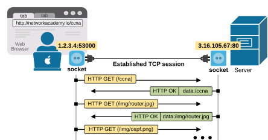

*Figure 7. HTTP Request/Response.*

A web page usually includes many files. There’s the main page text, as well as images, ads, and sometimes audio or video. Each part is a separate file on the web server. After retrieving the first file, the browser reads it and identifies the other files it requires. Then it sends more GET requests for those files.

All of this happens over one or more TCP connections. TCP ensures that the data arrives correctly.

When a host (like your computer) gets data, it must figure out which app should handle it. For example, if you have several browser windows open and are also using email or chat, each of these uses a different TCP port number. Your computer checks the destination port number in the TCP header to determine which application should receive the data.

Before it can check the port number, your computer looks at other headers. First, the Ethernet Type field shows that the next header is IPv4. Then, the IP Protocol field indicates what comes next, such as TCP (protocol number 6) or UDP (protocol number 17). Finally, your computer reads the TCP header and sees the destination port. That tells it which app should receive the message.

### HTTP Versions

HTTP is so prevalent today that it accounts for over 90% of all Internet and enterprise network traffic. Most web browsing, cloud services, APIs, and mobile apps rely on HTTP or HTTPS (HTTP over TLS). Even many non-browser applications use it for communication. It has become the default protocol for data exchange across modern networks.

That's why it is very important for any network and security engineer to have a good understanding of how it works and how it evolves over the years. Let's dive in.

HTTP 1.0 and 1.1
Web browsers and servers started showing up in the early 1990s. The IETF eventually took control of HTTP and released versions such as HTTP 0.9, 1.0, and 1.1, each with its own improvements, as follows:

**HTTP/1.0**

- One request per connection. After the server responds, the connection is closed.
- No connection reuse, so it creates many TCP connections. This is slow and inefficient.
- No support for pipelining or multiplexing.

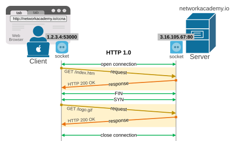

*Figure 8. HTTP 1.0.*

**HTTP/1.1**

- Keeps the connection open using keep-alive.
- Supports multiple requests on the same TCP connection, but only one at a time (no pipelining).
- Still suffers from head-of-line (HOL) blocking — next request must wait for the previous one to finish.

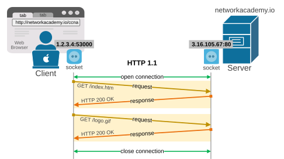

*Figure 9. HTTP 1.1.*

Since the release of HTTP/1.1 in 1997, it has remained the dominant version for almost 18 years. Even today, HTTP/1.1 remains in use, particularly for older systems or simple applications. However, as web pages grew larger and required loading more files, people realized that HTTP/1.1 had performance issues. That’s why HTTP2.0 and HTTP3.0 were developed—to make things faster.

HTTP/2 and TLS (HTTPS)
At some point, people wanted to make HTTP more secure. Therefore, the IETF developed a method for using HTTP with encryption, known as HTTPS. It uses TLS (Transport Layer Security) to add security features like server authentication and data encryption.

A secure connection starts the same way—with a TCP connection—but before sending any HTTP data, **it builds a TLS session**. Then, HTTP messages are sent through the secure tunnel.

**HTTP/2.0**

- Uses **a single TCP connection** for all requests/responses.
- Supports multiplexing — multiple requests/responses at the same time on one connection.
- Uses binary format (not text like HTTP/1.x), which is more efficient.
- Still uses TCP, so it still has HOL blocking at the transport layer.

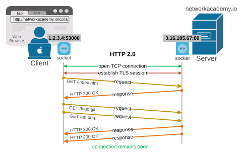

*Figure 10. HTTP 2.0.*

HTTP/2 became an official standard around the mid-2010s. It made changes to how HTTP works internally but kept most things the same from a networking point of view. It still uses TCP, TLS, the same ports (80 and 443), and the same types of URLs. So, it didn’t change anything big for network engineers. Then came version 3.0, which introduced significant changes.

HTTP/3
HTTP/3 is a much bigger change. **It switches from using TCP to using UDP**. It’s based on a new transport protocol called QUIC, developed by Google. QUIC uses UDP but includes features like error recovery and flow control, just like TCP. It also includes TLS as part of the protocol, which helps make secure connections faster.

HTTP/3 became official in 2022 through several RFCs, especially RFC 9114. Nowadays, all modern Internet browsers use version 3 of the protocol because of the following advantages:

- Uses QUIC, not TCP. QUIC runs over UDP.
- Eliminates HOL blocking because QUIC allows independent streams.
- Faster connection setup using 0-RTT (zero round-trip time).
- Better performance over unreliable networks (mobile, Wi-Fi).

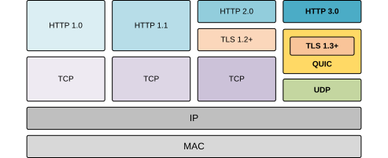

*Figure 11. HTTP 3.0.*

From a network perspective, HTTP/3 is different. **It uses UDP port 443 instead of TCP**, and its headers look different. QUIC rides on top of UDP, so in packet headers, you’ll see a UDP header followed by a QUIC header. This affects **how you can match traffic using access control lists (ACLs)**, which we’ll cover later in the course.

Note: HTTP/3 always uses TLS for security. That’s partly because QUIC has it built in, and partly because web traffic needs to be secure. UDP port 443 is the well-known port used for HTTP/3 traffic.

In the real world, HTTP/2 grew slowly, but HTTP/3 has grown quickly. Today, many major websites like Google, YouTube, Facebook, and Instagram use HTTP/3. Most users don’t even know it's happening.

The bottom line
As a user, you don’t pick the HTTP version. The browser and server work that out automatically. But as a network engineer, you should know the differences. HTTP traffic today might be using:

- HTTP/1.0, 1.1, or 2 **over TCP**, on ports 80 or 443
- HTTP/3** over UDP**, on port 443

Also, web servers can technically use any port—not just the well-known ones—but most stick with the standard ports.

## DNS/HTTP and Access-Lists (ACLs)

Now, let's examine why understanding Layer 7 protocols is crucial in the context of network security and access control lists (ACLs).

Let's start with domain name resolution. If the local router has an ACL that blocks UDP destination port 53, then DNS will not work for all name resolution queries. Practically, this completely stops the Internet access of the local network, as shown in the diagram below.

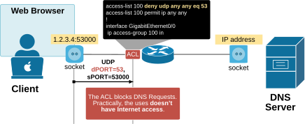

*Figure 12. ACL blocking DNS requests.*

Let's break down the process in steps and see what happens:

- The client tries to send a DNS request using UDP port 53 to the configured server.
- The router drops the packet because of the configured inbound ACL rule.
- The DNS query fails.
- Websites won't load because the web browser cannot resolve URI addresses to IP addresses.

The result is that the user won't have Internet access if UDP port 53 is blocked. Almost all Internet access begins with DNS, which resolves domain names (such as google.com) to their corresponding IP addresses. If DNS can't work, the browser or apps can't find the IP of the website or service. As a result, websites won't load, and apps won't connect.

## Book traversal links for 7

