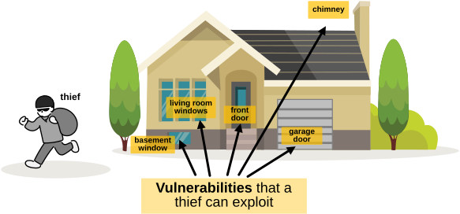
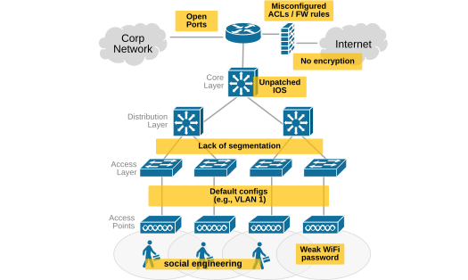
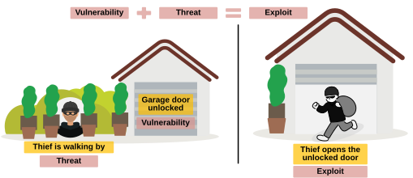
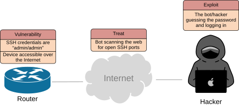
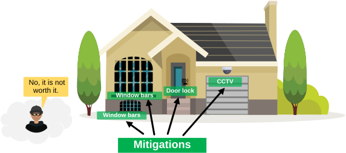
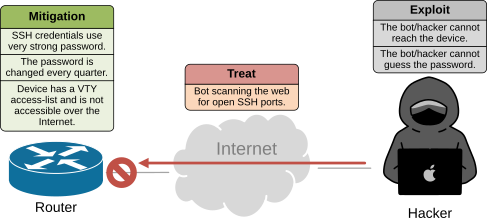
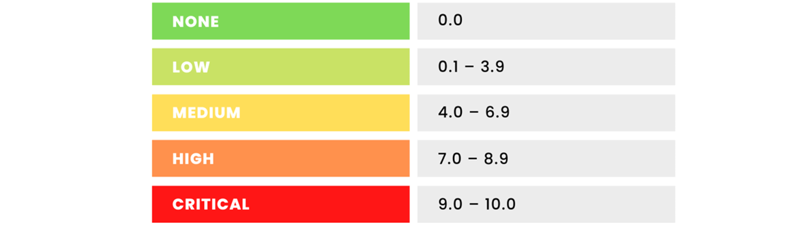

[Key Security Concepts](https://www.networkacademy.io/ccna/network-security/key-security-concepts)
==========

In this lesson, we will walk through the key security concepts that CCNA students must understand to pass the exam. The most common ones are vulnerabilities, threats, exploits, and mitigations. What are they, and how do they fit into the network security context? Let's find out.

## What are Vulnerabilities?

Let's explain what vulnerabilities are with a simple example everyone understands. Imagine** you have a house**, as the one shown below. In the context of your house, vulnerabilities are the weak spots that make it easier for someone—like a thief—to break in and steal something.

*Figure 1. What are vulnarabilities?*

As shown in the diagram above, every physical opening of the house is a potential entry point (e.g.,a security vulnerability).

- If the **front door** has a weak lock or is left unlocked, that’s a vulnerability.
- If the **garage door** doesn’t close completely, that’s another one.
- A **living room window** left open is a vulnerability.
- Even a **basement window** hidden behind bushes can be a vulnerability, as it gives a thief a quiet place to get in.
- A **chimney** is a bit exaggerated, but it might also be a vulnerability if it’s wide enough.

Basically, any place where someone could get in is a vulnerability. **It doesn’t mean you’re being robbed, though**—it just means there’s a weakness that a thief could use. Every vulnerability makes it easier for someone to try to rob you.

### Network Vulnerabilities

In the same way, in networking, weaknesses that attackers can exploit **are called vulnerabilities**. Every network has some. They can be technical, human, or even physical. The following diagram shows a list of the most common vulnerabilities that can be found in many networks out there (even if the network admins don't want to admit it).

*Figure 2. Example of network vulnarabilities.*

All of these weaknesses are like open locks, open windows, or forgotten garage doors in a digital house—inviting trouble if not properly mitigated.

## What are Threats and Exploits?

A threat is anything that can take advantage of a weakness and cause harm. It can be a hacker, malware, a virus, ransomware, or even an angry employee.

Now, the exploit is the way that danger becomes real. It’s the tool, the script, or the method that uses the vulnerability.

### How do vulnerabilities, threats, and exploits connect?

Let's see how the three terms fit together using our real-world example with your house.

If the garage door is left unlocked (**vulnerability**) and a thief is walking by (**threat**), the moment he opens the door and walks in—that’s the **exploit**, as shown in the diagram below.

*Figure 3. vulnerabilities, threats, and exploits example.*

The same logic applies in networking. If a network device's SSH credentials are “admin/admin” and it is accessible over the Internet, the **vulnerability **is weak authentication. The **threat **is a bot scanning the web for open SSH ports. The **exploit **is the bot/hacker guessing the password and logging in, as shown in the diagram below.

*Figure 4. Vulnerability plus Treat equals Exploit*

## What are Mitigations?

Mitigation means reducing risk. You rarely remove a risk completely, but you can make it more complicated, or even not worth it for the attacker, as shown in the diagram below.

*Figure 5. What are Mitigations?*

Mitigations can be technical, like firewalls, ACLs, VPNs, or encryption. They can also be physical, like locking server racks, or human, like user training. For example, 

- Using a strong WiFi password stops random people from trying to guess it.
- Enabling DHCP snooping stops fake DHCP servers.
- Using multi-factor authentication eliminates completely basic brute-force attempts.

The following diagram shows mitigations in the networking context. The weaknesses and risks shown in Figure 4 above are mitigated by applying the following countermeasures.

*Figure 6. Mitigation - network example.*

Remember that mitigation is not about perfection. It’s about balance. You apply enough protection to keep the risk at a level you can live with.

Going back to the example with your house. Even if you lock every door and window and set up video surveillance, someone could still drive a tank through the wall. There’s always some risk — but the chance of that happening is **so small that you can live with it**. In network security, you can never be 100% protected. You just raise the level of effort it takes to hack you — upper limit doesn’t exist.

## Vulnerabilities Classification

The examples that we have seen so far are very simple and straightforward. However, in the real world, vulnerabilities and exploits are much more complex and often harder for network and security teams to understand and follow. That's why several public resources were introduced to help classify and track vulnerabilities.

### Common Vulnerabilities and Exposures (CVE):

Common Vulnerabilities and Exposures (CVE) is a public list that keeps track of known security problems in software and hardware. **Each issue gets a unique ID number**, called a CVE ID, which makes it easy for people and companies to talk about the same problem using the same name.

*Figure 7. CVSS scores.*

For example, if a bug is found in Windows or Cisco software, it will be listed in the CVE database with details about what it is and how serious it might be. Security tools and researchers use CVE IDs to share information, compare results, and make sure they’re all fixing or checking for the same issues.

### Common Vulnerability Scoring System (CVSS):

Common Vulnerability Scoring System (CVSS) is a standard way to measure how serious a security problem is. It gives each vulnerability **a score from 0 to 10** — the higher the number, the more dangerous the issue.

CVSS looks at things like how easy it is to exploit the vulnerability, what kind of damage it can cause, and whether an attacker needs special access.

### National Vulnerability Database (NVD):

National Vulnerability Database (NVD) is an official U.S. government database that stores detailed information about known security weaknesses. **It’s built on top of the CVE list** and adds extra details, like how severe a vulnerability is, how it can be exploited, and what software or systems are affected.

The NVD helps security teams and companies track, measure, and** manage risks automatically**. It also supports tools that check systems for compliance and security issues.

### How do CVE, CVSS, and NVD fit together?

Now let's see how these terms fit together. Let’s say **there’s a serious bug in Cisco IOS-XE** that allows an attacker to run commands remotely.

- **CVE**: The bug gets listed as CVE-2023-20109 in the CVE database. This unique entry provides a short description—for example, “A vulnerability in the web UI of Cisco IOS XE Software could allow an attacker to execute arbitrary code.”
- **CVSS**: The vulnerability is rated using the CVSS score system. For this case, the score might be 9.8 (Critical), meaning **it’s very easy to exploit and could cause severe damage**.
- **NVD**: The National Vulnerability Database (NVD) adds more technical details, such as:

- Which Cisco versions are affected;
- Links to patches or fixes;
- Impact metrics (like confidentiality, integrity, and availability).

So, CVE identifies the problem, CVSS measures how bad it is, and NVD provides the full details and context.

## Key Takeaways

The main goal of this lesson is to introduce you to the key security terms that you will encounter often in network and network security documentation. 

Remember, every network has some vulnerabilities — it’s just the reality of technology. 

You may wonder - but why? Because most vulnerabilities **don’t come from your organization** but from the developers, vendors, and suppliers who build the systems and protocols you use. Still, there are some common types of vulnerabilities that your organization is directly responsible for, such as:

- Design flaws
- Misconfigurations
- Human error

Other vulnerabilities, however, **fall outside your organization's control.** You can’t prevent them from existing, but you can manage and reduce their impact. These include:

- Protocol weaknesses
- Software bugs
- Malicious code

Now, let's summarize the key security terms and concepts that we have seen in the lesson.

- **Asset: **Anything valuable to a company.
- **Vulnerability: **A weakness in an asset.
- **Threat:** The source or method of an attack.
- **Risk: **The chance of an attack. Risk exists when there’s both a threat and a vulnerability.
- **Exploit:** A tool or method that attackers use to take advantage of a vulnerability.
- **Mitigation** (Countermeasure): Steps taken to reduce or remove risks by fixing or minimizing vulnerabilities.

Remember that real-world security (like securing your house) and network security **work the same way**—same logic, same pattern, different tools. **Always make analogies with real-world security**, and you will understand the foundation of network security.
