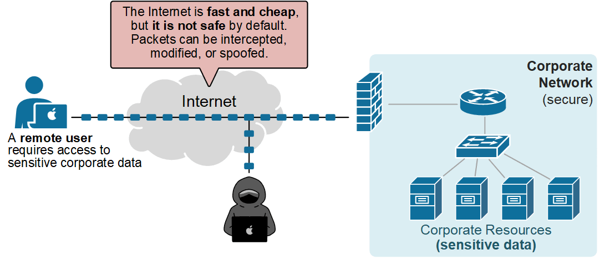
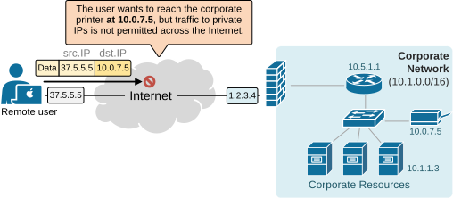
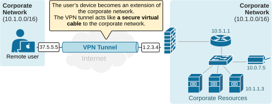
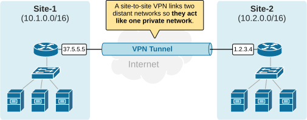
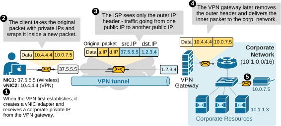
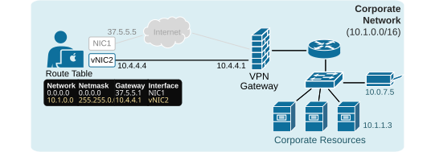

[VPN essentials](https://www.networkacademy.io/ccna/network-security/vpns-essentials)
==========

In this lesson, we discuss what a Virtual Private Network is and why organizations need one. We also walk through the most common VPN types, accompanied by numerous diagrams and examples.

## Why do we need a VPN?

There are two primary reasons why organizations need to utilize Virtual Private Network (VPN) technology. Let's examine each one.

### Security

Modern networks **rely heavily on the public Internet**. Employees work from home over the Internet, partners connect to internal apps over the Internet, and branches access the DC over the Internet. Why, you may wonder? Because the Internet is everywhere now. It is fast, cheap, and reliable. 

However, there is one problem - the Internet is not safe by default. Packets travel over the public network. They can be intercepted, modified, or spoofed, as shown in the diagram below. Attackers can watch unencrypted traffic and learn usernames, cookies, and database queries. 

*Figure 1. Why do we need a VPNs?*

At this point, you may ask - well, what if we use HTTPS? Even if an application uses HTTPS, small gaps remain: metadata still leaks, certificates are exposed, and there is another problem...

### Routing and Private Addressing

Another reason organizations need a VPN is that private IPs are not routable across the Internet. Corporate networks usually use private address spaces, such as 10.0.0.0/8, 172.16.0.0/12, or 192.168.0.0/16. These ranges are filtered by Internet providers.

Let's see the following example. Suppose a remote user connected to the Internet wants to access a corporate printer with the IP address 10.0.7.5. The user sends the packets with the source IP set to its own IP address and the destination IP set to 10.0.7.5 (the address of the printer). What do you think will happen? Of course, the remote user cannot reach any internal resource with a private IP address, because **RFC1918 addresses are not routable over the Internet**, as shown in the diagram below.

*Figure 2. Rouitng private IPs (RC1918) across the Internet.*

Devices with private IP addresses **are invisible outside the organization’s network**. Someone may say, '*Don't we have NAT for this case?*' Can't we translate the printer's address to a public IP address and access it over the Internet? 

Techniallly, we can, but NAT is not meant to be used **to translate EVERY corporate IP to a public one**. It is typically used for internal web servers and other applications that are publicly exposed. If remote users need to access every corporate internal IP from the outside, you cannot NAT the entire organization's internal IP space...

## What is a VPN?

A Virtual Private Network (VPN) solves these two problems that we saw above. It lets you build **a private, encrypted path across an untrusted network**, typically the Internet. 

With a VPN, two endpoints act as if they are directly connected. The tunnel uses cryptographic mathematical algorithms that protect confidentiality, integrity, and authenticity. 

There are two primary types of VPNs: Remote access VPN (also called SSL VPN) and Site-to-site VPN. Let's see each one in more detail.

### Remote Access VPN

When a remote user connects with a remote-access VPN, **their device becomes an extension of the corporate network**. The VPN tunnel acts like a secure virtual cable between the user and the office, as shown in the diagram below.

*Figure 3. What is IPsec Remote Access VPN?*

The user's device receives an IP address from the company’s internal range. This makes the device appear as **if it is inside the LAN**. As a result, the user can access private corporate subnets, servers, and applications that would normally be unreachable from the internet.

### Site-to-Site VPN

A site-to-site VPN links two distant networks so **they act like one private network**. It is often used to connect branch offices to a headquarters.

Each site has a VPN device, usually a router or firewall. These devices build an encrypted tunnel over the internet. Inside that tunnel, they exchange traffic between the two LANs. Users on one side can reach servers and hosts on the other side as if they were on the same internal network.

*Figure 4. What is Site-to-site VPN?*

The key point is that the connection is always between networks, not individual users. Once the tunnel is up, the two sites stay connected automatically.

## How does a Remote Access VPN work?

Now, let's see a high-level overview of how a remote access VPN works. Let's use the same example as above. Suppose a remote user wants to access a corporate printer with IP address 10.0.7.5 over the Internet. To do so, the user establishes a remote access VPN, such as Cisco AnyConnect, to connect to the corporate network. Behind the scenes, we can break down the process into five simplified steps, as shown in the diagram below.

*Figure 5. How does Remote Access VPN work?*

- **Step 1: **When the VPN connects for the first time, it creates a virtual NIC on the client device. The device gets a private corporate IP address 10.4.4.4 and routing rules for the corporate networks - 10.1.0.0/16 via 10.4.4.4.
- **Step 2:** When the client sends traffic to corporate IPs (for example, to the corporate printer at 10.0.7.5), the traffic matches the VPN route. The client builds a packet with its private IP 10.4.4.4 as the source and the printer IP 10.0.7.5 as the destination, then wraps it in an outer header.
- **Step 3:** The ISP sees only the outer header (in blue), showing traffic from the user device’s public IP address (37.5.5.5) to the VPN gateway’s public IP address (1.2.3.4).
- **Step 4:** The VPN gateway removes the outer header (in blue) and forwards the inner packet (in yellow) into the corporate network.
- **Step 5:** The destination host (the printer) receives the packet from the client’s assigned private IP, just like any other internal device.

Ultimately, from a logical perspective, it appears that the remote user is directly connected to the corporate network, as illustrated in the diagram below.

*Figure 6. Remote Access VPN logical view.*

Of course, the example is overly simplified, but it highlights the main idea of Virtual Private Networks (VPNs). 

## Key Takeaways

- VPN protects data across untrusted networks.
- Main needs: security and routing private IPs.
- The Internet is not safe; traffic can be intercepted, malformed, or spoofed.
- Private IPs (RFC1918) are not routable on the Internet.
- VPN creates encrypted tunnels for confidentiality and integrity.
- Two main types: Remote-access and Site-to-site VPN.
- Remote access extends the user device into the LAN.
- Site-to-site links two networks over the Internet.
- Remote-access workflow: virtual NIC, corporate IP, routes, encrypted tunnel.

## Book traversal links for 7

