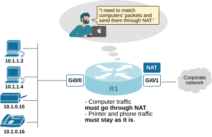
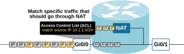
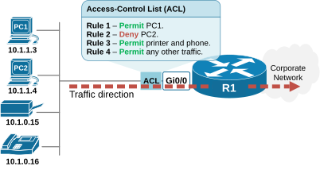
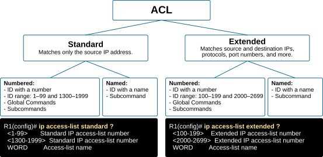
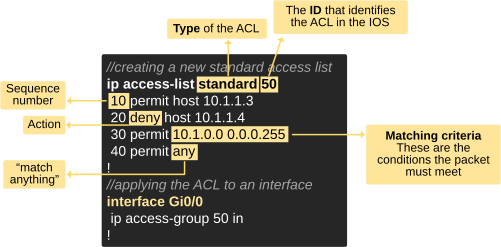
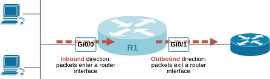
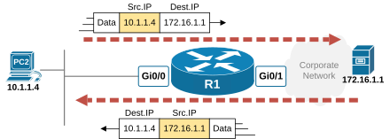
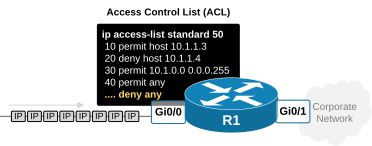

[ACL Basics](https://www.networkacademy.io/ccna/network-security/acl-basics)
==========

This lesson begins our discussions on **Access Control Lists (ACLs)**. ACLs are a powerful tool used in networking to identify traffic based on header information such as IP addresses, protocols, and port numbers. We walk through the core concepts behind ACLs, how they work, and where they are applied in a network.


## Why do we need Access Control Lists (ACLs)?


Imagine a common real-world scenario—a small network with only one router and a few end devices. You must configure the router so that computer traffic **goes through NAT** to access the Internet over the corporate network. On the other hand, printer and phone traffic **must bypass NAT **and remain unchanged. How do you do it?





*Figure 1. Why do we need Access Control Lists (ACLs)?*


Well, this isn’t a lesson on NAT, but here’s the basic concept: you need to identify (or "match") computer traffic and send it through the NAT process. But **how can a router match specific packets**? 


That’s where access control lists, or ACLs, come in.


## What are Access-Control Lists (ACLs)?


The term "*Access-Control*" list falsely implies that an ACL is only used to block or filter traffic (access control). However, this is NOT the primary function of access lists. Actually, their main job is **to match specific traffic** based on things like IP addresses, protocols, or port numbers. For example, imagine you have a router doing NAT. You want only Internet-bound traffic to go through NAT, but you want internal corporate traffic to stay as it is. To do that, you need a way to distinguish between the two types of traffic. This is where ACLs are useful. You can use an ACL to match the Internet traffic using information from Layer 2, Layer 3, or Layer 4 headers. Once matched, the **router knows which traffic to send through NAT**, as shown in the diagram below.





*Figure 2. Match traffic with ACL.*


In the example, the ACL matches all packets with source IP address 10.1.1.0/24 (in yellow) and directs them through the NAT process. All other traffic remains unchanged (in grey).


Access Control Lists (ACLs) are most commonly used to match traffic for features, like routing decisions, NAT, QoS, Route-maps, IPsec, and Crypto-maps. In these cases, the ACL does not filter the traffic; instead, **it matches traffic for further processing**. ACLs examine the details within each packet's headers, including IP addresses, ports, and protocols. For example, an ACL can allow or block packets from a specific source IP address, such as 10.1.1.1, or a group of IP addresses, like those in the 10.1.1.0/24 subnet. It can also match packets destined for a specific destination port, such as SSH (TCP port 22).


**Key Note:** ACLs are primarily used to match interesting traffic based on header information such as protocol, IP addresses, and ports.


## How do ACLs work?


Now let's zoom in and see how access control lists (ACLs) work. Let's examine the simplest and most straightforward scenario: **using access control lists to filter traffic**. Let's use the following topology. We need to configure R1 to filter the traffic to the corporate network as follows:


- PC1 must be **allowed **access to the corporate network.
- PC2 must be **denied **access to the corporate network.
- The printer and phone must be **allowed**.
- All other traffic must be **allowed**.





*Figure 3. Configuration Example.*


The process to reconfigure the router to achieve these requirements involves two steps as follows:


- Creating an ACL that matches traffic and defines an action: **permit **or **deny**.
- Applying the ACL on an interface in a specific traffic direction.

Let's walk through each step in more detail and discuss how the access-list works.


### Step 1. Creating ACLs


Obviously, the first step is to configure a new access control list that matches the traffic based on the requirements. However, what kind of access control list do we need? 

Types of IPv4 ACLs
Cisco devices support two types of ACLs: **standard **and **extended**. Each one can be configured using two different methods: either by assigning a number as an ID or by using a human-defined name as an ID. This yields the following combinations, as illustrated in the diagram below.





*Figure 4. IPv4 Access Control Lists (ACLs).*


The difference between standard and extended ACL is very simple: 


- A standard ACL filters traffic based **ONLY on the source IP address**.
- An extended ACL can filter traffic using **MORE detailed criteria**, such as source and destination IP addresses, protocols, and port numbers.

Then, each type can be configured using a number as an ID or using a human-defined name as an ID. This is mainly due to historical reasons. Initially, Cisco only supported numbered ACLs—standard ACLs used numbers from 1 to 99, and extended ACLs used numbers from 100 to 199. Later, to make configurations more readable and easier to manage, Cisco introduced named ACLs, allowing engineers to use descriptive names instead of just numbers. They also added extended numbered ranges because modern devices can have hundreds of access lists. In the end, we have the following options for ACL ID:


- Standard numbered ACLs (1–99).
- Extended numbered ACLs (100–199).
- Expanded ACL ranges:

- 1300–1999 for standard.
- 2000–2699 for extended.

- Named ACLs, which use human-defined names instead of numbers.
Structure of an ACL
Okay, we saw that there are two types of access lists, which can have two different types of identifiers (numbered or named IDs). Let's configure a standard ACL that meets all requirements as shown in Figure 3 above.


```
`//creating a new standard access list
ip access-list standard 50
10 permit host 10.1.1.3
20 deny host 10.1.1.4
30 permit 10.1.0.0 0.0.0.255
40 permit any
!`
```

Now, let's examine the structure of the access-list. An Access Control List (ACL) is made up of a series of Access Control Entries (ACEs). Each entry is a rule that instructs the device on how to handle specific traffic.





*Figure 5. Basic structure of an ACL.*


The first thing to notice is that each entry (ACE) starts with a sequence number. It helps you manage and organize the entries more easily. Without sequence numbers, if you wanted to add a new rule in the middle of an access list, you had to delete and recreate the entire access list. With sequence numbers, you can insert, modify, or delete specific lines without touching the whole ACL.


After the sequence number is the entry action – **permit **or **deny**. This tells the device whether to allow or block matching traffic.


Then, there are the matching criteria – these are the conditions the packet must meet. This can include:


- Standard ACLs can only match the source IP address.
- Extended ACLs can match source and destination IP addresses, protocol type (TCP, UDP, ICMP), and port numbers.

Lastly, note the keyword "any" in sequence 40. It is a matching criteria used to match all IP addresses. In simple terms, it means “*match anything*.” It's a shortcut for 0.0.0.0 255.255.255.255, which represents all possible IP addresses.


### Step 2. Applying the ACL.


We have now created a standard access list numbered 50 on router R1. However, it has no effect at the moment. When you create a new ACL on a Cisco device, it takes effect only after it is applied to a specific feature or interface.

ACL Direction and Location
Cisco routers can apply ACLs to packets either when they enter an interface (**inbound**) or when they leave an interface (**outbound**). This means two things:


- ACL is linked to a specific interface.
- ACL works in one direction—inbound or outbound.

If the ACL is applied inbound, it checks the packet before the router decides where to send it. If applied outbound, the ACL checks the packet after the router has made the forwarding decision and chosen the exit interface. The idea is visualized below.





*Figure 6. Packet Directions.*


In our example, we want to allow packets from PC1 to reach the corporate network, but you want to block packets from PC2. Therefore, we must place the ACL on a router interface that handles the packets from PCs 1 and 2, and in the correct direction of flow.


In the figure, there are four interfaces through which the packets between the PCs and the corporate network pass:


- Inbound on R1’s Gi0/0
- Outbound on R1’s Gi0/1
- Inbound on R1’s Gi0/1
- Outbound on R1’s Gi0/0

It is essential to understand that direction is related to the fact that standard ACLs can only match the source IP address in a packet. This means they work best in a direction where the IP you want to match is the source. If the traffic is traveling in the opposite direction, **the same IP address will appear as the destination**, and the standard ACL will not match it. For example, we want to match PC2's source IP address 10.1.1.4. When PC2 communicates with a corporate server at 172.16.1.1, its IP address, 10.1.1.4, appears as the source IP only in the direction from PC2 towards the corporate network, as shown in the diagram below.





*Figure 7. Traffic Direction.*


If you place the standard ACL on interface Gi0/1 in the inbound direction, it will have no effect at all. In short, to filter packets, the ACL must be enabled on the interface that the packet travels through and **in the correct direction**.


In our example, we must apply the access list inbound on the Gi0/0 interface that directly connects to the sources we want to filter. We do it with the configuration shown below.


```
`//applying the ACL to an interface
interface Gi0/0
ip access-group 50 in
!`
```
What happens when the ACL is applied?
Once the ACL is applied to an interface, the router **checks every IP packet** that comes in through that interface against the access control list and decides whether to allow or block it.





*Figure 8.Explicit Deny Any.*


At the end of every access-list, **there is an implicit (or automatic) deny**. This means that if a packet does not match any of the rules in the ACL, it will be denied by default. You don't have to add this deny rule yourself — Cisco devices always assume it is there. So, only the packets that match a "permit" rule are allowed; everything else is denied automatically. This helps secure the network by blocking unexpected or unwanted traffic.


In real-world environments, network engineers often add an explicit general permit statement as the last entry. We did the same with sequence number 40 permit any. This ensures that any traffic not matched by earlier entries is allowed, preventing unintended blocking of valid packets.


## Key Takeaways


- ACLs serve multiple purposes beyond filtering, including supporting NAT, routing decisions, QoS, and security features by selectively matching specific traffic flows.
- There are two primary types of ACLs:

- **Standard **ACLs, which filter traffic solely based on source IP addresses.
- **Extended **ACLs, which provide more granular control by matching source and destination IP addresses, protocol types, and port numbers.

- An access-list must be **explicitly applied to an interface** or feature, with the correct direction (inbound or outbound) to have an effect.
- Each access-list consists of a sequence of Access Control Entries (ACEs), where** each entry defines matching criteria and an action** (permit or deny).
- An implicit "deny any" rule exists at the end of every access-list, automatically blocking all traffic that does not match any permit statement, ensuring secure default behavior.
