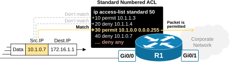
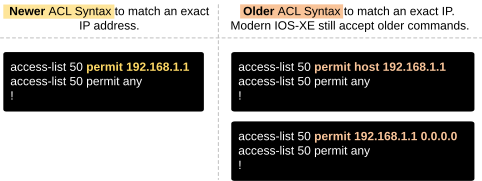
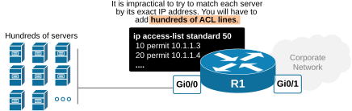
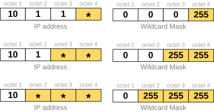
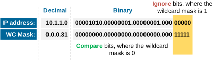
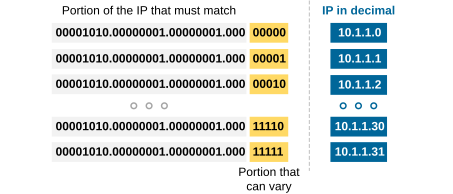
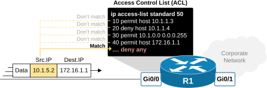
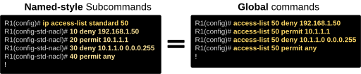

[Standard Numbered ACL](https://www.networkacademy.io/ccna/network-security/standard-numbered-acl)
==========

This lesson provides a detailed explanation of how Standard Numbered IPv4 ACLs work. Let's break this complex name into meaningful pieces: 


- **Standard:** They filter packets based only on the source IP address.
- **Numbered:** They use numbers (not names) to identify the ACL.
- **IPv4:** They work only with IPv4 traffic.

Now, let's dive right in by starting with the logic of packet matching.


## ACL matching logic


The most important aspect of access-control lists (ACLs) is to understand how they match traffic.


An ACL is both a single item and, at the same time, **a list of match-action entries**. For example, as a single item, such as ACL 50, you apply it to an interface in one direction. Once applied, it acts as a list; each entry line contains specific match conditions that the router checks against the source IP address of each packet.


Let's look at the following diagram, for example. A packet arrives on the GI0/0, where the standard access list number 50 is applied. 




*Figure 1. Standard ACL matching logic.*


The router compares the packet's source IP address (10.1.0.7) against each entry in the ACL as follows:


- The router checks the packet's source IP against the ACL line by line, **starting from the lowest sequence number** (seq 10).
- **It stops as soon as it finds a match** and applies the action (permit or deny) from that matching rule. In our example, the packet matches at sequence 30. Hence, the packet is permitted.
- If no rules match, the router **automatically denies the packet**. This is because Cisco ACLs always end with an invisible “deny any” rule (in red).

**Important note:** As soon as a packet matches a sequence line, the action (permit or deny) is applied, and the packet stops being checked against the rest of the ACL. Even if a later entry also matches the packet’s source IP, it won’t be evaluated.


For example, in the diagram above, the packet matches sequence 30 and is permitted. It will not reach sequence 40 and be denied, even if that line also matches the packet’s source IP. This behavior is called the first-match logic. The router checks each ACL line from top to bottom and stops at the first match.


### Matching the exact IP


Now, let's walk through a few examples of the ACL matching logic. To match a specific source IP, we simply type the full IP address at the end of a permit or deny entry.


For example, to permit packets from 192.168.1.1, we use the following configuration syntax, as shown on the left in the diagram below:




*Figure 2. Standard ACL matching exact IP address.*


Note that there is an older and a newer syntax to match one exact source IP address. It is recommended to use the newer one. Modern devices still accept the older command with the host, but they automatically remove the host keyword and transform the command to the newer syntax, as shown on the left.


### Matching a range of IPs (the Wildcard Mask)


More often than not, the goal of an ACL is not to match a single IP address but rather a group of addresses, such as all addresses in a subnet or across several subnets. In other words, you want the ACL to check a range of IPs, not just one. For example, you have a router with hundreds of directly connected servers, as shown in the diagram below. It is impractical to try to match each server by its exact IP address. You will have to add hundreds of ACL lines.




*Figure 3. Why do we need the Wildcard Mask?*


That's why the ACL lets you match a range of IP addresses using **a wildcard mask**. This is not the same as a subnet mask. A wildcard mask (or WC mask) tells the ACL which parts of the IP address to ignore during matching, treating those parts like “don’t care” values.


Wildcard masks can be understood in both decimal and binary, but first, let's think about them in decimal:


- A **0** in a wildcard mask means “compare this octet normally.”
- A **255** means “ignore this octet; it matches anything.”

For example, a wildcard mask of 0.0.0.255 tells the ACL to ignore the last octet of the IP address, as shown in the diagram below. 


*Figure 4. Matching range of IPs with a simple wildcard.*


So, 192.168.1.1 and 192.168.1.75 both match if the address being compared is 192.168.1.0 0.0.0.255. In fact, every IP address that starts with **192.168.1.*** matches this entry of the ACL, regardless of the number in the last octet.


We can use the same logic with a looser wildcard mask like the following:


- 0.0.255.255 ignores the last two octets.
- 0.255.255.255 ignores the last three octets.

For example, the following standard numbered access list matches all IP addresses that start with **192.168. *.***, regardless of the numbers in the third and fourth octets.


*Figure 5. Using a wildcard mask to match a broader IP range.*


For example, 192.168.45.123 matches the ACL. 192.168.0.55 also matches. 192.168.255.99 also matches, and so on. 


Written in simple language, a 255 in the wildcard mask means that this octet is a *****, meaning any number matches. The following diagram illustrates the three most common WC masks. Based on the 255s in the mask, the octet in the IP address matches everything (*).




*Figure 6. Summary of most common wildcard masks.*


Key note: Whenever you use 255 in the wildcard mask, the ACL expects the matching IP address to be 0 in those octets. So if the WC mask is 0.255.255.255, then ACL expects the IP to be written as 10.0.0.0. It will match all **10.*.*.*** addresses.


Lastly, let's see a few more examples with the three most common wildcard masks.


```
`**access-list 50 permit 172.16.1.0 ****0.0.0.255**
This means: Ignore the last octet, match anything starting with 172.16.1.*
**access-list 50 permit 172.16.0.0 ****0.0.255.255**
This means: Ignore the last two octets, match anything starting with 172.16.*.*
**access-list 50 permit 172.0.0.0 ****0.255.255.255**
This means: Ignore the last three octets, match anything starting with 172.*.*.*`
```

Lastly, let's compare the wildcard mask to the standard subnet mask. It is essential to understand that they are different concepts.


Table 1. Subnet mask vs WC mask.
|   | **Subnet Mask** | **Wildcard Mask** 
| **Used in** | IP addressing | ACLs, routing protocols 
| **0 means** | Host bits | Must match 
| **255 means** | Network bits | Ignore 
| **Example** | 255.255.255.0 | 0.0.0.255 

We will talk more about the difference between the two in the following part of the lesson.

Complex Wildcards (CCNP level)
Up to now, we have worked with IP addresses and WC masks in the decimal representation. It is easier that way because humans use the decimal system, based on numbers from 0 to 9. However, computers and network devices work in binary — they understand only 1s and 0s. 


Wildcard masks in networking may look like decimal numbers, but in reality, they are in binary. Understanding how they function requires converting them to binary and comparing them bit by bit. The following snippet shows the three most common WC masks in binary. 


```
`Decimal: **0.0.0.255**
Binary: 00000000.00000000.00000000.11111111
Decimal: **0.0.255.255**
Binary: 00000000.00000000.11111111.11111111
Decimal: **0.255.255.255**
Binary: 00000000.11111111.11111111.11111111`
```

Since both the IP address and the WC mask are in binary, we can have IP/WC mask combinations that are hard to understand unless we convert them to binary. For example, the following diagram shows the decimal representation of a WC mask that is harder to make sense of on the fly. Which IP addresses will match such an ACL entry? Let's find out using binary.


*Figure 7. A complex WC mask example.*


First, we need to convert both the IP address portion and the WC mask portion of the ACL entry into binary. Now we have two 32-bit binary numbers. The ACL compares each bit where the wildcard mask is 0 and ignores each bit where the wildcard mask is 1, as shown in the diagram below.




*Figure 8. Working with binary WC mask.*


This gives us the following result: the first 27 bits of a source IP address must start with 00001010.00000001.00000001.000 to match the ACL entry. The last 5 bits can vary. But what does this mean in decimal representation? We need to convert the binary representation of the IP portion back to decimal as shown in the diagram below.




*Figure 9. Calculating matching IPs using binary.*


So, the matching IP range is: from 10.1.1.0  to 10.1.1.31. Fortunately, in the CCNA exam, you won’t see questions with complex wildcard masks that require detailed binary conversions. Most wildcard masks that you will encounter on the exam will be like 0.0.0.255 or 0.0.255.255. However, the focus is on understanding how wildcard masks work, not on doing heavy binary math.

More Complex WC Masks (CCIE level)
Let's introduce one big difference between a subnet mask and a wildcard mask. A subnet mask is always **a continuous string of 1s followed by 0s in binary**. For example:


```
`The subnet mask **255.255.255.0** in binary is:
11111111.11111111.11111111.00000000`
```

But a wildcard mask does not need to be continuous. The bits can be mixed—some 0s, some 1s—anywhere. For example, a non-standard wildcard mask (not continuous) looks like this:


```
`0.0.15.240 → 00000000.00000000.00001111.11110000`
```

This would match IPs in a custom pattern, often used in OSPF or BGP filters. Using this logic, you can create ACL entries that match only ODD or EVEN IP addresses in a given subnet. Or only IP addresses that vary only in steps of 16, such as 10.1.1.16, 10.1.1.32, 10.1.1.48, etc.  This is one of the reasons why Access Lists use the concept of a wildcard mask instead of a subnet mask. WC masks let us match more complex patterns. However, it is unlikely to encounter such requirements in the CCNA or CCNP exams. This is something that you can zoom into if you decide to pursue the CCIE certification.


### Permit Any


An ACL is a list of match-action rules. Each rule either permits or denies packets based on their source IP address. When you apply an ACL to a router interface, the router checks each incoming packet against the list, in order.


If you don’t include a "permit" entry and only use "deny" entries, the device will deny all other traffic by default because of the implicit "deny any" at the end of every ACL.


So, permit any is sometimes used to ensure that other traffic is allowed after some deny entries.


```
`access-list 50 deny 10.1.1.4 
access-list 50 deny 192.168.1.5 
access-list 50 permit any`
```

### The Implicit Deny Any


If a packet doesn't match any rule in the ACL, the router drops it by default. Even though you don’t see a final “deny any” entry in the ACL, Cisco devices act like it’s there. That’s why many engineers add an explicit permit any at the end of an ACL—to avoid accidentally dropping all traffic.




*Figure 10. ACL Implicit Deny.*


This is how standard numbered IPv4 ACLs work. The rules are simple, but the order of the list and the match logic are very important. Always remember that ACLs process from top to bottom, and stop when they find a match.


## Standard ACL Command Syntax


There are two different syntaxes that you can use to create a new standard numbered access list on a modern Cisco device. 


- The older one that is still widely used is by **using global commands**. 
- The newer syntax, which is a bit more structured, creates a new ACL object and allows you to add access-list entries (ACEs) **as subcommands**. 




*Figure 11. Global vs. Named-style Syntax.*


From a functionality point of view, there is absolutely no difference regardless of how you configure the ACLs. However, from the configuration and editability of the ACL, there is a significant difference between the two approaches.


### Global Commands


The syntax using global commands is a more straightforward way of configuring standard numbered access lists.


```
`access-list 50 deny 192.168.1.10
access-list 50 permit any`
```

The main advantage of this style is its simplicity. If you want to enter a simple ACL with a few lines really fast, you simply add it using the global command. However, it has the following inefficiencies:


- Each match-action line is entered globally.
- You can't edit or remove a single line directly.
- You must remove the entire ACL with the **no access-list 50** command and re-enter it to make changes.

For example, suppose you want to deny access to host 10.1.1.1 using the same access list. Well, if you add such an entry, it will appear after the **permit any** line, as shown in the output below, and the device won't accept it because it will never have any effect.


```
`R1(config)# **access-list 50 deny 192.168.1.10**
R1(config)# **access-list 50 permit any**
R1(config)# **access-list 50 deny 10.1.1.1**
% Access rule can't be configured at higher sequence num 
as it is part of the existing rule at sequence num 20`
```

You must remove the entire ACL, modify it, and re-enter it correctly again in global configuration mode, as shown in the output below.


```
`R1(config)# **no access-list 50**
R1(config)# **access-list 50 deny 192.168.1.10**
R1(config)# **access-list 50 deny 10.1.1.1**
R1(config)# **access-list 50 permit any**`
```

### Named-style Subcommands


The named-style syntax is the newer and more flexible way of configuring ACLs. It uses an approach similar to interface or routing configuration. You first define the access control list in global configuration mode and then add the entries with subcommands as shown in the output below.


```
`**ip access-list standard 50**
10 deny 192.168.1.10
20 permit any`
```

This approach is much more flexible because of the following improvements:


- You can edit individual lines.
- You can use sequence numbers (10, 20, etc.) to manage entries.
- You can insert a new entry wherever you want in the order of the lines.

For example, suppose you want to deny access to host 10.1.1.1 using the same access list, which is defined using the named-style syntax.  


```
`R1(config)# **ip access-list standard 50**
R1(config-std-nacl)# 15 deny 10.1.1.1 
R1(config-std-nacl)# end
!
R1# **show run | s access-list**
ip access-list standard 50
10 deny 192.168.1.10
15 deny 10.1.1.1
20 permit any`
```

## Key Takeaways


- Standard ACL matches packets by **source IP address only**.
They do not consider destination IPs, ports, or protocols.
- Standard Numbered ACL is identified** by a number ID**.
Standard ACLs use numbers from 1 to 99 and 1300 to 1999.
- ACLs work with **a top-down, first-match** logic.
The router checks each rule from top to bottom. It stops at the first match and applies that action (permit or deny).
- There is **an invisible "deny any"** at the end of each ACL.
If no rules match, the packet is automatically dropped.
- You can match an exact IP address or a range of IPs.
To match a range of IPs, use wildcard masks (e.g., 0.0.0.255 matches any IP ending in any value from 0 to 255).
- Wildcard masks define **which IP bits to ignore**.
A 0 means “must match”, a 255 means “ignore this part”. Example: 192.168.1.0 0.0.0.255 matches all 192.168.1.* IPs.
- Permit any allows all other traffic.
If you deny specific IPs but want to allow everything else, always add permit any at the end.
- There are two ACL configuration styles.

- Global command style: Fast but hard to edit.
- Named-style subcommands: Flexible and easy to manage with sequence numbers.

- Editing global ACLs is tricky.
To change one line, you must remove and recreate the whole list. Use named style for better control.
