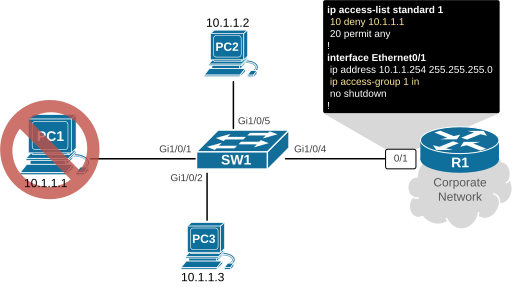
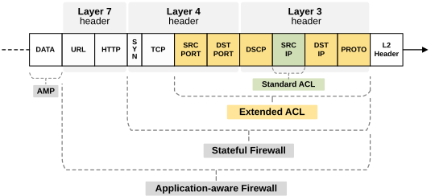
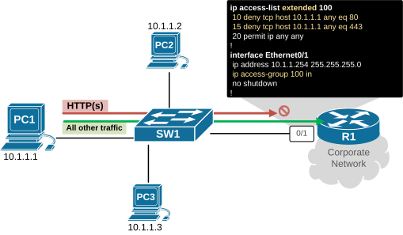
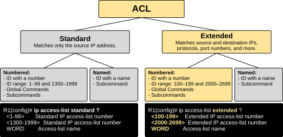
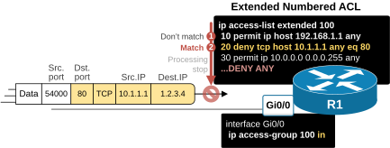
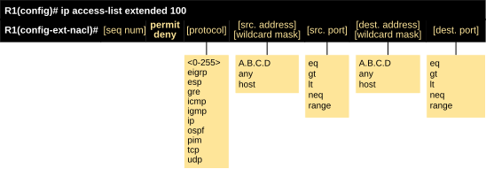

[Extended Numbered ACL](https://www.networkacademy.io/ccna/network-security/extended-numbered-acl)
==========

In this lesson, we will discuss Extended Numbered Access Control Lists. We will examine the differences between standard and extended ACLs, and then the differences between named and numbered ones. In the last part, we will practice configuring and editing extended access lists.


## Why do we need Extended ACLs?


In the previous section, we discussed standard access control lists. A standard ACL is the most basic type of control list. It **only examines the source IP address** in the packet's layer 3 header.


That's why standard ACLs are typically used for **matching blocks of IPs by features such as NAT, QoS, and Route maps.** They are rarely used for traffic filtering because they can unintentionally block more traffic than planned. When used for filtering, it is recommended** to place them near the destination** to minimize the risk of over-filtering.


Using standard ACLs for traffic filtering is limited to completely denying network access to a specific IP address or a block of addresses. For example, on R1, you can filter the IP address 10.1.1.1, which means PC1 will be unable to access the corporate network and will be limited to its local network only.





*Figure 1. Standard ACL over-filtering example.*


However, what if you want to block **only a specific application or service of PC1** but don't want to limit its network access completely? For example, you want to block PC1's web access (TCP ports 80 and 443) but want to allow all other applications. Well, you hit the limitations of the standard access list. The following diagram summarizes the good, bad, and ugly sides of the standard ACLs.


*Figure 2. Standard ACL - The good, The bad and The ugly.*


At some point, Cisco realized that network administrators need **more granular control** over the access control filtering process and introduced the extended access list.


### Extended ACLs to the rescue.


An extended ACL can filter network traffic **based on multiple criteria, not just source addresses**, as shown in yellow in the diagram below.





*Figure 3. Extended ACL matching criteria.*


You can see how much more granular an extended control list is. It can match traffic almost as much as a stateful firewall. Of course, it has its limitations - it cannot reach the packet's layer 7 header.  


Let's see the same example shown in Figure 1 above, but using an extended access list instead of a standard one. You can see that we can easily block only HTTP(s) traffic from PC1 to the corporate network while allowing all other traffic.





*Figure 4. Extended ACL example.*


To summarize, the two types of access control lists that Cisco devices use are:


- Standard ACLs - They match only the source IPv4 address. In real-world networks, they are typically used to match a block of IP addresses for NAT, QoS, or route filtering.
- Extended ACLs - They match on multiple fields, including source and destination IP addresses, protocol (TCP, UDP, ICMP, etc.), and even TCP/UDP ports. They are typically used for precise traffic filtering, like “allow web to a server, block FTP, permit DNS,” and so on.

## What is an Extended Numbered ACL?


An extended numbered ACL is an extended ACL **identified by a number** in the ranges 100–199 or 2000–2699, as shown in yellow in the diagram below.





*Figure 5. Types of ACLs.*


Because it is “extended,” it can look at Layer 3 and Layer 4 information. That means it can decide based on:


- Protocol: IP, TCP, UDP, ICMP, GRE, OSPF, etc.
- Source IP and destination IP.
- TCP/UDP ports: HTTP (80), HTTPS (443), DNS (53), SSH (22), custom ports, ranges, and greater/less-than operators.

## How does Extended Numbered ACL work?


Both extended and standard ACLs follow a strict but straightforward logic, which is very important to understand. Let's summarize it in a few steps, using the diagram below.





*Figure 6. How does ACL work?*


- **Top-down, first match wins.** The router checks each entry in top-down order. As soon as traffic matches a line, the action is applied, and processing stops. For example, the packet shown in the diagram is evaluated against entry number 10 first. It doesn't match. Then against entry number 20. It matches, the processing stops, and the deny action is executed. Although the packet can also match at entry 30, the evaluation process does not continue further down.
- **Implicit DENY ALL at the end**. If no line matches, the packet is dropped by a hidden “deny ip any any” at the end of the list.
- **Direction matters.** An ACL is applied inbound or outbound on an interface.

- **Inbound:** traffic enters the interface before routing.
- **Outbound:** traffic leaves the interface after routing.


Additionally, placement of the ACL in the network environment also matters. It is recommended to put extended ACLs **close to the source of the traffic** you want to control. This saves bandwidth and CPU by dropping unwanted packets early.


## Configuring Extended Numbered ACL


Now let's shift the focus to the configuration side of things. Let's begin with the difference between numbered and named ACLs.


### Numbred vs Named (Global vs Subcommands)


To understand the difference, you must be aware that there are two ways to configure an access control list:


- The old way of using global commands, as shown in the CLI output below:

```
`R1# **conf t**
Enter configuration commands, one per line.  End with CNTL/Z.
R1(config)# **access-list 100 deny tcp host 10.1.1.1 any eq 80**
R1(config)# **access-list 100 deny tcp host 10.1.1.1 any eq 443**
R1(config)# **access-list 100 permit ip any any**
R1(config)# **end**
R1#`
```


- And the more modern way of defining an ACL is with a single global command, followed by configuration of the ACE (access control entries) using subcommands, as shown below.

```
`R1# **conf t**
Enter configuration commands, one per line.  End with CNTL/Z.
R1(config)# **ip access-list extended 101**
R1(config-ext-nacl)# **10 deny tcp host 10.1.1.1 any eq 80**
R1(config-ext-nacl)# **20 deny tcp host 10.1.1.1 any eq 443**
R1(config-ext-nacl)# **30 permit ip any any**
R1(config-ext-nacl)# **end**
R1#`
```

From a functional standpoint, both configuration methods achieve the same result. However, from a configuration perspective, **there is a big difference**. You understand the difference when you have to modify an existing ACL. For example, let's say we want to delete the following entry from the access list. 


```
`deny tcp host 10.1.1.1 any eq 443`
```

How do you do it? How do you delete this ACE from the ACL100 and from ACL101?

Modifying ACL100 (using global command)
When you configure an ACL using global configuration commands like:


```
`R1(config)# **access-list 100 deny tcp host 10.1.1.1 any eq 80**
R1(config)# **access-list 100 deny tcp host 10.1.1.1 any eq 443**
R1(config)# **access-list 100 permit ip any any**`
```

You can’t edit individual lines. If you need to change something, you must remove the entire ACL with:


```
`R1(config)# **no access-list 100**`
```

And then re-enter all the statements from scratch, making the necessary modifications.


```
`R1(config)# **access-list 100 deny tcp host 10.1.1.1 any eq 80**
R1(config)# **access-list 100 permit ip any any**`
```

This limitation applies **to any numbered ACL built in global configuration mode**.

Modifying ACL101 (using subcommands)
In contrast, ACLs configured in subconfiguration mode allow you to add, delete, or modify individual entries without having to recreate the entire list. For example, to delete entry number 20, we simply enter the ACL101 configuration mode and delete the line as shown in the CLI block below.


```
`R1(config)# **ip access-list extended 101**
R1(config-ext-nacl)# **no 20**
R1(config-ext-nacl)#** end**
R1#`
```

Now, we check the list, and we can see that **line number 20 has been deleted**. However, the ACL is still applied under the interface and in effect.


```
`R1# **show ip access-lists 101**
Extended IP access list 101
10 deny tcp host 10.1.1.1 any eq www
30 permit ip any any`
```

You can see how easy it is to modify an ACL configured with the modern CLI way. That's the reason most modern devices with IOS-XE **automatically convert your old ACL configuration to the modern CLI structure**. However, in exam environments and old devices, you may still encounter the old CLI structure.


### Extended ACE structure


Now, let's see the general structure of an entry line in an extended ACL. It can match traffic using multiple parameters, as you can see in the diagram below.





*Figure 7. ACE structure.*


Here’s what each part of the ACE means:


- **sequence number** – Identifies the entry line in the access list. Sequence numbers let you **insert, remove, or reorder** entries without recreating the ACL. If you don’t specify a sequence number, IOS assigns one automatically (usually starting at 10, increasing by 10).
- **permit | deny** – Defines whether matching traffic is allowed or blocked.
- **protocol **– The protocol to match (like IP, TCP, UDP, ICMP). When you want to match a specific service or application, you typically use TCP or UDP and then a destination port number.
- **source **– The source IP address of the packet. You can use the keywords any, host, or a network address directly.
- **wildcard **– Defines which bits of the source address are ignored (0 = match, 1 = ignore).
- **source port** – Used for TCP/UDP to match a specific port. You can use operator keywords like eq, lt, gt, and range.
- **destination **– The destination IP address. Same rules as source.
- **destination wildcard** – Works the same way as the source wildcard.
- **destination port **– Same as the source port.

### Port Operators


In the entry structure above, you can see that the source and destination ports utilize operator keywords such as eq, lt, gt, and range. These operators let you granularly control specific applications or services, not just IP addresses. Of course, they only work with TCP and UDP protocols because only these protocols use port numbers in the header. For other protocols like ICMP or IP, you can’t use them.


Let's see what each operator does with a short example. It is essential to understand each one of them because they give the flexibility of the extended ACL.

eq (equal)
Matches traffic to **a specific port number**. Example:


```
`# Allows all TCP traffic on port 80 (HTTP).
**permit tcp any any ****eq 80**`
```
gt (greater than)
Matches ports **greater than** the given number.


```
`# Allows all TCP traffic using ports above 1023.
**permit tcp any any ****gt 1023**`
```
lt (less than)
Matches ports **less than** the given number.


```
`# Allows traffic to well-known ports below 1024.
**permit tcp any any ****lt 1024**`
```
neq (not equal)
Matches all ports **except the one** specified.


```
`# Allows all TCP traffic except Telnet (port 23).
**permit tcp any any ****neq 23**`
```
range
Matches ports within **a range** of numbers (inclusive).


```
`# Allows UDP traffic with destination ports between 10000 and 20000.
**permit udp any any ****range 10000 20000**`
```

### Port Operators Examples


Lastly, let's examine several examples to provide a clearer understanding of the ACE structure.


```
`# Blocks HTTP traffic from 10.1.1.1 to any destination.
**10 deny tcp host 10.1.1.1 any eq 80**`
```

```
`# Allows HTTPS traffic from any source to 192.168.1.10.
**20 permit tcp any host 192.168.1.10 eq 443**`
```

```
`# Allows UDP traffic using ports between 10000 and 20000.
**30 permit udp any any range 10000 20000**`
```

```
`# Blocks all TCP traffic with destination ports greater than 1023.
**40 deny tcp any any gt 1023**`
```

```
`# Allows all TCP traffic except traffic using port 25 (SMTP).
**50 permit tcp any any neq 25**`
```

```
`# Allows all IP traffic from a single host 172.16.5.5.
**60 permit ip host 172.16.5.5 any**`
```

Let's stop here, as the lesson has become quite lengthy. The theory about access lists is essential. However, it is one of those topics that people learn with practice, so let's walk through some real-world examples in the next lesson.


## Key Takeaways


- Standard ACLs filter **by source IP only.**
- Extended ACLs filter **by source, destination, and protocol/port**.
- Extended numbered ACLs use ranges **100–199 and 2000–2699**.
- ACLs process top-down, **first match wins**,
- ACLs end with **an implicit deny all**.
- Place extended ACLs **close to the source** to stop unwanted traffic early.
- Match TCP/UDP ports using eq, gt, lt, or range.
- Apply ACLs with **ip access-group** inbound or outbound on interfaces.
- **ACLs are stateless** — return traffic must be explicitly allowed.
