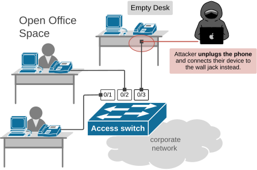
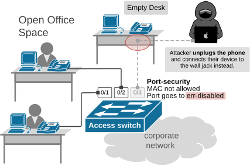
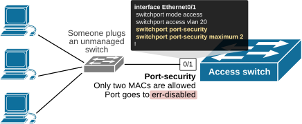
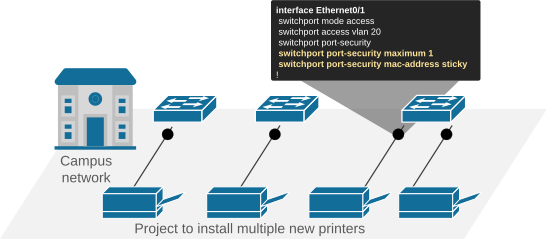
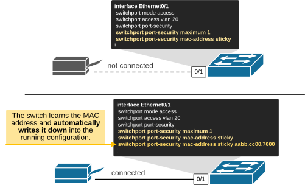

[Switchport Port-Security](https://www.networkacademy.io/ccna/network-security/port-security)
==========

There is a security saying - “*The network is only as strong as its weakest link*.” On a campus LAN, the weakest part is often not the core or the internet edge but the access layer. **Anyone can plug a cable into the wall jack** leading to the access switch. And the switch, by default, will forward traffic for whatever device shows up—PC, printer, or a rogue laptop.


## Why do we need port security?


Access switches live at the edge, where humans and devices connect. That edge is the most dynamic layer of the network. People move desks. Contractors and suppliers visit. IP phones sit between PCs and switches. Printers get swapped and so on. It is one of the network's weakest layers. Let's consider the following example.


Imagine an open office space with desks everywhere. What stops someone with access to the office **from unplugging a device at an empty desk** and plugging their rogue device into the wall jack, as shown in the diagram?





*Figure 1. An attacket connects to the corporate network.*


By default, **switches don’t apply any access control**. Anyone who plugs in a device can jump onto the local network, receive an IP address via DHCP, and gain access to the corporate network. As you can imagine, that’s a significant security gap.


Several layer 2 security features are designed to close this security loophole. The fastest and most straightforward way to protect the access layer from such exploits is to use port security. It limits the number of MAC addresses that can appear on a port and specifies which MACs are allowed to connect.


## What is Port-Security?


On Cisco Catalyst switches, port security is a per-interface feature that** enforces a limit and a list of allowed MAC addresses**. If a device connects and its MAC is allowed, all good. If too many MACs appear or an unexpected MAC is detected, the port goes into an err-disabled state, as shown in the diagram below.





*Figure 2. What is port-security?*


So in summary, port security is used as basic protection on access ports. It performs two main functions:


- Limits the number of allowed MAC addresses on a port.
- Control which MAC addresses are allowed based on a static or dynamic list.

There are several use cases in which engineers utilize port security on access switches as part of the organization's security strategy:


- **Lock a wall jack to a single device** - Stops people from unplugging a PC and connecting a rogue AP, mini-switch, or another device. Also limits MAC-flood attempts from that jack.
- **Printers, cameras, sensors, IoT** - Pin the MAC address of the known device so that only that device can connect to the network. Great for hallways, ceilings, and closets where wall jacks are hard to observe and protect.

## How does port-security work?


Port security is a per-access interface feature. This means we configure it on a per-interface basis on access ports. We enable the feature using the following command under an interface config mode:


```
`Switch(config)# interface Ethernet0/1
Switch(config-if)# **switchport port-security**`
```

However, the port must be configured for access beforehand; otherwise, the switch won't allow us to enable the feature, as shown in the output below.


```
`Switch# **configure terminal**
Enter configuration commands, one per line.  End with CNTL/Z.
Switch(config)# **interface Ethernet0/1**
Switch(config-if)# **switchport port-security**
Command rejected: Ethernet0/0 is a dynamic port.
!`
```

You can see that the switch rejected the port-security command because the port is dynamic - it can become access or trunk depending on the DTP negotiation with the remote side.


Let's configure the port as access in VLAN 10 first and then enable port security.


```
`Switch(config)# **interface Ethernet0/1**
Switch(config-if)# **switchport mode access**
Switch(config-if)# **switchport access vlan 20**
Switch(config-if)# **switchport port-security**
!`
```

Now the command is accepted, and port-security is enabled. However, it does nothing at the moment. We need to specify four parameters as shown below:


```
`Switch(config-if)# **switchport port-security ?**
**aging**        Port-security aging commands
**mac-address**  Secure mac address
**maximum**      Max secure addresses
**violation**    Security violation mode
<cr>         <cr>`
```

### **Step 1: Limit the maximum number of MAC addresses**


The first port-security option that we can configure is to specify **the number of different source MAC addresses that the port should accept**. By default, a switchport can learn a large number of MAC addresses, allowing someone to connect a switch to the access layer and connect multiple unauthorized devices to the corporate network. Port security prevents this by configuring a maximum number of MAC addresses that a port can learn, as shown in green in the CLI block below.


```
`interface Ethernet0/1
switchport mode access
switchport access vlan 20
** switchport port-security
****switchport port-security maximum 2**`
```

With the command above, the port will allow **up to two learned MACs**. If someone plugs an unauthorized switch and connects three or more devices, as shown in the diagram below, that’s a violation, and the violation action is triggered (which we will discuss later).





*Figure 3. Maximum MAC addresses.*


Nowadays, the most common use case of this feature is to prevent employees from hiding a little 5-port switch under a desk to plug in BYOD or lab gear into it. The port will be blocked because too many MAC addresses are detected.


### **Step 2. List of allowed MAC addresses**


The next feature of the port-security that we can configure is the list of allowed MAC addresses on a port. There are two options we can use.

**Pre-configured list**
In small static environments, we can manually pre-configure the MAC address of the connected device into the port configuration, as shown in the CLI block below.


```
`interface Ethernet0/1
switchport access vlan 10
**switchport port-security**
**switchport port-security mac-address 0011.2233.4455**`
```

This security feature is useful when connecting printers, cameras, or other IoT devices located in areas that are difficult to watch and physically protect. For example, a CCTV camera can be connected in a closet on the roof where nobody is watching. An attacker can easily unplug the camera and connect their device without anyone noticing.


However, this manual method **doesn't scale**. Imagine a campus that has hundreds of printers and CCTV cameras. It is a lot of manual work to pre-configure the MAC address of each device on the connected port. That's why Cisco introduced a semi-automated method called MAC-address sticky. 

**mac-address sticky**
The MAC-address sticky is a port-security feature that allows the switch to automatically learn a MAC address and then “stick” it to the running configuration. We enable it as shown below.


```
`interface Ethernet0/1
switchport access vlan 10
**switchport port-security**
**switchport port-security mac-address sticky**`
```

Instead of a network admin typing the MAC address by hand, **the switch sees the first device that connects**, writes down its MAC address in the running config, and treats it as a trusted device. After that, only that MAC is allowed on the port (unless the admin clears or changes it).


**KEY NOTE:** In simple terms, when mac-address sticky is configured, the switch remembers in the running config the first MAC address that is plugged in.


A typical example when mac-address sticky is used is when the network team wants to secure large deployments of static devices like printers, cameras, sensors, or other IoT devices, where typing MACs manually would be unscalable and painful. For example, there is a project to install multiple printers in the campus network. The day when the printers are connected to the network, the network team configures the switchports with port-security and mac-address sticky, as shown in the diagram below.





*Figure 4. MAC address sticky example.*


At that point, the MAC address of each printer is stored in the running configuration of the switchport it connects to. From that point on, if anyone disconnects a printer and plugs their own device into the wall jack, the switchport shuts down the port to prevent unauthorized access.

**mac-address sticky CLI example**
Now let's see a CLI example of the feature. First, we configure the switchport as shown in the top part of the diagram below. This is done before connecting the permanent device to the switchport.





*Figure 5. mac-address sticky CLI example.*


Once the device is connected as shown in the bottom part of the diagram, the switch learns the MAC address and writes it down in the switchport's running config, as you can see in the CLI output below.


```
`Switch# **show mac address-table interface eth0/1**
Mac Address Table
-------------------------------------------

Vlan    Mac Address       Type        Ports
----    -----------       --------    -----
20    aabb.cc00.7000    STATIC      Et0/1
Total Mac Addresses for this criterion: 1`
```

```
`Switch# **show run int Et0/0**
Building configuration...

Current configuration : 235 bytes
!
interface Ethernet0/1
switchport access vlan 20
switchport mode access
switchport port-security
switchport port-security mac-address sticky
switchport port-security mac-address sticky aabb.cc00.7000
end`
```

At this point, if someone disconnects the printer and connects a rogue device to the switchport, the switchport will trigger the port-security violation action (which we will see below).


Note that to make the sticky MAC stored permanently after reboot, you need to copy the running conf as shown in the CLI below:


```
`Switch# **copy running-config startup-config**
Destination filename [startup-config]?
Building configuration...
[OK]`
```

### Step 3. Violation actions


In summary, what we have seen so far - port-security controls two things on access ports:


- The maximum number of MACs that a switchport can learn.
- The list of MAC addresses that are allowed. 

But what happens when someone violates one of these rules - the port executes the configured violation action, which can be one of the following:


```
`Switch(config-if)# **switchport port-security violation ?**
**protect   **Security violation protect mode
**restrict  **Security violation restrict mode
**shutdown  **Security violation shutdown mode`
```


- **Protect:** Drop frames from unknown or excess MACs. Do not log. Do not disable the port. Authorized devices keep working. Quiet but strict.
- **Restrict:** Drop frames from unknown or excess MACs. Increment a violation counter, and send an SNMP trap/syslog. Good for visibility with less disruption.
- **Shutdown (default):** Put the port into the err-disabled state. It goes down and stays down until you manually shutdown/no shutdown the interface, or until an automatic recovery kicks in if you’ve configured it.

The shutdown option is most commonly used and is the default violation option on modern switches. Here, it is essential to note that once a port enters the err-disabled state, **it remains in that state** until either manual or automatic recovery is performed.


For example, let's see what happens if we disconnect the printer and connect another device to the switchport.


```
`# we disconnect the printer and connect another device
**Switch#**
***Oct 31: %PORT_SECURITY-2-PSECURE_VIOLATION: **
Security violation occurred,caused by MAC address aaaa.bbbb.cccc on port Ethernet0/1
***Oct 31: %PM-4-ERR_DISABLE:**
psecure-violation error detected on Et0/1, putting Et0/1 in err-disable state
***Oct 31: %LINEPROTO-5-UPDOWN:**
Line protocol on Interface Ethernet0/1, changed state to down
***Oct 31: %LINK-3-UPDOWN:**
Interface Ethernet0/1, changed state to down`
```

```
`Switch# **show interfaces Ethernet0/1**
Ethernet0/1 is down, line protocol is down (err-disabled)
Hardware is Ethernet, address is aabb.cc00.1000 (bia aabb.cc00.1000)
MTU 1500 bytes, BW 10000 Kbit/sec, DLY 1000 usec,
reliability 255/255, txload 1/255, rxload 1/255
Encapsulation ARPA, loopback not set
Keepalive set (10 sec)
Full-duplex, Auto-speed, media type is 10/100/1000BaseTX
input flow-control is off, output flow-control is unsupported
ARP type: ARPA, ARP Timeout 04:00:00
Last input 00:00:01, output 00:03:16, output hang never
Last clearing of "show interface" counters never
Input queue: 0/2000/0/0 (size/max/drops/flushes); Total output drops: 0
Queueing strategy: fifo
Output queue: 0/40 (size/max)
5 minute input rate 0 bits/sec, 0 packets/sec
5 minute output rate 0 bits/sec, 0 packets/sec
133 packets input, 14800 bytes, 0 no buffer
Received 21 broadcasts (0 multicasts)
0 runts, 0 giants, 0 throttles
0 input errors, 0 CRC, 0 frame, 0 overrun, 0 ignored
0 input packets with dribble condition detected
479 packets output, 37648 bytes, 0 underruns
Output 479 broadcasts (479 multicasts)
0 output errors, 0 collisions, 1 interface resets
0 unknown protocol drops
0 babbles, 0 late collision, 0 deferred
0 lost carrier, 0 no carrier
0 output buffer failures, 0 output buffers swapped out`
```

You can see that the port immediately went into the err-disabled state, and the switch sent a syslog. 


## Errdisable Recovery


By default, once a switchport port is placed into an err-disabled state, it remains down until the switch reboots. This is very important to understand and remember because it often appears in CCNA/CCNP exams.


There are two ways to recover an err-disabled port:


### **Manual Errdisable Recovery**


The most straightforward way to recover a port that is shut down by port security (or another feature like STP), is to shut it down and unshut it, as shown in the CLI block below. 


```
`Switch# **configure terminal**
Enter configuration commands, one per line.  End with CNTL/Z.
Switch(config)# **interface Ethernet0/1**
Switch(config-if)# **shutdown**
Switch(config-if)# **no shutdown**`
```

However, this approach obviously doesn't scale and requires human intervention, which is not applicable in some network environments that lack a 24/7 helpdesk.


### **Automatic Errdisable Recovery**


Cisco switches allow a more scalable and automated approach to recovering err-disabled ports. We enable it using the errdisable recovery command in global configuration mode, as shown in the CLI block below.


```
`Switch# **configure terminal**
Enter configuration commands, one per line.  End with CNTL/Z.
Switch(config)# **errdisable recovery ****cause psecure-violation**
Switch(config)# **errdisable recovery interval 300**`
```

This config example brings the err-disabled ports back up after 5 minutes, which reduces help-desk calls. You may wonder - wait, what if the rogue device is still connected? Do we want to enable the port? 


Remember, if the rogue device is still there, the port will be disabled immediately again, and the attacker still won't be able to access the network.


Note that errdisable recovery is not tied to port security only; it can recover ports disabled by various other features, such as EtherChannels and Spanning Tree, as you can see in the CLI block below.


```
`Switch(config)# **errdisable recovery cause ?  **              
all                   Enable timer to recover from all error causes
arp-inspection        Enable timer to recover from arp inspection error
disable state
bpduguard             Enable timer to recover from BPDU Guard error
channel-misconfig     Enable timer to recover from channel misconfig error
(STP)
dhcp-rate-limit       Enable timer to recover from dhcp-rate-limit error
dtp-flap              Enable timer to recover from dtp-flap error
gbic-invalid          Enable timer to recover from invalid GBIC error
inline-power          Enable timer to recover from inline-power error
l2ptguard             Enable timer to recover from l2protocol-tunnel error
link-flap             Enable timer to recover from link-flap error`
```

Remember that err-disabled recovery is a common question in the CCNA lab portion, so make sure to spend some time practicing.


## Port Security limitations


Port security is an old feature that had its place in the organization's security strategy. However, in modern network environments, it is insufficient to prevent rogue devices from connecting to the corporate network.

Port security is an old feature that had its place in the organization's security strategy. However, in modern network environments, it is insufficient to prevent rogue devices from connecting to the corporate network. Let's look at why.

### What port security does NOT protect against

**MAC address spoofing** — Port security binds a MAC address to a port, but MAC addresses can be easily spoofed in software. An attacker can use tools like "macchanger" on Linux or modify the MAC address in Windows settings to impersonate an authorized device. Port security checks the MAC address, but it cannot verify that the device claiming to have that MAC address is legitimate.

**Rogue DHCP servers** — Port security does not inspect the contents of frames. A device connected to a secure port can still run a rogue DHCP server and hand out malicious IP settings. You need DHCP snooping to prevent this.

**ARP spoofing** — Similarly, port security does not validate ARP messages. A device on a secure port can send fake ARP replies and perform man-in-the-middle attacks. Dynamic ARP Inspection (DAI) is required to prevent this.

**VLAN hopping** — Port security does not prevent an attacker from exploiting trunk negotiation or double-tagging to hop between VLANs.

### Better alternatives for modern networks

For a more robust access-layer security strategy, combine port security with these features.

**802.1X (Port-Based Network Access Control)** — This is the modern standard for network access control. When a device connects to a switch port, it must authenticate before the port forwards any traffic. Authentication can be based on:

- **EAP (Extensible Authentication Protocol)** — The device provides credentials (username/password or certificate) to a RADIUS server (like Cisco ISE or FreeRADIUS).
- **MAB (MAC Authentication Bypass)** — For devices that don't support 802.1X (like printers or cameras), the switch authenticates them based on their MAC address against the RADIUS server.

802.1X is far more secure than port security because:
- It authenticates the user/device, not just the MAC address.
- Credentials can be revoked centrally.
- It supports dynamic VLAN assignment based on the user's role.

**DHCP Snooping** — Prevents rogue DHCP servers from handing out malicious IP settings. Combined with port security, it adds a layer of protection that port security alone cannot provide.

**Dynamic ARP Inspection (DAI)** — Prevents ARP spoofing attacks by validating ARP packets against the DHCP snooping binding table.

**IP Source Guard** — Prevents IP spoofing by filtering traffic based on the DHCP snooping binding table.

### Defense in depth

The key concept to remember is **defense in depth** — relying on a single security feature is never enough. A well-designed access layer uses multiple overlapping controls:

1. **Port security** — Limits the number of MAC addresses and optionally binds specific MACs to a port.
2. **DHCP snooping** — Blocks rogue DHCP servers.
3. **DAI** — Validates ARP messages against known bindings.
4. **IP Source Guard** — Enforces source IP address validation.
5. **802.1X** — Authenticates devices before granting network access.

Each feature addresses a different attack vector, and together they provide comprehensive protection for the access layer.

### Port security best practices

Even with better alternatives available, port security is still useful when deployed correctly. Here are some best practices.

- **Use sticky MAC addresses** for small, stable networks where devices rarely change.
- **Set the maximum MAC addresses to a reasonable number** (1 for a PC port, 2 for a PC + IP phone).
- **Configure errdisable recovery** to automatically restore ports after a violation, but set a reasonable interval (300 seconds or more).
- **Use the "restrict" violation mode** in production (logs and drops, but doesn't shut the port), and "shutdown" for high-security areas.
- **Do not rely on port security alone** — combine it with 802.1X, DHCP snooping, and DAI.

## Summary

- **Port security** controls which devices can connect to a switch port based on MAC addresses.
- It supports three **violation modes**: protect, restrict, and shutdown.
- **Sticky MAC addresses** allow the switch to learn MAC addresses dynamically and save them to the running configuration.
- Ports disabled due to a security violation enter **errdisable state** and can be recovered manually or automatically using **errdisable recovery**.
- Port security alone is **not sufficient** — combine it with 802.1X, DHCP snooping, DAI, and IP Source Guard for a defense-in-depth approach.
