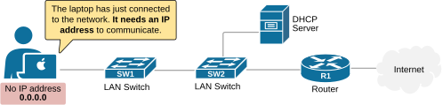
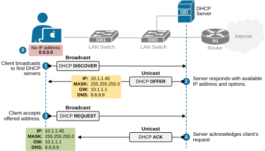
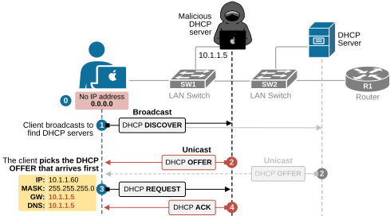

[DHCP Snooping](https://www.networkacademy.io/ccna/network-security/dhcp-snooping)
==========

In this lesson, we discuss what DHCP snooping is and how it protects the network from rogue IP settings. But before we talk about the security side of things, let’s rewind a bit and make sure we understand what DHCP actually is.

## What is DHCP?

When you plug your laptop into a switch or connect it to the Wi-Fi, your device doesn’t know what IP address to use, as shown in the diagram below.

*Figure 1. Client just connects to the network.*

That's where the Dynamic Host Configuration Protocol comes in, automatically providing IP settings such as IP address, Network Mask, Default Gateway, and DNS. Let's recall how it works.

### How does DHCP work?

DHCP is the service that automatically gives IP addresses and network settings to devices. It is very simple and works using a quick four-step process, as shown in the diagram below.

*Figure 2. How does DHCP work?*

- **Step 1:** When you connect your laptop to the network, it simply yells to everybody, “*Hey, is there a DHCP server out there? Can someone give me an IP?*” Remember that this is **a broadcast message that reaches every device in the local LAN**. The laptop doesn't know if there is a local server in the LAN, so it floods and learns.
- **Step 2: **Eventually, the local DHCP server hears that broadcast, and it replies, “*Sure, here’s an IP you can use, along with your subnet mask, default gateway, and DNS servers.*”
- **Step 3:** The client accepts the offered IP settings by sending a Request message back to the server.
- **Step 4:** Finally, the server acknowledges the client's request, indicating the device is online and ready to communicate on the network.

You can see how simple and powerful the process is, **but there’s a big problem**. DHCP was invented in times when security was not a primary concern. Therefore, it doesn't implement any security by default. It assumes everyone in the network is friendly. And we all know that’s not always the case nowadays.

## Why do we need DHCP Snooping?

Now let's look at the same example but from another perspective. Imagine this is an office network, with hundreds of people. There’s one official DHCP server that assigns IP addresses. 

Now imagine an attacker who wants to steal sensitive corporate data. They connect a laptop to the office network and run a fake DHCP server tool, as shown in the diagram below. 

*Figure 3. Rogue DHCP server example.*

In that case, the hacker's DHCP tool responds to clients’ DHCPDISCOVER messages **faster than the real server.** At the same time, clients accept the first DHCPOFFER message they receive. So what happens is that the client gets a malicious IP address, default gateway, and DNS servers from the hacker, as shown in the diagram above.

The ultimate goal of the hacker is to give the client a fake gateway that points to them. In our example, the hacker assigns its own IP address, 10.1.1.5, as the client's default gateway.
