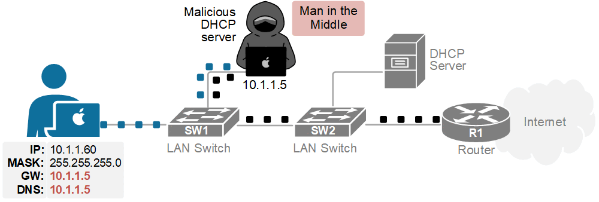
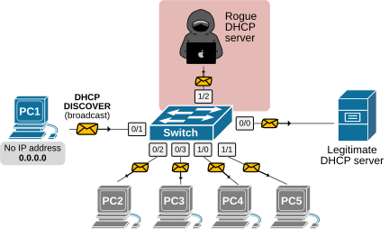
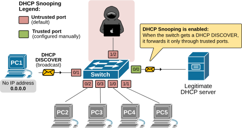
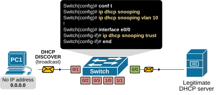

[DHCP Snooping](https://www.networkacademy.io/ccna/network-security/dhcp-snooping)
==========
# DHCP Snooping

In this lesson, we discuss what DHCP snooping is and how it protects the network from rogue IP settings. But before we talk about the security side of things, let's rewind a bit and make sure we understand what DHCP actually is.

## What is DHCP?

When you plug your laptop into a switch or connect it to the Wi-Fi, your device doesn't know what IP address to use, as shown in the diagram below.


Figure 1. Client just connects to the network.

That's where the Dynamic Host Configuration Protocol comes in, automatically providing IP settings such as IP address, Network Mask, Default Gateway, and DNS. Let's recall how it works.

### How does DHCP work?

DHCP is the service that automatically gives IP addresses and network settings to devices. It is very simple and works using a quick four-step process, as shown in the diagram below.


Figure 2. How does DHCP work?

- **Step 1:** When you connect your laptop to the network, it simply yells to everybody, "*Hey, is there a DHCP server out there? Can someone give me an IP?*" Remember that this is **a broadcast message that reaches every device in the local LAN**. The laptop doesn't know if there is a local server in the LAN, so it floods and learns.
- **Step 2:** Eventually, the local DHCP server hears that broadcast, and it replies, "*Sure, here's an IP you can use, along with your subnet mask, default gateway, and DNS servers.*"
- **Step 3:** The client accepts the offered IP settings by sending a Request message back to the server.
- **Step 4:** Finally, the server acknowledges the client's request, indicating the device is online and ready to communicate on the network.

You can see how simple and powerful the process is, **but there's a big problem**. DHCP was invented in times when security was not a primary concern. Therefore, it doesn't implement any security by default. It assumes everyone in the network is friendly. And we all know that's not always the case nowadays.

## Why do we need DHCP Snooping?

Now let's look at the same example but from another perspective. Imagine this is an office network, with hundreds of people. There's one official DHCP server that assigns IP addresses.

Now imagine an attacker who wants to steal sensitive corporate data. They connect a laptop to the office network and run a fake DHCP server tool, as shown in the diagram below.


Figure 3. Rogue DHCP server example.

In that case, the hacker's DHCP tool responds to clients' DHCPDISCOVER messages **faster than the real server.** At the same time, clients accept the first DHCPOFFER message they receive. So what happens is that the client gets a malicious IP address, default gateway, and DNS servers from the hacker, as shown in the diagram above.

The ultimate goal of the hacker is to give the client a fake gateway that points to them. In our example, the hacker assigns its own IP address, 10.1.1.5, as the client's default gateway.

The result is that the client connects to the Internet through them. All your traffic flows through the attacker's machine, as shown in the diagram below. That's called **a man-in-the-middle attack**.



Figure 4. DHCP Man in the Middle Attack.

This is why we need DHCP snooping—a feature that controls who's allowed to hand out IP addresses and who's not.

## What is DHCP snooping?

DHCP snooping is a feature that prevents unauthorized servers from providing IP settings to the host. Although DHCP is a Layer 3 service, **DHCP snooping works at Layer 2** — on switches. It is best understood via an example, so let's look at the simplest possible topology with only one switch.



Figure 5. DHCP at layer 2 without Snooping.

PC1 has just been connected to the network. It sends out a DHCPDISCOVER message. When the switch receives a DISCOVER message, **it forwards it on all its ports because it is a broadcast**. Ultimately, the rogue server receives the DHCPDISCOVER and replies back with a DHCPOFFER, compromising the network security.

Now, let's look at the same example, but with the switch configured to perform DHCP Snooping. When the feature is enabled, the switch starts treating every port as either trusted or untrusted:

- **Trusted ports** connect to real DHCP servers or routers. These ports **can send and receive all DHCP messages**, like DHCPOFFER and DHCPACK.
- **Untrusted ports** connect to regular users or end devices. They **can only receive DHCPDISCOVER messages** (asking for an IP). They cannot receive DHCPOFFER or DHCPACK.

By default, all ports are untrusted until the network admin marks them as trusted.

Let's see how our example differs when the snooping feature is enabled and the port toward the legitimate server is marked as trusted. Now, when PC1 sends the DHCPOFFER message, the switch only sends it out the port that connects to the real server. The attacker doesn't receive the message at all, as shown in the diagram below.



Figure 6. DHCP at layer 2 with Snooping enabled.

Even if the attacker receives the DHCPDISCOVER, when they reply back with DHCPOFFER, the switch drops the message because it doesn't accept DHCPOFFERS on untrusted ports.

In short, DHCP snooping separates trusted (known) servers from unknown servers and ensures that only trusted servers can hand out network settings.

## Configuring DHCP Snooping

Now let's shift the focus to the configuration side of things. Configuring DHCP Snooping is pretty straightforward. The following diagram summarizes how we enable the feature on the simple topology we use as an example.



Figure 7. DHCP Snooping configuration example.

Before we look into each configuration step separately, let's first verify that the feature is disabled globally by default.

```plaintext
Switch# show ip dhcp snooping
Switch DHCP snooping is disabled
Switch DHCP gleaning is disabled
DHCP snooping is configured on following VLANs:
none
DHCP snooping is operational on following VLANs:
none
 Proxy bridge is configured on following VLANs:
none
 Proxy bridge is operational on following VLANs:
none
DHCP snooping is configured on the following L3 Interfaces:

Insertion of option 82 is enabled
   circuit-id default format: vlan-mod-port
   remote-id: aabb.cc00.9000 (MAC)
Option 82 on untrusted port is not allowed
Verification of hwaddr field is enabled
Verification of giaddr field is enabled
DHCP snooping trust/rate is configured on the following Interfaces:

Interface                  Trusted    Allow option    Rate limit (pps)
-----------------------    -------    ------------    ----------------
```

Remember that by default, every Cisco switch allows all DHCP messages on all ports (no security at all).

### Step 1. Enable DHCP snooping on a switch

First, we need to enable DHCP snooping globally on the switch. We go to global config mode and enter:

```plaintext
Switch(config)# ip dhcp snooping
```

Note that just doing this, the switch does NOT start filtering messages yet. We still have to tell it which VLANs to protect.

### Step 2. Enable DHCP snooping for specific VLANs

The next step is to enable the feature for the specific VLANs we want. DHCP snooping works per VLAN. If you don't enable it for a VLAN, that VLAN is not protected. For example, let's say clients are connected to VLAN10, then we configure the following:

```plaintext
Switch(config)# ip dhcp snooping vlan 10
```

Now the switch will apply DHCP snooping logic to VLAN 10. At this point:

- The switch starts inspecting DHCP traffic on untrusted ports within VLAN 10.
- The switch starts building the DHCP snooping binding table (IP - MAC - port).

However, we still haven't defined trusted ports. Remember that by default, all switchports are untrusted.

### Step 3. Mark trusted and untrusted ports

By default, every port is UNTRUSTED, which means: a device connected to an untrusted port is allowed to request an IP address (send DHCPDISCOVER), but it is NOT allowed to respond as a server (send DHCPOFFER or DHCPACK). Those get dropped.

We need to tell the switch which ports we do trust. Normally, these are the uplinks toward the real DHCP server.

In our simple example, the server is connected to port Ethernet0/0. Therefore, we configure it as a trusted port using the CLI command below.

```plaintext
Switch(config)# interface Ethernet0/0
Switch(config-if)# ip dhcp snooping trust
Switch(config-if)# exit
```

Now Ethernet0/0 is trusted. DHCPOFFERS and DHCPACKs from that interface are allowed.

## Verify DHCP snooping

After the config, we should always verify. The following show command is essential for the CCNA exam and for real environments.

```plaintext
Switch# show ip dhcp snooping
Switch DHCP snooping is enabled
Switch DHCP gleaning is disabled
DHCP snooping is configured on following VLANs:
10
DHCP snooping is operational on following VLANs:
10
 Proxy bridge is configured on following VLANs:
none
 Proxy bridge is operational on following VLANs:
none
DHCP snooping is configured on the following L3 Interfaces:

Insertion of option 82 is enabled
   circuit-id default format: vlan-mod-port
   remote-id: aabb.cc00.1000 (MAC)
Option 82 on untrusted port is not allowed
Verification of hwaddr field is enabled
Verification of giaddr field is enabled
DHCP snooping trust/rate is configured on the following Interfaces:

Interface                  Trusted    Allow option    Rate limit (pps)
-----------------------    -------    ------------    ----------------
Ethernet0/0                      yes        yes             unlimited
Interface                  Trusted    Allow option    Rate limit (pps)
-----------------------    -------    ------------    ----------------
  Custom circuit-ids:
```

Notice the lines highlighted in blue. They will tell us:

- Is DHCP snooping enabled? Yes.
- Which VLANs are protected? Vlan 10.
- Which interfaces are trusted? Ethernet 0/0.

## The DHCP Snooping Binding Table

When DHCP snooping is enabled and a client successfully goes through the DORA process, the switch learns from the snooped DHCP messages and creates an entry in the **DHCP snooping binding database**. This is a table that keeps track of which client got which IP address, on which port, and for how long.

Let's take a look at the binding table after PC1 obtains an IP address from the real DHCP server.

```plaintext
Switch# show ip dhcp snooping binding
MacAddress          IpAddress        Lease(sec)  Type           VLAN  Interface
------------------  ---------------  ----------  -------------  ----  --------------------
aa:bb:cc:00:00:11  192.168.1.10     86300       dhcp-snooping   10    Ethernet0/1
```

The table contains the following information:

- **MacAddress** — The MAC address of the client that requested an IP.
- **IpAddress** — The IP address that was assigned to the client.
- **Lease(sec)** — How long the lease is valid (in seconds). Typically 24 hours (86400 seconds).
- **Type** — Always "dhcp-snooping" for dynamic entries.
- **VLAN** — The VLAN where the client is located.
- **Interface** — The switch port the client is connected to.

This binding table is very important because other security features like **Dynamic ARP Inspection (DAI)** and **IP Source Guard** rely on it to validate traffic.

But there's an important operational detail you need to know. **The binding table is stored in RAM by default**. If the switch reloads, the binding table is gone. Clients will still have their IP addresses (they don't lose their DHCP lease just because the switch rebooted), but DAI and IP Source Guard will have no entries to validate against. This causes traffic to be dropped until clients renew their leases and new bindings are created.

To prevent this, you can configure the switch to save the binding table to permanent storage.

```plaintext
Switch(config)# ip dhcp snooping database flash:dhcp-snoop.db
```

This tells the switch to periodically write the binding database to a file on the flash memory. After a reload, the switch reads the file and restores the bindings automatically.

## Rate Limiting — Preventing DHCP Starvation Attacks

There's another type of attack that DHCP snooping alone cannot prevent. Imagine an attacker connects a laptop to an untrusted port and runs a script that sends thousands of fake DHCPDISCOVER messages, each with a different spoofed MAC address.

What happens? The legitimate DHCP server sees all these requests and starts handing out IP addresses for each one. Eventually, the server's address pool runs out. When a real client connects and tries to get an IP address, the server has none left to give. This is called a **DHCP starvation attack** — a type of denial-of-service (DoS) attack.

How do we protect against this? We use **rate limiting** on untrusted ports. The command limits how many DHCP packets per second the switch will accept on a given port.

```plaintext
Switch(config)# interface Ethernet0/1
Switch(config-if)# ip dhcp snooping limit rate 10
```

This limits the port to 10 DHCP packets per second. If an attacker tries to exceed this limit, the switch drops the excess packets. If the rate is exceeded repeatedly, the switch will put the port in an **errdisable** state, effectively shutting it down.

A rate limit of 10-15 packets per second is a good starting point for typical access ports.

## DHCP Snooping and Option 82

When DHCP snooping is enabled, Cisco switches insert **Option 82** (also known as the DHCP Relay Agent Information Option) into DHCP packets received on untrusted ports. This option contains two pieces of information:

- **Circuit ID** — Identifies the switch and port where the client is connected (e.g., "Ethernet0/1").
- **Remote ID** — Identifies the switch itself (usually its MAC address).

You might have noticed in the `show ip dhcp snooping` output earlier:

```plaintext
Insertion of option 82 is enabled
   circuit-id default format: vlan-mod-port
   remote-id: aabb.cc00.1000 (MAC)
Option 82 on untrusted port is not allowed
```

Option 82 helps the DHCP server know exactly where each client is located in the network. However, **some DHCP servers do not support Option 82** and will drop packets that contain it. In that case, you need to disable Option 82 insertion.

```plaintext
Switch(config)# no ip dhcp snooping information option
```

After disabling it, verify with the show command that it shows "Insertion of option 82 is disabled".

## Verifying the Binding Table and Statistics

Besides the basic verification we did earlier, there are two more useful show commands for monitoring DHCP snooping.

**Show the DHCP snooping statistics** — This tells you how many packets have been processed and dropped, and why.

```plaintext
Switch# show ip dhcp snooping statistics
Packets Processed by DHCP Snooping = 100
Packets Dropped Because...
  IDB not known = 0
  Queue full = 0
  Interface is in error down = 0
  Rate limit exceeded = 0
  DHCP option 82 not allowed = 0
  Invalid server IP address = 0
  Invalid client IP address = 0
  Invalid source MAC address = 0
  Invalid destination MAC address = 0
  DHCP server received on untrusted port = 5
  DHCP client received on trusted port = 0
```

Look at the "DHCP server received on untrusted port" counter. If this number is increasing, someone (or something) is trying to act as a rogue DHCP server on an untrusted port. DHCP snooping is doing its job and blocking those DHCPOFFER messages.

**Show the DHCP snooping binding for all entries** — This lists every client that has successfully obtained a lease.

```plaintext
Switch# show ip dhcp snooping binding
MacAddress          IpAddress        Lease(sec)  Type           VLAN  Interface
------------------  ---------------  ----------  -------------  ----  --------------------
aa:bb:cc:00:00:11  192.168.1.10     84123       dhcp-snooping   10    Ethernet0/1
aa:bb:cc:00:00:22  192.168.1.11     86000       dhcp-snooping   10    Ethernet0/2
aa:bb:cc:00:00:33  192.168.1.12     85500       dhcp-snooping   10    Ethernet0/3
```

If the binding table is empty but clients have valid IP addresses, it usually means one of the following:

- DHCP snooping is not enabled for the correct VLAN.
- The switch was reloaded and no database persistence was configured.
- The DHCP server is on a different switch and the uplink port is not trusted.

## DHCP Snooping in Voice VLAN Environments

In many enterprise networks, IP phones are daisy-chained with a PC connected to the phone's pass-through port. In this setup, the switch port carries **two VLANs**: the data VLAN (for the PC) and the voice VLAN (for the phone).

The question is: should we trust this port or not?

The answer is **no — keep it untrusted**. Even though an IP phone is connected, the port is still user-facing and could potentially be compromised. The phone itself will use DHCP to get its IP address for the voice VLAN, and DHCP snooping will learn that binding just fine on the untrusted port.

However, there is one important consideration. When the IP phone boots up, it may use CDP (Cisco Discovery Protocol) to negotiate the voice VLAN with the switch. Once the phone gets its voice VLAN assignment, it requests an IP address via DHCP. Since the phone is on an untrusted port, it can send DHCPDISCOVER and DHCPREQUEST — which are allowed. The DHCP server (on the trusted port) responds with DHCPOFFER, which is forwarded back to the phone. Everything works normally because the server is on the trusted side.

## How DHCP Snooping Interacts with Other Features

DHCP snooping is not an island. It's the foundation for two other important security features.

### Dynamic ARP Inspection (DAI)

DAI prevents ARP spoofing attacks where an attacker sends fake ARP messages to trick devices into sending traffic to the wrong MAC address. DAI validates ARP packets against the DHCP snooping binding table. If an ARP packet claims an IP-to-MAC mapping that doesn't match the binding table, DAI drops it.

The relationship is simple: **DHCP snooping learns the bindings, DAI uses them to validate ARP traffic**. DAI cannot work without DHCP snooping (for dynamic hosts, at least).

### IP Source Guard

IP Source Guard (IPSG) goes a step further. It filters IP traffic on untrusted ports based on the binding table. Any packet whose source IP address doesn't match what the DHCP snooping binding table says for that port is dropped. This prevents a device from spoofing a different IP address.

The three features stack together:

- **DHCP snooping** — Builds the binding table and blocks rogue DHCP servers.
- **DAI** — Uses the binding table to block fake ARP messages.
- **IP Source Guard** — Uses the binding table to block IP spoofing.

## Troubleshooting Common DHCP Snooping Issues

DHCP snooping is usually set-and-forget, but there are some common issues to watch out for.

**Issue 1: Clients cannot get IP addresses after enabling DHCP snooping.**

This is the most common problem. The DHCP server is connected to an untrusted port, and its DHCPOFFER messages are being dropped by the switch. The fix is simple: configure the port connected to the DHCP server as trusted.

```plaintext
Switch(config)# interface Ethernet0/0
Switch(config-if)# ip dhcp snooping trust
```

**Issue 2: Some clients get IP addresses, but others can't.**

Make sure DHCP snooping is enabled for all the VLANs that contain DHCP clients. It's easy to forget to add a VLAN.

```plaintext
Switch(config)# ip dhcp snooping vlan 10,20,30
```

**Issue 3: Clients lose connectivity after a switch reload.**

If you're using DAI or IP Source Guard, the binding table is empty after a reboot until clients renew their leases. Configure the database persistence feature to avoid this.

```plaintext
Switch(config)# ip dhcp snooping database flash:dhcp-snoop.db
```

**Issue 4: DHCP server is not responding even though it's on a trusted port.**

Some DHCP servers don't understand Option 82. Try disabling it.

```plaintext
Switch(config)# no ip dhcp snooping information option
```

**Issue 5: Port goes into errdisable state.**

This happens when the DHCP rate limit is exceeded. Check the errdisable status and adjust the rate limit if needed. You can also configure automatic recovery.

```plaintext
Switch(config)# errdisable recovery cause dhcp-rate-limit
Switch(config)# errdisable recovery interval 300
```

## Summary

In this lesson, we covered everything you need to know about DHCP snooping for the CCNA exam and for real-world deployments. Let's recap the key points:

- **DHCP snooping** is a Layer 2 security feature that prevents rogue DHCP servers from handing out malicious IP settings.
- It works by dividing switch ports into **trusted** (where DHCP servers are allowed) and **untrusted** (where only client messages are allowed).
- By default, all ports are **untrusted**.
- DHCP snooping must be enabled **globally** and configured **per VLAN**.
- The **binding table** keeps track of which client got which IP address on which port. It can be saved to flash for persistence.
- **Rate limiting** prevents DHCP starvation attacks by limiting DHCP packets per second on untrusted ports.
- **Option 82** is inserted by default and may need to be disabled if the DHCP server doesn't support it.
- DHCP snooping is the foundation for **Dynamic ARP Inspection (DAI)** and **IP Source Guard**.

The following table summarizes the key commands covered in this lesson.

| Command | Purpose |
|---------|---------|
| `ip dhcp snooping` | Enable DHCP snooping globally |
| `ip dhcp snooping vlan 10` | Enable DHCP snooping on VLAN 10 |
| `ip dhcp snooping trust` | Mark a port as trusted |
| `ip dhcp snooping limit rate 10` | Limit DHCP packets to 10 pps on a port |
| `ip dhcp snooping database flash:file.db` | Save binding table to flash |
| `no ip dhcp snooping information option` | Disable Option 82 insertion |
| `show ip dhcp snooping` | Verify global status, VLANs, and trusted ports |
| `show ip dhcp snooping binding` | View the binding table |
| `show ip dhcp snooping statistics` | View dropped packet counters |