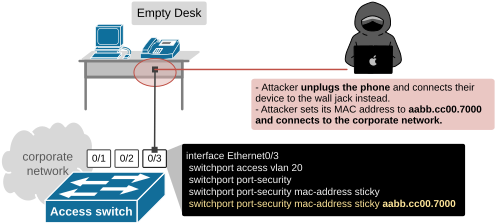
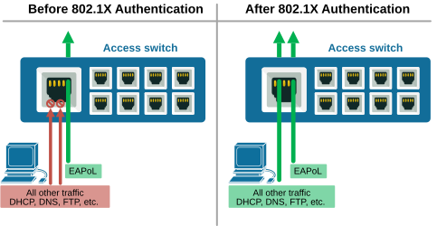
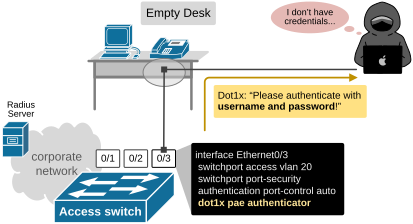
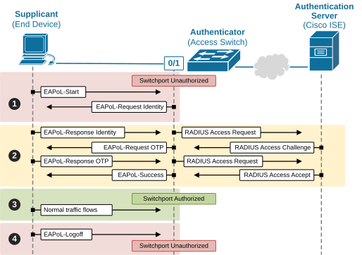

[IEEE 802.1x](https://www.networkacademy.io/ccna/network-security/ieee-802-1x)
==========

In this lesson, we’ll break down the basics of 802.1X and how it controls who has access to wired network edge.

## Why do we need IEEE 802.1X?

In the previous lesson, we discussed how the access layer of the network is typically its weakest point, as anyone can plug in a cable and gain access. That means rogue users or guests could easily connect to the corporate network. 

Port security was the first security protocol designed to protect the access layer, but it has a significant limitation: it relies solely on MAC addresses. And MAC addresses **can be easily spoofed**. Any attacker could fake a trusted MAC and still get in, as shown in the diagram below.

*Figure 1. Limitations of port security.*

It quickly became evident that the access layer of the network needs stronger and more sophisticated access control. One that not only allows or denies access based on MAC address but **also verifies and manages the identity of both the user and the device**.

That's why the industry introduces 802.1x - to provide sophisticated access and identity control on the network edge.

## What is IEEE 802.1X?

IEEE 802.1X is a port-based network access control standard. At a high level, it works pretty simply. When a new device connects to a wired port, **it is not allowed to send any data** except for EAPoL (Extensible Authentication Protocol over LAN), as shown on the left side of the diagram below.

*Figure 2. Before and after 802.1x authentication.*

The switch asks the device **to authenticate using a username and password or a certificate first**. If the device passes the check, the switch lets it send regular traffic and access the network, as shown on the right side of the diagram above. If it fails, no access.

Let's examine the same example as we saw above, but this time the switch is configured with 802.1X. Now the rogue device must have valid credentials to connect to the corporate network, as shown in the diagram below.

*Figure 3. What is 802.1x?*

Note that 802.1x access control is not based on the connected device's MAC address, which represents a significant improvement over traditional port security. Now let's dive in.

## How does IEEE 802.1X work?

IEEE 802.1X controls who can access the LAN by authenticating each connected device. It uses EAPoL (Extensible Authentication Protocol over LAN) to verify identity before allowing data to pass. Three roles work together:

*Figure 4. 802.1x roles and protocols.*

- **Supplicant: **The client device (PC, laptop, etc.) running 802.1X software.
- **Authenticator:** The switch that controls the port state.
- **Authentication Server:** Usually a RADIUS server (Cisco ISE, FreeRADIUS, etc.) that checks credentials and returns a decision.

Notice that the functionality is split between EAP and RADIUS. EAPoL runs between the host and the switch on the local link. The switch then wraps EAP inside RADIUS to talk to the server, which makes the decision whether to authorize the client or not.

The following diagram breaks down the 802.1x process into four simplified steps that describe its operation.

*Figure 5. 802.1x packet flow (simplified)**.***

- **Step 1. Supplicant initiates** - The switchport starts in an unauthorized state. Only EAPoL is allowed through. The user sends an EAPOL-Start and sends identity credentials such as:

- Username and password
- Digital certificate
- Machine account credentials

- **Step 2. Identity exchange** -  The switch forwards the user identity to the organization's RADIUS server.

- **Decision.** The RADIUS server returns an Access-Accept or Reject response and can include attributes such as VLAN, ACL name, dACL, SGT (TrustSec), or a URL redirect for guest portals.

- **Step 3. Authorized state** - The switch moves the port to the authorized state and applies the policy. Normal traffic starts to flow.
- **Step 4. Log off **-When the user finishes using the network, they log off using EAPoL. The switch moves the port to the unauthorized state and applies the policy.

In short, the switch acts like an access guard. Until the user's identity is confirmed, they cannot join the network.

## Key Takeaways

- IEEE 802.1X controls access at the switchport level before a device joins the network.
- It uses three parts: supplicant (client), authenticator (switch), and RADIUS server.
- Traffic is blocked until the user or device is authenticated.
- Uses EAP for identity checks and can assign VLANs or ACLs after login.
- It stops unauthorized access and improves network security at the edge.
