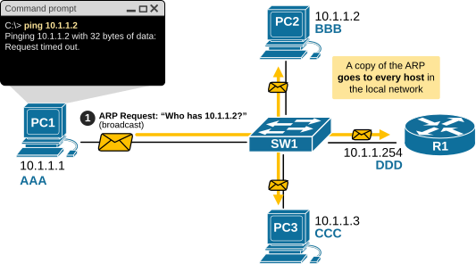
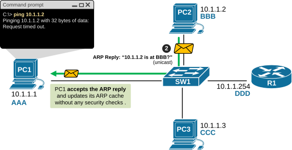
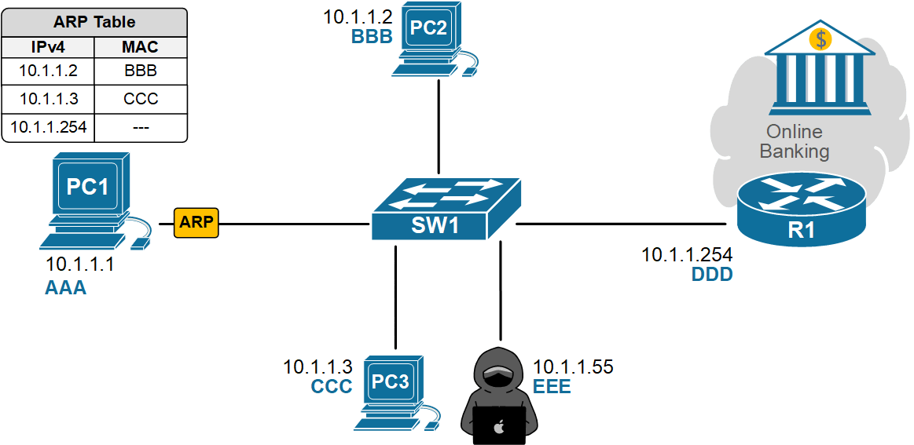
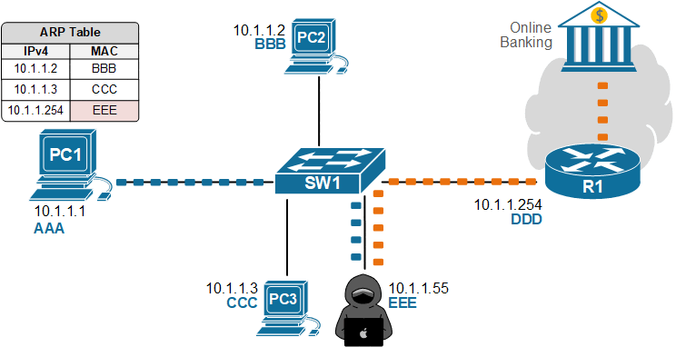
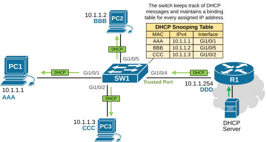
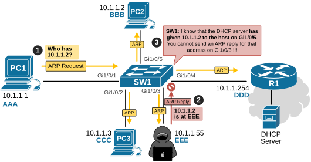
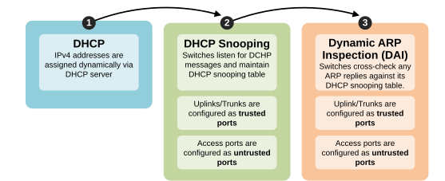
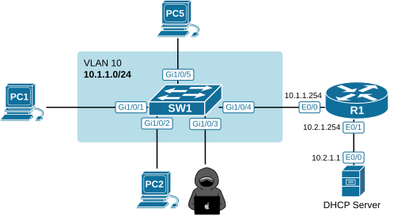

[Dynamic ARP Inspection (DAI)](https://www.networkacademy.io/ccna/network-security/dynamic-arp-inspection-dai)
==========

This lesson explains why we need Dynamic ARP Inspection (DAI), what it is, how it works, and how to configure and verify it on Cisco switches.

## Why do we need DAI?

Before we dive into DAI, let's first walk through the basics of the Address Resolution Protocol (ARP) from a security point of view. This will be the context for the lesson.

### What is ARP?

ARP is a fundamental protocol in Ethernet networks, and **every network engineer must know how it works**. If you don't feel confident in understanding the protocol, check out our "What is ARP?" lesson. 

In short, ARP maps a network layer address (IPv4 address) to a data link layer hardware address (MAC address), as shown in the diagram below.

*Figure 1. An ARP request for 10.1.1.2.*

In the example, a user has instructed PC1 to ping PC2 by typing the command shown in the command prompt. Notice two fundamental aspects:

- The user provides PC1 with **the network layer address (IPv4) of PC2** via the CLI command ping 10.1.1.2. Hence, when PC1 encapsulates a frame, it knows it must use ICMP and 10.1.1.2 as the destination IP address.
- However, neither the user nor PC1 knows **the data link layer address (MAC) of PC2**. Therefore, PC1 cannot fill the destination MAC addresses in the frame. How does PC1 find the MAC address corresponding to 10.1.1.2?

That's where ARP comes in. PC1 uses ARP to send a request "*Who has 10.1.1.2?*" as shown in the diagram above. The request is a broadcast and is sent to all devices on the local network. When PC2 gets the ARP request, it replies, “*Me, here is my MAC address*”, as shown in the diagram below.

*Figure 2. An ARP reply to 10.1.1.1.*

Ultimately, the PC1 accepts the answer and updates its ARP cache. Then it encapsulates the ICMP frame and sends it to PC2, executing the ping command that the user instructed. This is how ARP works at a high level.

Pay attention to the following aspect of ARP - it is a very old protocol. It came out in 1982 as part of RFC 826. It was developed in times **when network security was not the primary focus**. Cybersecurity was not a thing back in the 1980s. That's why the ARP protocol is plain text and does not implement any security. 

A host broadcasts “*Who has 10.1.1.2?*” **and any device can reply**. The host accepts any answer and updates its ARP cache. **It doesn’t verify if an ARP reply is legit**. There is no built-in mechanism to do so.

### What is ARP Poisoning?

Attackers can **easily abuse the fact that ARP has no built-in security** using a technique called ARP poisoning. Here’s how it works:

*Figure 3. What is ARP poisoning?*

- PC1 broadcasts an ARP Request looking for the MAC address of its default gateway, 10.1.1.254. The ARP Request goes to everybody on the local network.
- An attacker on the same VLAN sends fake ARP replies that map the default gateway’s IP address to the attacker’s MAC address.
- PC1 updates its ARP cache and starts sending traffic to the attacker, thinking it’s the gateway.
- The attacker can sniff data, run man-in-the-middle attacks, or drop traffic to cause a denial-of-service attack. 

**None of this requires any deep cybersecurity skills**—just the right tool and Layer 2 access. Traditional Layer 3 security features, such as ACLs and firewalls, won’t stop this because the attack happens before routing, inside the local network. In the end, PC1's traffic destined for the Internet goes to the attacker, as shown in the diagram below.

*Figure 4. ARP Man In the Middle (MitM) attack.*

Dynamic ARP Inspection (DAI) is explicitly designed to stop these fake ARP messages at the access edge.

## What is Dynamic ARP Inspection (DAI)?

DAI is a Layer 2 security feature on switches that inspects ARP packets and permits only “*valid*” ARP replies. Valid means the IP-to-MAC mapping matches what the switch believes to be true. But where does the switch learn the truth? 

DAI operates together with DHCP snooping. For example, let's look at the diagram below. The DHCP server assigns IPs to hosts in the 10.1.1.0/24 network. Switch SW1 has DHCP snooping enabled, so it monitors DHCP messages and builds its own table that records which hosts received which IP addresses on which port. **This is the source of truth that DAI uses**.

*Figure 5. DHCP Snooping.*

Having the DHCP snooping table, the switch can cross-check if an ARP reply comes on a port that has been assigned that IP address by DHCP. For example, let's revisit the same ARP poisoning example we saw earlier.

PC1 asks, "Who has 10.1.1.2?". The attacker replies with "Me, 10.1.1.2 is at EEE.". However, SW1 cross-checks according to its DHCP Snooping table, 10.1.1.2 is connected to Gi1/0/5 and has MAC address BBB. Therefore, SW1 knows that the ARP reply on Gi1/0/3 is fake and drops it, as shown in the diagram below.

*Figure 6. How does Dynamic ARP Inspection (DAI) work?*

Additionally, the DAI implements the concept of trusted and untrusted ports. Network administrators can manually configure a port as trusted, which means any ARP replies on that port will be accepted automatically. These are typically the ports that are also configured as DHCP trusted. You can see that DAI operates in conjunction with DHCP snooping. It cannot work without it.

## How does DAI work?

Let's start with the most fundamental part of the feature:

- DAI relies on DHCP Snooping.
- DHCP Snooping relies on DHCP. 

Therefore, it is essential to understand that Dynamic ARP inspection makes sense only in environments where IP addresses are assigned dynamically using DHCP and DHCP snooping is enabled throughout, as shown in the dependency graph below.

*Figure 7. DAI dependencies.*

The feature works in two simple steps:

- **Step 1:** Intercept all ingress ARP messages originating from untrusted ports. Here, pay special attention to the following:

- It is an ingress security feature. It doesn't do anything in the egress direction of a swtichport.
- It only intercepts packets on untrusted ports. It doesn't do any checks in trusted ports.

- **Step 2:** It verifies the incoming packet's tuple (IP address, MAC address, interface) in the DHCP Snooping binding table.

- If there’s a match, the packet is forwarded.
- If not, the packet is dropped, and the switch logs the violation.

DAI also does some additional work. It checks for sanity, including invalid ARP lengths, inconsistent addresses, or unusual rates. You can tune DAI to rate-limit ARP on a per-port basis so a flood of ARP packets can’t overwhelm the control plane.

## Configuring Dynamic ARP Inspection (DAI)

Now, let's go through a configuration example to see how we configure and verify the feature on Cisco Catalyst switches. We are going to use the topology shown in the diagram below.

*Figure 8. DAI lab configuration topology.*

Notice all devices are Cisco IOL images, while SW1 is a Catalyst 9000v virtual switch. All devices are with their default configuration. We will configure everything from scratch.

### Full Content Access is for Subscribed Users Only...

- **Learn any CCNA, CCIE or Network Automation topic** with animated explanation.
- **We focus on simplicity.** Networking tutorials and examples written in simple, understandable language.

Sign up for free ►
