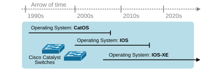
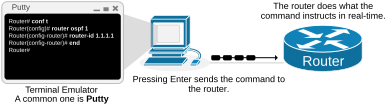
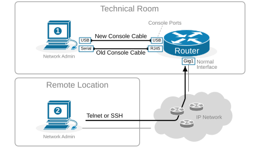
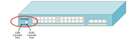
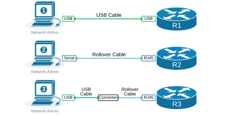
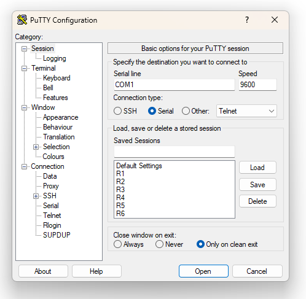
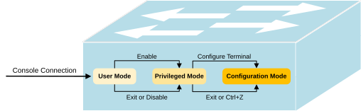
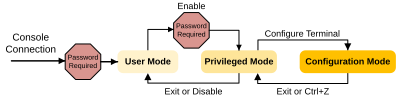

[Local console access](https://www.networkacademy.io/ccna/network-services/local-console-access)
==========

This lesson begins our journey to learning the different device management protocols. We discuss accessing a Cisco device through the local console port and the different console types and cables.

Accessing Cisco IOS devices
---------------------------

For context, let's start really simple. Every modern computer hardware has an underlying software operating system that controls it and allows humans to interact with it. For example, Microsoft computers have Windows, Apple products have MacOS, and web servers have Red Hat Linux. In the same way, Cisco network devices have an operating system called the Internetwork Operating System (IOS). However, it has evolved via a few different versions, as shown in the diagram below.



Figure 1. Cisco Catalyst Switches Operating Systems.

- In the 1990s, when Cisco expanded rapidly into the LAN switching domain, Cisco Catalyst switches ran an old operating system called CatOS. It focused primarily on layer 2 features and had a different CLI compared to the more modern OSes. 
- In the 2000s, Cisco introduced a more modern OS called IOS. It offers both Layer 2 and Layer 3 functionality but with a monolithic architecture.
- In late 2000-2010, Cisco modernized the IOS, making it modular based on Linux and called it IOS-XE. **It is the operating system of all modern routers and switches** from the Catalyst product family, covered in the CCNA curriculum. IOS-XE is often referred to simply as IOS because the command-line interface is the same as the old IOS, so people can barely notice any difference from a management and configuration point of view. Keep in mind that when we say "IOS," we mean IOS-XE.

The IOS operating system controls the network device's behavior and performance and provides a command-line interface (CLI) for human interaction. The CLI is a text-based communication with the device in which the network admin instructs the device what to do, as shown in the diagram below.



Figure 2. Cisco Command Line Interface (CLI).

Connecting to the CLI
---------------------

All Cisco networking products support the command-line interface. There are several different ways to connect to a device's CLI: 

- Locally through the device's console port.
- Remotely using a protocol such as Telnet or SSH. 

The local console connection **requires physical access to the device**. Look at the following diagram, for example. Network admin 1 is located in the same technical room as the router. It has physical access to the device's console ports and can physically connect its PC to the device via a console cable.



Figure 3. Accessing Cisco IOS devices.

However, network admin 2 is located far away in a remote location. It uses Telnet or SSH to connect to the device using the IP network in which the device resides.

Types of Console Connections
----------------------------

Every network device has one or more special physical ports called console ports that allow local CLI access. The process of connecting to the console port of a network device has three main components:

1. The device's console port — it can be a USB or RJ45 port.
2. A console cable that connects a PC to the device's console port.
3. A terminal emulator software installed on the PC. 

Let's zoom into each one.

### Console Ports

Most Cisco devices have two console ports — one USB and one legacy RJ45 port, as shown in the diagram below. Every device has a different form factor, so the console ports can be found in different places. On some devices, the console ports can be on the front, while on others, they can be on the rear. 



Figure 4. Cisco Switch Console ports.

However, older models typically only have RJ45 ports, while newer models have only USB ones.

### Console Cables

The console cables have changed over the years with the modernization of computer hardware. Nowadays, most laptops and PCs do not have serial ports; they only have USB ports. That's why modern Cisco devices have USB console ports so that you can connect a typical laptop to the network device using a standard USB cable.

Older console cables used a Serial port on the PC and an RJ-45 port on the network device that is colored in blue and labeled "**console**." 

Additionally, in case you don't have the right combination of console port, cable, and PC port — a USB converter can convert a legacy console cable to a USB connector and vice-versa.



Figure 5. Types of console cables.

The diagram above shows the different console connection options. 

### Terminal Emulator Software

When a network administrator's PC connects to a device's console port, a terminal emulator software is required to manage the connection and provide a human interface to the network admin. For example, one of the most common terminal emulator software is called PuTTY. It takes the text typed on the PC by the user and sends it to the device over the console connection. Similarly, it takes the device's response and displays it back to the PC user.

The emulator needs some settings before establishing a console connection to a device. The default console settings on a Cisco network device are as follows:

- **Speed (baud)**: 9600 bits per second
- **Data bits**: 8
- **Stop bit**: 1
- **Parity bits**: None
- **Hardware Flow Control**: Off

You absolutely do not need to remember these settings. They are typically configured by default on all terminal emulator tools out there. The following screenshot shows an example of a console connection on PuTTY.



Figure 6. Terminal Emulator - PuTTY.

When using a USB console cable to connect to a device's USB console port, you sometimes need to install a USB driver so that the PC can recognize that the USB connection talks to a Cisco IOS device.

Privilege Modes
---------------

When you successfully establish a connection to a device's command line interface, you enter an area of the CLI called the "*User EXEC mode*" or "*user mode*" for short. This is the CLI space with the least privileges to execute commands. For example, in user mode, you cannot reboot the device or check the device's current configuration, as you can see in the output below. 

```
Router con0 is now available
Press RETURN to get started.

User Access Verification
Username: admin
Password: *****

Router>
Router> reload
% Unknown command or computer name, or unable to find computer address
Router>
```

Notice that when the command prompt lists the device's hostname followed by this sign **\>**, you are in User EXEC mode. When the hostname is followed by the sign **#**, you are in privilege mode.

The next privilege level is called "*Privileged EXEC mode*" or "*enable mode*". In this mode, the user has more privileges, as the name implies. You can reload the device and see the running configuration, for example, as you can see in the following output.

```
DSW1>
DSW1> enable
Password:

DSW1#
DSW1# reload
System configuration has been modified. Save? [yes/no]: yes
Building configuration...
[OK]
Proceed with reload? [confirm]
```

Notice that you enter privilege exec mode with the command **enable** (hence, the alternative name "enable mode").

From enable mode, you can enter the CLI configuration mode, which allows you to alter the device's running-config. You enter the **configuration mode** using the configure terminal command or **conf t** for short. The following diagram summarizes the three different privilege modes.



Figure 7. User, Privileged and Configuration Modes.

Securing the console access
---------------------------

Console access **does not require security authentication** by default. You simply connect to the console, and you have access to the device. It seems odd at first, but when you think about it, it makes sense — if you have physical access to the device, you can break it anyway. You can power it off, remove it from the cabinet, and smash it into pieces.

However, someone may not want to break the device but may want to steal the running configuration so they can plan a more sophisticated exploit of the corporate network. That's why securing the console login process with a simple password is a good practice. You can configure password protection at two points in the process, as shown in the diagram below.

- When the user initially connects to the console.
- When the user wants to enter the privileged mode.



Figure 8. Protecting the console port with a password.

We configure the console port to request a password, as shown in the output below.

```
R1# conf t
Enter configuration commands, one per line.  End with CNTL/Z.
R1(config)# line con 0
R1(config-line)# login
% Login disabled on line 0, until 'password' is set
R1(config-line)# password cisco
R1(config-line)# end
R1#
```

Notice that all configuration changes related to the console port go under the **line con 0**. The command `login` enables the login process while the command `password` sets the password.

We configure password security when the user wants to go from user mode to privilege mode as follows:

```
R1# conf t
Enter configuration commands, one per line.  End with CNTL/Z.
R1(config)# enable secret cisco
R1(config)# end
```

Now if we initiate a new console connection to the device, we can see that it requests password authentication.

```
R1 con0 is now available
Press RETURN to get started.

User Access Verification
Password: *****

R1> enable
Password: *****
R1#
```

Also, when we want to go from user mode to privileged mode, the device also requests a password.

### Summary

- **Cisco IOS** (now IOS-XE) is the operating system for all modern Cisco routers and switches.
- **Console access** requires physical presence, a console cable (USB or RJ45), and a terminal emulator (e.g., PuTTY).
- **Default console settings**: 9600 baud, 8 data bits, 1 stop bit, no parity, no flow control.
- **Three privilege levels**:
  - **User EXEC (\>)** — limited commands (ping, telnet, etc.)
  - **Privileged EXEC (#)** — full read access (reload, show running-config, etc.)
  - **Global Configuration (config)#** — modify the device configuration
- **Console password**: Configured under `line con 0` with the `password` and `login` commands.
- **Enable password**: Configured with `enable secret` to protect access to privileged mode.