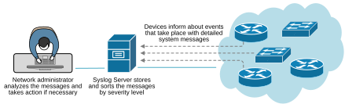
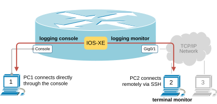
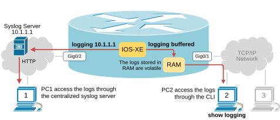
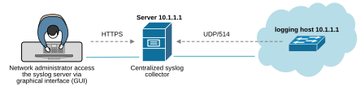

[System Logging (Syslog)](https://www.networkacademy.io/ccna/network-services/system-logging-syslog)
==========

The network is a critical infrastructure component for every organization. It must be available all the time. In that context, the most important task of the network team is to constantly monitor the events in the network and prevent incidents that could interrupt user traffic.

Syslog Message Logging
----------------------

Cisco, as a leading vendor, knows that organizations rely on its network equipment. That's why they have equipped all Cisco devices with many monitoring and reporting tools. When an event happens on a device, the device immediately tries to notify the network team with detailed messages. Such messages are commonly called **logs** or **syslogs**. The logs are typically stored on a dedicated server called **a syslog server**, which sorts and analyzes logs based on their severity level and further notifies the network team via email or another instant messaging tool.



Figure 1. Network logging process.

The diagram above illustrates a typical network logging process where devices send syslogs to a server, which stores them and displays them to a network administrator.

### Real-time Logging

When a user is currently logged in to a Cisco device, the IOS tries to send all log messages directly via the CLI, making the user aware of any ongoing event. This is especially important when the user is making configuration changes that can affect the device.

Since the user can be logged in via two methods — locally via console or remotely via Telnet/SSH — two different configuration options control the log messaging process to current users, as shown in the diagram below.

#### Local real-time logging

If the user is logged in locally via the console (like PC1), the IOS sends all log messages for all severity levels by default. 



Figure 2. Logging System messages.

This is controlled by the **logging console** global configuration command, which is configured by default on all Cisco IOS/IOS-XE devices, as shown in the output below.

```
Router(config)# logging console
//Example of logs that the user see via the console
%LINK-3-UPDOWN: Interface GigabitEthernet0/1, changed state to up
%LINK-3-UPDOWN: Interface GigabitEthernet0/2, changed state to down
...
```

#### Remote real-time logging

Users who are connected remotely using a protocol such as Telnet or SSH (like PC2 and PC3) do not get any real-time logs via the CLI by default. Two commands control the logging process for remote users:

- The global configuration command **logging monitor** controls whether the IOS is allowed to send logs to remote terminal sessions. The command is configured by default.
- The EXEC command **terminal monitor** enables the IOS to send logs to the particular user terminal session which executes the command. The user must explicitly execute the command if they want to receive real-time logs.

The process is designed like this because multiple users might be connected remotely to a device simultaneously. **Some may want to receive logs, while others may not**. That's why the EXEC command **terminal monitor**, which each user executes, enables the real-time logs for the user's terminal session. For example, look at the diagram above — PC2 executes the terminal monitor command and receives real-time logs, while PC3 doesn't execute the terminal monitor command and does not receive logs.

```
// Enables real-time logs for the current terminal session.
Router# terminal monitor 

// Disables real-time logs for the current terminal session. (default)
Router# terminal no monitor 
```

The output above shows how you enable real-time logging for the current session to a device and how you disable it. Notice that the command effect is per-session. When you close the current session to the device and open a new one later, you must configure the **terminal monitor** command again to receive real-time logs.

### Collecting and storing logs

When a device sends logs in real time to the console or terminal session, it does not store them. It just sends them to the user and discards them. However, users are not logged in on every device all the time. Most of the time, a network administrator connects to a device only after an event has happened. That's why the IOS also allows storing logs locally or sending them to a centralized syslog collector.

#### Storing syslog messages locally

Cisco devices can collect and store syslog messages in the device's RAM memory. This functionality is enabled by default on some platforms, while it is disabled on others.



Figure 3. Storing Syslog messages.

You can configure a device to start storing syslog messages locally in the RAM using the **logging buffered** command in global configuration mode, as shown in the output below. You can specify the size of the buffer (the default is 4096 bytes) and the minimum severity level of the log messages that the device will store. Generally, you may not want to store debug, informational, or even notification messages because the buffer can fill up very quickly.

```
Router(config)# logging buffered ?
  <0-7>              Logging severity level
  <4096-2147483647>  Logging buffer size
  alerts             Immediate action needed           (severity=1)
  critical           Critical conditions               (severity=2)
  debugging          Debugging messages                (severity=7)
  discriminator      Establish MD-Buffer association
  emergencies        System is unusable                (severity=0)
  errors             Error conditions                  (severity=3)
  informational      Informational messages            (severity=6)
  notifications      Normal but significant conditions (severity=5)
  warnings           Warning conditions                (severity=4)
  xml                Enable logging in XML to XML logging buffer
  <cr>               <cr>
```

Remember that the RAM is volatile memory and is flushed when the device reloads. Hence, **storing the log messages in the RAM is not permanent**.

The following command allows you to check a device's stored logs, configured buffer size, and severity level.

```
Router# show logging 
Syslog logging: enabled

    Console logging: level debugging, 7 messages logged, xml disabled,
                     filtering disabled
    Monitor logging: level debugging, 0 messages logged, xml disabled,
                     filtering disabled
    Buffer logging:  level debugging, 36 messages logged, xml disabled,
                    filtering disabled
    Exception Logging: size (4096 bytes)
    Count and timestamp logging messages: disabled
    Persistent logging: disabled
    Trap logging: level informational, 39 message lines logged
        Logging Source-Interface:       VRF Name:
        
Log Buffer (4096 bytes):
*Oct  6 13:33:11.017: %CRYPTO_ENGINE-5-CSDL_COMPLIANCE_ENFORCED: Cisco PSB security compliance is being enforced
*Oct  6 13:33:11.211: %PNP-6-PNP_DISCOVERY_STARTED: PnP Discovery started
*Oct  6 13:33:11.261: %SYS-7-NVRAM_INIT_WAIT_TIME: Waited 0 seconds for NVRAM to be available
*Oct  6 13:33:11.264: %LINEPROTO-5-UPDOWN: Line protocol on Interface SR0, changed state to up
*Oct  6 13:33:11.331: %SYS-5-LOG_CONFIG_CHANGE: Console logging disabled
*Oct  6 13:33:11.336: %PKI-6-TRUSTPOINT_CREATE: Trustpoint: TP-self-signed-67108992 created successfully
*Oct  6 13:33:11.427: %SYS-5-CONFIG_I: Configured from memory by console
...
```

#### Storing syslog messages remotely

The second option to store the syslog messages is to send them to a centralized syslog server that collects all messages and stores them permanently. Generally, all production networks collect syslogs from all network devices.

Devices use UDP on port 514 to send log messages to a centralized server. The server typically provides a GUI interface for administrators to browse and analyze all log messages, as shown in the diagram below.



Figure 4. Collecting syslog messages.

To configure a Cisco IOS-XE device to send log messages to a centralized server, we use the **logging host [IP/FQDN]** command in global configuration mode, as shown below.

```
Router(config)# logging host 10.1.1.1
```

where the IP/FQDN is the IP address or the DNS name of the syslog server.

Syslog Message Format
---------------------

When a device generates a log message, it assigns a severity level to indicate the event's importance. The following table shows the syslog severity levels. Notice that **the lower the severity number, the more impactful the event is**.

| Severity Level | Keyword | Description |
|---|---|---|
| 0 | emergencies | System is unusable |
| 1 | alerts | Immediate action needed |
| 2 | critical | Critical conditions |
| 3 | errors | Error conditions |
| 4 | warnings | Warning conditions |
| 5 | notifications | Normal but significant conditions |
| 6 | informational | Informational messages |
| 7 | debugging | Debugging messages |

Table 1. Syslog Severity Levels.

The two top severity levels highlighted in red are the most impactful for the device.

- **Emergency** (severity 0) means the device is unusable.
- **Alert** (severity 1) means immediate action is required to prevent the device from becoming unusable.

The following three severity levels (Critical, Error, and Warning) describe events that are not severe but impact the device somehow. For example, an interface going down generates a severity 3 event.

The next two levels (Notification and Informational) do not describe impactful events but are just informational. For example, when a user changes the running configuration through the console, the device generates a severity 5 notification log message "%SYS-5-CONFIG_I: Configured from console by admin on console". 

The last severity level (Debug) is used when a device generates user-requested debug messages.

Configuring System Logging
--------------------------

We use the commands in the following table to configure a device to send syslog messages. The configuration is pretty straightforward and self-explanatory.

| Logging Service | Global Configuration command | Set severity level |
|---|---|---|
| Local logging via the console | logging console | logging console [severity] |
| Remote logging to terminal session | logging monitor | logging monitor [severity], terminal monitor (EXEC command per user session) |
| Storing log messages locally in RAM | logging buffered | logging buffered [severity] |
| Storing log messages remotely | logging host [server IP/FQDN] | logging trap [severity] |

Table 2. Summary of system logging configuration commands.

Typically, a device is configured with a combination of all options. For example, a switch can be configured to store log messages locally in RAM, to send syslogs to a remote server, and to send log messages in real-time to users who are logged in. Such configuration looks like this:

```
Switch#
logging console informational
logging monitor debugging
logging buffered
logging host 10.1.1.1
logging trap notifications
```

However, notice that sometimes you may need to set the source interface and VRF for syslog messages. For example, very often in large-scale networks, a router has multiple interfaces in multiple VRFs. The centralized syslog server is located in the management VRF and cannot be reached through the other VRF tables. In such an example, simply giving an IP address of the syslog server, the device cannot figure out on its own which interface and VRF to use to connect to the syslog server. The IOS allows you to specify which source interface the device must use and which VRF routing table to use using the following command.

```
Router(config)# logging host 172.16.1.1
Router(config)# logging source-interface FastEthernet0/1 vrf MGMT
```

The command above tells the router: "Connect to the syslog server 172.16.1.1 via interface FastEthernet0/1 using VRF MGMT."

### Summary

- **Syslog** is Cisco's mechanism for event notification and logging.
- **Real-time logging**: console users get all logs by default; remote users must run `terminal monitor`.
- **Local storage**: RAM buffer via `logging buffered` (volatile — lost on reload).
- **Remote storage**: UDP 514 to a syslog server via `logging host`.
- **Severity levels**: 0 (emergency) to 7 (debugging); lower number = more severe.
- **Source-interface/VRF binding**: Use `logging source-interface <int> vrf <name>` for multi-VRF environments.