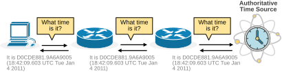
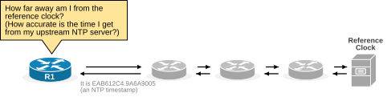
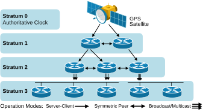
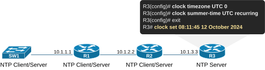
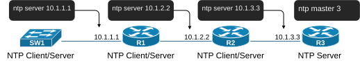
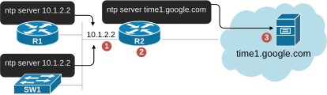

[Network Time Protocol (NTP)](https://www.networkacademy.io/ccna/network-services/network-time-protocol-ntp)
==========

Every computer device has some clock and the notion of day and time. A network device is no different. It has an internal system clock that it uses to timestamp logs, validate certificates, run scheduled tasks, and so on. But how do we ensure the device clock is accurate and synchronized with global time? This lesson shows how.

The internal system clock
-------------------------

The system clock is the primary timekeeping mechanism a network device uses while it's operational. On most network devices, it is a software-based clock that relies on the device's CPU and internal timers to keep track of time. 


Figure 1. System Clock.

The system clock has several key characteristics:

- **Volatile Nature**: The system clock retains the current time only while the device is powered on. Once the router reboots, it resets.
- **Reset Behavior**: If the router does not have a backup hardware clock, it may default to a reference time (00:00 on January 1, 1970) after rebooting.
- **Drift**: The system clock experiences "clock drift," where the device gradually loses time over a long period. This happens because the software clock depends on the CPU's crystal oscillator, which has minor frequency variations.

Why does a network device need a synchronized clock?
----------------------------------------------------

Most network devices have software clocks that are not very accurate over long periods of time. At the same time, a network device needs to use its system clock for many tasks, such as:

- **Logging and Troubleshooting**: Network devices generate log messages (syslogs) for events such as configuration changes, errors, and network incidents. Accurate timestamps are essential to understand the order and timing of these events. Without synchronized clocks, it becomes challenging to correlate events across multiple devices.
- **Security (Authentication and Encryption)**: Security protocols, such as IPsec and SSL/TLS, rely on synchronized clocks to function correctly. For example, IPsec uses time-based elements in its authentication process, and if the clocks are too far out of sync, authentication fails. Certificates have validity periods. If a device's clock is incorrect, it may not be able to validate certificates properly, leading to failures in establishing secure connections.
- **Compliance**: Many industries have regulatory requirements (such as PCI DSS, HIPAA, or GDPR) that mandate accurate timekeeping for logging and auditing. A synchronized clock ensures compliance with these regulations by providing a consistent and accurate audit trail.
- **Time-based Access Lists**: Some devices may be configured with time-based access control lists (ACLs) or firewall rules that allow or deny traffic based on the time of day. If the device's clock is inaccurate, these policies may not be enforced correctly.
- **Network Automation**: Some devices rely on the clock for scheduling tasks like backups, configuration updates, or running scripts. If the clocks are not synchronized, these tasks may run at incorrect times or fail to run altogether.

What is NTP?
------------

The abbreviation NTP stands for Network Time Protocol. **It is the protocol that computer devices use to synchronize their internal clocks**. The protocol has evolved through several versions, with version 4 being the most recent. 

NTP uses IP/UDP on destination port 123 to exchange NTP timestamps and accurately calculate the current time within microseconds. Generally, it is a request-response message exchange, as shown in the following high-level diagram.



Figure 2. NTP high-level process.

The protocol uses timestamps to track the number of seconds that have passed since a specific reference point in time. Many CCNA candidates wrongly assume that devices exchange answers such as "Today is Mon Jul 1st, 2024 14:23:11:506 UTC" as a clear text. This is absolutely not the case. NTP messages only exchange timestamps.

An NTP timestamp is a 64-bit value consisting of two parts: a 32-bit integer part representing **the number of seconds since January 1, 1900** (the reference point), and a 32-bit fractional part representing fractions of a second. This format provides very high precision for timekeeping. Here is an example:

- **Timestamp value**: D0CDE881.9A6A9005.
- **The integer part (D0CDE881)** represents the number of seconds since January 1, 1900.
- **The fractional part (9A6A9005)** indicates that approximately 0.6032 seconds have passed.

The human-readable time for the NTP timestamp D0CDE881.9A6A9005 is January 4, 2011, 18:42:09.6032 UTC.

### What is the reference clock?

NTP is a request-response protocol. Every device asks its upstream NTP server what time it is and learns the time. However, somewhere in the chain of NTP servers, a device must learn the time from a highly accurate source, such as an atomic clock or GPS satellite. This device providing very precise time **is referred to as the reference clock**. Typically, in many networks, the reference clock is a purpose-built device with a GPS receiver or external Internet time server such as time1.google.com.


Figure 3. GPS Satellites.

For example, an atomic clock is a highly precise timepiece that uses the vibrations or oscillations of atoms to measure time. It is one of the most accurate timekeeping devices ever created. Cesium atomic clocks, like those used in laboratories, can remain accurate to within 1 second in millions of years. GPS satellites rely on atomic clocks to provide precise time. Each GPS satellite contains cesium and rubidium atomic clocks to synchronize time signals.

### What is Stratum?

NTP is a stateless request-response protocol. Every router asks its upstream NTP server what the time is. This creates the following problem: How can a device understand its distance from the reference clock? This is the same as asking **how accurate the time I receive is.** For example, how can R1 understand how many hops are between him and the authoritative time source and how precise the time it gets?



Figure 4. What is Stratum?

NTP uses **the concept of a stratum** to define how far away (in hops) a client is from an authoritative source of time, such as an atomic clock or GPS satellite. The source of time is at the top of the hierarchy and has a stratum of 0, as shown in the diagram below.



Figure 5. NTP Stratum Levels.

An NTP device that gets its time directly from the time sources is stratum 1. A device that gets its time from the server with stratum 1 is considered stratum 2. The maximum stratum level is 16.

The following table describes the accuracy and role of each stratum level:

| Stratum | Description | Accuracy | Typical Time Sources |
|---|---|---|---|
| 0 | Primary Reference Clock | Most accurate (within nanoseconds to microseconds) | Atomic clocks, GPS receivers, Radio clocks |
| 1 | Directly synchronized to Stratum 0 | 1 to 10 microseconds accuracy | Servers synchronized to Stratum 0 (GPS or atomic clock) |
| 2 | Synchronized to Stratum 1 | 1 to 10 milliseconds accuracy | Servers synchronized to Stratum 1 |
| 3 | Synchronized to Stratum 2 | 10 to 100 milliseconds accuracy | Servers synchronized to Stratum 2 |
| 4 | Synchronized to Stratum 3 | 100 milliseconds to 1 second accuracy | Servers synchronized to Stratum 3 |
| 5-15 | Synchronized to a higher stratum | 1 second to several seconds accuracy | Servers at each lower stratum synchronize to the next higher one |
| 16 | Unsynchronized or unreachable | Not synchronized (highly inaccurate) | Devices that have lost their connection to a valid time source |

Table 1. Stratum levels accuracy.

The stratum is essential because it indicates **the distance from the reference clock** and helps determine the network's accuracy, reliability, and hierarchy of time sources. The lower the stratum number, the more accurate the time source. Each time a device synchronizes with a server, small delays and inaccuracies are introduced, so higher-stratum devices have slightly less precise time than lower-stratum ones.

Configuring NTP (Network Time Protocol)
---------------------------------------

Before jumping into the NTP configuration portion of the lesson, keep in mind two essential things about the protocol:

- **NTP is slow**: The network time protocol is very slow compared to other network protocols. The default poll interval is typically between 1 and 15 minutes (minutes, not seconds).
- **NTP works best when a device's clock is already close to the accurate time**: The protocol is designed to adjust the time gradually in tiny steps, minimizing abrupt changes that could disrupt processes dependent on precise timing.

Because of the two facts above, the NTP works best when a device's clock is already close to the accurate time. Otherwise, it could take a long time before a device synchronizes fully. 

As a general rule of thumb, before configuring a network device (even Windows/Linux machines) to sync with NTP, we **manually set the device's internal clock to a time relatively close to the accurate time**. Let's see how.

### Manually setting the clock on a Cisco device

Cisco devices have two commands that we use to set up the system clock manually: the command **clock** in global configuration mode and the same command **clock** in EXEC mode, as shown in the diagram below.



Figure 6. Set the time on a Cisco device.

Notice that the **clock timezone** command in global configuration mode sets the timezone. In our example, we put it to UTC, which stands for Coordinated Universal Time. Then, the **clock summer-time** command tells the device that daylight saving is enabled in our timezone. 

These two commands must be configured properly before we set the time because the **clock set** command in EXEC mode assumes that you configure the time in the timezone already set on the device.

```
R3# conf t
Enter configuration commands, one per line.  End with CNTL/Z.
R3(config)# clock timezone UTC 0
R3(config)# clock summer-time UTC recurring
R3(config)# end
*Oct 12 08:08:35.910: %SYS-6-CLOCKUPDATE: System clock has been updated from 
08:08:35 UTC Sat Oct 12 2024 to 09:08:35 UTC Sat Oct 12 2024, 
configured from console by console.
R3#
R3# clock set 08:11:45 12 October 2024
Oct 12 07:11:45.000: %PKI-6-AUTHORITATIVE_CLOCK: The system clock has been set.
```

We check the current time of a Cisco device using the following command.

```
R3# sh clock
08:38:19.178 UTC Sat Oct 12 2024
```

### Basic NTP configuration

The most fundamental NTP configuration is fairly simple. There are two general commands that we use when configuring NTP:

- **ntp server [IP|hostname]** — specifies an upstream NTP server. The router synchronizes its clock with the upstream NTP server and then provides time to other downstream clients.
- **ntp master [stratum-level]** — if configured, the device acts as an NTP server but not a client. It becomes the authoritative clock for the network domain.

For example, let's look at the following diagram. We have four devices that we want to synchronize using NTP. R3 will act as the authoritative reference clock.



Figure 7. Basic NTP configuration.

- R3 is configured and acts **only as an NTP server**. It provides stratum-3 time to all downstream clients; it doesn't act as a client itself.
- R2 is configured and acts as a client and server at the same time. It synchronizes its clock with R3 and then provides time to R1.
- R1 is configured and acts as a client and server at the same time. It synchronizes its clock with R2 and then provides time to SW1.
- SW1 acts as a client only because it doesn't have any downstream clients.

Before you configure NTP, it is a good practice to manually set each router's timezone and clock to a reasonably accurate value. Otherwise, NTP will take a lot of time to synchronize (could be hours). 

The configuration of all devices looks like this:

```
SW1(config)# ntp server 10.1.1.1
```

```
R1(config)# ntp server 10.1.2.2 
```

```
R2(config)# ntp server 10.1.3.3
```

```
R3(config)# ntp master 3
```

Let's check the status of one of the routers. You can see that the router still hasn't synchronized its clock with the upstream NTP server immediately after the protocol has been configured. **NTP is slow. You have to be patient**. Check again after at least 20-30 min.

```
R1# sh ntp status 
Clock is unsynchronized, stratum 16, no reference clock
nominal freq is 250.0000 Hz, actual freq is 250.0000 Hz, precision is 2**10
ntp uptime is 4000 (1/100 of seconds), resolution is 4000
reference time is 00000000.00000000 (00:00:00.000 UTC Mon Jan 1 1900)
clock offset is 0.0000 msec, root delay is 0.00 msec
root dispersion is 0.61 msec, peer dispersion is 0.00 msec
loopfilter state is 'NSET' (Never set), drift is 0.000000000 s/s
system poll interval is 8, never updated.
```

We can see the same information using the following command. Notice the symbol in front of the server address. When the device is synchronized with its peer, we expect to see the **\*** symbol, which is currently not present.

```
R1# sh ntp associations 

  address         ref clock       st   when   poll reach  delay  offset   disp
 ~10.1.2.2        .INIT.          16     31     64     0  0.000   0.000 15937.
 * sys.peer, # selected, + candidate, - outlyer, x falseticker, ~ configured
```

There is one more way to check if the router has synchronized its clock. When the output of the **show clock** command on a Cisco router shows a leading dot (.), it indicates that the clock is not synchronized with a reliable external time source, such as an NTP server.

```
R1# show clock
.18:43:52.516 EEST Sun Oct 13 2024
```

If we check the status on R1 again after a while, we can see that it has successfully synchronized with its upstream time server 10.1.2.2. Notice the stratum level.

```
R1# show ntp status 
Clock is synchronized, stratum 5, reference is 10.1.2.2       
nominal freq is 250.0000 Hz, actual freq is 249.9686 Hz, precision is 2**10
ntp uptime is 1303400 (1/100 of seconds), resolution is 4016
reference time is EAB666C7.E37299CD (18:33:27.888 EEST Sun Oct 13 2024)
clock offset is 13.3975 msec, root delay is 1.99 msec
root dispersion is 417.78 msec, peer dispersion is 3.33 msec
loopfilter state is 'CTRL' (Normal Controlled Loop), drift is 0.000125607 s/s
system poll interval is 64, last update was 45 sec ago.
```

If we check the output of the following command, we can now see that the server address has a leading star, which means the router syncs with this server.

```
R1# show ntp associations 
  address         ref clock       st   when   poll reach  delay  offset   disp
 *~10.1.2.2       10.1.3.3         4     20     64   377  1.000 -70.394  3.334
 * sys.peer, # selected, + candidate, - outlyer, x falseticker, ~ configured
```

Real-world Setup
----------------

In real network deployments, it is very unlikely that a router alone will serve as a precise time source for the entire network, as shown in Figure 7 above. Routers are typically not designed to have clocks that are this accurate over long periods.

A more typical design is to have one or more routers synchronizing with a purpose-built hardware device with a precise clock or an external time server over the Internet, as shown in the diagram below.



Figure 8. Real-world NTP configuration.

However, this setup has one flaw — it is not redundant. There are multiple scenarios where the network can be left without an authoritative time source:

1. The **ntp server** command points to a single IP address or FQDN name. For example, both R1 and SW1 point to 10.1.2.2, which is the IP address of R2's downstream interface. If the interface goes down, both R1 and SW1 won't be able to synchronize.
2. R2 is the only router that provides the network with an accurate time. If the router goes down, the network no longer has an authoritative time source.
3. R2 has only one external time source: time1.google.com. If the external source becomes unreachable, the network no longer has synchronized time.

### Summary

- **NTP** uses UDP port 123 to synchronize device clocks within microseconds.
- **Stratum** indicates distance from the reference clock (0 = most accurate, 16 = unsynchronized).
- **NTP is slow** — poll intervals are minutes, not seconds; manually set the clock close first.
- **Commands**: `ntp server <IP>` (client mode), `ntp master <stratum>` (server-only mode).
- **Verification**: `show ntp status`, `show ntp associations`, `show clock` (leading `.` means unsynchronized).
- **Redundancy concern**: Single NTP server and single upstream link are SPOFs; redundant servers and paths are recommended in production.