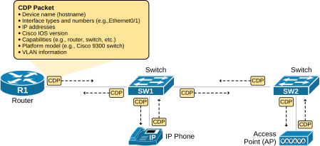
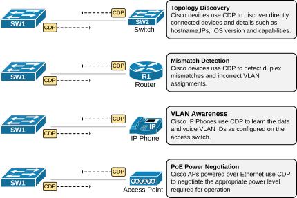
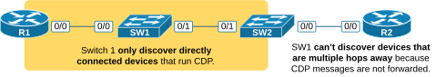

[Cisco Discovery Protocol (CDP)](https://www.networkacademy.io/ccna/network-services/cisco-discovery-protocol-cdp)
==========

This lesson covers the most commonly used protocol for topology discovery: Cisco's proprietary Cisco Discovery Protocol (CDP).

What is the Cisco Discovery Protocol (CDP)?
-------------------------------------------

Cisco Discovery Protocol (CDP) is a proprietary Layer 2 network protocol developed by Cisco Systems. It allows Cisco devices to share information with other **directly connected Cisco devices**, enabling them to discover each other and exchange information. The protocol is enabled by default and requires no additional configuration to start working. It is plug-and-play. You power up a Cisco device, and it starts sending CDP messages out of every interface, as shown in the diagram below.



Figure 1. What is CDP?

CDP messages include the following information, as shown in the diagram above:

- Device name (hostname)
- Interface types and numbers (e.g., GigabitEthernet0/1)
- IP addresses of connected devices
- Cisco IOS version
- Capabilities (e.g., router, switch, etc.)
- Platform model (e.g., Cisco 9300 switch)
- VLAN information

Why do we need CDP?
-------------------

The CDP protocol plays a few key roles in the network operation at the data-link layer, as shown in the diagram below:



Figure 2. Why do we need CDP?

- **Topology Discovery**: Devices use CDP to discover directly connected Cisco devices, such as switches, routers, and IP phones. This information helps network engineers gather information about the connected devices in real-time and the physical topology.
- **Mismatch Detection**: The protocol is used by devices to detect duplex mismatches and wrong VLAN assignments.
- **VLAN Awareness**: IP phones use CDP to learn the VOICE and DATA VLAN IDs that are configured on the switchport that the phone connects to.
- **PoE Power Management**: CDP allows the AP to inform the switch about its power requirements, helping to ensure the AP receives adequate power, especially in scenarios where multiple devices need to share PoE resources.

Verifying CDP
-------------

Let's now see how we can use CDP to discover the network topology. For this example, we are going to use the network shown in the diagram below.


Figure 3. CDP verification.

We check the CDP table of a Cisco device using the **show cdp neighbors** command. For example, let's execute it on switch SW1 and analyze the output.

```
SW1# sh cdp neighbors
Capability Codes: R - Router, T - Trans Bridge, B - Source Route Bridge
                  S - Switch, H - Host, I - IGMP, r - Repeater, P - Phone,
                  D - Remote, C - CVTA, M - Two-port Mac Relay
                  
Device ID        Local Intrfce     Holdtme    Capability  Platform  Port ID
SW2              Eth 0/1           134             R S I  Linux Uni Eth 0/1
R1               Eth 0/0           145               R    Linux Uni Eth 0/0
```

Notice that each line lists a directly connected device (a CDP neighbor). 

- The first column, "Device ID," shows the device's hostname. 
- The second column, "Local Interface," shows switch 1's local interface that connects to the neighbor. For example, SW1's interface Eth0/1 connects to R1 while Eth0/0 connects to R1.
- The capability column shows if the device is a router, switch, or IP phone.
- The Platform identifies the specific model of the neighboring device. Since our devices are virtual IOL images, it shows Linux.
- The Port ID shows the neighboring device's local interface.

Notice something essential: SW1 only sees the directly connected devices, which are R1 and SW2. It cannot see a device one or more hops away, such as R2. 



Figure 4. CDP only discovers connected devices.

There are a few reasons for that:

- First, CDP messages do not have an IP header. They only have a layer 2 header and cannot be routed.
- Second, devices send CDP messages to the destination MAC address 0100.0CCC.CCCC (which is a multicast MAC address). When a device receives a CDP message, it processes and discards it. It does not forward the message to other devices.

Hence, R2's messages are only received by SW2 and can never reach SW1. That's why SW1 can never discover Router R2 using CDP.

Moving on, let's see how we can see the additional details about neighboring devices.

```
SW1# sh cdp neighbors detail
-------------------------
Device ID: SW2
Entry address(es):
Platform: Linux Unix,  Capabilities: Router Switch IGMP
Interface: Ethernet0/1,  Port ID (outgoing port): Ethernet0/1
Holdtime : 158 sec

Version :
Cisco IOS Software [Dublin], Linux Software (X86_64BI_LINUX_L2-ADVENTERPRISEK9-M),
Version 17.12.1, RELEASE SOFTWARE (fc5)
Technical Support: http://www.cisco.com/techsupport
Copyright (c) 1986-2023 by Cisco Systems, Inc.
Compiled Thu 27-Jul-23 22:33 by mcpre
advertisement version: 2
Peer Source MAC: aabb.cc00.2010
VTP Management Domain: 'Mgmt'
Native VLAN: 1
Duplex: full
-------------------------
Device ID: R1
Entry address(es):
  IP address: 10.1.1.100
Platform: Linux Unix,  Capabilities: Router
Interface: Ethernet0/0,  Port ID (outgoing port): Ethernet0/0
Holdtime : 177 sec

Version :
Cisco IOS Software [Dublin], Linux Software (X86_64BI_LINUX-ADVENTERPRISEK9-M), 
Version 17.12.1, RELEASE SOFTWARE (fc5)
Technical Support: http://www.cisco.com/techsupport
Copyright (c) 1986-2023 by Cisco Systems, Inc.
Compiled Thu 27-Jul-23 22:33 by mcpre
advertisement version: 2
Peer Source MAC: aabb.cc00.3000
Duplex: full
Management address(es):
  IP address: 10.1.1.100
  
Total cdp entries displayed : 2
```

You can see that this command shows much more details, such as the IP address of the neighbor, the software version, and so on.

Configuring CDP
---------------

CDP is enabled by default on all Cisco IOS-XE devices, such as routers and switches. To disable the protocol entirely, we use the **no cdp run** command in global configuration mode, as shown in the output below.

```
Switch(config)# no cdp run
```

To disable the protocol on only a particular interface, we use the command **no cdp enable**, as shown in the output below.

```
Switch(config)# interface Eth0/1
Switch(config-interface)# no cdp enable
```

Disadvantages of CDP
--------------------

We have seen that CDP is a great protocol. It is enabled by default, doesn't require any planning or configuration, and just works in the background. It can be very handy to network administrators when troubleshooting and managing the physical topology. Only advantages, right? All those advantages actually create one significant disadvantage — security exposure.

CDP messages contain detailed information about the device — hostname, IOS version, IP addresses, platform model, VLAN information, etc. If an attacker gains access to a network link, they can capture CDP frames and use this information to plan more sophisticated exploits. For example, knowing the exact IOS version allows an attacker to look up known vulnerabilities specific to that version. For this reason, CDP should be disabled on interfaces facing untrusted networks (e.g., external or guest-facing ports).

### Summary

- **CDP** is a Cisco-proprietary Layer 2 protocol for discovering directly connected Cisco devices.
- **Enabled by default**; uses multicast MAC 0100.0CCC.CCCC; messages are not routed.
- **Information shared**: hostname, interfaces, IOS version, IP address, platform, capabilities, VLAN info.
- **Key uses**: topology discovery, duplex/VLAN mismatch detection, IP phone VLAN assignment, PoE negotiation.
- **Verification**: `show cdp neighbors`, `show cdp neighbors detail`.
- **Disable globally**: `no cdp run`; **per interface**: `no cdp enable`.
- **Security risk**: CDP leaks detailed device info; disable on untrusted interfaces.