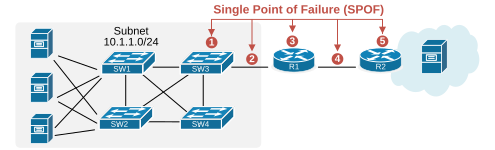
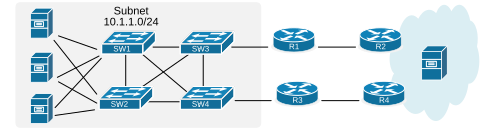
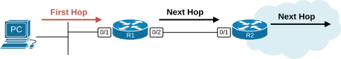
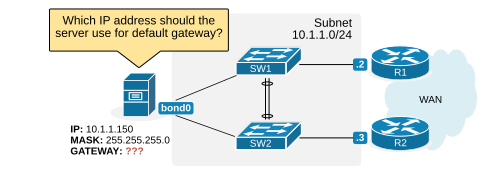
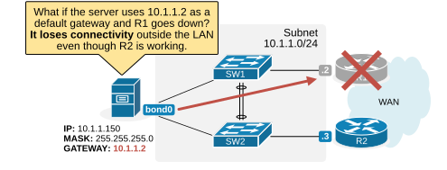
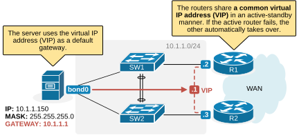

[Why do we need a First Hop Redundancy Protocol?](https://www.networkacademy.io/ccna/network-services/why-do-we-need-a-fhrp)
==========

This lesson begins our journey into First-Hop Redundancy Protocols (FHRP). The term FHRP refers to a category of solutions that includes three options: HSRP, VRRP, and GLBP, with the most popular being the Hot Standby Router Protocol (HSRP). 

We begin by establishing context so that you can understand what the first hop in the network is and why it is essential. Then, we briefly touch on what FHRP is and how it works. In the following lessons, we zoom into each protocol in more detail and demonstrate how we configure and troubleshoot it.

What is a Single Point of Failure (SPOF)?
-----------------------------------------

A single point of failure (SPOF) is a component in the infrastructure that, if it fails, causes an outage for an entire section of the network. These points are undesirable in network design because they compromise the infrastructure's overall reliability, availability, and fault tolerance.

Imagine a LAN network with multiple servers and switches. Everything inside the LAN is redundant. However, take a look at the components with red arrows. If any of these components (1-5) fail, the servers lose connectivity to the outside world.



Figure 1. Single Point of Failure (SPOF).

The network must have redundancy at every component to be highly available and resilient. The following diagram shows a fully redundant network. There are no single points of failure (SPOFs). Any element in the network, such as a power supply, cable, or optical module, might break, or even an entire device might lose power, and the network still works fine.



Figure 2. Fully redundant network.

Physical redundancy is very easy to understand. The network must have at least two of every physical component to be highly available — two power supplies, two switches, two cables, two WAN routers, two links, etc. 

However, physical redundancy alone is not enough. **The network needs protocols that can utilize the redundancy**. If you have two WAN links but don't have a dynamic routing protocol, if one link goes down, the traffic might not be forwarded to the other link. Having multiple switches in the LAN is also not enough on its own. You must use the Spanning-Tree Protocol (STP) to calculate a loop-free topology and recalculate the new paths if one switch goes down.

What is the First Hop?
----------------------

The first hop in an IP routing path is the first device that receives a packet as it leaves the sender's device. Usually, this is **the default gateway**, such as a router, which is responsible for forwarding the packet to its destination. It acts as the initial step in the packets' journey through the network. The first hop decides the next step based on its routing table.



Figure 3. What is the First Hop?

However, **the IPv4 protocol does not utilize redundancy by default**. IPv4 focuses on delivering packets from a source to a destination but does not include built-in mechanisms for ensuring redundancy. IP hosts rely on a single configuration with one default gateway IP address that never changes. For example, a Windows host has the following IP configuration:

```
C:\Users\User>ipconfig
Windows IP Configuration
Ethernet adapter Ethernet 2:
   Connection-specific DNS Suffix  . :
   IPv4 Address. . . . . . . . . . . : 10.1.1.150
   Subnet Mask . . . . . . . . . . . : 255.255.255.0
   Default Gateway . . . . . . . . . : 10.1.1.1
```

The host's default gateway is 10.1.1.1, which will never change until an administrator reconfigures it. This is pretty straightforward if there is only one router (10.1.1.1) in the local LAN. But what if there are two routers in the LAN? Router 1 has 10.1.1.2, and router 2 has 10.1.1.3, as shown in the diagram below. 



Figure 4. Which default gateway to use?

This raises an interesting question: Which IP address should a host use for the default gateway?

- If the server uses 10.1.1.2 (R1) as a default gateway, what happens when R1 goes down? Well, you can guess that the server loses connectivity to the outside world. 
- If the server uses 10.1.1.3 (R2) as a default gateway, it is the same story — it loses connectivity to the outside world if router R2 goes down. 

The following diagram visualizes what happens if the server uses R2 as the default gateway and R2 goes down.



Figure 5. The default gateway is a SPOF.

You can see that having redundancy alone is not enough to have a resilient network. Even though there are two local routers in the LAN, the server cannot take advantage of the redundancy. That is where the first hop redundancy protocols come into play.

First-Hop Redundancy Protocols (FHRP)
--------------------------------------

A default gateway is the local router hosts use to send traffic outside their connected network. If that gateway fails, hosts lose connectivity to the outside world. Hence, the availability of the default gateway is critically important for hosts to stay connected. However, all operating systems, such as Windows, MacOS, and Linux, **allow only one default gateway address to be configured on a host**. Therefore, it is the network's responsibility to ensure that this default gateway address is highly available. 

First Hop Redundancy Protocol (FHRP) is a protocol that ensures high availability for hosts' default gateway. It allows multiple routers to appear as a single gateway address to hosts, as shown in the diagram below.



Figure 6. What is a First-Hop Redundancy Protocol (FHRP)?

FHRP protocols work by creating a group of routers that collectively act as a single virtual gateway for devices in the network. These routers **share a virtual IP address (VIP) and a virtual MAC address.** One router in the group is chosen as the active router, which handles all traffic sent to the virtual gateway. Another router is designated as the standby router, ready to take over if the active router fails.

The routers in the group communicate with each other using periodic messages to share status updates. If the active router stops sending these messages, the standby router detects the failure and takes over the role of the active router. This failover process is seamless for network devices, so they continue to communicate without reconfiguring their default gateway or noticing any interruption.

### FHRP Options

There are three main FHRP protocols used in Cisco networks:

| Protocol | Standard | Description |
|----------|----------|-------------|
| **HSRP** (Hot Standby Router Protocol) | Cisco Proprietary | The original FHRP. Active/standby model with one forwarding router. |
| **VRRP** (Virtual Router Redundancy Protocol) | Open standard (RFC 5798) | Industry-standard alternative to HSRP. Very similar functionality. |
| **GLBP** (Gateway Load Balancing Protocol) | Cisco Proprietary | Provides both redundancy and load balancing across multiple gateways. |

We will examine each of these protocols in detail in the following lessons.

### How FHRP Works (High Level)

1. **Routers form a group**: Two or more routers are configured with the same virtual IP address (VIP) and a virtual MAC address. This VIP is configured as the default gateway on the end hosts.
2. **Election**: The routers elect an **active router** (one that forwards traffic) and a **standby router** (one that waits to take over). The election is typically based on configured priority values.
3. **Hello messages**: The routers exchange periodic hello messages (typically every 3 seconds for HSRP) to monitor each other's health.
4. **Failover**: If the standby router stops receiving hello messages from the active router for a configured hold time (typically 10 seconds), it assumes the active role and begins forwarding traffic using the same VIP and virtual MAC.
5. **Seamless transition**: End hosts are unaware of the failover because the default gateway IP and MAC address remain the same.

### Summary

- **SPOF**: A single point of failure can bring down an entire network segment. Redundant hardware alone does not solve the problem.
- **Default gateway problem**: Hosts can only have one default gateway configured. If that gateway fails, the host loses connectivity even if another router is available on the LAN.
- **FHRP solves this**: Multiple routers share a virtual IP (VIP). One is active, one is standby. If the active fails, the standby takes over seamlessly.
- **Three main protocols**: HSRP (Cisco proprietary), VRRP (open standard), and GLBP (Cisco proprietary with load balancing).

In the next lesson, we will look at **Hot Standby Router Protocol (HSRP)** in detail.