[Hot Standby Router Protocol (HSRP)](https://www.networkacademy.io/ccna/network-services/hot-standby-router-protocol-hsrp)
==========

In the previous lesson, we saw why resilient networks need a first-hop redundancy protocol (FHRP). This lesson begins our journey into the family of FHRP protocols by examining the most popular one, the Hot Standby Router Protocol (HSRP).

What is HSRP?
-------------

Hot Standby Router Protocol (HSRP) is a Cisco proprietary FHRP protocol that enables two or more routers to work together, acting as a highly available default gateway to local hosts. HSRP operates in an active/standby model and implements the concept of a Virtual IP address (VIP), as shown in the diagram below. 

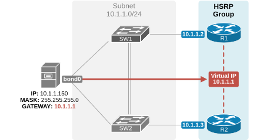

Figure 1. What is Cisco HSRP?

Notice that R1's physical interface has an IP address of 10.1.1.2, and R2's physical interface has 10.1.1.3. However, both routers run HSRP and share the virtual IP address 10.1.1.1. The VIP is a normal IP address in the same local subnet but is not configured on any physical router interface (hence "virtual"). 

How does HSRP work?
-------------------

This was the protocol's high-level overview. Now, let's examine the protocol's most important aspects and operation in more detail.

### Virtual IP (VIP) and Virtual MAC address (VMAC)

HSRP creates a virtual IP address (VIP) and a virtual MAC address (VMAC) that hosts in the network use as their gateway. The active router acts as if the virtual IP address is configured on its physical interface that connects to the local subnet, as shown in the diagram below.

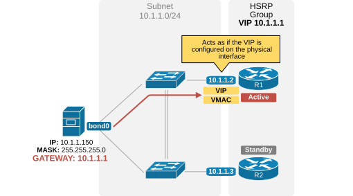

Figure 2. HSRP's virtual IP and MAC.

For example, a host is configured with the default gateway 10.1.1.1 (the VIP). When the host sends an ARP Request for the default gateway 10.1.1.1, the active router (R1) replies to ARP requests for the VIP with the virtual MAC address (VMAC).

The other router remains in standby mode and is ready to take over. When the active router fails, the standby router becomes active. What does that mean, though? This means it starts acting as if the virtual IP address is configured on its physical interface, as shown in the diagram below.

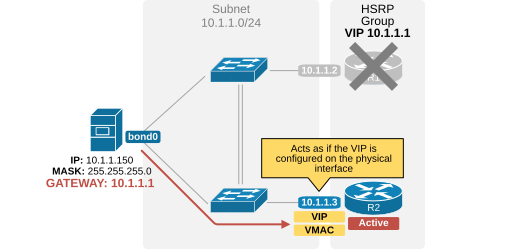

Figure 3. HSRP standby becomes active router.

When a host sends an ARP Request for 10.1.1.1 (the VIP) and R1 is unavailable, the standby router becomes active and replies with the virtual MAC address (the VMAC).

### HSRP Control Plane

Now, let's examine the protocol's control plane that manages the exchange of messages and states between routers participating in an HSRP group. 

#### Hello messages

HSRP is configured per router interface. When we configure an interface as part of an HSRP group, it starts sending periodic HSRP Hello messages to multicast address 224.0.0.2 (all routers link-local multicast). These packets use UDP port 1985. 

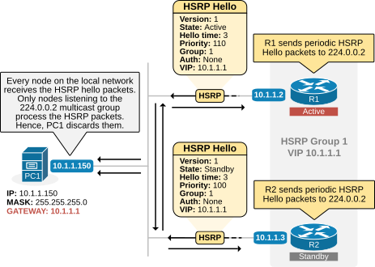

Figure 4. HSRP Control Plane.

As the diagram above shows, Hello messages contain essential information. The most important parameter is the HSRP group number. Two or more routers that want to establish an HSRP relationship and share a common virtual IP address **must use the same Group number**. For example, in the diagram above, both routers use group number 1.

The other very important parameters in the Hello messages are the priority value and the virtual IP address.

#### Priority

The router's priority determines the active router in the group. **One HSRP group can only have one active router.** Each router in the group is assigned a priority value between 0 and 255, as shown in the output below. If no priority is explicitly set, the device assigns the default priority value 100.

```
R1(config)# interface GigabitEthernet0/1
R1(config-if)# standby 1 ip 10.1.1.1
R1(config-if)# standby 1 priority 110
```

In the end, **the device with the highest priority becomes the active router**. Pay attention to the following arguments in the configuration commands shown above:

- The protocol is configured **per interface**. This example is configured under GigabitEthernet0/1.
- The group number is 1. **It must match all devices** participating in the group and sharing the same VIP address.
- The command **standby 1 ip 10.1.1.1** specifies the VIP address. It must be in the same subnet as the interface's IP address and the same value on all routers in the group.
- The command **standby 1 priority 110** specifies the priority of this router. Higher is better.

#### Active router election

Based on the priority values of every router, the HSRP election process determines which router will become active and which will be the standby router in an HSRP group. The process works in two steps:

1. **Priority Comparison** — All HSRP routers send each other hello messages containing their priority values and IP addresses. The device with **the highest priority** is elected as the active router.
2. **Tiebreaker Using IP Address** — If two routers have the same priority, the one with **the highest IP address** becomes the active router.

Once an active router has been elected, the router with the second-highest priority (or IP address in case of a tie) is elected as the standby router. It will take over if the active router fails.

#### States

A router interface that runs HSRP does not immediately become an Active or Standby router. It first goes through **the protocol's state machine** to determine how many routers participate in the HSRP group and what its state should be. The following diagram explains the purpose of each state.

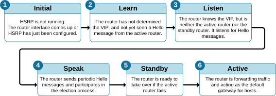

Figure 5. Protocol States.

In the HSRP configuration lab, we will discuss the states in more detail. Using debug messages, we will observe how a device moves through the states before it becomes active or standby. Keep in mind that the HSRP states are a common drag-and-drop question on the CCNA exam. Although they are pretty easy to figure out using simple logic, it is good to spend time understanding each state. 

### Versions

Cisco devices support two HSRP versions: version 1 and version 2. These versions differ in several aspects, such as multicast IP addresses and message formats. Because of these differences, **all routers within the same group must run the same version.** If two routers in the same group are mistakenly configured with different versions, they will be unable to communicate and will ignore each other.

| Capability | Version 1 | Version 2 |
|------------|-----------|-----------|
| Hello timer units | Seconds | Milliseconds |
| Supports both IPv4 and IPv6 | No (only IPv4) | Yes |
| Number of groups supported | 256 (0 to 255) | 4096 (0 to 4095) |
| Virtual MAC (--- is the HSRP group number in HEX) | 0000.0C07.AC-- | 0000.0C9F.F--- |
| Multicast address | 224.0.0.2 | 224.0.0.102 |

Version 2 offers several advantages over version 1. It introduced support for IPv6 and enables faster convergence during changes by using shorter Hello timers. In contrast, HSRPv1 typically had a minimum Hello timer of 1 second. The table above outlines the key differences between the two protocol versions. Even though version 2 is superior to v1, HSRPv1 is far more common in real-world deployments than HSRPv2.

#### The virtual MAC address

The HSRPv1 virtual MAC address is a Layer 2 address associated with the virtual IP address (VIP) configured for the HSRP group. It has the following format:

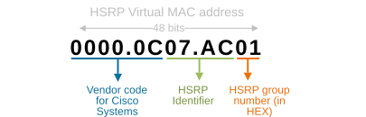

Figure 6. HSRPv1 Virtual MAC address.

For example, if the HSRPv1 group number is 1, the virtual MAC address will be as follows:

```
0000.0C07.AC01
```

Let's break it down into pieces:

- **0000.0C** — The Organizationally Unique Identifier (OUI) assigned to Cisco.
- **07.AC** — Indicates that this is an HSRP MAC address.
- **01** — Represents the HSRP group number 1 in hexadecimal format.

If you want to become a good network engineer, you must remember this MAC address structure. It is a very common part of Cisco exam questions. Additionally, it is very common in real-world troubleshooting situations to check ARP tables and figure out that a particular IP address is a virtual one (based on the bound MAC address). Let's see a few more examples:

```
The MAC address for Group 5
0000.0C07.AC05

The MAC address for Group 10
0000.0C07.AC0A

The MAC address for Group 150
0000.0C07.AC96

The MAC address for Group 255
0000.0C07.ACFF
```

Notice that the Group number is converted to a hexadecimal number in the MAC address (in red). Also, notice that the largest possible HEX number with two HEX digits is FF, which is 255 in decimal. That's why Cisco routers support a maximum of 256 HSRP groups per interface (depending on the platform and software version).

The HSRPv2 uses a different MAC address 0000.0C9F.F**xxx**, where **xxx** is the group number in HEX. However, the logic is exactly the same. Obviously, it supports more group numbers — 4096. 

### HSRP Data Plane

Once the protocol state machine has gone through the states, the protocol is converged and ready to forward traffic. Let's quickly examine how traffic forwarding happens in the data plane. How does host traffic end up on the Active router? The following diagram explains how the data plane works.

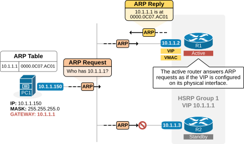

Figure 7. HSRP Data Plane.

Once an active router is elected, it starts acting as if the virtual IP address is configured on its physical interface that connects to the subnet. In our instance, R1 is the active router for group 1 with VIP 10.1.1.1. Even though its physical interface has IP address 10.1.1.2, it starts replying to ARP requests for the VIP address 10.1.1.1 with the VMAC address, as shown in the diagram above. Therefore, the hosts' ARP tables have an entry that binds the VIP (10.1.1.1) with the VMAC (0000.0c07.ac01), as shown in the output below.

```
Microsoft Windows [Version 10.0.22631.4317]
(c) Microsoft Corporation. All rights reserved.
C:\Users\ivan> arp -a
Interface: 10.1.1.150 --- 0x7
  Internet Address      Physical Address      Type
  10.1.1.1              00-00-0c-07-ac-01     dynamic
  10.1.1.32             70-da-01-aa-3c-3f     dynamic
  239.255.255.250       01-00-5e-7f-ff-fa     static
  255.255.255.255       ff-ff-ff-ff-ff-ff     static
```

In the end, the Ethernet switches forward all frames destined to the VMAC to R1 (the active router). 

### Preemption

Preemption is a feature in the Hot Standby Router Protocol (HSRP) that allows a higher-priority device to become the active router when it becomes available.

Typically, the device with the highest priority becomes the active router. If it fails, the device with the next highest priority takes over. Without preemption, the original active router will not regain its role when it returns online, even if it has a higher priority. Instead, the current active router will continue in that role until it fails, as shown in the diagram below.

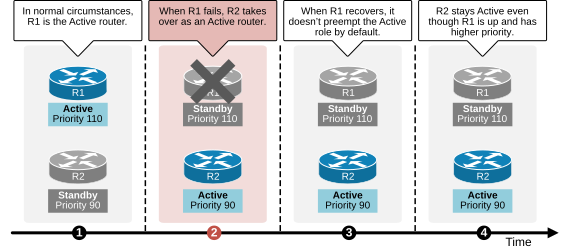

Figure 8. HSRP without preemption (by default).

With preemption enabled, **the higher-priority router can automatically take back the active role once it recovers and rejoins the network**, as shown in the diagram below. This feature ensures that the router with the best resources or configuration is always the active one, maintaining optimal performance.

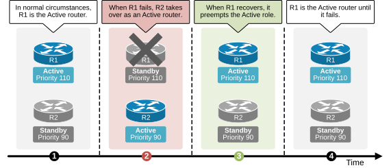

Figure 9. HSRP with preemption configured.

For preemption to work, it must be explicitly configured on the router, and the priority value should also be set to reflect its importance in the group.

```
Router(config-if)# standby 1 preempt
```

It is very important to remember that preemption is disabled by default. If you want the router with the highest priority to preempt the Active role when available, you must configure the capability explicitly, as shown in the output above. 

**IMPORTANT:** Preemption is disabled by default in HSRP.

Now that we have reviewed how the protocol works, let's look at the most common use cases in real-world scenarios.

HSRP Use cases
--------------

There are a few very common scenarios when we use the Hot Standby Routing Protocol in production networks. 

### Resilient Default Gateway

Of course, the protocol's most common use case is **providing a resilient default gateway to hosts** by allowing two or more routers to share a virtual IP address. One router is active, and the others are on standby. A standby router takes over if the active router fails, ensuring uninterrupted gateway availability. 

This capability is used in 99.9% of all modern networks because default gateway redundancy is essential for the overall availability of host connectivity.

### Load balancing

We have said that the protocol is configured per interface, which is effectively per subnet. When a device has many interfaces connected to many subnets, it typically participates in many HSRP groups. Suppose we have two routers (R1 and R2) that connect to multiple host subnets. In such a scenario, if we configure R1 to be the active router for every subnet, we end up in the following situation:

- R1 (active) is overutilized because all hosts use it as their default gateway.
- R2 (standby) is underutilized because none of the hosts use it as their default gateway.

A better design is distributing traffic across the two routers by making one device active for some subnets and the other active for others, as shown in the diagram below.

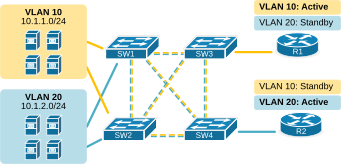

Figure 10. HSRP Load Balancing.

We can go even further and configure two HSRP groups in the same subnet with different VIP addresses. Then, we can configure some of the hosts to use one of the VIPs as the default gateway and the other half to use the second VIP. The diagram below illustrates this idea.

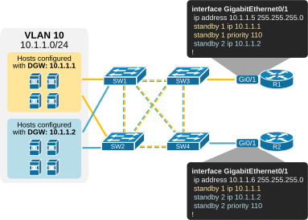

Figure 11. Load Balancing in a single subnet.

Notice that we configure multiple HSRP groups on a single interface. Each group has its own virtual IP address, which different hosts can use as their default gateway. 

- In group 1, R1 is the active device because it has a priority of 110, while R2 has the default value of 100. 
- In group 2, R2 is the active device because it has a priority of 110, while R1 has the default value of 100. 

Although this design is not very common, it can be useful in scenarios where large subnets have many hosts transmitting high data volumes. If we don't balance the traffic to both routers, one can easily be overutilized while the other is underutilized.

### VIP as IP next hop

Another common use case is using HSRP VIP as the next-hop IP address in static routing. A static route can point to a virtual IP instead of a physical router IP, ensuring continuity in routing even if a next-hop device fails.

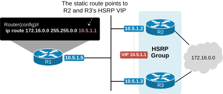

Figure 12. VIP as IP next hop.

For example, we can configure a static route on R1 to point to either of the next-hop devices (R2 and R3). However, if that device fails, we will lose the static route. A better design is configuring the static route to point to a virtual IP address, as shown in the diagram above. In that case, even if one of the next-hop devices fails, the other takes over, and the static route still provides connectivity to the destination network.

### Interface Tracking

Another capability available in all FHRPs monitors the status of other IOS functions. Cisco devices support tracking the state of interfaces, routes in the IP routing table, and various other objects. If a tracked interface fails, the protocol lowers the configured priority value.

The example below shows the most common use case of this capability. We have a dual-homed network with two WAN routers. The routers run HSRP to provide a resilient default gateway to hosts.

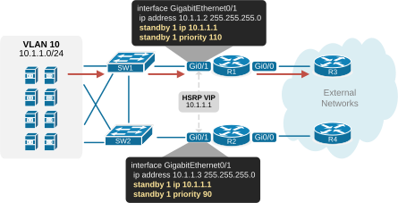

Figure 13. Dual-homed network.

Notice that R1 is the active router, while R2 is the standby one. Therefore, all host traffic goes to R1 in normal circumstances. So far, so good; there is no problem here. However, let's see what happens if one of the WAN links goes down. For example, R1's uplink goes down, as shown in the diagram below.

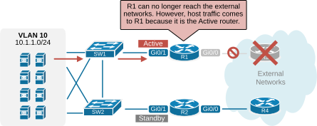

Figure 14. WAN failure.

At this point, traffic from hosts still goes to R1 (because it is still the active device). However, R1 is not connected to the external world because its uplink is down. Depending on the routing design, this could lead to a complete outage for the hosts. Even if there is no outage, the traffic path becomes inefficient. This is where the interface tracking feature comes into play.

HSRP interface tracking monitors the status of a specific interface and dynamically adjusts the HSRP priority based on the operational state of the tracked interface. For example, R1 is the active device, and its tracked interface fails. The protocol immediately decreases the HSRP priority of the router with the configured value (50). At this point, **the standby router's priority becomes higher than R1's current priority of 60 (110-50)**. Hence, R2 preempts the active role for the time being until R1's uplink goes up again.

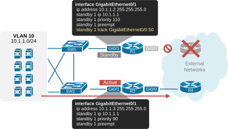

Figure 15. Interface tracking.

Now, the traffic from hosts goes directly to R2 and the external networks, which is the most efficient network path in this situation.  

### Summary

- **HSRP** is a Cisco proprietary FHRP providing active/standby default gateway redundancy.
- **VIP (Virtual IP)** and **VMAC (Virtual MAC)** are shared by routers in a group. End hosts use the VIP as their default gateway.
- **Election**: The router with the highest priority becomes active. Tiebreaker is the highest IP address.
- **Preemption**: Disabled by default. Must be explicitly configured for a higher-priority router to reclaim the active role.
- **Versions**: HSRPv1 (224.0.0.2, MAC 0000.0C07.AC--) and HSRPv2 (224.0.0.102, MAC 0000.0C9F.F---).
- **Interface tracking**: Dynamically lowers priority if a tracked interface goes down, triggering a failover to the standby router.
- **Load balancing**: Can be achieved by making different routers active for different subnets or using multiple HSRP groups per subnet.

In the next lesson, we will practice configuring HSRP in **Lab #4.1 — Configuring HSRP**.