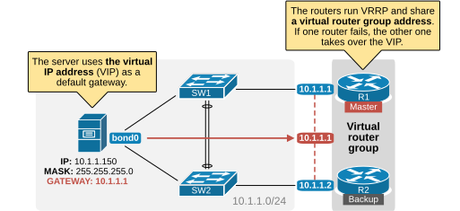
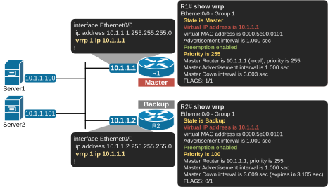

[Virtual Router Redundancy Protocol (VRRP)](https://www.networkacademy.io/ccna/network-services/virtual-router-redundancy-protocol-vrrp)
==========

The **Virtual Router Redundancy Protocol (VRRP)** is the second first-hop redundancy protocol (FHRP) we will examine in this course section. If you don't know why a resilient network needs a FHRP protocol, I would suggest going through [our lesson on FHRP](https://www.networkacademy.io/ccna/network-services/why-do-we-need-a-fhrp) first. Also, make sure to go through the lessons in order so that you are familiar with HSRP before going into VRRP and the next protocol we are going to examine — GLBP.

What is VRRP?
-------------

Hosts on the LAN, such as servers, PCs, laptops, mobile phones, etc., typically have a single default gateway address. This introduces a single point of failure in the network. If the default gateway becomes unavailable, the hosts can only communicate within their local LAN and lose access to the rest of the network. Similarly to HSRP, VRRP provides a solution to this problem.

VRRP allows **multiple routers to operate as a single virtual router**, which hosts can then use as their default gateway.



Figure 1. What is VRRP?

At first glance, you can notice a few major differences between VRRP and HSRP, as shown in the diagram above. 

- The routers that share a virtual IP address are called the "*Virtual router group*" (not the HSRP group).
- The virtual IP address is called the "*Virtual router group IP address.*"
- The virtual router address (the VIP) **can be the IP address of the physical interface of one of the routers**. For example, R1's physical interface is 10.1.1.1, and the virtual router group IP address is 10.1.1.1.
- The active router is called the "*Master virtual router.*"
- The standby routers are called "*Backup virtual routers.*"

When the virtual router address uses R1's physical interface's IP address, R1 assumes the role of the master virtual router and is also known as the IP address owner. As the master virtual router, R1 controls the virtual router IP address 10.1.1.1 and is responsible for forwarding packets sent to this IP address.

R2 functions as a backup virtual router. If the master virtual router fails, the backup router becomes the master virtual router and provides uninterrupted service for the LAN hosts. In VRRP, preemption is enabled by default. When R1 recovers, it becomes the master virtual router again. 

### The history of VRRP

HSRP and VRRP were introduced at the same time in the 1990s when organizations started relying heavily on their corporate networks. Cisco identified the need for first-hop router redundancy but, in the absence of a standards-based solution, developed HSRP as a proprietary protocol. Later, the IETF introduced VRRP, which offers similar features but as an open-standard protocol. 

VRRP provides the same functionality as HSRP. Both protocols aim to offer redundancy for hosts' default gateway and optional preemption.

### Versions

The protocol has evolved into three major versions: VRRPv1, VRRPv2, and VRRPv3. However, Version 1 is now completely obsolete and not supported by modern network devices. It has been completely replaced by VRRPv2 and VRRPv3 for enhanced features and security. The following table compares the two modern versions. 

| Feature | VRRPv2 | VRRPv3 |
|---------|--------|--------|
| IP Protocol Support | Only IPv4 | IPv4 and IPv6 |
| Authentication | Does not support authentication | IPsec-based authentication |
| Multicast address | Uses 224.0.0.18 for IPv4 | 224.0.0.18 for IPv4, FF02::12 for IPv6 |
| Priority | 1–255, where higher is better | 1–255, where higher is better |
| Virtual MAC address | 0000.5E00.01xx for IPv4 | 0000.5E00.01xx for IPv4, 0000.5E00.02xx for IPv6 |
| RFC | RFC3768 | RFC5798 |

In summary, VRRPv3 is an improvement over VRRPv2. It primarily adds support for IPv6 and enhances security with IPsec authentication. In this lesson, when we say "VRRP," we refer to VRRPv3.

### VRRPv3 vs HSRPv2

The following table compares the differences between the most modern versions of HSRPv2 and VRRPv3. 

| Feature | HSRP | VRRP |
|---------|------|------|
| Cisco-proprietary | Yes | No (open standard) |
| VIP must be different from routers' physical IPs? | Yes | No |
| Preemption disabled by default | Yes | No (enabled by default) |
| Supports IPv4 and IPv6 | Yes | Yes |
| Multicast address | 224.0.0.102 | 224.0.0.18 |
| Virtual MAC | 0000.0c9f.fxxx | 0000.5e00.01xx |
| Max group numbers supported | 4096 (0-4095) | 255 (1-255) |
| Transport | UDP/1985 | IP/112 |
| Default Hello timer | 3 seconds | 1 second |

In summary, the essential difference is that HSRP is Cisco-proprietary, while VRRP is open-standard. You can safely use either one as a first-hop redundancy protocol and have a resilient default gateway. Typically, the design choice of which one to use depends on the type of network equipment. If the network is 100% Cisco-based, you use HSRP. If it is another vendor, you use VRRP.

VRRP Concept
------------

Now, let's zoom into VRRP a little bit more and examine the most fundamental aspects of the protocol.

### Basic Configuration

Let's start with the basic configuration. Although it is not part of the CCNA blueprint, knowing how to configure the protocol helps a lot in understanding how it works. The following diagram shows the most basic configuration setup.



Figure 2. VRRP Basic Configuration.

Notice that similarly to HSRP, VRRP is configured per interface. The basic command that enables the protocol always starts with `vrrp [VRID]`, where VRID is the virtual router identifier. This is the analog of the HSRP group number. It is a number in the range between 1 and 255 and there is no default value. It must be explicitly set.

Also, notice that the virtual router IP address can be the IP address of the physical interface of R1. This is not possible with HSRP, where the VIP must be a different IP than the physical interfaces' IP addresses.

When the VRRP VIP is configured, as shown in the output below, the router is called "*IP owner*" because its IP address 10.1.1.1 is configured as virtual router address 10.1.1.1.

```
R1# show run interface e0/0
interface Ethernet0/0
 ip address 10.1.1.1 255.255.255.0
 vrrp 1 ip 10.1.1.1
end
```

This configuration simplifies the Master/Backup election process, as you can see in the next section of the lesson.

### The election process

The VRRP Master/Backup election process is based on priority. The priority value is between 0 and 255, where 100 is the default value. If there is a tie, the highest IP address wins. 

There are two special priority values that cannot be configured explicitly with the `vrrp 1 priority [value]` command, 0 and 255:

- **Priority 255** — If the virtual router IP address is one of the router's physical interface IP addresses, it automatically has a priority of 255. You cannot configure 255 with the priority command.
- **Priority 0** — A value of 0 (zero) is reserved for the Master router to signal to other routers in the VRRP group that it is stepping down and no longer participating as the Master. This triggers a re-election process among the backup routers to select a new Master based on their configured priority values.

The values from 1 to 254 are available for explicit configuration on VRRP routers, as you can see in the output below.

```
R1(config-if)# vrrp 1 priority ?
  <1-254>  Priority level(default 100)
```

Higher values indicate higher priority and a higher likelihood of becoming the master virtual router. The default priority value is 100 (same as HSRP).

### Timers

In VRRP, only the Master virtual router sends periodic VRRP advertisement packets (Hellos) to indicate its availability and status. The advertisement timer is 1 second by default. (In HSRP, it is 3 seconds by default). The advertisements are encapsulated in IP/112 and sent to the VRRP link-local multicast address 224.0.0.18.

Backup routers simply listen for these advertisements from the Master. If a backup router does not receive 3 x Advertisements from the Master within a specific timeout period (Master Down Interval), it assumes the Master has failed. The backup routers then initiate an election process to select a new Master based on their priority values.

### Preemption

Preemption is enabled by default in VRRP. This is a big difference from HSRP, where preemption is disabled by default.

Notice in the output below that we haven't configured preemption explicitly, but it is enabled by default.

```
R1# show run int e0/0
interface Ethernet0/0.20
 encapsulation dot1Q 20
 ip address 10.1.1.1 255.255.255.0
 vrrp 1 ip 10.1.1.1
!
```

```
R1# show vrrp
Ethernet0/0 - Group 1
  State is Master
  Virtual IP address is 10.1.1.1
  Virtual MAC address is 0000.5e00.0101
  Advertisement interval is 1.000 sec
  Preemption enabled
  Priority is 255
  Master Router is 10.1.1.1 (local), priority is 255
  Master Advertisement interval is 1.000 sec
  Master Down interval is 3.003 sec
  FLAGS: 1/1
```

Okay, but let's ask ourselves: What are the consequences of preemption being on by default in VRRP?

During the configuration and reconfiguration of VRRP routers, if multiple routers are not explicitly assigned different priorities, the one with the highest IP address will immediately preempt the master role. This may be undesirable. Configuring each one with a different priority value is a recommended practice. For example, one with priority 130, another with 120, another with 110, and so on. This approach helps achieve faster convergence.

Also, recall that the "*IP address owner*" has a priority value of 255. During the configuration process, the router with a priority of 255 will immediately preempt any lower-priority routers upon startup. Only one router on the link should be assigned this priority.

Use Cases
---------

The Virtual Router Redundancy Protocol is commonly used in the same scenarios where we use HSRP or any other first-hop redundancy protocol. The most common use cases include:

- Redundancy for the default gateway router.
- Redundancy for the next hop in static routing.
- Conditional next hop router (Tracking of an uplink interface or IP route).

The design choice when to use VRRP instead of HSRP is primarily based on the network equipment vendor. In Cisco environments, engineers prefer to use HSRP. In non-Cisco environments, VRRP is the only standard choice for first-hop redundancy.

If you are studying for the CCNA (200-301) v1.1 exam, you don't need to know VRRP in great detail. However, if you plan to follow a path as a network engineer, it is a good starting point for practicing configuring VRRP in the same topology that we used for HSRP in the previous lesson.

### Configuration Example

Here is a VRRP configuration for two routers providing redundant gateway for a LAN subnet.

**R1 (Master / IP Owner):**
```
interface Ethernet0/0
 ip address 10.1.1.1 255.255.255.0
 vrrp 1 ip 10.1.1.1
!
```

**R2 (Backup):**
```
interface Ethernet0/0
 ip address 10.1.1.2 255.255.255.0
 vrrp 1 ip 10.1.1.1
 vrrp 1 priority 150
!
```

In this example, R1 is the IP owner because the VIP (10.1.1.1) matches its physical interface IP, giving it an automatic priority of 255. R2 is configured with priority 150. If R1 fails, R2 becomes Master. When R1 recovers, it preempts and becomes Master again (preemption is enabled by default).

To verify the VRRP state:

```
R1# show vrrp brief
Interface          Grp Pri Time  Ownr Pre Trans State
Ethernet0/0        1   255 3529  Y    Y   1      Master

R2# show vrrp brief
Interface          Grp Pri Time  Ownr Pre Trans State
Ethernet0/0        1   150 3530  N    Y   1      Backup
```

### Summary

- **VRRP** is the open-standard alternative to HSRP (RFC 5798).
- **IP address owner**: The router whose physical IP matches the VIP automatically gets priority 255 and becomes Master.
- **Preemption is enabled by default** (opposite of HSRP).
- **Default hello timer**: 1 second (faster than HSRP's 3 seconds).
- **Virtual MAC**: 0000.5e00.01xx (VRRPv2/v3 for IPv4).
- **Multicast**: 224.0.0.18, protocol IP/112.
- **Design choice**: Use HSRP in Cisco-only environments; use VRRP in multi-vendor environments.

In the next lesson, we will examine **Gateway Load Balancing Protocol (GLBP)**.