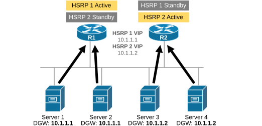
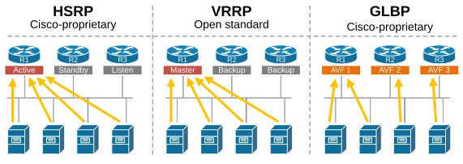
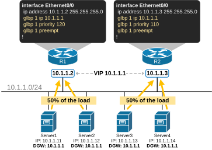
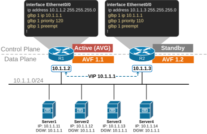
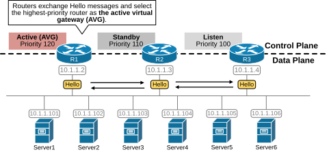
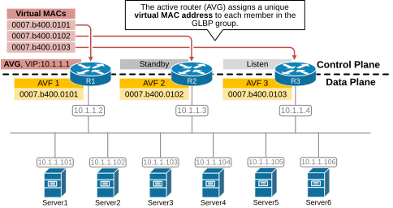
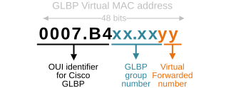
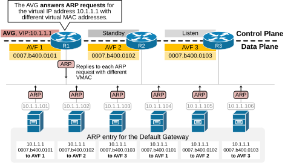
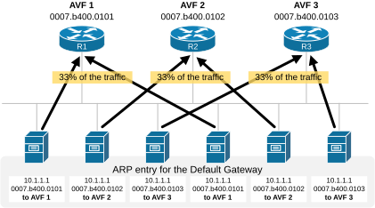

[Gateway Load Balancing Protocol (GLBP)](https://www.networkacademy.io/ccna/network-services/gateway-load-balancing-protocol-glbp)
==========

The Gateway Load Balancing Protocol (GLBP) is the last first-hop redundancy protocol (FHRP) we discuss in this section. It serves the same function as HSRP and VRRP — it provides redundancy for the default gateway. However, GLBP supports load balancing, while HSRP and VRRP only support load sharing.

HSRP/VRRP Load Sharing
----------------------

To provide context around this lesson and understand why Cisco has introduced GLBP, let's discuss the difference between load sharing and load balancing. 

**Load Sharing** refers to distributing traffic across multiple routers based on predefined static configuration. For example, we have a subnet with many hosts and two routers running HSRP. Suppose we want to load balance the traffic between the two local routers. Since HSRP does not support true load balancing, the only way to achieve it is to configure two different HSRP groups (say groups 1 and 2) and make a different router Active for each group. For example, R1 is the Active router for HSRP group 1, and R2 is the active group for HSRP group 2. 

However, this is still not enough. We also need to configure one-half of the hosts with a default gateway pointing to HSRP 1's VIP and the other half of the hosts with a default gateway pointing to HSRP 2's VIP, as shown in the diagram below.



Figure 1. HSRP Load Sharing.

The load-sharing process involves configuring different default gateways on hosts and multiple HSRP groups per subnet. This becomes problematic at scale. That's why HSRP/VRRP load sharing is typically not used in large-scale networks.

**Load Balancing** refers to the process of dynamically distributing traffic evenly across multiple routers based on real-time conditions without requiring different default gateway addresses on different hosts on the local network. HSRP and VRRP support only load-sharing, as shown in the diagram above. That's why Cisco introduced another first-hop redundancy protocol specially designed to perform true load balancing — the Gateway Load Balancing Protocol (GLBP).



Figure 2. GLBP vs HSRP/VRRP.

GLBP is the only protocol that can do proper load-balancing inside one virtual router group, as shown in the diagram above. Now, let's see how.

What is GLBP?
-------------

GLBP is a first-hop redundancy protocol (FHRP) that provides redundancy for the default gateway router, similar to HSRP and VRRP. However, the main improvement that GLBP provides compared to HSRP/VRRP is that it supports proper load balancing. Look at the diagram below and compare it to Figure 1 above. 



Figure 3. What is GLBP?

You can see that host traffic is equally load-balanced between the two local routers. However, let's highlight the big differences compared to the HSRP/VRRP load sharing: 

- There is **only one GLBP group configured** on the router interface, while in the case of HSRP load sharing, there are two HSRP groups on the same interface.
- All servers are configured **with the same default gateway address**, 10.1.1.1, while in the case of HSRP load sharing, a subset of the servers is configured with another DGW address. 

These improvements make GLBP much more efficient at scale if the organization wants to load balance the default gateway traffic. Let's now zoom in and see how it works.

How does GLBP work?
-------------------

GLBP works per subnet as all other FHRP protocols. When there are multiple GLBP routers on the same subnet, they must be configured with the same group number, the same virtual address, and different priorities, as shown in the output below (similarly to HSRP):

```
interface Ethernet0/0
 glbp [group] ip [virtual address]
 glbp [group] priority [priority value]
```

Then, based on the configured priority values, all routers in the GLBP group elect the one with the highest priority to act as the **Active Virtual Gateway (AVG)**. In a tie, the router with the highest IP address wins. The router with the second highest priority is elected as the standby router. 

There is only one AVG per GLBP group. The function of the AVG router is to assign **a virtual MAC address** to each other member of the GLBP group. Once a router is assigned a virtual MAC address, it becomes an **Active Virtual Forwarder (AVF)**. 



Figure 4. Cisco GLBP Overview.

When a host sends an ARP request, the AVG responds with one of the virtual MAC addresses from the available AVFs. This mechanism ensures that different hosts have different VIP-to-VMAC bindings, which load balances the traffic among the GLBP routers in the group.

This is a high-level overview of how GLBP works. Now, let's zoom in a little bit more. 

### GLBP Control-plane

Let's introduce a more complex topology with three local routers (R1, R2, and R3) connected to subnet 10.1.1.0/24 and several servers (Server 1 through 6). All servers are configured with a default gateway address of 10.1.1.1. The routers are configured as shown below.

```
R1(config)# interface Ethernet0/0
 glbp 1 ip 10.1.1.1
 glbp 1 priority 120
```

```
R2(config)# interface Ethernet0/0
 glbp 1 ip 10.1.1.1
 glbp 1 priority 110
```

```
R3(config)# interface Ethernet0/0
 glbp 1 ip 10.1.1.1
 glbp 1 priority 100
```

Now, let's break down the GLBP control-plane operation into three main steps and then see how the server's traffic is load-balanced across the three local routers in the data plane.

#### Step 1. Electing an Active Virtual Gateway (AVG)

When GLBP is configured on a router interface, the router starts exchanging hello messages to announce its presence on the subnet and share its priority and IP information. The Hello messages are sent to the link-local multicast address 224.0.0.102 using UDP port 3222. 

The router with the highest priority becomes **the Active Virtual Gateway (AVG)**. The router with the second-highest priority (or IP address) becomes the standby router. It monitors the AVG and takes over if the current AVG fails.



Figure 5. Electing an Active Virtual Gateway (AVG).

For example, R1 has the highest priority (120), so it becomes the AVG for the group. R2 has the second highest priority (110), so it becomes the standby router. R3 then acts as a backup in case any of the active/standby routers fail.

Let's look at the CLI representation of the election process. The first line in the show glbp brief output shows the router's control-plane state based on the configured priority and the election process. 

```
R1# show glbp brief
Interface   Grp  Fwd Pri State    Address         Active router   Standby router
Et0/0       1    -   120 Active   10.1.1.1        local           10.1.1.3
Et0/0       1    1   -   Active   0007.b400.0101  local           -
Et0/0       1    2   -   Listen   0007.b400.0102  10.1.1.3        -
Et0/0       1    3   -   Listen   0007.b400.0103  10.1.1.4        -
```

```
R2# show glbp brief
Interface   Grp  Fwd Pri State    Address         Active router   Standby router
Et0/0       1    -   110 Standby  10.1.1.1        10.1.1.2        local
Et0/0       1    1   -   Listen   0007.b400.0101  10.1.1.2        -
Et0/0       1    2   -   Active   0007.b400.0102  local           -
Et0/0       1    3   -   Listen   0007.b400.0103  10.1.1.4        -
```

```
R3# show glbp brief
Interface   Grp  Fwd Pri State    Address         Active router   Standby router
Et0/0       1    -   100 Listen   10.1.1.1        10.1.1.2        10.1.1.3
Et0/0       1    1   -   Listen   0007.b400.0101  10.1.1.2        -
Et0/0       1    2   -   Listen   0007.b400.0102  10.1.1.3        -
Et0/0       1    3   -   Active   0007.b400.0103  local           -
```

Notice that R1 is the Active Virtual Gateway (AVG) for GLBP group 1 with a priority of 120. R2 is elected the Standby router with priority 110. R3 is in a Listen state, meaning it waits to become Active or Standby in case R1/R2 fails.

#### Step 2. Assigning a Virtual MAC to members

Once the AVG router has been elected, **it assigns a virtual MAC address to every group member** through Hello Request/Response messages. Once a member is assigned a virtual MAC, it becomes **an Active Virtual Forwarder (AVF)** for that virtual MAC address, as shown in the diagram below.



Figure 6. Assigning virtual MAC addresses to members.

Let's look at the CLI representation of this concept. Notice that R1 is the Active Forwarder for the first virtual MAC address. R2 is the AVF for the second virtual MAC address, and R3 is active for the third.

```
R1# show glbp brief
Interface   Grp  Fwd Pri State    Address         Active router   Standby router
Et0/0       1    -   120 Active   10.1.1.1        local           10.1.1.3
Et0/0       1    1   -   Active   0007.b400.0101  local           -
Et0/0       1    2   -   Listen   0007.b400.0102  10.1.1.3        -
Et0/0       1    3   -   Listen   0007.b400.0103  10.1.1.4        -
```

```
R2# show glbp brief
Interface   Grp  Fwd Pri State    Address         Active router   Standby router
Et0/0       1    -   110 Standby  10.1.1.1        10.1.1.2        local
Et0/0       1    1   -   Listen   0007.b400.0101  10.1.1.2        -
Et0/0       1    2   -   Active   0007.b400.0102  local           -
Et0/0       1    3   -   Listen   0007.b400.0103  10.1.1.4        -
```

```
R3# show glbp brief
Interface   Grp  Fwd Pri State    Address         Active router   Standby router
Et0/0       1    -   100 Listen   10.1.1.1        10.1.1.2        10.1.1.3
Et0/0       1    1   -   Listen   0007.b400.0101  10.1.1.2        -
Et0/0       1    2   -   Listen   0007.b400.0102  10.1.1.3        -
Et0/0       1    3   -   Active   0007.b400.0103  local           -
```

Notice that GLBP uses the MAC address format shown below. The group number in blue represents the configured group in HEX. The AFV number represents the forwarder number in HEX.



Figure 7. Virtual MAC address format.

There can be up to four virtual MAC addresses per group. Hence, there can be up to four active forwarders per group.

#### Step 3. Answering hosts' ARP requests

The last piece of the puzzle that glues everything together is the Address Resolution Process (ARP) that every host on the subnet uses to resolve the MAC address of its default gateway. When a host sends an ARP Request for the VIP 10.1.1.1, the AVG router responds to the request with the first virtual MAC address 0007.b400.0101. When another host sends an ARP request, the AVG responds with the next MAC address, 0007.b400.0102. When another host ARPs, the AVG responds with 0007.b400.0103, and so on. The AVG answers ARP with different virtual MAC addresses in a round-robin manner.



Figure 8. AVG answers ARP requests.

In the end, each server has a different ARP entry for the default gateway address, as shown in the diagram above.

### Data plane

After the control plane operation is completed, every host in the local network **receives an ARP response with a different AVF MAC address** for the default gateway. Recall that at the Ethernet layer, data packets (called frames) are sent directly to the destination MAC address based on the ARP table. Since every host has different IP-to-MAC binding for the default gateway, the traffic is balanced between the three active virtual forwarders (AVF), as shown in the diagram below.



Figure 9. GLBP Data plane.

For example, the first server has the binding 10.1.1.1 — 0007.b400.0101 for the default gateway. Therefore, it sends all traffic destined for external networks to destination MAC 0007.b400.0101, which goes to R1.

On the other hand, the second server has the binding 10.1.1.1 — 0007.b400.0102 for the default gateway. Therefore, it sends all traffic destined for external networks to destination MAC 0007.b400.0102, which goes to R2.

### FHRP Comparison

| Feature | HSRP | VRRP | GLBP |
|---------|------|------|------|
| Standard | Cisco proprietary | Open standard (RFC 5798) | Cisco proprietary |
| Active router called | Active | Master | AVG |
| Standby router called | Standby | Backup | Standby (for AVG) |
| Load balancing | No (load sharing only) | No (load sharing only) | Yes (true load balancing) |
| Preemption default | Disabled | Enabled | Disabled |
| Virtual MAC | 0000.0c9f.fxxx | 0000.5e00.01xx | 0007.b400.xxxx |
| Multicast | 224.0.0.102 | 224.0.0.18 | 224.0.0.102 |
| Transport | UDP/1985 | IP/112 | UDP/3222 |
| Max forwarders | 1 per group | 1 per group | Up to 4 per group |
| VIP different from physical IPs? | Yes | No (can match) | Yes |

### Summary

- **GLBP** is a Cisco proprietary FHRP that provides both redundancy and true load balancing for the default gateway.
- **AVG (Active Virtual Gateway)**: The control-plane role — one router per group that assigns virtual MACs and responds to ARP requests.
- **AVF (Active Virtual Forwarder)**: Each router in the group gets a unique virtual MAC and forwards traffic for hosts that resolve to its MAC.
- **Round-robin ARP**: The AVG replies to ARP requests with different AVF MAC addresses in round-robin fashion, distributing hosts across routers.
- **Single VIP**: All hosts use the same default gateway IP — no need for multiple groups or manual host configuration.
- **Up to 4 forwarders**: A GLBP group can have up to 4 active forwarders, providing both redundancy and load distribution.
- **Preemption disabled by default** (same as HSRP).

This concludes our coverage of First Hop Redundancy Protocols. In the next lesson, you can test your understanding with **Test #4.1 — FHRP Fundamentals**.