[Simple Network Management Protocol (SNMP)](https://www.networkacademy.io/ccna/network-services/simple-network-management-protocol-snmp)
==========

In this lesson, we are going to discuss the Simple Network Management Protocol (SNMP). It is one of the most widely implemented network protocols out there and is a must know for any network engineer — especially if you are studying for an exam such as the CCNA or CCNP.

Why do we need SNMP?
--------------------

To understand how SNMP came to be and why it is essential, we must go back to the 1970s and 1980s. Back then, most corporate networks were managed and monitored manually using the CLI in a device-by-device manner. There was no centralized network monitoring system (NMS). Troubleshooting and analyzing past problems and incidents was almost impossible because there was no data collection from devices. The network was in the dark. Typically, the network team understood that there was an ongoing network problem by the users that were already affected, as shown in the diagram below.

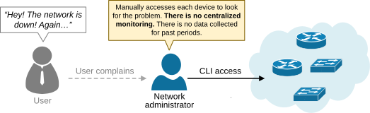

Figure 1. Networks in the 1980s.

However, networks became larger and more business-critical in the late 1980s. Network administrators faced significant challenges maintaining the network's health without centralized monitoring. It became obvious that admins alone cannot monitor the network 24/7 and detect problems. Imagine an interface goes down on a router somewhere, and you don't have a monitoring system. You will find that the interface is down, either if it causes an outage that users report or if you, by chance, log into that router and check the interface status. 

That's when the need for a centralized network monitoring system became apparent. Network teams needed a system that could collect network statistics, track device status, and notify admins of any ongoing issues, as shown in the diagram below. However, no standard protocol could collect data, manage, and monitor network devices at the time (1970s-1980s). 

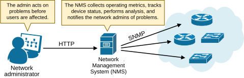

Figure 2. A network with a NMS.

Each manufacturer often used proprietary protocols to manage their devices, making interoperability between different vendors' equipment challenging. The Internet Engineering Task Force (IETF) recognized the need for a simple, standardized protocol that could manage and monitor a wide range of devices in a consistent way. The IETF's Internet Activities Board (IAB) initiated the development of SNMP in 1987. The goal was to create a *standard* protocol that can collect, store, and modify operational data from devices.

### Development of SNMP

SNMP version 1 was officially published in 1988 as [RFC 1067](https://datatracker.ietf.org/doc/html/rfc1067). Although initially intended as a temporary solution, its simplicity and effectiveness led to widespread adoption. After the success of SNMPv1, further iterations were developed:

- **SNMPv2 (1993)**: Introduced better performance and additional features but faced security and implementation complexity issues.
- **SNMPv3 (1998)**: Focused on security, adding authentication, encryption, and access control.

Despite being that old, the protocol remains a core tool for network monitoring today, thanks to its adaptability and ease of use across all kinds of devices — routers, switches, computers, printers, wireless access points, and so on.

What is SNMP?
-------------

SNMP is an application layer protocol that uses **a request-response** mechanism to monitor and manage devices, as shown in the diagram below.

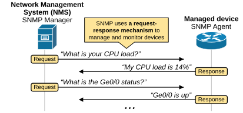

Figure 3. What is SNMP?

It defines the message format for communication between a *manager* and *agents*. The SNMP manager is an application that runs on a server and uses SNMP to collect information from managed devices. The manager is typically called a **Network Management Station (NMS)**. 

Each managed device in the network has an SNMP agent embedded inside the operating system. The agent contains information about the device's configuration, status, and counters.

### The idea behind SNMP

The idea behind SNMP is that all devices connected to the network, such as a computer, router, switch, firewall, printer, access point, etc., **share the same characteristics**. They all have CPU, RAM, DISC, OS, interfaces, buffers, hostname, IP addresses, temperature sensors, etc. Hence, if every device characteristic can be represented as a variable, an application can monitor and manage the device by reading and modifying these variables. So that's what the protocol does; **it represents each device's characteristic as an object** identified by an OID (Object Identifier), as shown in the diagram below.

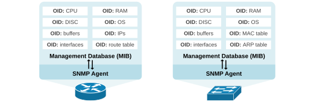

Figure 4. SNMP variables.

It then organizes the OIDs hierarchically into a structured database called the Management Information Base (MIB). Later, we will discuss OIDs and the MIB in more detail.

### The SNMP components

An SNMP-managed network includes three main components, as shown in the diagram below: an SNMP manager, SNMP agents, and a Management Information Base (MIB).

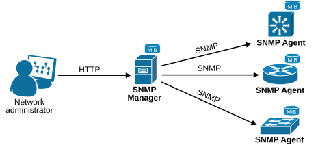

Figure 5. SNMP Components.

**The SNMP manager** acts as the interface between the network administrator and the management system. It is also referred to as a Network Management Station (NMS). It collects operational data from devices using SNMP query messages.

**The SNMP agent** is a software module installed in the managed device's operational system (OS). It maintains information in the device's MIB database and allows the SNMP manager to read and write the values stored there.

**The Management Information Base (MIB)** is the database of the device's variables (OIDs) that can be managed. Typically, an MIB is unique to a device. 

How does SNMP work?
-------------------

Now, to really understand how the protocol works, we must zoom in on the MIB database and OIDs in more detail.

### The MIB Hierarchy

Each SNMP agent (technically each managed device) has its own Management Information Base (MIB), which defines the variables that the agent can read and write. Each available variable on the device's MIB is called an Object and is identified by an Object Identifier (OID). 

The MIB structure is organized as a tree hierarchy, where each node is identified by a name or number, as shown in the diagram below.

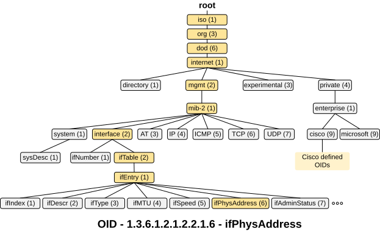

Figure 6. SNMP MIB.

The first few branches of the MIB tree, such as iso.org.dod.internet.mgmt, are always the same because they follow a standardized hierarchy defined by ISO. This structure ensures a consistent, globally recognized framework for organizing objects across different systems and vendors. Starting with iso (1), the tree branches into org (3), representing organizations, and then into dod (6) for the Department of Defense, which initially managed the internet standards (back in the 1980s-1990s). From there, internet (1) branches into areas like mgmt (2) for managed objects and private (4) for vendor-specific objects. This standardized organization allows for interoperability and uniformity across all MIB implementations.

Working directly with MIBs can be challenging due to the complexity of the variable names and numbers. The NMS tools, such as Cisco Prime, PRTG, Solarwinds, etc., simplify this process **by hiding the detailed MIB structures under the hood**. Network administrators typically don't need to know the MIB structure of the devices they manage. However, a general understanding of the MIB structure and how it works is good to have, especially if you are taking a CCNA/CCNP/CCIE exam.

Notice that the name notation is designed for humans. **Machines use number notation**. For example, if the manager wants to query the MAC address of an interface, it will use the following OID, as highlighted in yellow in the diagram above:

```
R1# snmp get v2c 10.1.1.3 public oid 1.3.6.1.2.1.2.2.1.6.1
SNMP Response: reqid 44, errstat 0, erridx 0
 ifPhysAddress.1 = AA BB CC 00 20 00
```

Notice that the last digit in the OID is the interface number. If the device has four interfaces, the second one's MAC can be found at OID 1.3.6.1.2.1.2.2.1.6.2, the third at 1.3.6.1.2.1.2.2.1.6.3, and the fourth at 1.3.6.1.2.1.2.2.1.6.4. If we want to check which interface is under index 1, we can use the following command:

```
R1# snmp get v2c 10.1.1.3 public oid 1.3.6.1.2.1.2.2.1.2.1
SNMP Response: reqid 48, errstat 0, erridx 0
 ifDescr.1 = Ethernet0/0
```

Hence, using SNMP, we understood that R2 (10.1.1.3)'s interface Ethernet0/0 has a MAC address aabb.cc00.2000. Indeed, we can verify this using the CLI, as shown below:

```
R2# show interface Eth0/0 | in address
  Hardware is AmdP2, address is aabb.cc00.2000 (bia aabb.cc00.2000)
  Internet address is 10.1.1.3/24
```

More practical examples in the configuration portion of the lesson. Now, let's examine the different messages that the protocol uses to read and write object information.

### SNMP messages

SNMP is a request-response protocol. The network management system (NMS) sends out a request, and the remote device returns a response. However, since the status of an object can change over time (for example, an interface can be up now but down in 5 minutes), the NMS queries the device every couple of minutes to retrieve updated information. This is referred to as the polling interval, as shown in the diagram below.

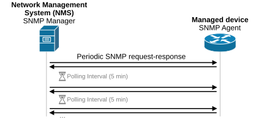

Figure 7. SNMP polling.

This request-response communication uses three message categories: Get, Set, and Trap. The messages contain a header and a PDU (protocol data unit). The headers consist of the community string used as an authentication (more later on). The PDU depends on the type of message being sent but typically consists of the requested information.

#### Get messages

The SNMP manager (called the NMS) uses SNMP Get messages to retrieve the value of a specific managed object identified by its OID (Object Identifier) from an SNMP agent. The following diagram provides a visual example of the process.

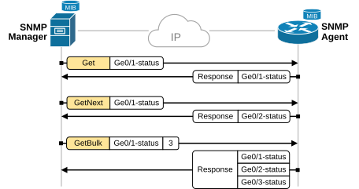

Figure 8. SNMP Get messages.

Let's break down the function of each available GET message and see when it is typically used. Notice that you don't need to know and remember the SNMP messages in detail. The Network Monitoring System (NMS) uses those messages to get data from devices; you don't typically have to do anything. However, you may encounter related SNMP questions in CCNA/CCNP/CCIE exams, so it is useful to know them at a high level. 

**SNMP Get:**

The GET message retrieves a specific OID value. The NMS specifies the exact OID, and the agent responds with the value associated with that OID. For example, if the NMS wants the status of interface Ge0/1, it uses the corresponding OID, and the agent's response contains the interface status.

**SNMP GetNext:**

The GetNext message retrieves the value of the next OID in the MIB database. The NMS provides a specific OID, and the agent returns the OID and value of the next object in the MIB tree. It is used to walk through a list or table of items when the NMS doesn't know the exact OID of the next object.

**SNMP GetBulk:**

The GetBulk message retrieves multiple OIDs in a single request, reducing the number of queries needed to gather large amounts of data. For example, the NMS uses it to fetch information about several network interfaces simultaneously, making it more efficient than multiple GetNext requests for large tables or lists.

In summary:

- **SNMP Get:** Retrieves a single, specific OID.
- **SNMP GetNext:** Retrieves the next OID in the MIB tree.
- **SNMP GetBulk:** Retrieves multiple objects in a single request for efficient bulk data collection.

#### Set messages

SNMP set messages are used by a network management system (NMS) to modify or configure values on a managed device, such as changing an interface's status or updating device settings. These messages contain the desired Object Identifier (OID) and the new value to apply to the device. The device processes the request and, if successful, updates the configuration or state accordingly, sending a response back to the NMS for confirmation.

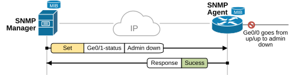

Figure 9. SNMP Set message.

Notice that SNMP set messages require authentication and RW access to ensure that only authorized users can modify a device's configuration. The authentication mechanism depends on the SNMP version in use:

- **SNMPv1 and SNMPv2**: Use a community string as a simple password for authentication. If the community string matches the device's configured string, the request is accepted.
- **SNMPv3**: Provides more robust security, including authentication with usernames and optional encryption, ensuring confidentiality and integrity of the messages.

More on SNMP communities in the configuration section of the lesson.

#### Trap messages

One of SNMP's limitations is its request-response nature. This implies that a device only reports its operation status when a query from the NMS is made. This is not efficient when there is an event on the device that needs the attention of the network administrators, such as an interface going down. That's why the protocol implements real-time notifications called SNMP Traps.

An SNMP trap is an unsolicited message sent by an SNMP agent (a device) to an SNMP manager (the NMS) to notify it of specific events or conditions on the managed device. Unlike the typical request-response flow, traps are one-way communications initiated by the agent, as shown in the diagram below.

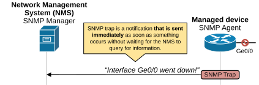

Figure 10. SNMP Trap.

SNMP Traps help identify issues like hardware failures or threshold breaches in real-time. For example, an interface goes down. The network devices immediately send an SNMP trap to the NMS. A network administrator immediately takes action to prevent problem escalation or outage.

Configuring SNMP on Cisco devices
---------------------------------

Now let's be a bit more practical and show how we configure basic SNMP functionalities on Cisco devices.

### Enabling SNMP on a Cisco router

Enabling SNMP on a Cisco router is as simple as adding one or two commands under global configuration mode as shown in the output below.

```
Router(config)# snmp-server community [community-string] [permissions]
```

We only need to specify the community and the permission level.

#### What is the SNMP community?

An SNMP community is **a password-like string used to control access to an SNMP-enabled device**. It acts as a basic form of authentication for SNMP operations and determines what level of access a user or network management system (NMS) has to the device. There are typically two types of community strings:

- **Read-Only (RO):** This community allows the SNMP manager to retrieve only data from the device, such as checking performance metrics or configurations, without being able to modify any settings.
- **Read-Write (RW):** This community allows the SNMP manager to retrieve data from the device and modify its configuration or settings.

Community strings act as simple authentication keys for SNMP operations. They are sent in clear text over the network, which is a security concern in environments requiring higher security. In more secure setups, SNMPv3 is often preferred since it supports encryption and stronger authentication mechanisms.

The following examples show how to configure read-only and read-write communities.

```
Router(config)# snmp-server community MyPublicCommunity ro
```

```
Router(config)# snmp-server community MyPrivateCommunity rw
```

These two commands are enough to enable the SNMP functionality on the device and add it to your NMS system that monitors and manages the network.

### Enable SNMP Traps (Optional)

In real-world deployments, we also want to enable the SNMP trap functionality that notifies the NMS immediately when an event occurs on the device. We enable it using the following command.

```
Router(config)# snmp-server host [nms-ip] version 2c [community-string]
Router(config)# snmp-server enable traps
```

Notice that the NMS-ip is the IP address of the management system, and the community string is the password.

### Testing the Configuration

In a typical practice lab, you most probably don't have a full-fledged NMS system to play around with and test the SNMP functionalities. However, most Cisco devices can act as SNMP agents as well as SNMP managers. To enable this functionality, we use the command highlighted in yellow below. 

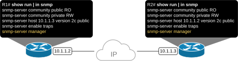

Figure 11. SNMP Testing Topology.

You can easily configure two routers with the configuration shown above and test querying different OIDs. For example, let's say we only have access to the router on the right (R1). From R1, we can use SNMP to check how many interfaces R2 has and see their IP address, MAC address, speed, duplex, MTU, etc. 

#### Configuration

**R2 (SNMP Agent):**
```
! Enable SNMPv2c with read-only community
snmp-server community public ro

! Enable traps to NMS
snmp-server host 10.1.1.1 version 2c public
snmp-server enable traps
```

**R1 (SNMP Manager / acting as NMS):**
```
! No SNMP agent configuration needed on R1
! R1 will be used to send SNMP queries to R2
```

#### Testing Queries

From R1, we can use the `snmp` command to query R2 (10.1.1.3).

```
! Get the hostname of R2
R1# snmp get v2c 10.1.1.3 public oid 1.3.6.1.2.1.1.5.0
SNMP Response: reqid 1, errstat 0, erridx 0
 sysName.0 = R2

! Get the uptime of R2
R1# snmp get v2c 10.1.1.3 public oid 1.3.6.1.2.1.1.3.0
SNMP Response: reqid 2, errstat 0, erridx 0
 sysUpTime.0 = 1209600

! Get the number of interfaces on R2
R1# snmp get v2c 10.1.1.3 public oid 1.3.6.1.2.1.2.1.0
SNMP Response: reqid 3, errstat 0, erridx 0
 ifNumber.0 = 3

! Walk through all interfaces to get their descriptions
R1# snmp walk v2c 10.1.1.3 public oid 1.3.6.1.2.1.2.2.1.2
SNMP Response: reqid 4, errstat 0, erridx 0
 ifDescr.1 = Ethernet0/0
 ifDescr.2 = Ethernet0/1
 ifDescr.3 = Ethernet0/2
```

### SNMPv3 Configuration

For more secure environments, SNMPv3 should be used instead of SNMPv2c. SNMPv3 adds authentication and encryption.

```
! Configure an SNMPv3 user with auth and priv
snmp-server group ADMIN v3 priv
snmp-server user admin ADMIN v3 auth sha MyAuthPassword priv aes 128 MyPrivPassword

! Enable traps with SNMPv3
snmp-server host 10.1.1.1 version 3 priv admin
snmp-server enable traps
```

### Summary

- **SNMP** is a standardized protocol for centralized network monitoring and management.
- **Three components**: SNMP Manager (NMS), SNMP Agent (device), and MIB (database of OIDs).
- **MIB tree**: A hierarchical structure where each device characteristic is represented by an OID (e.g., 1.3.6.1.2.1.2.2.1.6.1 = MAC address of interface 1).
- **Messages**:
  - **Get/GetNext/GetBulk**: Read OID values from the agent.
  - **Set**: Write/modify OID values on the agent (requires RW community).
  - **Trap**: Unsolicited notification from agent to manager about events.
- **Versions**:
  - SNMPv1/v2c: Use community strings (plaintext passwords) for authentication.
  - SNMPv3: Provides authentication (SHA/MD5) and encryption (AES/DES).
- **Configuration**: Simple commands — `snmp-server community`, `snmp-server host`, `snmp-server enable traps`.
- **Verification**: Use `snmp get`, `snmp walk` from another Cisco device to test queries.