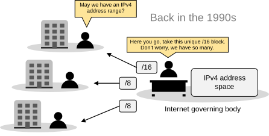
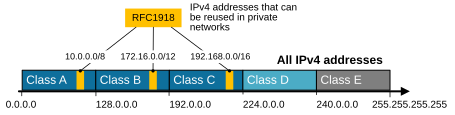
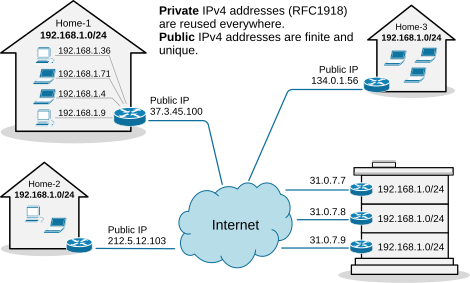
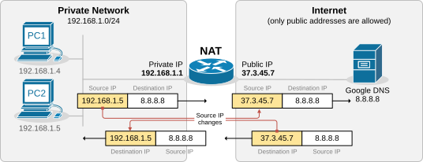
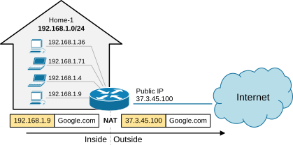

[Why do we need NAT?](https://www.networkacademy.io/ccna/network-services/why-do-we-need-nat#main-content)
===================

This lesson begins our journey into one of the most important topics in the CCNA blueprint: Network Address Translation (NAT). 

Before discussing how NAT works on Cisco routers, we must first explain why we need to use NAT in the first place. 

The problem with IPv4 addresses
-------------------------------

An IP address is used as an endpoint identifier in IP-based communications. It is just like a telephone number. When you want to call another person over your mobile, you dial his telephone number. **The call is established between phone numbers**. 

In the same way, when a device wants to communicate using IP communication, it sends the data to the remote end's IP address. **The communication is established between IP addresses.** Every mobile phone has a telephone number. In the same way, every device needs an IP address to send and receive data over an IP network.

Figure 1. IPv4 address space.

**IPv4 addresses are limited number**. A key point here is that, by standard, an IPv4 address is 32 bits long, meaning there are only 4,294,967,296 possible unique IP addresses (and they were officially exhausted in April 2017). That's it; new addresses could never be produced. The IPv4 address space is a finite resource. 

The original idea when the Internet protocol was first introduced was that every organization would ask for and be given an IP address range, and IP addresses would be unique and not reused. People thought we had so many IPv4 addresses (4 billion) that everybody would have a unique IP that nobody else uses anywhere on the planet.

Figure 2. Allocating IPv4 addresses back in the old days.

So, the Internet governing body was giving big, classful blocks of IP addresses (/8, /16, or /24) to every organization that asked for it. This model worked for a while. However, in the mid-1990s, it became extremely evident that the Internet was growing so fast that we would run out of addresses in a few years. 

Then, people realized we needed a new IP protocol that supported more addresses, so IPv6 was introduced. This protocol uses 128-bit addresses instead of 32-bit, allowing for 2^128^ addresses. However, most organizations had already invested a lot of money in the adoption of IPv4. They were unwilling to reinvest time and money to migrate to IPv6, so they were looking for another solution. 

The solution came through combining two network standards that worked together to save IPv4 address space: Private IPv4 addresses (RFC1918) and Network Address Translation (NAT).

The private IPv4 space (RFC1918)
--------------------------------

If we combine the following two statements:

-   Every device must have an IP address to communicate over the Internet.
-   IPv4 addresses are finite (4 billion overall, but significantly less usable).

It is evident that, at some point, there will not be enough IPv4 addresses for every device on the planet. To overcome this problem, people came up with a brilliant idea: 

-   Can't we reuse some portion of the IPv4 address space wherever required? 

And that's how the private IPv4 address space was born. A small portion of each class of usable IPv4 addresses was dedicated to addressing inside private networks (highlighted in yellow in the diagram below). These addresses were called private IP addresses and can be used anywhere by anyone without permission. They are not subject to IANA allocation.

Figure 3. RFC1918 private addresses.

IPv4 private addresses are not routable on the public Internet. These addresses are typically used within internal networks (e.g., home, office, or enterprise environments), and devices with private IP addresses can communicate within that network. However, they must pass through a device like a router performing Network Address Translation (NAT) to access the Internet.

Every home network in the diagram below uses the same private network 192.168.1.0/24. For example, every device inside Home-1 has a private IPv4 address. However, when a device communicates with a host on the Internet, its address is translated into a public address assigned to the Internet router (37.3.45.100). All devices in Home-1 share this public IPv4 address when talking to the Internet.

Figure 4. Reusing private IPv4 addresses.

The idea is that anyone can use these addresses or re-use them for as many hosts as they like on their internal network. NAT can then translate the multitude of hosts using Private addresses into a much smaller set of Public addresses -- thereby curbing the rate at which IPv4 addresses are being utilized.

What is NAT?
------------

Network Address Translation (NAT) is a network capability that allows a device (typically a router or a firewall) to modify the IP address information in the IP packet headers while in transit. For example, let's look at the diagram shown below. PC2 is configured with the private IPv4 address 192.168.1.5. This address is not routable on the Internet. However, PC2 can access the Internet because the router does Network Address Translation (NAT). When PC2's packets reach the router, the router changes the source IP address in the IP header from 192.168.1.5 to 37.3.45.7, as shown in the diagram. Hence, all devices on the Internet see PC2's traffic as coming from the public IP address 37.3.45.7. 

Figure 5. What is NAT?

NAT is most commonly used to enable multiple devices on a private network to access the internet using a single public IP address, which helps conserve the limited number of IPv4 addresses available. For example, all devices inside Home-1, as shown in the diagram below, use private IPv4 addresses from subnet 192.168.1.0/24. The router translates all internal IP addresses to the public IPv4 address assigned to the interface that connects to the Internet. Devices on the Internet see all traffic from Home-1 as coming from the public IP address 37.3.45.100.

Figure 6. Basic NAT operation.

You can see that NAT and private IPv4 addresses work together to conserve IPv4 address space by allowing many devices in a local network to share a single public IPv4 address. Without NAT and private IPv4 addresses, every device inside Home-1 would have required a unique public IP address. This would have depleted the available IPv4 addresses would long ago due to the rapid growth of devices connected to the internet.