[Static NAT](https://www.networkacademy.io/ccna/network-services/static-nat#main-content)
==========

A device, such as a router or firewall, can change the IP address information in the packets' headers while packets pass through. This network function is called Network Address Translation (NAT) and is shown in the diagram below. 

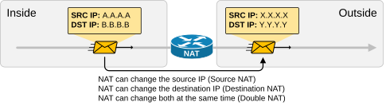

Figure 1. What is Network Address Translation?

We have a packet with source IP "A.A.A.A" and destination IP "B.B.B.B" that goes through address translation. After the packet passes through the router, it has source IP "X.X.X.X" and destination IP "Y.Y.Y.Y."

The following diagram shows an example of NAT with real IPv4 addresses. Notice something fundamental. Typically, organizations use NAT to translate private IPv4 addresses into public IPv4 addresses. However, from NAT's perspective, it doesn't matter whether the IPs are public or private. **NAT can translate any IPv4 address to any other IPv4 address**, whether private or public. In the example below, the NAT router translates the source IPv4 10.1.1.1 to 37.3.1.5 (private to public) and the destination IPv4 address 212.2.4.56 to 8.8.8.8 (public to public).

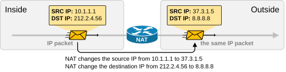

Figure 2. Network Address Translation Example.

NAT is so ubiquitous and well-accepted that organizations primarily use private IPv4 addresses inside the entire network. Then, they use a small number of public IPv4 addresses on the internet-facing devices and use NAT to translate between the two, as shown in the diagram below. 

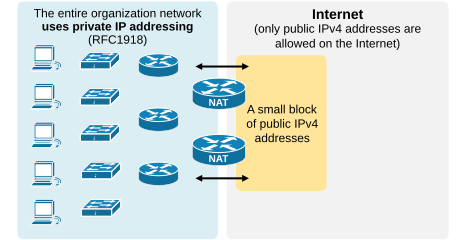

Figure 3. NAT in the enterprise.

NAT can change a packet's source, destination, or both source and destination IP addresses while it passes through a router or a firewall. In 99% of implementations, NAT changes only the packet's source address, which is typically private, with a public IPv4 address. This process is referred to as **source NAT** because only the source IP address is being changed (the destination IP address in the packet is left untouched). The CCNA curriculum includes only source NAT. It is the most widely adopted implementation of network translation. You probably have source NAT configured on your home WiFi router, at work, at the local cafe, and everywhere. That's why we won't cover other NAT implementations, such as destination NAT or double NAT, in the CCNA course. 

Static Source NAT
-----------------

Static NAT is the most straightforward type of network address translation. An IPv4 address on the inside i**s always mapped to the same IPv4 address on the outside** via a configuration command. For example, the IP address 10.1.1.1 is always replaced with 37.3.1.1 when a packet goes through the NAT router, as shown in the diagram below. 

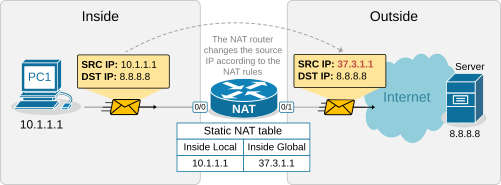

Figure 4. Static Network Address Translation.

This static NAT rule allows PC1 to access the Internet because Internet hosts see PC1's traffic as coming from public IP address 37.3.1.1. However, if a second PC must access the Internet, we need a second public IPv4 address and a second static NAT rule. 

For example, if we have three PCs, as shown in the diagram below, we need three public IPv4 addresses and three static NAT rules. However, notice that the public IPv4 subnet assigned on the outside interface of the router is /26, which means we can only have 64 addresses. If we have 100 hosts on the inside, we cannot configure a static one-to-one mapping for all of them because we only have 64 public IPv4 addresses on the router's outside interface.

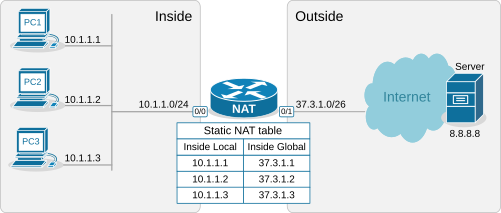

Figure 5. Inefficiencies of static translation.

This example outlines the following essential aspects of Static NAT.

-   It is a static mapping between an **Inside Local** and **Inside Global** address, as shown in the diagram above (more on these terms later on).
-   It does not conserve IPv4 addresses.
-   It does not scale.

You may be wondering why this network translation technique even exists if it doesn't conserve IP addresses. The truth is that static NAT is typically not an organization's primary network translation technique. For most hosts with private IPv4 addresses, the organization most likely uses Dynamic NAT with Overload (more on it in the following lessons). **Static NAT is typically used only for some particular IP addresses assigned to special hosts**. Here are some reasons why:

-   It is a predictable, consistent one-to-one mapping.
-   It allows hosts on the outside to initiate connections to the inside. This one is key.

With static NAT, a specific internal private IP is always mapped to a specific public IP, making the translation predictable. This is useful for services that need to be consistently reachable from the outside, such as Web servers, Mail servers, and VPN gateways. For example, we have a web server inside the organization that has a private IPv4 address, 10.1.1.3, as shown in the diagram below. 

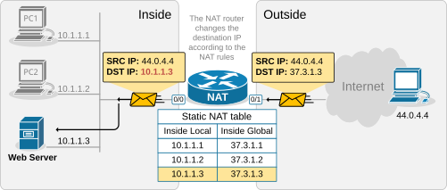

Figure 6. Benefits of static address translation.

The NAT router has a static one-to-one mapping between 10.1.1.3 and 37.3.1.3. This allows hosts on the outside to send traffic to 37.3.1.3, and the static NAT rule ensures that incoming traffic is always forwarded to the internal web server 10.1.1.3, as shown in the diagram above.

Configuring Static NAT
----------------------

Let's now see how to configure a router to perform static source network address translation. We will use a very basic topology, which you can download from the section at the end of the lesson and practice yourself.

The configuration process can be broken down into two main steps that are independent of one another:

-   **Step 1**. Defining Inside and Outside from the point of view of the local router.
-   **Step 2**. Configuring the NAT rules.

### Step 1. Defining Inside and Outside

The first step in configuring network address translation is the same for every type of NAT - **the router must identify which interfaces connect to the Inside which to the Outside**.

A router cannot independently determine which interfaces connect to the organization's network and which connect to an external network such as the Internet. For the router, every interface is the same---a layer 3 port with an IP address. 

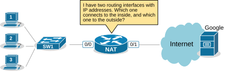

Figure 7. Defining Inside and Outside.

That's why we must explicitly define the NAT zones on the router as follows: 

-   We must explicitly tell the router which interfaces connect to the **Inside**. The inside is typically our organization, an enterprise, a small office, or a home. This is our network, where we use private IPv4 addresses.
-   We must explicitly tell the router which interfaces connect to the **Outside**. The outside is typically the Internet, but it can also be another external network. This is the network where typically only public IPv4 addresses are allowed.

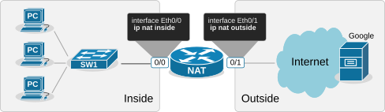

Figure 8. Configuring Inside and Outside.

For example, we explicitly tell the router shown in the diagram above that its interface Ethernet0/0 connects to the Inside and Eth0/1 connects to the Outside by applying the configuration shown in the output below.

```
interface range Ethernet0/0
 ip address 10.1.1.254 255.255.255.0
 ip nat inside
!
interface Ethernet0/1
 ip address 37.3.1.254 255.255.255.0
 ip nat outside
!
```

Notice that a router may have multiple interfaces connecting to the Inside and multiple interfaces connecting to the Outside. 

### Step 2. Configuring NAT rules.

The second step in the configuration process is to define the network address translation rules. The following diagram shows the rules we need to configure.

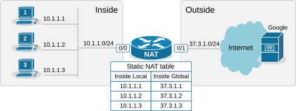

Figure 9. Configuring static NAT rules.

We apply one configuration command in global configuration mode for every one-to-one mapping, as shown in the output below.

```
ip nat inside source static 10.1.1.1 37.3.1.1
ip nat inside source static 10.1.1.2 37.3.1.2
ip nat inside source static 10.1.1.3 37.3.1.3
```

Let's decode the IP nat command that we use.

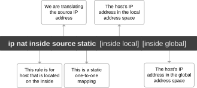

Figure 10. Decoding the configuration command.

We have configured static network address translation for each local host in the topology. Now, let's verify that the hosts can reach the Google server.

Verifying the network address translation
-----------------------------------------

We use the following command to verify that the network address translation is working. Notice the terms "Inside local," "Inside global," "Outside local," and "Outside global."

```
NAT# sh ip nat translations

Pro Inside global      Inside local       Outside local      Outside global
icmp 37.3.1.1:3        10.1.1.1:3         8.8.8.8:3          8.8.8.8:3
--- 37.3.1.1           10.1.1.1           ---                ---
```

 It is essential to understand what each of those terms means, so let's zoom in.

### Decoding the NAT table

One of the most important goals of this lesson is to ensure you understand the four main NAT table terms:

-   Inside Local
-   Inside Global
-   Outside Local
-   Outside Global

Let's use the diagram below to introduce the key terms. Notice that we have a static one-to-one mapping that allows the host 10.1.1.1 on the inside to reach the host 8.8.8.8 on the Internet.

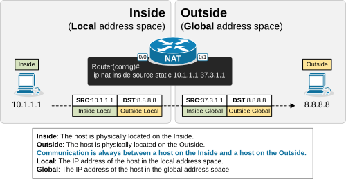

Figure 11. Decoding the NAT terms.

First, remember that from the perspective of the NAT router, every communication is between a host on the Inside and a host on the Outside. (Having in mind that Inside and Outside are already defined using the **ip nat inside/outside** command). One host is referenced as Inside and the other as Outside, as shown in the diagram below.

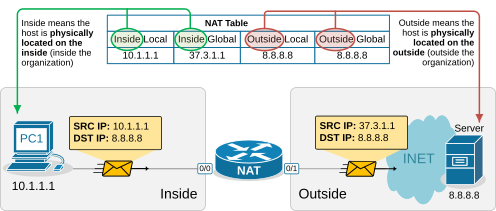

Figure 12. Inside vs Outside.

-   In that context, the term "Inside Local" refers to the host's IP address in the local address space. Typically, this is a private IPv4 address of a host inside the organization. For example, PC1 is seen with IP address 10.1.1.1 inside the local network.
-   The term "Inside Global" refers to the host's IP address in the global address space. Typically, this is the public IPv4 address representing the host outside the organization. For example, PC1 is seen with IP address 37.3.1.1 on the Internet. 

The following diagram visualizes the difference between the Local and Global terms.

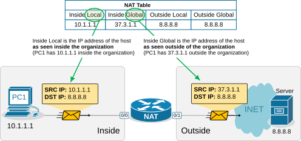

Figure 13. Local vs Global.

Static address translation can be configured in the opposite direction for the host on the outside. The Outside host with Outside Global address 8.8.8.8 can be represented with an Outside Local address 10.1.1.8 on the inside, depending on the network requirements.

Now let's define the remaining two terms to complete the picture:

-   The term **"Outside Global"** refers to the real IP address of the outside host from the perspective of the outside network. In our example, the Google DNS server at 8.8.8.8 is reachable via that exact address on the Internet. This is the actual IP address assigned to the outside device.

-   The term **"Outside Local"** refers to how the outside host appears from the inside network. In a basic Static NAT configuration, the Outside Local and Outside Global addresses are typically the same because we only translate the inside addresses. However, as mentioned earlier, you could configure a static mapping in the opposite direction so that the outside host 8.8.8.8 appears as 10.1.1.8 to devices on the inside.

The following table summarizes the four NAT terms:

| Term | Definition | Example |
|------|-----------|---------|
| Inside Local | The inside host's IP address as seen from the inside network | 10.1.1.1 |
| Inside Global | The inside host's IP address as seen from the outside network | 37.3.1.1 |
| Outside Local | The outside host's IP address as seen from the inside network | 8.8.8.8 |
| Outside Global | The outside host's IP address as seen from the outside network | 8.8.8.8 |

Understanding these four terms is critical for reading the NAT translation table and for troubleshooting NAT issues on a Cisco router.

### How Static NAT Works — End-to-End Packet Flow

Let's trace a packet from PC1 (10.1.1.1) to the Google DNS server (8.8.8.8) to see how Static NAT translates the packets in both directions.

#### Outbound Traffic (Inside to Outside)

1. **PC1** sends a packet with source IP **10.1.1.1** and destination IP **8.8.8.8** to its default gateway (the NAT router).
2. The **NAT router** receives the packet on its inside interface (Ethernet0/0). Because `ip nat inside` is configured on this interface, the router checks its NAT table for a matching entry.
3. The router finds the static mapping `ip nat inside source static 10.1.1.1 37.3.1.1`. It translates the source IP address from **10.1.1.1** to **37.3.1.1**.
4. The router forwards the packet out its outside interface (Ethernet0/1) with source IP **37.3.1.1** and destination IP **8.8.8.8**.
5. The **Google DNS server** receives the packet and sees the source IP as **37.3.1.1**. It sends its reply back to **37.3.1.1**.

#### Inbound Traffic (Outside to Inside)

1. The **Google DNS server** sends a reply packet with source IP **8.8.8.8** and destination IP **37.3.1.1**.
2. The **NAT router** receives the packet on its outside interface (Ethernet0/1). Because `ip nat outside` is configured on this interface, the router checks its NAT table.
3. The router finds the static mapping and translates the destination IP address from **37.3.1.1** back to **10.1.1.1**.
4. The router forwards the packet out its inside interface (Ethernet0/0) with source IP **8.8.8.8** and destination IP **10.1.1.1**.
5. **PC1** receives the reply and sees the packet as coming from **8.8.8.8**.

This symmetric translation — source IP translated on the way out, destination IP translated on the way back — is what makes Static NAT work seamlessly for bidirectional communication.

### Summary

Static NAT is a simple, predictable one-to-one mapping between a private inside IP address and a public outside IP address. Here are the key takeaways:

-   **One-to-one mapping**: Each inside local address is statically mapped to a specific inside global address.
-   **No address conservation**: Static NAT uses one public IP address for each internal host. It does not conserve IPv4 address space.
-   **Used for servers**: Static NAT is typically used for devices that need to be reachable from the outside, such as web servers, mail servers, and VPN gateways.
-   **Bidirectional**: Static NAT allows hosts on the outside to initiate connections to the inside because the mapping is always present in the NAT table (it does not need to be dynamically created).
-   **Does not scale**: For large networks with many hosts, Dynamic NAT or NAT Overload (PAT) is used instead.

In the next lesson, we will look at **Dynamic NAT**, which overcomes the scalability limitations of Static NAT by dynamically assigning public IP addresses from a pool as needed.