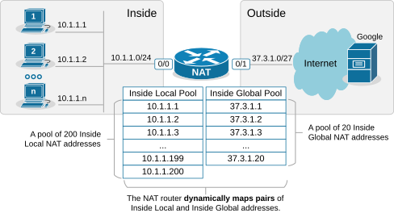
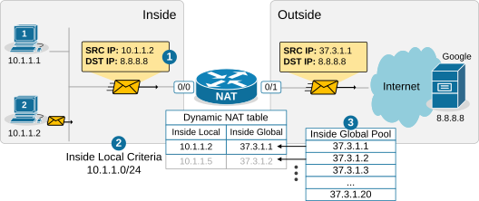

[Dynamic NAT](https://www.networkacademy.io/ccna/network-services/dynamic-nat)
==========

This lesson continues our discussion on Network Address Translation by examining Dynamic NAT. At the end of the lesson, you can download the EVE-NG virtual machine and practice the configurations on your own.

What is Dynamic NAT?
--------------------

Dynamic NAT is basically a static one-to-one mapping between an inside local and inside global **that happens automatically**. We have seen in the previous lesson that with Static NAT, a network administrator manually configures every one-to-one mapping on the router. For example, to map the inside local address 10.1.1.1 to inside global 37.3.1.1, a network admin must configure the following configuration line on the router:

```
Router(config)# ip nat inside source static 10.1.1.1 37.3.1.1
```

Suppose there are many inside local and inside global addresses. In that case, the network admin must configure many configuration lines on the router and statically pair each inside local and global addresses.

Dynamic NAT is a method of dynamically mapping inside local addresses (typically private ones) to inside global IP addresses (typically public ones) from a predefined pool of global IPs. Unlike Static NAT, where there's a fixed one-to-one mapping between local and global addresses, Dynamic NAT maps local to global addresses on a first-come, first-served basis. 



Figure 1. Dynamic NAT pools.

Let's see how Dynamic NAT works in a few steps, as visualized in the diagram below:

- **Step 1.** A host on the inside, PC2 (10.1.1.2), sends traffic destined for the Internet (8.8.8.8).
- **Step 2.** The router receives the packet on its NAT-Inside interface, meaning it must translate the source address according to the configured NAT rules. The source IP matches the Inside Local criteria (it is part of subnet 10.1.1.0/24).
- **Step 3.** Since the router is configured to translate the source address from 10.1.1.0/24 to the configured NAT pool, the router maps the host's private IP address (Inside Local) to the first available public IP address from the NAT pool (Inside Global). The router creates a one-to-one mapping between PC2's private address (10.1.1.2) and **the first available public IP address from the NAT pool** (37.3.1.1), as shown in the diagram below. 



Figure 2. Dynamic NAT process.

When step 3 is complete, the router adds a dynamic entry in its NAT table for the pair (10.1.1.2, 37.3.1.1) and keeps the entry until traffic flows between PC2 and the host on the Internet. As long as the entry exists in the table, only host 10.1.1.2 can use the public address 37.3.1.1. The default timeout for the dynamic entry is 24 hours. If no traffic is seen in 24 hours, the entry is deleted from the table, and the public IP address is returned to the NAT pool.

Suppose another host, PC5 (10.1.1.5), sends packets destined for the Internet at the same time. The NAT router performs the same steps and dynamically maps PC5's private address, 10.1.1.5, to the next available public address from the pool — 37.3.1.2, as shown in the diagram above. The router keeps mapping Inside Local addresses to the next available Inside Global address until all addresses in the NAT pool are allocated. Then, if a packet arrives and there are no available public IPv4 addresses in the pool, the router discards the incoming packet. The size of the pool defines the maximum number of inside hosts that can access the Internet at the same time.

Notice the following key aspects of Dynamic NAT:

- **Many-to-Many Mapping**: Private IP addresses are mapped to public IPs dynamically from a pool, meaning there is no fixed assignment.
- **Temporary Mapping (24 hours by default)**: The public IP is assigned to a private IP only when traffic is sent out and released when the session ends.

Now let's move on to the configuration portion of the lesson.

Configuring Dynamic NAT
-----------------------

For this example, we are going to use the topology shown in the diagram below. There are three hosts inside the organization, which must be able to access the Google server and the Internet. The organization has purchased the following public IPv4 address from the ISP: 37.3.1.1 — 37.3.1.20.


Figure 3. Configuration topology.

Configuring any network address translation starts with identifying the Inside and Outside interfaces of the router. In this example, we configure the Eth0/0 interface as Inside and the Eth0/1 interface as outside, as shown in the output below.

```
interface Ethernet0/0
 ip address 10.1.1.254 255.255.255.0
 ip nat inside
!
interface Ethernet0/1
 ip address 37.3.1.30 255.255.255.224
 ip nat outside
!
```

The next step is configuring an access list defining the Inside Local criteria. Basically, when a packet enters the router on the NAT-inside interface, the router will check whether the source IP address is from the configured subnet. In our example, we will translate the source addresses from subnet 10.1.1.0/24 so the ACL looks like this:

```
ip access-list standard INSIDE_LOCAL
 10 permit 10.1.1.0 0.0.0.255
!
```

Then, we need to define the pool of Inside Global addresses. In our case, we are given the range of addresses 37.3.1.1-37.3.1.20, so we configure the pool as follows:

```
ip nat pool INSIDE_GLOBAL 37.3.1.1 37.3.1.20 prefix-length 27
```

Lastly, we configure the NAT rule. Notice that the command references the access list and the pool that we have just configured.

```
ip nat inside source list INSIDE_LOCAL pool INSIDE_GLOBAL
```

The command basically tells the router — "*When a packet arrives on your inside interface, and the packet's source address matches the Inside Local criteria (10.1.1.0/24), map it to the next available public IPv4 address from the Inside Global pool.*"

Verifying Dynamic NAT
---------------------

Immediately after the router has been configured, its NAT table is empty. We must first initiate some traffic from Inside to Outside in order to trigger the dynamic translation. Let's ping from the hosts to the Google server.

```
PC1> ping 8.8.8.8
Type escape sequence to abort.
Sending 5, 100-byte ICMP Echos to 8.8.8.8, timeout is 2 seconds:
.!!!!
Success rate is 80 percent (4/5), round-trip min/avg/max = 1/2/6 ms
```

```
PC2> ping 8.8.8.8
Type escape sequence to abort.
Sending 5, 100-byte ICMP Echos to 8.8.8.8, timeout is 2 seconds:
.!!!!
Success rate is 80 percent (4/5), round-trip min/avg/max = 1/4/7 ms
```

```
PC3> ping 8.8.8.8
Type escape sequence to abort.
Sending 5, 100-byte ICMP Echos to 8.8.8.8, timeout is 2 seconds:
.!!!!
Success rate is 80 percent (4/5), round-trip min/avg/max = 1/3/8 ms
```

Now if we check the network translation table using the following command, we can see the dynamic one-to-one mappings.

```
NAT# sh ip nat translations

Pro Inside global      Inside local       Outside local      Outside global
icmp 37.3.1.1:14       10.1.1.1:14        8.8.8.8:14         8.8.8.8:14
--- 37.3.1.1           10.1.1.1           ---                ---
icmp 37.3.1.3:2        10.1.1.2:2         8.8.8.8:2          8.8.8.8:2
--- 37.3.1.3           10.1.1.2           ---                ---
icmp 37.3.1.2:1        10.1.1.3:1         8.8.8.8:1          8.8.8.8:1
--- 37.3.1.2           10.1.1.3           ---                ---
```

The following command is useful to check which router interfaces are configured as Inside and Outside. Also, you can see the pool of public addresses and what percentage of the addresses have been allocated.

```
NAT# sh ip nat statistics
Total active translations: 5 (0 static, 5 dynamic; 3 extended)
Outside interfaces:
  Ethernet0/1
Inside interfaces:
  Ethernet0/0
Hits: 32  Misses: 0
CEF Translated packets: 25, CEF Punted packets: 7
 Reserved port setting disabled provisioned no
Expired translations: 4
Dynamic mappings:
-- Inside Source
[Id: 1] access-list INSIDE_LOCAL pool INSIDE_GLOBAL refcount 5
 pool INSIDE_GLOBAL: id 1, netmask 255.255.255.224
        start 37.3.1.1 end 37.3.1.20
        type generic, total addresses 20, allocated 2 (10%), misses 0
nat-limit statistics:
 max entry: max allowed 0, used 0, missed 0
```

Notice the Hits and Misses counters. The Hits counter shows how many packets arrived on the router's inside interface and required address translation. Those packets were able to be translated. However, the Misses counter is more important. It shows how many packets arrived, and the router could not translate them to an Inside Global address because there were no available IPv4 addresses in the Inside Global pool. The counter is zero in our example because we have only three internal hosts but 20 available Inside Global addresses. However, you must keep track of this counter in a real-world implementation.

### How Dynamic NAT Works — End-to-End Packet Flow

Let's trace a packet from PC1 (10.1.1.1) to the Google DNS server (8.8.8.8) to see how Dynamic NAT handles the translation. Unlike Static NAT, the NAT table starts empty — the dynamic entry is created only when traffic triggers a match.

#### Outbound Traffic (Inside to Outside)

1. **PC1** sends a packet with source IP **10.1.1.1** and destination IP **8.8.8.8** to its default gateway (the NAT router).
2. The **NAT router** receives the packet on its inside interface (Ethernet0/0). Because `ip nat inside` is configured, the router checks whether the source IP matches the ACL `INSIDE_LOCAL`.
3. The source IP **10.1.1.1** matches the ACL. The router then checks the NAT pool `INSIDE_GLOBAL` for an available public IP address.
4. The router picks the first available address from the pool (e.g., **37.3.1.1**) and creates a dynamic entry in the NAT table: (10.1.1.1 → 37.3.1.1). A 24-hour inactivity timer starts.
5. The router translates the source IP to **37.3.1.1** and forwards the packet out its outside interface toward **8.8.8.8**.
6. The **Google DNS server** receives the packet and sends its reply back to **37.3.1.1**.

#### Inbound Traffic (Outside to Inside)

1. The **Google DNS server** sends a reply with source IP **8.8.8.8** and destination IP **37.3.1.1**.
2. The **NAT router** receives the packet on its outside interface and looks up the destination **37.3.1.1** in its NAT table.
3. The router finds the dynamic mapping and translates the destination IP back to **10.1.1.1**.
4. The router forwards the packet to **PC1** on the inside network.

#### What Happens When the Pool Runs Out?

If a fifth host (say, PC5 at 10.1.1.5) tries to send traffic when all 20 pool addresses are already allocated, the router discards the packet and increments the **Misses** counter in `show ip nat statistics`. The host will not be able to reach the Internet until an existing mapping times out (after 24 hours of inactivity) and a public IP is returned to the pool. You can also use the `clear ip nat translation *` command to manually free all dynamic entries in a lab or troubleshooting scenario.

### Dynamic NAT vs. Static NAT

| Feature | Static NAT | Dynamic NAT |
|---------|-----------|-------------|
| Mapping | Fixed one-to-one | Dynamic from a pool |
| Configuration | Manual per-host | ACL + pool definition |
| Address conservation | No (one public per private) | Better (shared pool, but still one-to-one when active) |
| Inbound access | Yes (outside can initiate) | No (outside cannot initiate) |
| Scalability | Poor | Moderate |
| Use case | Servers needing fixed public IP | General user Internet access |

### Summary

Dynamic NAT is a more scalable alternative to Static NAT for general user traffic. Here are the key takeaways:

- **Automatic mapping** — Inside local addresses are mapped to inside global addresses from a pool on a first-come, first-served basis.
- **Pool-based** — The size of the NAT pool determines how many inside hosts can access the outside simultaneously.
- **One-to-one while active** — Even though the mapping is dynamic, each active translation still consumes one public IP address.
- **24-hour timeout** — Dynamic entries expire after 24 hours of inactivity, returning the public IP to the pool.
- **Outbound only** — Dynamic NAT does not allow outside hosts to initiate connections to the inside, unlike Static NAT.
- **Monitor Misses** — A non-zero Misses counter in `show ip nat statistics` means hosts are being dropped because the pool is exhausted.

In the next lesson, we will look at **NAT Overload (PAT)**, which solves the public IP exhaustion problem by allowing many inside hosts to share a single public IP address using port multiplexing.