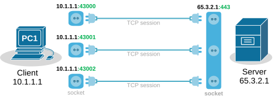
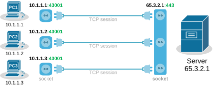
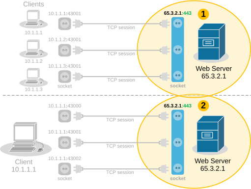
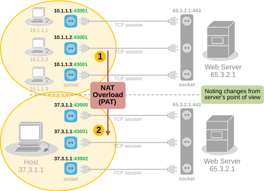
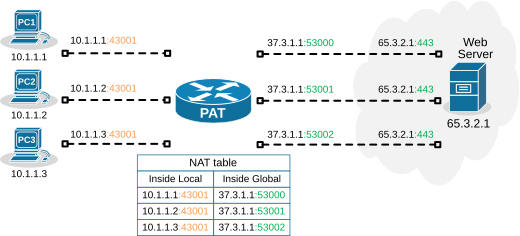
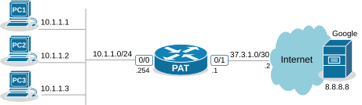
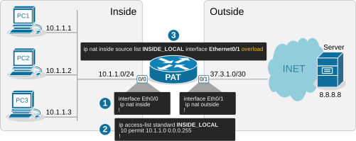

[NAT Overload (PAT)](https://www.networkacademy.io/ccna/network-services/nat-overload-pat)
==========

Port Address Translation (PAT), also known as NAT overload, is a type of Network Address Translation (NAT) that allows multiple devices on a local network (with private IP addresses) to share a single public IP address to access external networks, such as the internet.

However, to really understand how PAT works, you must know how TCP/UDP connections are established in the context of IP addresses and ports. Let's quickly refresh our knowledge of sockets and TCP sessions.

What is a socket, and what is a TCP session?
--------------------------------------------

In networking, a socket is an endpoint for sending and receiving data between devices over a network. It provides a mechanism for communication between two hosts, typically a client and a server, enabling applications to exchange data over protocols like TCP or UDP.

A socket is a pairing between an IP address and a port, as shown below: 

```
IP_Address:Port_Number
```

When two applications communicate, they each create a socket. A connection between them is established by pairing the client socket with the server socket, forming a TCP or UDP session.

A TCP session is always between two sockets. For example, on Windows, you can see the established sessions between the host and remote hosts using the **netstat** command, as shown in the output below.

```
C:\> netstat -a -n | find /I "ESTABLISHED"
  TCP    10.1.1.1:43000      65.3.2.1:443      ESTABLISHED
  TCP    10.1.1.1:43001      65.3.2.1:443      ESTABLISHED
  TCP    10.1.1.1:43002      65.3.2.1:443      ESTABLISHED
```

**Notice that a pair of one local and one remote socket uniquely describes a TCP/UDP connection**. For example, one unique TCP session is (10.1.1.1:43000-65.3.2.1:443). If host 10.1.1.1 wants to establish a new TCP connection to the same server, it must use another TCP port like this: (10.1.1.1:43001-65.3.2.1:443). The logic is visualized in the diagram below. Notice that PC has established three TCP sessions with the same server. Pay attention to the IP addresses and ports (sockets).



Figure 1. TCP sessions between a host and a server.

Notice another important aspect. In client-server communications, the server socket is always the same. The server's web hosting service always listens on the same socket (IP:Port), typically on port 80(http) or 443(https). Therefore, the client-side socket distinguishes the different TCP connections to the server.

Every TCP session is between a pair of sockets. The combination of local and remote sockets is unique because **the host uses a different TCP port for each connection**. Let's see a slightly different example - three different hosts establishing a single connection to the same server.



Figure 2. TCP sessions between three hosts and a server.

Notice that each host uses the same TCP port. So, how does the server differentiate between the three sessions? Each host's IP address is different, which makes the three TCP sessions unique from the server's point of view. 

Now, let's compare the two scenarios from the webserver's perspective. Do you see any difference in the context of sockets and TCP sessions?



Figure 3. Comparing examples 1 and 2.

No, from the server's point of view, there is no difference. In client-server communications, the clients choose a random port and initiate the connection. The server always listens for connection on the same socket. The server does not differentiate between three TCP sessions to one host and three TCP sessions to three different hosts. For the server, these are just three TCP sessions.

What is Port Address Translation (PAT)?
---------------------------------------

People soon realized they can use this to their advantage and translate multiple clients' private IP addresses to one public IPv4 address **by changing the entire socket (IP:port)**, not only the IP address. For example, we can change the sockets (IP:port) of the three hosts with different sockets with the same public IPv4 address but different ports. This wouldn't change anything on the server side.  



Figure 4. Port Address Translation from server's point of view.

PAT uses exactly this logic to translate many private IPv4 addresses on the inside with one public IPv4 address on the outside. It takes advantage of the fact that **99% of internet communications are client-server and that the server socket is permanent.** In client-server communications, the client initiates the connection and chooses a random port number. The server's port number is well-known and permanent.

How does PAT work?
------------------

Port Address Translation (PAT), also known as NAT Overload, translates many client private addresses to one public IP address, making many TCP sessions from different clients look like many TCP sessions from one client. This does not affect the server side. **However, it only works for clients in client-server communications**.

For example, the three TCP sessions from PC1, PC2, and PC3 look like three TCP sessions coming from the same host, 37.3.1.1, at the server end, as shown in the diagram below. 



Figure 5. How does PAT work?

Of all Network Address Translation types, PAT is by far the most popular and widely adopted one. Every home WiFi router and every small, medium, and large enterprise uses PAT. It can translate up to 65000 private IPv4 addresses to a single public IPv4 address. It reduces the need for multiple public IP addresses, which can be costly for organizations with many devices.

On the other hand, PAT has some disadvantages as well. It only works for clients in client-server communication (which accounts for 99% of the Internet traffic). It complicates the inbound traffic from outside to inside. For example, generally, with PAT, you cannot have a server on the inside that must be reachable by clients on the outside. In such scenarios, organizations use static one-to-one NAT for the server address, which allows clients on the outside to initiate a connection to the server inside.

Configuring PAT (NAT Overload)
------------------------------

Next, let's move on to the configuration example. We will use the topology shown in the diagram below. There are three clients that must be able to access the Internet. However, the organization has only one public IPv4 address assigned to the router's Eth0/1 interface. 



Figure 6. Configuration topology.

The only way to allow all hosts on the inside to communicate with the outside using one public IP is by using PAT (also called NAT Overload).

The configuration process can be broken down into three steps, as shown in the diagram below. 



Figure 7. Configuration steps.

### Step 1. Define Inside and Outside

The first step is always the same for every network translation type. We must tell the router which interfaces connect to the inside and which to the outside. 

```
interface Ethernet0/0
 ip address 10.1.1.254 255.255.255.0
 ip nat inside
!
interface Ethernet0/1
 ip address 37.3.1.1 255.255.255.252
 ip nat outside
!
```

We configure interface Eth0/0 as Inside and Eth0/1 as Outside.

### Step 2. Define Inside Local criteria

Next, we must configure the Inside Local criteria. Basically, this tells the router which IPv4 addresses it must translate and which not. In our example, we have only one internal subnet and we configure it into an access list named INSIDE_LOCAL.

```
ip access-list standard INSIDE_LOCAL
 10 permit 10.1.1.0 0.0.0.255
!
```

However, in real-world examples, an organization may have many inside networks, some of which must be able to pass through the router untranslated and others translated. That's why this step exists in the process: network admins want to have complete control over which networks the router translates.

### Step 3. Configure NAT rules

Lastly, we configure the PAT rule. You can see that the command has several parameters and is a bit long.

```
ip nat inside source list INSIDE_LOCAL interface Ethernet0/1 overload
!
```

Let's break down and explain each parameter in the command:

- **ip nat inside** — The translation is for hosts physically located on the inside. Clients' traffic will be coming to the router's internal interface.
- **source** — The translation affects the source IP addresses of packets.
- **list INSIDE_LOCAL** — An access list that contains the range of IP addresses on the inside that will be matched and translated according to the PAT rule.
- **interface Ethernet0/1** — Specifies the interface connected to the Outside, whose IP address will be used as the public IP address for NAT translation.
- **overload** — This enables Port Address Translation (PAT), also known as NAT overload. When enabled, it allows multiple clients on the inside network to use a single public IPv4 address by differentiating traffic using unique port numbers for each connection.

Verifying PAT (NAT Overload)
----------------------------

Now, if we initiate some traffic from the clients to the server on the outside, we can see the active translations on the PAT router. Notice the ports used by the clients (in green) and the ports after the translation (in blue). The router has changed the entire socket (IP:port).

```
NAT# sh ip nat translations
Pro Inside global      Inside local       Outside local      Outside global
tcp 37.3.1.1:4096      10.1.1.1:40591     8.8.8.8:23         8.8.8.8:23
tcp 37.3.1.1:4097      10.1.1.2:49399     8.8.8.8:23         8.8.8.8:23
tcp 37.3.1.1:4098      10.1.1.3:61278     8.8.8.8:23         8.8.8.8:23
```

We can also gather some useful information using the command below.

```
NAT# sh ip nat statistics 
Total active translations: 3 (0 static, 3 dynamic; 3 extended)
Outside interfaces:
  Ethernet0/1
Inside interfaces: 
  Ethernet0/0
Hits: 140  Misses: 0
CEF Translated packets: 140, CEF Punted packets: 0
 Reserved port setting disabled provisioned no
Expired translations: 3
Dynamic mappings:
-- Inside Source
[Id: 1] access-list INSIDE_LOCAL interface Ethernet0/1 refcount 3
nat-limit statistics:
 max entry: max allowed 0, used 0, missed 0
```

Pay attention to the Hits and Misses counters. They indicate how many packets were translated and how many packets weren't translated because no sockets were available (public IP:available port). This can happen if there are hundreds of clients and only one public IPv4 address on the outside. Recall that there are only 2^16 port numbers (65536).

### How PAT Works — End-to-End Packet Flow

Let's trace packets from three PCs to the Google server to see how PAT differentiates between them using port numbers.

#### Outbound Traffic (Inside to Outside)

1. **PC1** sends a packet with source **10.1.1.1:40591** to **8.8.8.8:23**.
2. **PC2** sends a packet with source **10.1.1.2:49399** to **8.8.8.8:23**.
3. **PC3** sends a packet with source **10.1.1.3:61278** to **8.8.8.8:23**.
4. The **NAT router** receives each packet on its inside interface. The source IP matches the ACL `INSIDE_LOCAL`.
5. For each packet, the router translates the **entire socket**:
   - 10.1.1.1:40591 → 37.3.1.1:**4096**
   - 10.1.1.2:49399 → 37.3.1.1:**4097**
   - 10.1.1.3:61278 → 37.3.1.1:**4098**
6. The router creates NAT table entries mapping each translated socket and forwards the packets out the outside interface.
7. The **server** sees three TCP sessions all coming from the same host **37.3.1.1** but with different source ports. It treats them as independent sessions and sends replies back to each respective socket.

#### Inbound Traffic (Outside to Inside)

1. The **server** sends replies with destination:
   - 37.3.1.1:4096
   - 37.3.1.1:4097
   - 37.3.1.1:4098
2. The **NAT router** receives each reply on its outside interface and looks up the destination socket in its NAT table.
3. The router finds the corresponding mapping and translates the destination socket back to the original private socket:
   - 37.3.1.1:4096 → 10.1.1.1:40591
   - 37.3.1.1:4097 → 10.1.1.2:49399
   - 37.3.1.1:4098 → 10.1.1.3:61278
4. The router forwards each reply to the correct host on the inside.

This is the magic of PAT — it uses the port number to uniquely identify which inside host each packet belongs to, allowing hundreds of devices to share a single public IP.

### NAT Types Comparison

| Feature | Static NAT | Dynamic NAT | PAT (NAT Overload) |
|---------|-----------|-------------|-------------------|
| Mapping | Fixed one-to-one | Dynamic from pool | Many-to-one with port multiplexing |
| Public IPs needed | One per host | Pool size | One (or few) |
| Port translation | No | No | Yes |
| Max hosts | Limited by public IPs | Limited by pool size | ~65000 per public IP |
| Inbound access | Yes | No | No (without static exception) |
| Scalability | Poor | Moderate | Excellent |
| Use case | Servers | General access with moderate scale | General Internet access at scale |

### Summary

PAT (NAT Overload) is the most widely deployed form of NAT and the reason the Internet still works with IPv4 address exhaustion. Here are the key takeaways:

- **Socket translation**: PAT translates the entire socket (IP:port), not just the IP address.
- **Many-to-one**: Thousands of inside hosts can share a single public IP address.
- **Port uniqueness**: The router assigns a unique source port to each translation to differentiate between sessions.
- **Client-server only**: PAT works naturally for client-initiated traffic. Inbound connections require a separate Static NAT rule.
- **Configuration**: The `overload` keyword on the `ip nat inside source` command enables PAT.
- **64k limit**: A single public IP can theoretically support up to 65535 simultaneous translations (one port per session), though in practice the number is lower due to reserved ports and TCP timers.

With PAT, we have solved the public IP conservation problem. In the next lessons, we will practice these concepts with labs and tests.