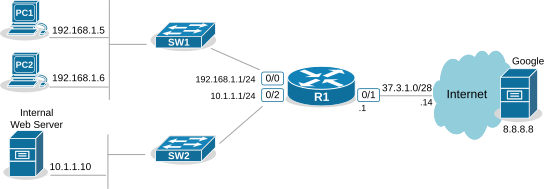
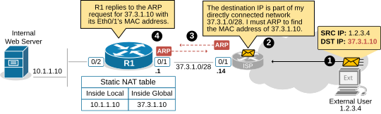

[Lab #2.1 - Internet access](https://www.networkacademy.io/ccna/network-services/lab-1-internet-access)
==========

After introducing the most fundamental aspects of Network Address Translation (NAT), we begin with our practical examples. This lesson demonstrates how to configure NAT in real-world scenarios from scratch, walking through the most important parts of the configuration process.

At the end of the lesson, you will find the Download section, where you can download the EVE-NG file and practice to complete all objectives yourself.

Ticket Initial State
--------------------

The diagram below shows the customer network we will work with. It has two local subnets: **Users** — 192.168.1.0/24 and **Servers** — 10.1.1.0/24.



Figure 1. Ticket Initial Topology.

The router R1 has access to the Internet using a static route 0.0.0.0/0 toward the Internet Server Provider.

Ticket Objectives
-----------------

An engineer configured the customer network **but didn't manage to finish**. The customer has contacted you to finish the configuration based on the objectives below. There is no information on the current state of the configuration.

- **Objective 1**: Clients in subnet 192.168.1.0/24 must be able to access the Internet using the router's public IP 37.3.1.1.
- **Objective 2**: External users must be able to access the internal web server (10.1.1.10) using public IPv4 address 37.3.1.10.
- **Verification 1**: PC1 and PC2 must be able to ping and telnet to 8.8.8.8 successfully.
- **Verification 2**: External users must be able to ping and telnet to the Internet WebServer using IP address 37.3.1.10. 

Try to complete the objectives yourself and then return to cross-check your solution with ours.

Approaching the objectives
--------------------------

Let's analyze the current topology and plan how to complete each objective.

### Objective 1

Clients in subnet 192.168.1.0/24 must be able to access the Internet using the router's public IP 37.3.1.1.

In the context of NAT, when a requirement says that **multiple internal hosts must access the Internet using a single public IP address**, it automatically means you must use NAT Overload, also known as PAT. Let's see how we can configure NAT overload in the lab topology.

#### Configuring NAT Overload

The first step in any NAT configuration is identifying which interfaces connect to the inside and which to the outside from NAT's point of view. According to the topology, Eth0/0 and Eth0/2 connect to the Inside, while Eth0/1 connects to the Outside. Therefore, the configuration looks like this:

```
R1# conf t
Enter configuration commands, one per line.  End with CNTL/Z.
R1(config)# interface Eth0/0
R1(config-if)# ip nat inside
R1(config-if)# exit
R1(config)# interface Eth0/2
R1(config-if)# ip nat inside
R1(config-if)# exit
R1(config)# interface Eth0/1
R1(config-if)# ip nat outside
R1(config-if)# exit
R1(config)#
```

The next step is to define the Inside Local criteria, which basically tells the router **which internal IP addresses must be translated (NATed)**. In our example, we must allow clients in 192.168.1.0/24 to access the Internet using the router's public IP address. Hence, we configure the following access list.

```
R1(config)# ip access-list standard INSIDE_LOCAL
R1(config-std-nacl)# permit 192.168.1.0 0.0.0.255
R1(config-std-nacl)# exit
R1(config)#
```

Lastly, we configure the NAT Overload rule as follows:

```
NAT(config)# ip nat inside source list INSIDE_LOCAL interface Eth0/1 overload
```

We can break down each parameter of the command as follows:

- **ip nat inside source** — We enable NAT on the router to translate the source address of hosts connected on the Inside.
- **list INSIDE_LOCAL** — The range of Inside Local addresses that must be translated.
- **interface Eth0/1** — All Inside Local addresses will be translated to interface Eth0/1's IP address (the Inside Global address).
- **overload** — Enables PAT (Port Address Translation), also known as NAT overload, which allows multiple internal IP addresses to be translated to a single external IP address by differentiating connections based on port numbers.

Without the last parameter, "overload," we are basically configuring dynamic NAT that will translate the first Inside Local address to the Inside Global address of interface Eth0/1 and will then discard all other packets that arrive on the Inside interfaces. **Do not forget the "overload" parameter when configuring PAT!** It is a very common mistake at exams and even in production.

#### Verifications

Once the NAT overload is configured, we must first generate traffic from the Inside destined to the Outside to trigger the NAT rule. Let's execute ping and telnet from PC1 to the external server 8.8.8.8.

```
PC1# ping 8.8.8.8
Type escape sequence to abort.
Sending 5, 100-byte ICMP Echos to 8.8.8.8, timeout is 2 seconds:
!!!!!
Success rate is 100 percent (5/5), round-trip min/avg/max = 1/1/2 ms
```

```
PC1# telnet 8.8.8.8
Trying 8.8.8.8 ... Open

User Access Verification

Username:cisco
Password:*****
Google>
```

Both commands are successful. If we check the router's NAT table, we can see the actual NAT translations.

```
NAT# sh ip nat translations

Pro Inside global      Inside local       Outside local      Outside global
tcp 37.3.1.1:4096      192.168.1.5:64475  8.8.8.8:23         8.8.8.8:23
tcp 37.3.1.1:4097      192.168.1.6:30409  8.8.8.8:23         8.8.8.8:23
```

Notice that the port address of the inside hosts is changed during the NAT process. That's why NAT overload is also called Port Address Translation. It works by changing the entire source socket (IP:port) with a different socket (Inside Global IP and random port number).

With that, objective number one is done. Let's move on to the next one.

### Objective 2

External users must be able to access the internal web server (10.1.1.10) using public IPv4 address 37.3.1.10.

When a requirement says that external users must access a resource on the Inside in the context of NAT, **you must either use one-to-one NAT or PAT with Port Forwarding**. Since we haven't yet discussed Port Forwarding, let's configure a static one-to-one mapping between the Inside local address 10.1.1.10 and the inside global address 37.3.1.10, as written in the requirements.

#### Configuring Static NAT

The static one-to-one NAT is only a single line of configuration, as shown in the output below.

```
R1# conf t
Enter configuration commands, one per line.  End with CNTL/Z.
R1(config)# ip nat inside source static 10.1.1.10 37.3.1.10
R1(config)# exit
```

#### Verifications

To test the static NAT rule, let's generate ping and telnet from an external user toward the internal web server. 

```
ExternalUser# ping 37.3.1.10
Type escape sequence to abort.
Sending 5, 100-byte ICMP Echos to 37.3.1.10, timeout is 2 seconds:
!!!!!
Success rate is 100 percent (5/5), round-trip min/avg/max = 1/1/2 ms
```

```
ExternalUser# telnet 37.3.1.10
Trying 37.3.1.10 ... Open

User Access Verification

Username: cisco
Password:
WebServer>
```

We can see that both commands are successful. Static NAT is so straightforward that it needs little explanation. You must know what "Inside Local" and "Inside Global" are, and you are good to go. However, to provide some additional value, let's zoom in on how the communication happens in the direction from the outside to the inside.

#### NAT and ARP

Let's focus on the communication between an external user (1.2.3.4) and the Internet Web Server (10.1.1.10). Since we are using a one-to-one mapping between 10.1.1.10 and 37.3.1.10, the external users see the webserver as having IP address 37.3.1.10 (the Inside Global address). 



Figure 2. Static NAT - ARP Resolution.

1. The external user sends a packet destined to 37.3.1.10.
2. The packet reaches the last ISP router that connects to router R1. Here is the essential part: According to the ISP router's routing table, the destination IP 37.3.1.10 is part of its directly connected network 37.3.1.0/28. Hence, 37.3.1.10 is the next hop.
3. The ISP router must send **an ARP request** to resolve the MAC address of the next hop (37.3.1.10).
4. R1 receives the ARP request for 37.3.1.10. Although R1 doesn't have this IP address configured on the Eth0/1 interface, **it sends back an ARP Reply**. Inside the ARP Reply, it inserts its Eth0/1 MAC address so that the traffic from the ISP router (destined to 37.3.1.10) arrives at R1 and is translated to 10.1.1.10 on the Inside. 

The example shows that **the NAT router responds to ARP requests for the Inside Global addresses** when handling traffic from outside to inside for static one-to-one mappings or static Port Forwarding rules.

### Full Configuration Summary

Here is the complete configuration applied to R1:

```
! Step 1: Define NAT interfaces
interface Ethernet0/0
 ip nat inside
!
interface Ethernet0/2
 ip nat inside
!
interface Ethernet0/1
 ip nat outside
!

! Step 2: Define Inside Local criteria (ACL)
ip access-list standard INSIDE_LOCAL
 permit 192.168.1.0 0.0.0.255
!

! Step 3a: PAT for user Internet access
ip nat inside source list INSIDE_LOCAL interface Ethernet0/1 overload

! Step 3b: Static NAT for web server
ip nat inside source static 10.1.1.10 37.3.1.10
```

### Summary

This lab demonstrated a real-world NAT deployment combining two types of NAT on a single router:

- **PAT (NAT Overload)**: Used for general user Internet access. Multiple inside hosts share a single public IP (37.3.1.1) using port multiplexing.
- **Static NAT**: Used for inbound access to an internal web server. A fixed one-to-one mapping (10.1.1.10 ↔ 37.3.1.10) allows external users to reach the server.
- **NAT and ARP**: The router responds to ARP requests for Inside Global addresses that are statically mapped, even though those IPs are not configured on its physical interfaces.
- **Verification**: `ping`, `telnet`, and `show ip nat translations` confirm the configuration is working correctly.