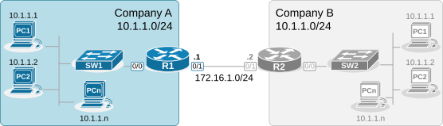
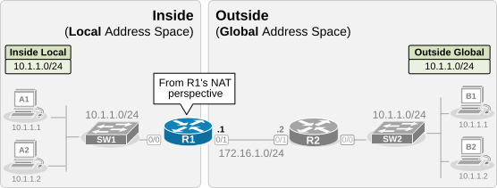
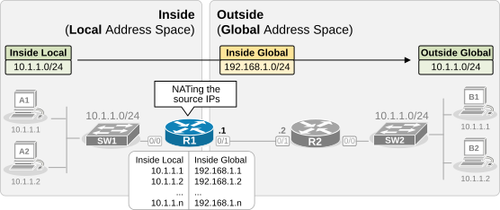

[Lab #2.2 - Overlapping IP ranges](https://www.networkacademy.io/ccna/network-services/lab-2-overlapping-ip-ranges)
==========

This configuration ticket demonstrates another real-world scenario where NAT can be used to solve complex network requirements. The scenario shows **two companies merging** and needing to interconnect their networks but having overlapping IP ranges. 

At the end of the lesson, you can download the EVE-NG file from the Download section and practice completing all objectives yourself.

Ticket Initial State
--------------------

Company A recently merged with Company B and must interconnect their networks. An engineer has already connected the two networks from physical and routing point of view, as shown in the diagram below.



Figure 1. Ticket Initial Topology.

However, there is a problem with IP addressing. Both companies use the same private IPv4 address space — 10.1.1.0/24. This prevents hosts in Company A from communicating with hosts in Company B. 

Ticket Objectives
-----------------

The customer has contacted you to resolve the problem with the overlapping IP schemes. They entrusted you with enabling **full communication between the two networks**. 

- **Requirement 1:** Hosts in Company A must be able to reach hosts in Company B. For example, host A1 (10.1.1.1) must telnet to host B1 (10.1.1.1).
- **Requirement 2:** You are not allowed to change the IP addresses of any of the hosts in each network. 
- **Requirement 3:** You can only make configuration changes on router R1. You cannot make configuration changes on any of the other devices.

Download the EVE-NG file from the download section at the end of the lesson and try to complete the objectives yourself. Then return to cross-check your solution with ours.

Analyzing the Requirements
--------------------------

It is common to deal with overlapping IP ranges in scenarios such as mergers, acquisitions, and multi-tenant environments. Connecting two networks with overlapping IPs (where both networks have IP ranges that conflict) typically requires using NAT techniques to avoid IP conflicts.

In this lab example, Company A and Company B use the overlapping subnet 10.1.1.0/24. To satisfy the requirement, we will use static NAT with a one-to-one mapping between networks.

### Step 1. Identifying Inside and Outside

The first step in any NAT configuration is identifying NAT Inside and Outside. Since we will reconfigure router R1, the Inside and Outside directions are from R1's perspective.



Figure 2. Identifying Inside and Outside.

We configure R1's Eth0/0 interface as inside and the Eth0/1 interface as outside using the commands shown in the output below.  

```
R1(config)#
interface Ethernet0/0
 ip address 10.1.1.254 255.255.255.0
 ip nat inside
!
interface Ethernet0/1
 ip address 172.16.1.1 255.255.254.0
 ip nat outside
!
```

As a general rule of thumb, when working on a more complex NAT setup, it is beneficial to visualize the Inside and Outside zones with the actual addresses of the hosts on the two sides, as shown in the diagram above.  

Notice that the real configured IP addresses on the hosts on the Inside are referred to as "Inside Local" addresses, while the configured IPs on the hosts on the Outside are referred to as "Outside Global." Those addresses are taken for granted from R1's NAT's perspective. They are already chosen and configured on the hosts.

### Step 2. Static Source NAT at subnet scale

The next step in the process is configuring static one-to-one mapping for the hosts on the Inside. Until now, we have only seen how to configure one-to-one mapping between two IP addresses. However, for this use case, it is not practical to configure mappings for each pair of Inside Local-Inside Global IP addresses. It is much more convenient to configure static mapping at a network scale.



Figure 3. NATing Inside Local to Inside Global.

The **ip nat inside source static** command has a parameter **network** that allows us to map an Inside Local network to an Inside Global network. In our example, we will map the inside network 10.1.1.0/24 to the non-overlapping subnet 192.168.1.0/24. Therefore, **Company B hosts will see Company A traffic coming from 192.168.1.0/24** (instead of 10.1.1.0/24).

```
R1(config)#
 ip nat inside source static network 10.1.1.0 192.168.1.0 /24
```

Notice the parameters in the command we configure on R1. 

- The network 10.1.1.0/24 is the Inside Local subnet of the hosts in Company A. This network is a given. It is already configured on the hosts and cannot be easily changed. 
- The network 192.168.1.0/24 is the Inside Global subnet after the router performs the translation. This network can be any arbitrary one that does not overlap with Company B. In our example, we have chosen 192.168.1.0/24. However, it could be any subnet as long as Company B's network has routing to it. 

The router maps each IP address from the Inside Local network to one from the Inside Global network in one-to-one sequential order: 10.1.1.1 maps to 192.168.1.1, 10.1.1.2 maps to 192.168.1.2, 10.1.1.3 maps to 192.168.1.3, and so on.

### Step 3. Static Destination NAT at subnet scale

We must perform one more step to allow bidirectional connectivity between the two companies. Translating only the source addresses is not enough. Although hosts on the Outside (in Company B) no longer see any overlapping addresses, the hosts on the Inside still cannot initiate connections to Company B because the destination IP addresses overlap. For example, host A1 (10.1.1.1) can't ping host B1 (10.1.1.1) because, from A1's perspective, it seems like it is initiating a ping to itself.

To solve this problem, we must translate the destination IPs as well. Hosts in Company A must initiate connections to arbitrary destination IPs that the router replaces with the real IPs of hosts in Company B.


Figure 4. Destination NAT.

The approach is to create a static one-to-one mapping of the Outside Global network to an Outside Local network (using the same non-overlapping subnet 192.168.1.0/24). This allows the hosts in Company A to initiate connections to the arbitrary IPs, which the router translates to the real IPs of hosts on the outside.

```
R1(config)#
 ip nat outside source static network 10.1.1.0 192.168.1.0 /24
```

This command tells the router: "When a packet arrives from the Inside destined to the Outside, and the destination IP is in the 192.168.1.0/24 range, translate it to 10.1.1.0/24 before forwarding it to the Outside." The sequential mapping works the same way: 192.168.1.1 → 10.1.1.1, 192.168.1.2 → 10.1.1.2, etc.

### Step 4. Routing

Now we must ensure that Company B's routers (R2) have a route back to 192.168.1.0/24 pointing to R1. Since we are only allowed to configure R1, and the engineer who set up the network has already configured the routing protocols, let's verify that the route is present.

```
R2# show ip route 192.168.1.0
Routing entry for 192.168.1.0/24
  Known via "ospf", distance 110, metric 2
  Last update from 172.16.1.1 on Ethernet0/0
  Routing Descriptor Blocks:
  * 172.16.1.1, from 172.16.1.1, via Ethernet0/0
      Route metric is 2, traffic share count is 1
```

### Verifications

Now, let's verify that hosts can communicate across the two companies. From A1, we initiate a ping to B1 using the translated Outside Local address (192.168.1.1).

```
A1# ping 192.168.1.1
Type escape sequence to abort.
Sending 5, 100-byte ICMP Echos to 192.168.1.1, timeout is 2 seconds:
!!!!!
Success rate is 100 percent (5/5), round-trip min/avg/max = 1/1/2 ms
```

Let's also verify that B1 can communicate with A1 using the translated Inside Global address.

```
B1# ping 192.168.1.1
Type escape sequence to abort.
Sending 5, 100-byte ICMP Echos to 192.168.1.1, timeout is 2 seconds:
!!!!!
Success rate is 100 percent (5/5), round-trip min/avg/max = 1/2/6 ms
```

We can verify the NAT translations on R1.

```
R1# show ip nat translations
Pro Inside global      Inside local       Outside local      Outside global
icmp 192.168.1.1:1     10.1.1.1:1         192.168.1.1:1      10.1.1.1:1
--- 192.168.1.1        10.1.1.1           ---                ---
```

### Full Configuration Summary

Here is the complete configuration on R1:

```
! Step 1: Define NAT interfaces
interface Ethernet0/0
 ip address 10.1.1.254 255.255.255.0
 ip nat inside
!
interface Ethernet0/1
 ip address 172.16.1.1 255.255.254.0
 ip nat outside
!

! Step 2: Source NAT — translate Company A's real IPs to non-overlapping range
ip nat inside source static network 10.1.1.0 192.168.1.0 /24

! Step 3: Destination NAT — translate Company B's real IPs to non-overlapping range
ip nat outside source static network 10.1.1.0 192.168.1.0 /24
```

### Summary

This lab demonstrated how to use NAT to resolve overlapping IP address ranges:

- **Inside source NAT at subnet scale**: The `ip nat inside source static network` command translates the entire Inside Local subnet to a non-overlapping Inside Global subnet in one command.
- **Outside source NAT at subnet scale**: The `ip nat outside source static network` command translates the entire Outside Global subnet to a non-overlapping Outside Local subnet, enabling Inside hosts to initiate connections.
- **Bidirectional communication**: The combination of both source and destination NAT allows full two-way communication between overlapping networks.
- **Routing**: The non-overlapping translated subnet must be reachable by the remote side (via static routes or dynamic routing protocols).
- **Verification**: Use `ping`, `telnet`, and `show ip nat translations` to confirm connectivity.