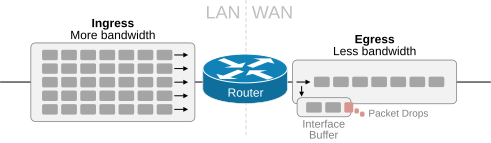
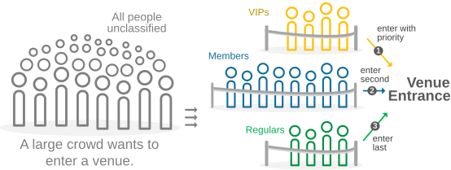
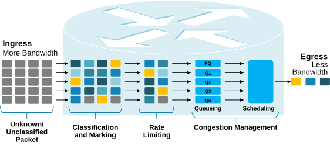

[Why do we need QoS?](https://www.networkacademy.io/ccna/network-services/why-do-we-need-qos)
==========

In a typical IP network, the LAN operates at higher speeds (in the Gigabits range), while WAN interfaces run at slower speeds (in the Megabits range). This creates an interesting problem for the routers that sit on the WAN edge connecting the LAN to the WAN — thousands of packets arrive through the LAN interface, but the WAN interface does not have the capacity to transmit them all.

Figure 1. Why do we need QoS?

When there are more packets than the WAN interface can transmit, **some packets must be buffered, and others must be dropped**. But which packets should the router drop? Which packets should it place in the buffer and transmit later? Which packets should it send immediately with priority?

These questions touch on core concepts of Quality of Service (QoS) in networking. QoS refers to the tools routers and switches use to apply differentiated handling of packets as they move through the network (hence, the term **DiffServ** — differentiated services). For instance, a WAN edge router can immediately send out the packets that are important to the business. At the same time, it can queue relatively important packets and drop packets that are irrelevant to the organization's business.

The bottom line is that **not all packet flows are equal to the business.** Some are business-critical, and some are business-irrelevant. QoS is the toolset network devices use to treat the packet flows essential to the business differently than the less important ones.

People congestion vs Packet congestion
--------------------------------------

Let's compare a venue managing crowd congestion to a router managing packet congestion. This will help you understand most of the QoS concepts at a high level. 

Imagine you are managing a venue with thousands of people wanting to enter. You would like to treat different groups of people differently. For example, you want backstage and security staff to enter without waiting, right? You want VIPs to enter with priority. You want members and fast-lane ticket holders to enter with priority over regular ticket holders. You want to prevent overcrowding and ensure safety. What would be the process? How do you do it?

Figure 2. Managing crowd congestion.

Generally, the process can be broken down into three steps as follows:

- **Step 1. Classification and Marking** — The first step is to classify the different people into separate groups based on their tickets. When you classify a person as VIP, for example, you mark him with a wristband so that you can easily understand his importance later at any place at any time when required. This process typically takes place far in advance of the actual entrance. 
- **Step 2. Rate Limiting** — Then you must control the flow of people to prevent overcrowding and ensure safety. Venues typically set up zig-zag stanchions, fences, and ropes to create orderly lines and direct the flow of people, preventing chaotic crowd movement.
- **Step 3. Queueing and Scheduling** — Lastly, to treat different people with different priorities, you split them into different waiting queues. Staff and security personnel enter immediately without waiting. VIPs wait in another queue and enter with priority. Fast-lane ticket holders enter with priority over regular ticket holders, etc. 

The venue treats different people differently based on their importance. Hence, the process could also be called differentiated services — DiffServ.

The QoS toolkit
---------------

A router using QoS to manage packet flows during congestion is like a venue's crowd management system. It is important to understand from the beginning that QoS is not a single tool or feature. It is a toolkit of different features and capabilities working together to achieve the common goal — ensuring business-critical packet flows arrive on time without packet loss.

Figure 3. The QoS toolkit.

The Quality of Service (QoS) workflow is similar to the venue's crowd management. It involves the following processes:

- **Classification and Marking** — The process of classifying packets and marking them with a DSCP value (1 to 63) so that their importance can easily be determined anywhere in the network at any time.
- **Rate Limiting (Shaping and Policing)** — The process of controlling the maximum traffic rate at specific points in the network for particular packet flows. 
- **Queuing and Scheduling** — Queuing is the process of placing packets in different queues based on their classification (in step 1). Scheduling determines the order in which packets are transmitted from these queues, typically giving higher priority to business-critical traffic.

If you compare the QoS workflow shown in Figure 3 to the venue's crowd management shown in Figure 2, you can see that at a high level, the logic is very similar. Now, let's shift the focus a little bit and discuss the different traffic characteristics that we want to control with QoS.

Bandwidth, Delay, Jitter, and Packet Loss
-----------------------------------------

There are four fundamental metrics that impact applications running over the network: Bandwidth, Delay, Jitter, and Packet Loss. Here's a breakdown of each term:

### Bandwidth

Bandwidth is the maximum amount of data that can be transmitted over a network link in a given amount of time. It is typically measured in bits per second (bps), Megabits per second (Mbps), or Gigabits per second (Gbps).

- **Insufficient bandwidth** causes congestion, which leads to packet buffering, increased delay, and eventually packet drops.
- QoS cannot increase the physical bandwidth of a link — it can only prioritize which traffic gets to use the available bandwidth first.
- **Example**: A VoIP call requires roughly 100 Kbps of bandwidth. If the WAN link is saturated with file downloads, the VoIP packets will be delayed or dropped without QoS. With QoS, the router can reserve bandwidth for the VoIP call and allow the file downloads to use only the remaining capacity.

### Delay (Latency)

Delay is the time it takes for a packet to travel from the source to the destination. It is typically measured in milliseconds (ms). Delay has several components:

- **Propagation delay**: The time it takes for the signal to travel across the physical medium (fiber, copper, etc.). This is determined by the speed of light and the distance between devices.
- **Serialization delay**: The time it takes to place the bits of a packet onto the physical interface. This depends on the interface speed and the packet size.
- **Queuing delay**: The time a packet spends waiting in a queue while the router processes and transmits other packets. This is the component that QoS directly affects.
- **Processing delay**: The time the router takes to examine the packet header, make forwarding decisions, and apply any QoS policies.

Different applications have different delay tolerances:

| Application Type | Delay Tolerance | Example |
|-----------------|-----------------|---------|
| Real-time (voice/video) | Very low (< 150 ms one-way) | VoIP, Video conferencing |
| Interactive | Moderate (< 1 second) | Web browsing, SSH |
| Bulk data | High (minutes/hours) | File transfers, backups, email |

### Jitter

Jitter is the variation in delay between consecutive packets belonging to the same flow. In other words, if packet 1 takes 10 ms to arrive and packet 2 takes 50 ms to arrive, the jitter is 40 ms.

- Jitter is **more damaging to real-time applications than delay**. A VoIP application can handle a consistent 150 ms delay (it just plays audio slightly later), but it cannot handle packets arriving with wildly varying delays because the audio would sound choppy or garbled.
- QoS reduces jitter by providing consistent queuing treatment to real-time traffic — queuing it in a priority queue that is serviced first, every time.
- The receiver typically uses a **jitter buffer** to smooth out small variations, but excessive jitter causes buffer underruns or overruns, resulting in poor audio/video quality.

### Packet Loss

Packet loss occurs when one or more packets fail to reach their destination. It is typically measured as a percentage of total packets sent.

- **Causes**: Congestion (router buffers fill up and packets are dropped), faulty hardware, or link errors.
- **Impact varies by application**:
  - **TCP-based applications** (web, email, file transfer) recover from packet loss through retransmission, but this reduces throughput and increases delay.
  - **UDP-based real-time applications** (VoIP, video streaming) do not retransmit lost packets. A loss of 1-2% can make a voice call unintelligible.
  - **Audio/video codecs** can handle small amounts of loss using error concealment, but beyond 3-5% the quality degrades rapidly.

QoS addresses packet loss by:
1. Providing **dedicated bandwidth** for critical traffic so it never experiences congestion drops.
2. Using **selective dropping** (WRED) to proactively drop less important traffic before congestion becomes critical.
3. Prioritizing **queuing and scheduling** so important traffic is transmitted first and never tail-dropped.

### The Four Metrics Together

The four metrics are interdependent. For example:

- Low bandwidth → Congestion → Queuing delay increases → Jitter increases → Buffer fills up → Packet loss occurs
- QoS breaks this chain by giving priority to critical traffic, ensuring it has enough bandwidth, low delay, low jitter, and zero loss due to congestion.

Understanding these four metrics is essential because every QoS tool is designed to improve one or more of them for the traffic that matters most to the business.

### Summary

Quality of Service (QoS) is not a single feature but a toolkit of mechanisms that allow network devices to treat different types of traffic differently during congestion. Here are the key takeaways:

- **Why QoS?** Because WAN links are slower than LAN links, creating a speed mismatch. Routers must decide which packets to forward, buffer, or drop when congestion occurs.
- **Not all traffic is equal**: Business-critical traffic (VoIP, video conferencing, ERP applications) must be prioritized over non-essential traffic (bulk downloads, streaming video, peer-to-peer).
- **The analogy**: Managing packet congestion is like managing crowd congestion at a venue — classify/mark, rate-limit, and queue/schedule.
- **The QoS toolkit has three main components**:
  1. Classification and Marking
  2. Rate Limiting (Shaping and Policing)
  3. Queuing and Scheduling
- **Four key metrics**: Bandwidth, Delay, Jitter, and Packet Loss. QoS tools improve these metrics for critical traffic.

In the next lesson, we will look at **Classification and Marking** in detail, including how DSCP and CoS values are used to mark packets for differentiated treatment.