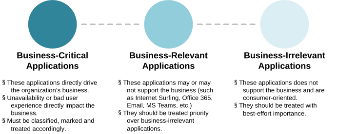
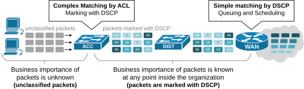
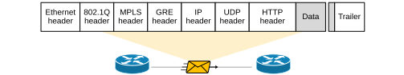
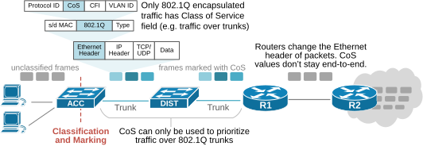
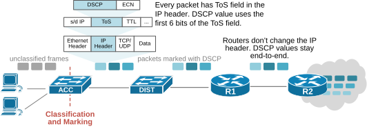
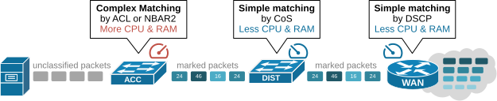

[Classification and Marking](https://www.networkacademy.io/ccna/network-services/classification-and-marking)
==========

This lesson begins our journey into Quality of Service (QoS). We discuss why the Classification and Marking process is important and how it fits into the QoS workflow. Then, we dive into the marking process and the different headers that can be used to mark a packet with a QoS value. Finally, we discuss the classification process in more detail and examine the organization's classification strategy.

Why do we need Classification and Marking?
------------------------------------------

As always, let's start with why. Why do we need classification and marking, and why is it important? Each organization's network **transports many different types of application traffic**. Depending on the organization's business niche, some applications may be business-critical, while others may be irrelevant, as shown in the diagram below.

Figure 1. Types of traffic according to the business.

In short, not all network traffic is equally important to the business. Some traffic flows are more important than others. However, **how can network devices understand which traffic flows are business-critical and which are business-irrelevant?** Well, a network device cannot determine the business importance of network flows on its own — business is work for humans. 

That's where the classification process comes into play. Every network device can match and classify traffic based on human-defined access lists (ACLs) because only network admins know what is important for the organization. For example, a UDP traffic with a source IP address from subnet 10.1.1.0/24 destined to TCP port 8080 is important to the business. However, matching this traffic on every device that performs QoS operation by looking at many fields in the packet's header is a resource-intensive task. It is inefficient to match traffic at every device in the network by inspecting multiple header fields in different packet headers (source and destination IPs are in the IP header, TCP ports are in the TCP header, etc.).

That's where marking comes into play. The idea is to classify a packet by inspecting many header fields only once and marking the packet with a QoS value. Then, all other devices that perform QoS match the packet by this QoS value instead of looking at many header fields, making the process much more efficient and less resource-intensive. 

The purpose of the classification and marking process is to reduce the need to repeat complex classification steps at every device along the network path of packets.

Classification and Marking at a high level
-------------------------------------------

Every organization's QoS strategy starts with identifying the essential business applications. By default, **every packet in the network looks the same from a QoS perspective**. Look at the left side of the diagram below. When end hosts send traffic to the network, network devices cannot quickly determine the packets' importance. All packets are unclassified and have the same priority.

Figure 2. Classification and Marking close the end hosts.

Typically, the access switch closest to the end hosts matches the business-critical and business-relevant traffic based on header information such as protocol, IP addresses, and ports. Then, it marks each packet with a specific QoS value. In this example, the access switch marks the packets with a DSCP value in the IP header. This value stays in the IP header the entire path until the packet reaches its destination. Network devices along the route can determine the packet's importance just by looking at the DSCP value. However, this is not the only option for marking packets. Let's discuss the process in more detail.

### Marking

Marking is the process of **assigning specific QoS values to packets to indicate their priority** along their network path. However, there are two very important aspects to understand here:

- Packets are encapsulated **with multiple different headers** depending on the protocols and technologies used in the network. A packet might have many headers, as shown in the fictitious example below.
    
    
    
    Figure 3. A packet with multiple headers.
    
    Additionally, some headers change along the way. For example, switches replace the 802.1Q header depending on the port types and VLAN assignments. MPLS routers add or remove the MPLS header. WAN routers add and remove the GRE/IPsec header depending on whether the packet goes through a tunnel. More headers, such as VXLAN, WiFi, etc., might even be added.
    
- Different devices (switches, routers, firewalls, etc.) **read different header information**. For example, layer 2 switches only read the Ethernet and 802.1Q headers of frames. They do not read the other headers such as GRE, IP, UDP, HTTP, etc. MPLS routers do not read the IP, UDP, HTTP headers, and so on.

In the perspective of Quality of Service (QoS), these two facts raise the following important question:

#### Which header to mark with a QoS value?

In short, some headers are replaced along the packet's network path, while others remain on the entire path. Logically, people would say, "*Okay, then why not assign a QoS value to the IP or UDP headers that stay with the packet end-to-end?*"

Okay, but then some devices, such as layer 2 switches, look only at the Ethernet and 802.1Q headers of packets. If the QoS value is assigned to the IP header, layer 2 switches cannot determine a packet's QoS priority.

That's why multiple QoS fields exist in different packet headers. This is very important to remember and understand. The following table shows the different fields used for Quality of Service marking:

| OSI Layer | Packet Header | Field Name | Value | Length [bits] | Used |
|-----------|--------------|------------|-------|---------------|------|
| Layer 2 | 802.1Q | CoS (Class of Service) | PCP (Priority Code Point) | 3 | Over 802.1Q trunks |
| Layer 2 | 802.11 | TID (Traffic Identifier) |  | 3 | Over WiFi segments |
| Layer 2/3 | MPLS Label | EXP (Experimental bits) / TC (Traffic Class) |  | 3 | Over MPLS networks |
| Layer 3 | IP | ToS (Type of Service) | IPP (IP Precedence) | 3 | End-to-end |
|  |  |  | DSCP (DiffServ Code Point) | 6 |  |

- For example, suppose we want to prioritize traffic inside a layer 2 network segment. In that case, we classify and mark packets using the CoS (Class of Service) field in the Ethernet header because layer 2 switches typically do not read the other packet's headers. 
- If we want to prioritize traffic inside a Wi-Fi segment, we use the TID field in the 802.11 header because WiFi devices only read the 802.11 header.
- If we want to prioritize traffic between routers, we generally use the Type of Service (ToS) field in the IP header. It can be used in two different ways: IPP and DSCP, which we will discuss later.

#### Marking the Ethernet Header

Suppose we have the topology shown in the diagram below. The end hosts connect to the access switches, which connect to the distribution switches, which connect to the WAN. Suppose the link between the DIST switch and the R1 router is often congested, and we want to prioritize business-critical traffic. In this case, we classify the important packets at the access switch and mark them with Class of Service (CoS) values from 1 through 7 inside the Ethernet header.

Figure 4. Class of Service (CoS).

When there is congestion on the trunk link toward the R1 router, the distribution switch can easily match the important traffic based on the class of service and treat it with priority. Notice that after the traffic passes through the R1 router, **the CoS values are lost because the router replaces the Ethernet header of packets**. Hence, R2 cannot match and classify traffic based on the class of service values assigned by the access switch. 

#### Marking the IP Header

Using the same example, suppose you want to prioritize traffic over the link between routers R1 and R2. In this case, we classify the important packets at the access switch and mark them with DSCP values from 1 through 63 inside the IP header. The IP header exists for the entire packet trip from the source to the destination. Therefore, the DSCP value stays with the packet end-to-end. 

Figure 5. Type of Service (ToS).

When the link between R1 and R2 is congested, R1 can easily match the business-important traffic based on the DSCP values and prioritize it. R2 can also match the important traffic based on DSCP and prioritize it over the WAN.

However, the distribution switch (or other layer 2 switches) cannot match the business-critical traffic based on DSCP because the DSCP value is in the IP header, and the switch only reads the Ethernet header of frames.

#### Marking other headers (WiFi, MPLS, etc.)

Using CoS values in the Ethernet header and DSCP values in the IP header (or using both) is the most often used approach to Quality of Service. However, some network domains implement domain-specific QoS marking:

- In **MPLS** backbones, devices use the 3-bit Traffic Class (TC) field in the MPLS header to do QoS.
- In **Wi-Fi** networks, devices use the Traffic Identifier (TID) field in the 802.11 header to do QoS.
- In **Frame Relay** networks, devices use the Discard Eligible (DE) field in the frame relay header.
- In **ATM** networks, devices use the Cell Loss Priority (CLP) field in the ATM cell header.

### Classification

Classification is the process of identifying and categorizing network traffic. Before any QoS operation can be performed on a packet, the packet must be classified first. Therefore, **every device must first classify the network traffic** before performing a QoS operation such as policing, shaping, queueing, scheduling, etc. There are two ways to match traffic on Cisco devices: complex and simple.

- The **complex** method involves matching various packet headers using an Access List (ACL) or the device's packet inspection engine (NBAR2). The process of matching multiple header fields adds a lot of configuration complexity and consumes a lot of resources, ultimately degrading the device's performance. 
- The **simple** method involves matching only packets' QoS marking. It is much more efficient and consumes way fewer resources than complex matching. For example, an access switch has already classified and marked all business-relevant traffic with DSCP values. Then, all other devices along the network path only match the DSCP values when classifying traffic. 

Typically, packets' initial classification and marking must happen as close to the end hosts as possible, as shown in the diagram below.

Figure 6. QoS Classification Strategy.

Then, all devices along the path can only perform a simple classification by matching the most convenient QoS field. 

Now, let's demonstrate how we configure QoS Classification and Marking in the next lesson in this section.

### Summary

Classification and Marking is the foundational first step in any QoS deployment. Here are the key takeaways:

- **Classify once, mark everywhere**: Complex classification (matching ACLs, NBAR) is done once near the source. Packets are then marked with a QoS value (DSCP, CoS, etc.) so downstream devices can use simple matching.
- **Multiple headers, multiple QoS fields**: Different devices read different headers. CoS (Ethernet) for layer 2 switches, DSCP (IP) for routers, TC (MPLS) for MPLS backbones, TID (802.11) for WiFi.
- **DSCP is end-to-end**: The DSCP field in the IP header stays with the packet from source to destination, making it ideal for end-to-end QoS.
- **CoS is per-hop**: CoS in the 802.1Q header is lost when a router rewrites the Ethernet header, so it is only useful within layer 2 segments.
- **Proximity to source**: The initial classification and marking should happen as close to the end hosts as possible (typically at the access switch) to offload processing from core devices.

In the next lesson, we will look at **The Modular QoS CLI (MQC)**, which is the Cisco framework for configuring QoS policies.