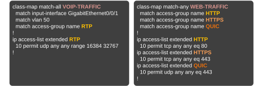
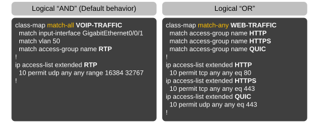
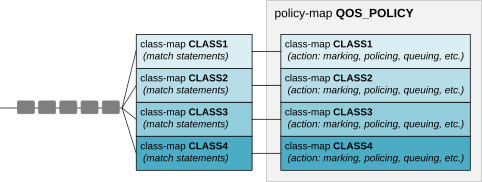

[The Modular QoS CLI (MQC)](https://www.networkacademy.io/ccna/network-services/modular-qos-cli-mqc)
==========

This lesson demonstrates how we configure Quality of Service (QoS) on Cisco devices using the modular QoS CLI (MQC) framework. Along the way, we explain the class-map, policy-map, and service-policy commands in detail and demonstrate how we use them to enable classification and marking on a device.

The Modular QoS CLI (MQC)
-------------------------

QoS is not a single tool or feature. It is a set of tools and capabilities that work together to achieve differentiated treatment of business-important traffic. In the '90s and early 2000s, **each QoS tool had different configuration commands** and workflows. Additionally, even the same QoS feature had different configuration commands on different platforms. 

Over time, the number of QoS commands grew to the point that **managing QoS configurations became increasingly complex** and unpractical. To address this issue, Cisco developed the Modular QoS CLI (MQC) framework, standardizing the QoS configuration commands on routers and switches.


Figure 1. Cisco Modular QoS CLI (MQC).

MQC organizes the configuration process into the following three steps:

- **Step 1.** Classifying packets using the **class-map** command. It specifies the parameters for matching packets into traffic classes.
- **Step 2.** Configuring QoS policy with actions (marking, shaping, policing, queuing) using the **policy-map** command. It specifies the action that the policy takes on each traffic class.
- **Step 3.** Attaching the QoS policy on an interface using the **service-policy** command.

Now, let's zoom into each step and examine it in more detail.

The class-map command
---------------------

The class-map command matches traffic into a traffic class. A class-map has three elements: a human-defined name, a series of one or more match statements, and a parameter (match-all or match-any) that tells the class-map how to evaluate the match statements. The following diagram shows examples of traffic classes.



Figure 2. Two class-maps.

### Match Statements

Match commands define the criteria for packet classification. Packets are evaluated to see if they meet the specified criteria. If a packet matches, it is considered a member of the traffic class. Packets that do not match any criteria are assigned to the default traffic class (class-default).

```
class-map TRAFFIC-CLASS-1
  match statement 1 
  match statement 2 
  match statement 3 
  match statement n 
!
```

A traffic class can have multiple match statements, as shown above. Hence, the device must know what logic you have in mind when configuring the traffic class with multiple match criteria. That is where the next parameter comes into play.

### Match-all vs Match-any

When configuring a new class map, we can specify either **match-any** or **match-all** to define how the matching criteria are evaluated. 

```
Switch(config)# class-map ?
  WORD       class-map name
  match-all  Logical-AND all matching statements under this classmap
  match-any  Logical-OR all matching statements under this classmap
```

The difference between match-any and match-all lies in how conditions are evaluated.

- With **match-all**, a packet matches the class only if it satisfies **all the conditions**. This means it uses "AND" logic.
- With **match-any**, a packet matches the class if it satisfies **at least one of the conditions**. This means it uses "OR" logic.

For example, a packet must match all three statements to match the class map named VOIP-TRAFFIC shown below. It must come via interface Gi0/0/1 in Vlan 50 and match access-list RTP to match the class. A packet that matches only one or two statements won't match the class.



Figure 3. Match-all vs Match-any.

On the other hand, a packet must match any one of the statements to match the class map named WEB-TRAFFIC. The packet can be HTTP, HTTPS, or QUIC.

The following output shows how we configure class maps via the CLI.

```
! Notice that IP CEF is required for class-based QoS. 
! It is configured by default on all modern platforms.
! However, if not, the device would reject the service-policy command.
ip cef
! First class map matches RTP traffic based on an ACL. 
! Notice that it is match-all (by default).
class-map VOIP-TRAFFIC
  match access-group name RTP
!
! Second class map matches WEB-TRAFFIC based on two ACLs.
! Notice that it is match-any.
class-map match-any WEB-TRAFFIC
  match access-group name HTTP
  match access-group name HTTPS
!  
! The class maps call one or more access-lists for matching.
ip access-list extended HTTP
  10 permit tcp any any eq 80
ip access-list extended HTTPS
  10 permit tcp any any eq 443
ip access-list extended RTP
  10 permit udp any any range 16384 32767
!
```

Remember that if you don't specify either match-any or match-all when creating a class map, it will default to match-all, requiring all conditions to be satisfied for a packet to match.

The policy-map command
----------------------

The policy-map command associates class maps with specific actions, like marking, policing, shaping, queuing, or dropping traffic, as shown in the diagram below.



Figure 4. Policy-map.

For example, we match ICMP traffic with a class-map. Then, inside the policy-map command, we refer to the ICMP class map and configure an action.

The following output shows how we configure a policy-map using the CLI. Notice that it refers to the traffic classes we created in the previous step.

```
! The policy map associates actions each of the two class maps.
! The actions are set, meaning this policy marks traffic.
policy-map QOS_POLICY
  class VOIP-TRAFFIC
    set dscp EF
  class WEB-TRAFFIC
    set dscp AF31
!
```

The policy map on its own does not do anything unless it is attached to an interface.

The service-policy command
--------------------------

The service-policy command is used to attach a policy map to an interface or control plane. It enforces the traffic policies defined in the policy map. You can apply it to inbound or outbound traffic on an interface. It activates features like marking, queuing, shaping, or policing, as the policy map specifies.

```
Switch# conf t
Enter configuration commands, one per line.  End with CNTL/Z.
Switch(config)# interface GigabitEthernet0/0/1
Switch(config-if)# service-policy ?
  input   Assign policy-map to the input of an interface
  output  Assign policy-map to the output of an interface
  
Switch(config-if)# service-policy input QOS_POLICY
Switch(config-if)# end
```

Once a traffic policy is attached to an interface, we can monitor the traffic that goes into each traffic class using the **show policy-map interface [interface_name]** command, as shown in the output below.

```
Switch# show policy-map interface Gi0/0/1
 GigabitEthernet0/0/1 
 
  Service-policy input: QOS_POLICY

    Class-map: VOIP-TRAFFIC (match-all)  
      2132 packets, 3213213 bytes
      5 minute offered rate 3212 bps, drop rate 0000 bps
      Match: access-group name RTP
      QoS Set
        dscp ef
          Packets marked 2132
          
    Class-map: WEB-TRAFFIC (match-any)  
      967232 packets, 8276532123 bytes
      5 minute offered rate 3232131 bps, drop rate 0000 bps
      Match: access-group name HTTP
        65464 packets, 7675633 bytes
        5 minute rate 543543 bps
      Match: access-group name HTTPS
        54353 packets, 5453453 bytes
        5 minute rate 87612 bps
      QoS Set
        dscp af31
          Packets marked 967232
          
    Class-map: class-default (match-any)  
      7874321 packets, 643824328 bytes
      5 minute offered rate 4343242 bps, drop rate 432423 bps
      Match: any 
```

### Summary

Cisco's MQC simplifies QoS configuration with a standardized three-step process:

- **Class-map**: Defines criteria for traffic classification.
- **Policy-map**: Specifies actions (e.g., marking, shaping) for classified traffic.
- **Service-policy**: Applies the policy to an interface (input or output).

Key specifics to remember:

- The **class-map** command:
  - Can have multiple match statements.
  - Use **match-all** (AND logic) for packets to meet all match statements.
  - Use **match-any** (OR logic) for packets to meet at least one match statement.
  - Defaults to match-all if not specified.
- The **policy-map** command:
  - Applies actions to traffic classes, such as marking packets with DSCP values.
- The **service-policy** command:
  - Activates the policy on an interface (input or output direction).
  - Requires **IP CEF** to be enabled; otherwise the command is rejected.

In the next lesson, we will practice these concepts in **Lab #3.1 — Marking traffic at the access**.