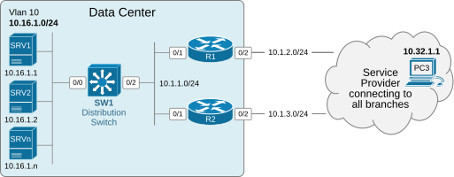
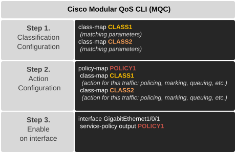
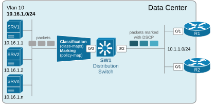

[Lab #3.1 - Marking traffic at the access](https://www.networkacademy.io/ccna/network-services/lab1-marking-traffic-at-the-access)
==========

QoS is not a single tool. It involves multiple QoS features and capabilities that work together to achieve the common goal of prioritizing business-important over business-irrelevant traffic. That's why QoS is one of those network technologies that can only be learned and understood well with practice. Engineers who spend significant time learning the theory but don't allocate enough time to practice very quickly forget how every QoS tool fits together and how the configuration is structured. That's why, in this series, we are going to demonstrate most of the QoS capabilities via practical examples. At the end of each lesson, you can download the EVE-NG file used in the lesson and practice the configuration yourself.

Lab Initial State
-----------------

The diagram below shows the customer network we will work with. The data center servers connect to the distribution switch in VLAN 10 within subnet 10.16.1.0/24. The switch connects to the WAN routers R1 and R2, which connect to the service provider. 



Figure 1. Initial Topology.

All remote users have access to the server LAN. One particular remote user, PC3 (10.32.1.1), is used to test the connectivity to the data center.

Lab Requirements
----------------

An engineer configured the customer network but didn't manage to finish. The customer has contacted you to finish the configuration based on the requirements below. There is no information on the current state of the configuration.

- **Requirement 1:** You must define four traffic classes on SW1 as follows:
  - Traffic class **SSH** that matches SSH packets on the standard port.
  - Traffic class **TELNET** that matches telnet packets on the standard port.
  - Traffic class **ICMP** that matches ping packets.
  - Traffic class **WEB** that matches HTTP and HTTPS packets.
- **Requirement 2:** You must define a traffic policy that marks the different traffic classes as follows:
  - Traffic class **SSH** must be marked with DSCP 34 (AF41).
  - Traffic class **TELNET** must be marked with DSCP 26 (AF31).
  - Traffic class **ICMP** must be marked with DSCP 18 (AF21).
  - Traffic class **WEB** must be marked with DSCP 10 (AF11).
- **Requirement 3:** You are not allowed to use an access list (ACL) to match HTTP and HTTPS traffic.
- **Requirement 4:** The traffic policy must be applied to the traffic coming from end hosts on the distribution switch.
- **Verifications:** Generate SSH, TELNET, and ICMP traffic from SRV1 (10.16.1.1) to PC3 (10.32.1.1) and then check the **show policy-map interface Eth0/0** command on the distribution switch. You must see the packets being classified into different traffic classes and marked with DSCP values according to the lab requirements.

As you can see, the requirements are fictitious so that they can be tested in an EVE-NG environment. In a real work network, the traffic classes would likely match the voice, video, and other business-important traffic (not telnet, SSH, and ICMP).

Anyway, try to complete the objectives yourself and then return to cross-check your solution with ours.

QoS Configuration
-----------------

We configure Quality of Service (QoS) on Cisco devices using the MQC framework, as shown in the diagram below.



Figure 2. Cisco Modular QoS CLI (MQC).

The configuration workflow consists of three steps that use three major commands: class-map, policy-map, and service-policy. Let's start with the classification configuration using the class-map command.

### Step 1. Classification

The class-map command has many match options, which allow us to match traffic based on many parameters. However, **99% of the time, we either match an access list or a DSCP value**. Those are by far the most commonly used ways to match traffic.

In our example, we will need a few access-lists that we can then use in the class-map commands to match the required traffic.

#### Access-lists (ACLs)

Access lists are the primary matching tool when classifying packets based on header information. When a class map refers to an access list, any packet that matches an ACL's permit statement is considered to match the class map. 

For our particular example, we need the following access lists.

```
ip access-list extended SSH
 10 permit tcp any any eq 22
!
ip access-list extended TELNET
 10 permit tcp any any eq 23
!
ip access-list extended ICMP
 10 permit icmp any any
!
```

#### Class-maps

A class map classifies traffic into a human-defined traffic class. For our example, we are going to use the following three traffic classes. Notice that each class map refers to an access list that does the actual matching based on the packet's header information. 

```
class-map SSH
 match access-group name SSH
!
class-map TELNET
 match access-group name TELNET
!
class-map ICMP
 match access-group name ICMP
!
```

Notice that the class map has a match-all parameter by default (which isn't shown because it is the default one). This means that if there are multiple match statements, the packet must match every statement to be considered part of the traffic class.

If you pay attention to the requirements, one traffic class WEB is missing. That's because, due to requirement 3, we are not allowed to use an access list to match HTTP and HTTPS traffic. Hence, we must use the device's deep packet inspection engine to match the web traffic.

#### NBAR (Deep Packet Inspection)

Cisco NBAR (Network-Based Application Recognition) is a technology that can classify packets that are difficult to classify using an ACL. For example, a protocol that uses dynamic ports and encryption is hard to identify using an access list. ACLs are useful for matching TCP/UDP traffic on well-known ports. **NBAR can look past the layer 3 and layer 4 headers** and examine application-specific information such as SSL certificates, URL strings, and other packet attributes. Nowadays, NBAR2 is the latest generation of the deep packet inspection engine. It can recognize applications based on their protocols, even if they use dynamic ports or encryption. 

We configure a class map to use the deep packet inspection capability by using the **match protocol** command.

```
class-map match-any WEB
 match protocol http
 match protocol https
!
```

Notice that the class map has the match-any parameter, meaning a packet can match either one of the match statements to be considered a part of the traffic class.

### Step 2. Actions (PHB)

Once we have the traffic classes configured, we can specify a QoS action for each class. In this example, we are going to mark packets, so we choose the "set" action, as shown in the output below.

```
SW1(config)# policy-map QOS_MARKING
SW1(config-pmap)# class SSH
SW1(config-pmap-c)#?
Policy-map class configuration commands:
  aaa-accounting   AAA Accounting
  account          Account statistic
  bandwidth        Bandwidth
  exit             Exit from class action configuration mode
  fair-queue       Enable Flow-based Fair Queuing in this Class
  netflow-sampler  NetFlow action
  no               Negate or set default values of a command
  police           Police
  priority         Strict Scheduling Priority for this Class
  queue-limit      Queue Max Threshold for Tail Drop
  random-detect    Enable Random Early Detection as drop policy
  service-policy   Configure QoS Service Policy
  set              Set QoS values
  shape            Traffic Shaping
  
SW1(config-pmap-c)# set dscp 46
SW1(config-pmap-c)# exit
```

For each traffic class, we set the DSCP value according to the lab requirements, as shown below.

```
policy-map QOS_MARKING
!
 class SSH
  set dscp af41
  !
 class TELNET
  set dscp af31
  !
 class ICMP
  set dscp af21
  !
 class WEB
  set dscp af11
 !
```

At this point, our traffic policy is done but does not have any effect because it isn't applied to actual traffic.

### Step 3. Attaching the traffic policy

The last step in the MQC process is to attach the policy to an interface. Since we need to match and classify traffic, we apply the policy on the interface connecting to the end hosts in an inbound direction, as shown in the output below.

```
SW1# configure terminal
Enter configuration commands, one per line.  End with CNTL/Z.
SW1(config)# int e0/0
SW1(config-if)# service-policy input QOS_MARKING
SW1(config-if)# end
SW1#
```

The policy ensures that traffic is classified and marked as it enters the network, preparing it for downstream QoS treatment (e.g., prioritization, policing, or shaping in the core and WAN layers), as shown in the diagram below.



Figure 3. Classification and Marking policy applied.

Verifications
-------------

Now, let's see how we can verify if the policy is working. First, we need to generate interesting traffic from the end hosts. Then, we can check the policy counters using the **show policy-map interface** command on the distribution switch and see if traffic is being matched on the different traffic classes.

### Generating Test Traffic

We generate traffic from SRV1 (10.16.1.1) to PC3 (10.32.1.1) using different protocols.

```
! SSH traffic from SRV1 to PC3
SRV1# ssh -l admin 10.32.1.1

! Telnet traffic from SRV1 to PC3
SRV1# telnet 10.32.1.1

! ICMP traffic from SRV1 to PC3
SRV1# ping 10.32.1.1 repeat 100
```

### Checking the Policy Counters

After generating traffic, we check the policy-map interface statistics on SW1.

```
SW1# show policy-map interface e0/0

 Ethernet0/0 

  Service-policy input: QOS_MARKING

    Class-map: SSH (match-all)  
      2345 packets, 4567890 bytes
      5 minute offered rate 12000 bps, drop rate 0000 bps
      Match: access-group name SSH
      QoS Set
        dscp af41
          Packets marked 2345
          
    Class-map: TELNET (match-all)  
      1876 packets, 2345678 bytes
      5 minute offered rate 8000 bps, drop rate 0000 bps
      Match: access-group name TELNET
      QoS Set
        dscp af31
          Packets marked 1876
          
    Class-map: ICMP (match-all)  
      100 packets, 98000 bytes
      5 minute offered rate 500 bps, drop rate 0000 bps
      Match: access-group name ICMP
      QoS Set
        dscp af21
          Packets marked 100
          
    Class-map: WEB (match-any)  
      0 packets, 0 bytes
      5 minute offered rate 0000 bps, drop rate 0000 bps
      Match: protocol http
      Match: protocol https
      QoS Set
        dscp af11
          Packets marked 0
          
    Class-map: class-default (match-any)  
      5432 packets, 12345678 bytes
      5 minute offered rate 25000 bps, drop rate 0000 bps
      Match: any 
```

Notice that the WEB class shows 0 packets and 0 marked packets because we did not generate any HTTP or HTTPS traffic in our test. The SSH, TELNET, and ICMP classes show the packets being classified and marked with the correct DSCP values (af41, af31, af21) as specified in the lab requirements.

Also pay attention to the **class-default** class. Any traffic that does not match the explicitly defined classes falls into class-default. This class is always present in every policy-map and exists even if you do not configure it explicitly.

### Full Configuration Summary

The complete configuration on SW1 should look like this:

```
! Step 1a: Access lists for matching
ip access-list extended SSH
 10 permit tcp any any eq 22
!
ip access-list extended TELNET
 10 permit tcp any any eq 23
!
ip access-list extended ICMP
 10 permit icmp any any
!

! Step 1b: Class maps
class-map SSH
 match access-group name SSH
!
class-map TELNET
 match access-group name TELNET
!
class-map ICMP
 match access-group name ICMP
!
class-map match-any WEB
 match protocol http
 match protocol https
!

! Step 2: Policy map with marking actions
policy-map QOS_MARKING
 class SSH
  set dscp af41
 class TELNET
  set dscp af31
 class ICMP
  set dscp af21
 class WEB
  set dscp af11
!

! Step 3: Attach policy to the interface
interface Ethernet0/0
 service-policy input QOS_MARKING
!
```

### Summary

This lab demonstrated a complete QoS classification and marking deployment using the MQC framework:

- **Class-maps** matched traffic using ACLs (SSH, TELNET, ICMP) and NBAR protocol inspection (WEB).
- **Policy-map** assigned DSCP marking actions (AF41, AF31, AF21, AF11) to each traffic class.
- **Service-policy** was applied inbound on the access-facing interface, classifying and marking traffic as close to the source as possible.
- **Verification** with `show policy-map interface` confirmed that packets were being classified and marked correctly.

This is the foundation for all QoS deployments — once traffic is classified and marked, downstream devices can use these markings for policing, shaping, queuing, and scheduling decisions.