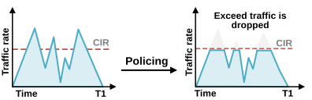
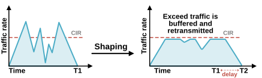
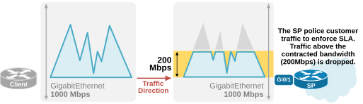
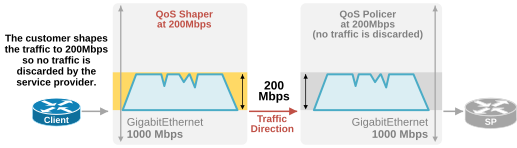

[Policing and Shaping](https://www.networkacademy.io/ccna/network-services/policing-and-shaping)
==========

Policing and Shaping are QoS techniques used to manage and control bandwidth usage. Both QoS features monitor the traffic rate of an interface and compare it to the configured rate limit called CIR (Committed Information Rate). When the traffic exceeds the CIR value, they perform a pre-configured action. 

Policing vs Shaping
-------------------

Packets are transmitted as a series of bits over the communication medium. Bits arrive at a network interface at fluctuating rates, with peaks and valleys. The average rate per second at which the bits arrive is called the traffic rate. It is measured in bits/sec, kilobits/sec, megabits/sec, etc. In short, Kbps, Mbps, Gbps, etc.

### Policing

Policing is a QoS feature that monitors the traffic rate of an interface against a configured policing rate called CIR. When an arriving packet pushes the current traffic rate above the configured policing rate (CIR), the policer takes action. The action is typically to drop the packet, but it can also be looser, like remark the QoS value of the packet.

For example, the following diagram shows a policer that discards traffic that exceeds the CIR rate.



Figure 1. QoS Policing.

In summary, policing is a QoS feature that **prevents traffic from exceeding the configured CIR rate** by discarding any packets that push the current traffic rate above the CIR rate.

### Shaping

Shaping is a QoS feature that also prevents traffic from exceeding the configured traffic rate (CIR). However, it uses a different logic. Instead of discarding the packets that push the current traffic rate above the CIR rate, **it buffers and transmits the exceeding traffic over time**.

For example, the following diagram shows a shaper that holds exceeding traffic in a buffer and transmits it over time when the current traffic rate is lower. 



Figure 2. QoS Shaping.

Notice something very important about shapers — holding traffic in buffers introduces latency.

Use cases for QoS Policing and Shaping
--------------------------------------

You cannot really understand what policing and shaping do and why they exist in the QoS toolset unless we review the use cases for both features.

### Where policing is commonly used?

Policing is one of those features that makes people initially think — *How does dropping packets could be good for the network?* It seems exactly the opposite of what the network must do — reliably transport packets to their destinations.

By far, the most common use case for policing is **enforcing service level agreements (SLA)**. For example, you are a service provider that sells connectivity to customers. When you sell 200 Mbps WAN service to a customer, you must ensure that the customer is not sending more traffic than that. A service provider has thousands of customers. If all those customers consistently sent traffic above their agreed bandwidth limit, this could lead to significant congestion in the WAN, potentially overwhelming the SP core. Additionally, customers might exploit the situation by purchasing lower bandwidth limits, knowing their excess traffic would still be forwarded.

So, what does the service provider do? It strictly enforces the agreed bandwidth limits (CIR) **by configuring a QoS policer on the customer-facing interface**, as shown in the diagram below. 



Figure 3. QoS Policer use case.

When the customer on the left sends more than 200 Mbps of traffic, the service provider discards the traffic that exceeds the agreed bandwidth limit. By enforcing the agreed SLAs for all customers, the service provider ensures that no single customer starves others of bandwidth.

Another very common use case is preventing excessive bandwidth usage by specific hosts, applications, or network devices. For example, suppose you know that a host can generate a very high traffic volume that can cause network congestion. In that case, you can apply an ingress QoS policer to the interface that connects to that host and police the traffic bursts exceeding a configured rate.

Another common use of policing is protecting a device's control plane from denial of service (DoS) or other abusive traffic. 

**KEY POINT:** Policing can be used inbound and outbound. However, it is most commonly used inbound on customer-facing interfaces.

### Where shaping is commonly used?

QoS shaping is commonly used in scenarios where it is necessary to smooth traffic flows in order to comply with the service provider's SLA. For example, align traffic with the capacity of a WAN link, as shown in the diagram below.



Figure 4. QoS Shaper use case.

Service providers always apply ingress traffic policers to enforce the agreed bandwidth limits. That's why **you always shape outbound traffic on the WAN link to the agreed-upon bandwidth** to avoid congestion and packet loss, which policing might introduce at the service provider's edge.

**KEY POINT:** Shaping can only be used outbound. It is most commonly used on WAN links to service providers.

### Comparison

| Feature | Policing | Shaping |
|---------|----------|---------|
| Mechanism | Drops or re-marks exceeding packets | Buffers exceeding packets and transmits later |
| Direction | Inbound or outbound | Outbound only |
| Latency | No additional latency (drops immediately) | Adds latency (buffering) |
| Common use | SP enforcing SLA (ingress), control-plane protection | Customer smoothing traffic to meet SP SLA (outbound) |
| Burst handling | Drops bursts above CIR | Buffers bursts and sends during idle periods |
| Result | Drop may cause TCP retransmissions | Smoother traffic flow, no drops |

### Configuration Examples

Both policing and shaping are configured using the MQC framework (class-map, policy-map, service-policy).

#### Policing Configuration

The following example polices traffic on an interface to a maximum of 10 Mbps. Traffic exceeding the limit is dropped.

```
! Step 1: Class-map (match interesting traffic, or use class-default)
class-map match-any CRITICAL-TRAFFIC
 match protocol http
 match protocol https
!

! Step 2: Policy-map with police action
policy-map POLICE_POLICY
 class CRITICAL-TRAFFIC
  police 10000000 bc 2000000 be 2000000
   conform-action transmit
   exceed-action drop
!
 class class-default
  police 10000000 bc 2000000 be 2000000
   conform-action transmit
   exceed-action drop
!

! Step 3: Attach to interface inbound
interface GigabitEthernet0/0/0
 service-policy input POLICE_POLICY
!
```

The **police** command parameters:

- **10000000** — CIR in bits per second (10 Mbps).
- **bc** — Burst committed (normal burst size in bytes).
- **be** — Burst excess (maximum burst size in bytes).
- **conform-action** — What to do with traffic within CIR (transmit).
- **exceed-action** — What to do with traffic above CIR (drop).

You can also use the **percent** option to specify the police rate as a percentage of the interface bandwidth.

```
policy-map POLICE_PERCENT
 class class-default
  police percent 50
   conform-action transmit
   exceed-action drop
!
```

#### Shaping Configuration

The following example shapes outbound traffic on a WAN interface to an average rate of 10 Mbps.

```
! Step 1: Class-map
class-map match-any ALL-TRAFFIC
 match any
!

! Step 2: Policy-map with shape action
policy-map SHAPE_POLICY
 class ALL-TRAFFIC
  shape average 10000000
!
 class class-default
  shape average 10000000
!

! Step 3: Attach to interface outbound
interface Serial0/0/0
 service-policy output SHAPE_POLICY
!
```

The **shape average** command parameters:

- **10000000** — CIR in bits per second (10 Mbps). The shaper will buffer packets that exceed this rate and transmit them when the traffic rate drops below the CIR.

You can also shape to a percentage of the interface bandwidth:

```
policy-map SHAPE_PERCENT
 class class-default
  shape average percent 50
!
```

#### Policing with Re-marking (Alternative to Drop)

Instead of dropping exceeding traffic, you can re-mark it to a lower DSCP value, allowing it through but with lower priority for downstream queuing.

```
policy-map POLICE_REMARK
 class CRITICAL-TRAFFIC
  police 10000000
   conform-action transmit
   exceed-action set-dscp-transmit af11
!
```

This approach is more forgiving — the traffic is still forwarded but marked as less important, so it will be dropped first during downstream congestion.

### Summary

- **Policing** drops or re-marks traffic exceeding the CIR. Used inbound at the SP edge. No added latency.
- **Shaping** buffers traffic exceeding the CIR and sends it later. Used outbound on customer WAN links. Adds latency but avoids drops.
- Both use the MQC framework: class-map to match, policy-map with **police** or **shape** action, service-policy to attach.
- **Policing** can be input or output; **shaping** is output only.
- Policing with re-marking is a softer alternative to dropping.

In the next lesson, we will look at **Queuing and Scheduling**.