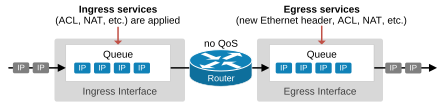
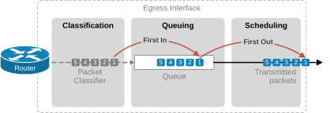
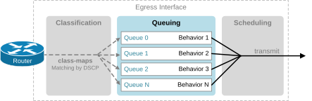
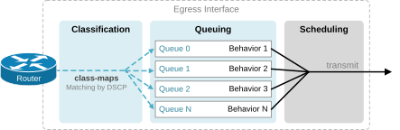
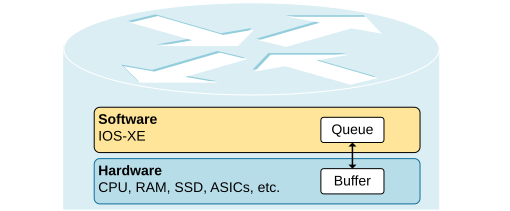
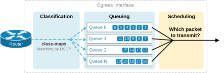
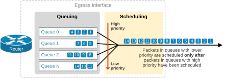
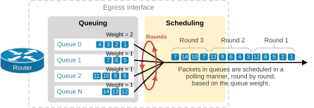

[Queuing and Scheduling](https://www.networkacademy.io/ccna/network-services/queuing-and-scheduling)
==========

Networking is all about moving packets around. When a device receives a packet on an interface, it doesn't immediately transmit it over another interface. First, it must apply all configured ingress services, such as ACL, NAT, and IPsec. It must also make a forwarding decision and replace the packet's Ethernet header. Then, it must apply all configured egress services, such as NAT, ACL, IPsec, etc. The device has to perform multiple tasks when it receives and before it sends the packet. Hence, **the packet must wait somewhere** while the device performs all processes and makes a forwarding decision. That's why every network interface has a queue that temporarily holds packets. 

What is a Queue?
----------------

Every network interface uses at least one queue to copy and temporarily hold packets. When no Quality of Service (QoS) is configured on an interface, the interface operates with **a single default queue:**

- When a packet arrives on an interface, the device holds it in the queue while performing ingress operations like ACL, NAT, and a forwarding decision.
- When a packet is scheduled for transmission, the device holds it in the egress interface queue while performing egress operations like replacing the Ethernet header, outbound ACL, NAT, GRE, IPsec, etc.

The following diagram illustrates the concept of interface queuing.



Figure 1. Interface queue with no QoS.

What is FIFO?
-------------

The router manages the packets in the queue using a queuing method called FIFO (First In, First Out). FIFO means that the packets are processed in the order of their arrival in the queue, as shown in the diagram below. 



Figure 2. What is FIFO?

The packet that arrived first in the queue is processed first. The one that arrived second is processed second, and so on. It is the same queuing method as waiting in the ice cream ordering line. Whoever comes first orders first.

Differentiated Services (Multiple Queues)
-----------------------------------------

This default single queue using FIFO has one major disadvantage in the context of Quality of Service — **it does not allow for prioritization and differentiation of important traffic** over less important traffic. All packets go in the same queue, and the device cannot differentiate between them. 

To treat different traffic classes based on their importance to the business, the device needs to have multiple queues and split different traffic classes into separate queues, as shown in the diagram below.



Figure 3. An interface with multiple queues.

Splitting the traffic into multiple queues allows the scheduler to treat different traffic classes differently (hence the term "DiffServ" — Differentiated Services).

Classification and Queuing
--------------------------

Now, consider the example with an interface with multiple queues in greater detail. The next logical question is how to split the traffic into different queues. This is the job of the classification process. It can rely on previously marked DSCP values or perform more complex matching. In a typical QoS strategy, packets are classified and marked with DSCP values at the network's access layer (as close to the end host as possible). Then, on the WAN edge, the classification process simply matches the existing QoS marking — the DSCP values in the IP header.



Figure 4. QoS Classification and Queuing.

The primary function of the classification process is to split traffic based on the importance of the business. Also, keep in mind that since we use class maps to separate traffic into different queues, people often use the terms *a queue* and *a class* interchangeably, meaning the same thing. 

Queue vs Buffer
---------------

When we talk about queues, we must also discuss what is a buffer and what is the difference between the two. Before continuing, let's get this out of the way. In a simplified language, **a queue is a logical structure in the software** (e.g., IOS-XE), while **a buffer is a physical memory space (RAM)**.

It has the same logic as tunnel interfaces — for example, interface Tunnel5. It is a logical construct. There is no such physical interface, right? However, we work with the logical interface Tunnel5 from an operational and configuration standpoint. We configure routing on the Tunnel interface, check the Tunnel interface status, and so on. In the end, the device's software translates the logical construct into a physical process.

Queues and Buffers have the same relationship. We work with the logical construct — queues. We configure queues. We check if a queue is full and drops traffic, etc. The software (IOS-XE) translates the logical construct into a physical process behind the scenes.



Figure 5. Queue vs Buffer.

In summary, queues determine the order and how packets are processed, while buffers provide the physical space to temporarily hold packets during processing. Both work together to handle traffic effectively in networking devices.

Scheduling
----------

When an interface has multiple queues with packets, a logical question arises: In what order does the device transmit packets from each queue? Since there are multiple queues, the question is not simple at all. This is the job of the scheduler and the scheduling algorithm.



Figure 6. Queuing and Scheduling.

Let's say we split the traffic into queues based on business importance. The most important traffic is in queue 0, and the least important traffic is in queue N.

Let's examine some of the most common scheduling methods.

### Priority Queueing (PQ)

Priority Queuing (PQ) is a simple scheduling algorithm that supports differentiated services. The logic is that each queue has a priority, with queue 0 having the highest priority. The scheduler **always processes packets from the highest-priority queue first**. Once the highest-priority queue is empty, it moves to the next lower-priority queue. 

Consider the example shown in the diagram below. The PQ scheduler only services Queue 0 until it is empty. Then, it only services Queue 1 until it's empty. Then Queue 2 and so on.



Figure 7. Priority Queueing (PQ).

This scheduling method has a significant drawback: What if queue 0 is always full of packets? If the traffic in a high-priority queue is constantly high, lower-priority queues might wait indefinitely until their packets age out, which is called **queue starvation**. 

Priority Queueing (PQ) is a very effective scheduling method for delay-sensitive traffic such as voice and video, but it needs careful configuration to avoid starvation for lower-priority queues.

### Weighted Fair Queueing (WFQ / CBWFQ)

Weighted Fair Queueing (WFQ) is another scheduling method that **services queues in rounds** (also called turns). It assigns each queue a weight value, which determines how much bandwidth the queue receives each round. Queues with higher weights receive more bandwidth than those with lower weights. 



Figure 8. Weighted Fair Queuing.

The algorithm ensures all queues get some bandwidth, even if high-priority traffic is present (hence "fair queueing"). It prevents low-priority queues from being completely ignored and starved. If all queues contain many packets, the scheduler allocates bandwidth to each queue corresponding to its weight value. However, if a queue is empty and temporarily does not require bandwidth for some period, the scheduler allocates the bandwidth among the remaining queues.

Notice one important thing: Weighted Fair Queueing (WFQ) uses MQC (Modular QoS CLI) for configuration and class maps for classification. That's why it is typically referred to as Class-based Weighted Fair Queueing (CBWFQ).

WFQ has one significant limitation — It does not offer priority levels in its scheduling. All queues are serviced each turn. Therefore, traffic flows with a very high demand for delay and jitter must also wait for their scheduling turn and might be affected by the order of other queues. For example, suppose there are 10 VoIP packets in queue 0. We generally want them transmitted before any other packets. However, with WFQ, only 2 packets are transmitted each turn because that is the weight value of Queue 0. 

That's why Cisco incorporates both PQ and WFQ into one scheduling method, which combines the advantages of both PQ and WFQ but offsets the disadvantages.

### Low Latency Queueing (LLQ)

Low Latency Queueing (LLQ) combines strict priority queueing (PQ) and class-based weighted fair queuing (CBWFQ), as shown in the diagram below.


Figure 9. Low Latency Queuing (LLQ).

LLQ works as follows:

- **One or more priority queues**: Designated traffic classes (e.g., voice) are assigned to a strict priority queue. The scheduler services this queue first, exactly like PQ. This ensures the absolute lowest delay and jitter for delay-sensitive traffic.
- **CBWFQ queues**: All other traffic classes are serviced using CBWFQ (weighted fair queueing). Each class gets a guaranteed minimum bandwidth.
- **Policing of the priority queue**: To prevent queue starvation, LLQ polices the priority queue. If the priority traffic exceeds a configured bandwidth limit, the excess packets are dropped (not buffered). This ensures that high-priority traffic cannot consume all available bandwidth and starve other queues.

LLQ is the recommended scheduling method on Cisco devices for modern networks because it provides:

- Very low latency and jitter for real-time traffic (voice, video).
- Fair bandwidth distribution for all other traffic.
- Protection against priority queue starvation via policing.

### Configuration Example (LLQ)

The following example shows how to configure LLQ on a WAN edge router using the MQC framework.

```
! Step 1: Class-maps for different traffic types
class-map VOICE
 match ip dscp ef
!
class-map VIDEO
 match ip dscp af41
!
class-map CRITICAL-DATA
 match ip dscp af31
!
class-map BULK-DATA
 match ip dscp af11
!

! Step 2: Policy-map with LLQ
policy-map WAN-EDGE-POLICY
 class VOICE
  priority 1000        ! Strict priority queue, policed at 1 Mbps
 class VIDEO
  priority 4000        ! Strict priority queue, policed at 4 Mbps
 class CRITICAL-DATA
  bandwidth 8000       ! Guaranteed 8 Mbps via CBWFQ
 class BULK-DATA
  bandwidth 4000       ! Guaranteed 4 Mbps via CBWFQ
 class class-default
  fair-queue           ! Remaining bandwidth shared via fair queueing
!

! Step 3: Apply to WAN interface outbound
interface Serial0/0/0
 service-policy output WAN-EDGE-POLICY
!
```

Key configuration notes:

- The **priority** command puts the class into the strict priority queue and polices it at the specified rate (kbps). Excess priority traffic is dropped.
- The **bandwidth** command guarantees a minimum amount of bandwidth (kbps) to the class via CBWFQ.
- The **fair-queue** command on class-default uses flow-based fair queueing to distribute remaining bandwidth among all other flows.
- Multiple priority classes can exist (as shown with VOICE and VIDEO), but the total priority policed rate must not exceed the interface bandwidth.

### Scheduling Methods Comparison

| Method | Mechanism | Latency for priority traffic | Risk of starvation | Use case |
|--------|-----------|------------------------------|-------------------|----------|
| FIFO | Single queue, first-come-first-served | High | N/A | No QoS |
| PQ | Strict priority, lower queues after | Very low | High | Specialized low-latency needs |
| WFQ/CBWFQ | Weighted round-robin | Moderate | None | Fair distribution among classes |
| LLQ | Strict priority + policed + CBWFQ | Very low (policed) | None (policing prevents) | Modern converged networks |

### Summary

- **Queues** are logical constructs that hold packets during processing. **Buffers** are the physical RAM backing the queues.
- Without QoS, all packets share a single FIFO queue — no differentiation.
- **Classification** splits traffic into multiple queues based on business importance (typically using DSCP markings).
- **Scheduling** determines the transmission order from multiple queues.
- **PQ** provides strict priority but can starve lower queues.
- **WFQ/CBWFQ** provides fair weighted round-robin with no starvation but higher latency for real-time traffic.
- **LLQ** combines PQ + CBWFQ with policing on the priority queue — it is the recommended scheduling method on Cisco devices.

In the next lesson, we will look at **Congestion Avoidance**.