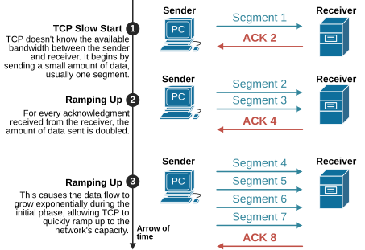
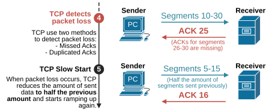
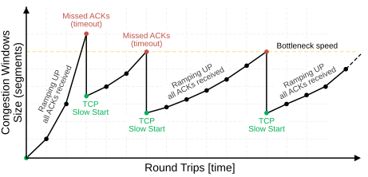
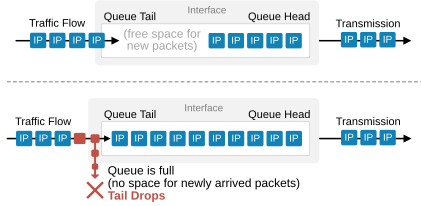
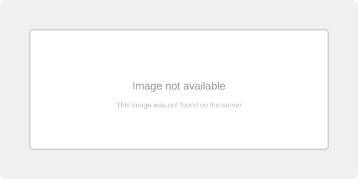
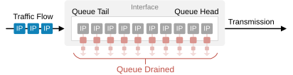
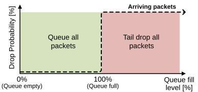

[Congestion Avoidance](https://www.networkacademy.io/ccna/network-services/congestion-avoidance)
==========

Congestion Avoidance is a QoS technique that aims to minimize network congestion (as the name implies) **by proactively discarding certain packets used in TCP connections**. To understand its functionality, it is essential first to know how TCP handles windowing and then explore how congestion avoidance mechanisms take advantage of this TCP process.

TCP Windowing
-------------

TCP windowing is a mechanism the protocol uses to manage the data flow between a sender and a receiver. It controls **how much data the sender can send before waiting for an acknowledgment from the receiver**. This process ensures that the sender does not overwhelm the receiver or the network with too much data at once.

As the sender transmits data as TCP segments, it waits for acknowledgments. Each acknowledgment indicates that the receiver has successfully received the data and is ready for more. Let's explain the process in a simplified way using the diagram below. 



Figure 1. TCP Windowing Slow Start.

Initially, the sender doesn't know the available network bandwidth up to the receiver or the receiver's capacity. That's why the sender first sends a tiny amount of data — typically one TCP segment (step 1). This process is referred to as the **TCP Slow Start**.

Every time the sender sends data and receives an acknowledgment, it tries to send more by doubling the number of segments (steps 2 and 3). This process is referred to as **Ramping Up**. 

Eventually, this data transmission process reaches the point where the sender sends more data than the network can handle or the receiver can process. In both cases, the sender detects that the TCP segments were lost, as shown in the diagram below.



Figure 2. TCP detects packet loss.

When TCP detects that a segment has been lost, the sender reduces the amount of data it sends by one-half. If multiple segments have been lost, the sender shrinks the sending amount by half numerous times. Then, the sender starts ramping up again by doubling the number of sent segments every time it receives successful acknowledgments.  

Keep in mind this is a simplified explanation of the process. It is much more complex at a low level and involves additional parameters. Also, there are multiple different implementations of the TCP protocol. However, the main point to remember is that a TCP data transmission between a sender and a receiver is not a straight line. It is a dynamic process of trying to utilize all the available bandwidth and the receiver's capacity, as shown in the diagram below.



Figure 3. TCP Phases Simplified.

It is especially important **to understand the TCP windowing process at a high level** because the QoS Congestion Avoidance takes advantage of this TCP process. 

Queue Drops
-----------

There is one more thing that we need to have as a context before jumping into the congestion avoidance techniques.

Queue drops occur when packets are discarded because a queue is unable to accommodate more packets. This happens when the queue reaches its maximum capacity. Let's discuss the different scenarios when a queue drops packets.

### Tail Drops

Packets arrive at the tail of a queue. If the queue has space for new packets, they enter the queue and stay until they are scheduled for transmission. However, if the queue becomes full, **new packets cannot be added and are dropped**. This is called a "tail drop" because the packets arriving last, at the "tail" of the queue, are the ones that are dropped.



Figure 4. Tail Drops.

The diagram above illustrates the tail drop process. Notice that within an individual queue, the queuing mechanism is always FIFO — First In, First Out. If you don't follow the lessons in order and don't know what FIFO is, check out our previous lesson on [Queueing and Scheduling](https://www.networkacademy.io/ccna/network-services/queuing-and-scheduling). 

### Head Drops

Once a packet enters a queue doesn't automatically mean it will be transmitted. A queue can also drop packets at the head. If the queue does not receive a scheduling slot for some time, **packets age out and are dropped out of the queue** from the head, as shown in the diagram below.



Figure 5. Head drops.

This can happen to a low-priority queue at times of congestion, depending on the scheduling mechanism in use. However, this dropping action doesn't typically occur with modern scheduling techniques such as LLQ and CBWFQ.

The queue can be drained entirely in extreme congestion situations to prevent traffic stalling and other resource overutilization problems. 



Figure 6. Queue completely drained.

However, tail drops are by far the most commonly encountered queue drops that the interface experiences during congestion.

Why do we need Congestion Avoidance?
------------------------------------

Knowing how TCP works at a high level and how a queue manages traffic in times of congestion is a prerequisite to understanding the QoS Congestion avoidance techniques.

The following diagram shows a graphical representation of the tail drop behavior of queues. The vertical axis represents the probability of a packet getting dropped. The horizontal axis shows the queue fill level in the context of arriving packets.



Figure 7. Tail Drop.

You can clearly see that the probability of a packet being dropped **is zero percent until the queue fills up completely**. Once the queue is full, the drop probability becomes 100%, meaning newly arriving packets have a 100% chance of getting dropped.

This behavior is pretty straightforward. There are two scenarios when this behavior is not desirable from a network point of view:

- **TCP synchronization**: When multiple TCP connections experience packet loss at the same time, their TCP window sizes shrink to one-half at the same time. Then they all start ramping up again simultaneously. In the bigger scheme of things, this results in a period of **massive underutilization** of the network path, followed by a period of **overutilization**. The process typically repeats multiple times until the TCP connections are active, causing a sawtooth pattern of underutilization and congestion.
- **No differentiation**: A queue typically holds multiple different types of traffic. When the queue drops traffic at the tail, it does not differentiate between the packets. It simply drops the newly arrived ones. This may impact business-critical applications, which is not desirable.

That's why a quality of service (QoS) tool called WRED has been introduced to prevent a queue from becoming completely full and starting to drop packets.

What is Weighted Random Early Detection (WRED)?
-----------------------------------------------

Weighted Random Early Detection, or WRED, is a method that prevents congestion and tail drops by taking advantage of the TCP windowing mechanism. It works by selectively dropping packets **before the queue becomes full** and experiences tail drops. The following diagram illustrates the WRED working logic in a graphical way.


Figure 8. WRED.

WRED introduces two thresholds:

- **Minimum Threshold**: When the queue fill level is below this threshold, no packets are dropped.
- **Maximum Threshold**: When the queue fill level reaches this threshold, all arriving packets have a probability of being dropped.

Between the minimum and maximum thresholds, WRED randomly drops packets with an increasing probability as the queue fill level rises. The drop probability increases linearly from 0% at the minimum threshold to the configured maximum drop probability at the maximum threshold.

### How WRED leverages TCP

When WRED drops a packet belonging to a TCP flow, the TCP sender detects the loss and reduces its window size by half. This causes the TCP flow to slow down, giving the queue time to drain. Because the drops are **random** and occur before the queue is full, only a few TCP flows are affected at a time (not all of them simultaneously). This prevents the TCP synchronization problem:

- Without WRED: Queue fills up → tail drop drops packets from ALL TCP flows → ALL senders halve their window → link underutilized → all ramp up → queue fills again.
- With WRED: Queue starts filling → WRED randomly drops a packet from ONE TCP flow → only that sender halves its window → queue drains slightly → other flows continue unaffected → stable queue depth.

### WRED with DSCP (Differentiated Drop)

WRED can differentiate based on DSCP markings. Packets with a lower DSCP priority can be assigned lower minimum/maximum thresholds, meaning they are dropped earlier than higher-priority traffic. For example:

- AF11 (low priority data): Minimum threshold 20, Maximum threshold 40
- AF31 (medium priority data): Minimum threshold 30, Maximum threshold 50
- EF (voice, high priority): Not subject to WRED at all (uses priority queue)

This ensures that when congestion looms, the least important traffic is dropped first, protecting business-critical flows.

### Configuration Example

WRED is configured under a class within a policy-map. It is typically applied to CBWFQ classes (not priority classes).

```
! Step 1: Class-maps
class-map CRITICAL-DATA
 match ip dscp af31
!
class-map BULK-DATA
 match ip dscp af11
!

! Step 2: Policy-map with WRED
policy-map WAN-EDGE-POLICY
 class VOICE
  priority 1000                    ! PQ — no WRED
 class CRITICAL-DATA
  bandwidth 8000
  random-detect dscp-based         ! WRED with DSCP differentiation
 class BULK-DATA
  bandwidth 4000
  random-detect dscp-based
 class class-default
  fair-queue
  random-detect                    ! WRED on default class
!

! Step 3: Apply to interface outbound
interface Serial0/0/0
 service-policy output WAN-EDGE-POLICY
!
```

You can also customize the WRED thresholds per DSCP value:

```
policy-map CUSTOM-WRED
 class BULK-DATA
  bandwidth 4000
  random-detect dscp 18 20 40 10   ! DSCP AF21: min 20, max 40, max-prob 10%
  random-detect dscp 10 15 30 10   ! DSCP AF11: min 15, max 30, max-prob 10%
!
```

The parameters for `random-detect dscp <value> <min-threshold> <max-threshold> <max-probability>`:

- **min-threshold**: Queue depth (in packets) at which random dropping begins.
- **max-threshold**: Queue depth at which drop probability reaches the maximum.
- **max-probability**: The maximum drop probability (1/x, where x is the value; default is 10, meaning 1/10 = 10% drop probability at max-threshold).

### Verification

Use the following commands to verify WRED operation:

```
! Check WRED statistics on an interface
show policy-map interface Serial0/0/0

! Check WRED queue depths and drops
show queueing random-detect interface Serial0/0/0
```

### Summary

- **TCP windowing**: TCP senders dynamically adjust their transmission rate. Packet loss causes them to halve their window and ramp up again (slow start).
- **Tail drop problem**: Causes TCP synchronization (all flows stop and start together) and does not differentiate traffic.
- **WRED**: Proactively drops packets before the queue is full, causing only a few TCP flows to slow down at a time, preventing synchronization.
- **DSCP-based WRED**: Drops lower-priority traffic earlier, protecting business-critical flows.
- **WRED is not applied to priority queues** (LLQ priority classes) because real-time traffic (voice/video) does not use TCP retransmission.
- **WRED is applied to CBWFQ classes and class-default** to manage TCP-based data traffic.

This concludes the QoS module. You now have a solid understanding of all the key QoS components: Classification and Marking, Policing and Shaping, Queuing and Scheduling, and Congestion Avoidance (WRED).