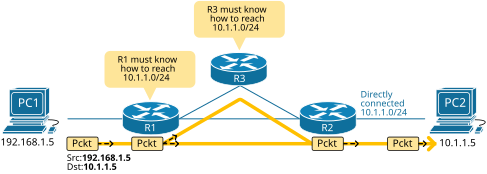
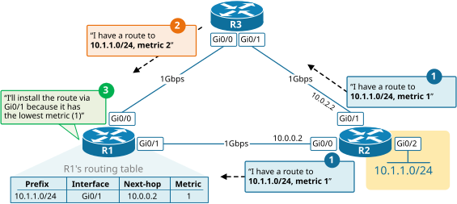
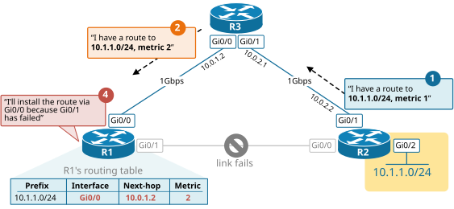
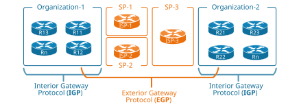
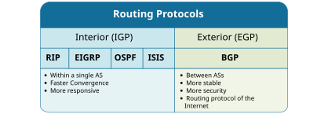
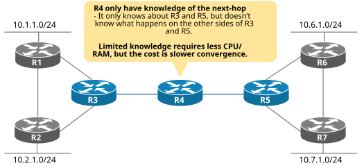
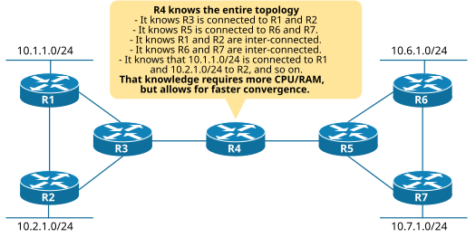

[Why do we need OSPF?](https://www.networkacademy.io/ccna/ospf/why-do-we-need-ospf)
==========

# Why do we need OSPF?

Let's keep it simple. What does an IP network do? - An IP network enables computers to communicate with each other by forwarding data packets from router to router until packets reach their final destination. For example, PC-1 (192.168.1.5) sends packets to PC-2 (10.1.1.5) over the network shown in figure 1. When R1 receives the packets, it must know how to reach the destination subnet 10.1.1.0/24; otherwise, it will discard the packets. Typically, all routers in a network must know how to reach each IP subnet. To do that, routers install IP routes into their routing tables using three different techniques: **connected** routes, **static** routes, and routes learned by using **dynamic routing** protocols.

Figure 1. IP routing overview

For example, R2 knows how to reach PC-2 because it has an interface in subnet 10.1.1.0/24 and installs a connected route in its routing table. However, by default, R1 and R3 don't know how to reach 10.1.1.0/24. Either a network administrator must configure a static route, or R2 must automatically tell R1 and R3 that they can send packets destined to 10.1.1.0/24 toward him. That is what a dynamic routing protocol does.

Another important aspect is choosing the best path to a destination. For example, how would R1 decide where to forward the packets destined to PC-2? Obviously, there are two possible network paths, one via R2 and one via R3. Dynamic routing protocols have algorithms that can calculate which route is the best path to a destination.

## Routing Protocols Functions

In general, a dynamic routing protocol such as OSPF performs the following general functions:

1. Learn routing information about IP subnets from connected interfaces and adjacent routers.
2. Advertise routing information to adjacent routers.
3. If multiple network paths exist to the same subnet, install the best route (based on a metric) into the routing table.
4. If a link fails and the network topology changes - trigger a topology recalculation and choose a new best route.

Figure 2 shows an example of the first three steps. R2 advertises its directly connected subnet 10.1.1.0/24 to its neighboring routers. R3 and R1 learn that routing information and re-advertise it to their neighboring routers. In the end, R1 receives two routes to 10.1.1.0/24 and must choose the best path and install it in its routing table.

Figure 2. Routing Protocol Functions in Normal Operations

The fourth routing protocol function occurs when the network topology changes if a device or a link fails. When a failure occurs, the currently installed best route to a destination may no longer be the best available network path. In that case, routers inform each other, re-advertise the available paths, and collectively recalculate the network topology. Then each router selects a new best route. This process is called **convergence**.

Figure 3. Routing Protocol Functions in case of a failure

Convergence is one of the most important functions of dynamic routing protocols and typically is the main consideration point when an organization chooses which routing protocol to use.

## Comparing Routing Protocols

Network routing protocols fall into different categories and classes based on the scope they have and the algorithm they use. Let's explore the difference between the different protocol categories and see whether OSPF falls into them.

### Based on scope - Interior vs. Exterior Routing Protocols

Network routing protocols fall within two major categories based on their scope :

- **Interior gateway protocol (IGP)**
- **Exterior gateway protocol (EGP)**

Figure 4 shows an example of the scope of IGP and EGP. IGP is a routing protocol used within the boundaries of a single organization (a single autonomous system). Within organization-1's network, an interior routing protocol such as OSPF or EIGRP is used.

Figure 4. Interior vs. Exterior Routing Protocols

EGP is a routing protocol that exchanges routes between different organizations (different autonomous systems). Today, BGP is the only exterior protocol in use. It was designed to control the routing information exchanged between different organizations' networks, known as autonomous systems (AS).

Figure 5 shows a comparison between IGP and EGP protocols. If you are wondering why the protocol categories are called "Gateway protocols," that's because network routers were called gateways back in the day.

Figure 5. Interior vs. Exterior Protocols Comparison

### Based on the algorithm - Distance Vector vs. Link-State Protocols

Routing protocols can be separated into three classes based on the underlying algorithm that determines how the routing protocol works:

- **Distance-vector** - RIP
- **Link-state** - OSPF, IS-IS
- **Hybrid** (sometimes called "Advanced Distance-vector") - EIGRP

#### Distance-vector Protocols

A distance vector protocol is a dynamic routing algorithm where each network router sends its entire routing table to its neighboring routers. The neighboring routers then forward their routing knowledge to their adjacent routers, and so on, until each one learns everything. For example, R4 sends its whole network knowledge to R3 and R5. R3 then forwards that information to R1 and R2, and R5 forwards it to R6 and R7.

Figure 6. Routers running a distance-vector protocol

In the end, R4 only knows that it is connected to R3 and R5. It doesn't know where subnet 10.6.1.0/24 is connected. It only knows how to reach 10.6.1.0/24 because R5 has sent him the distance vector to that IP subnet. The distance is what it "costs" to get to the destination from the perspective of R5, and the vector is the "direction" to get there.

#### Link-state Protocols

A link-state protocol is a dynamic routing algorithm where each network router sends information about the state of all its connected links to all routers in the network through a process called "flooding." Ultimately, all routers learn all connected links, and each one calculates the network topology by itself. **In the end, all routers know the entire topology.** For example, R4 knows that R3 is connected to R1 and R2 and that R5 is connected to R6 and R7. It knows that 10.1.1.0/24 is connected to R1, 10.6.1.0/24 is connected to R6, and so on. It can calculate the cost to reach each destination by itself.

Figure 7. Routers running a link-state protocol

The knowledge of the entire topology came with a price: it requires more CPU and RAM on routers and scales more difficult, but also allows for faster convergence. While OSPF can scale to hundreds of routers, network admins must plan carefully to reduce processing and memory overhead using special techniques such as Summarization and OSPF Areas.

From a historical perspective, distance vector protocols were created before the link-state ones. The first distance vector protocol, Routing Information Protocol (RIP), was invented in the 1980s. By the 1990s, it became clear that distance vector protocols have slow convergence times and are suspectable to routing loops. This drove the development of more sophisticated routing protocols - OSPF and ISIS that use the link-state algorithm. In the same period as the introduction of OSPF, Cisco created their proprietary protocol EIGRP, which uses a distance vector algorithm but at the same time has some link-state characteristics. That's why EIGRP is typically classified as a "hybrid" or "advanced distance vector" protocol.

## Why OSPF?

Now that we understand the difference between distance vector and link-state protocols, let's look at why OSPF became the most widely used interior gateway protocol (IGP) in enterprise networks.

**Open standard** — OSPF is defined in RFC 2328 and is an open standard. This means any vendor can implement it, making it ideal for multivendor environments. Unlike EIGRP (which was Cisco proprietary until 2013), OSPF works seamlessly across Cisco, Juniper, Huawei, and any other vendor's equipment.

**Fast convergence** — OSPF detects topology changes almost immediately and propagates them quickly through the network. When a link goes down, OSPF can converge in seconds or even milliseconds, compared to RIP which could take minutes.

**Loop-free topology** — Because every router has a complete view of the network (the link-state database), OSPF builds a loop-free tree using the Shortest Path First (SPF) algorithm. This eliminates the routing loop problems that plagued distance vector protocols like RIP.

**Hierarchical design** — OSPF supports a two-level hierarchy with areas. This reduces the size of the link-state database and the impact of topology changes. Routers only need to know the full topology of their own area, not the entire network.

**Classless routing** — OSPF supports VLSM and CIDR, allowing efficient use of IP address space. RIP version 1 was classful, which caused many limitations.

## OSPF Terminology

Before we go deeper into OSPF, let's get familiar with some key terms.

**Link** — A physical or logical connection between two routers. In OSPF, a link is any interface that is enabled for OSPF.

**Link-State Advertisement (LSA)** — A packet that contains information about a router's connected links and their state. OSPF routers exchange LSAs to build their knowledge of the network.

**Link-State Database (LSDB)** — The collection of all LSAs received from all routers in the same area. Every router in an area has an identical LSDB.

**Shortest Path First (SPF) algorithm** — The algorithm OSPF uses to calculate the best path to each destination. It is also known as Dijkstra's algorithm.

**OSPF Area** — A logical grouping of routers and links. Areas reduce the size of the LSDB and limit the propagation of topology changes.

**Area 0 (Backbone Area)** — The central area in an OSPF network. All other areas must connect to Area 0.

**Router ID (RID)** — A 32-bit number that uniquely identifies each OSPF router. It is usually the highest loopback IP address or the highest physical interface IP address.

**Neighbor** — A directly connected router that is also running OSPF on the same link.

**Adjacency** — A logical relationship formed between OSPF neighbors to exchange routing information.

**Designated Router (DR)** — A router elected on multiaccess networks (like Ethernet) to reduce the number of adjacencies and LSA flooding.

**Backup Designated Router (BDR)** — The backup to the DR. It takes over if the DR fails.

## OSPF vs Other Routing Protocols

| Feature | OSPF | EIGRP | RIP |
|---------|------|-------|-----|
| Type | Link-state | Advanced distance vector | Distance vector |
| Standard | Open (RFC 2328) | Cisco proprietary (open in 2013) | Open (RFC 1058) |
| Convergence | Fast | Very fast | Slow |
| Metric | Cost (based on bandwidth) | Composite (bandwidth, delay, load, reliability) | Hop count |
| Maximum hops | Unlimited | Unlimited | 15 |
| VLSM/CIDR | Yes | Yes | RIPv1: No, RIPv2: Yes |
| Hierarchical | Yes (areas) | No (flat) | No (flat) |
| CPU/Memory | Higher | Medium | Low |
| Scalability | Hundreds of routers | Hundreds of routers | Small networks |

## Summary

- **OSPF** is an open-standard link-state routing protocol widely used in enterprise networks.
- It offers **fast convergence**, a **loop-free topology**, and **hierarchical design** through areas.
- OSPF uses the **SPF algorithm** (Dijkstra's) to calculate the shortest path to each destination.
- Key OSPF terms include **LSA**, **LSDB**, **Area**, **Router ID**, **neighbor**, **adjacency**, **DR**, and **BDR**.
- Compared to EIGRP and RIP, OSPF is the most scalable and vendor-neutral IGP for modern networks.
