[What is OSPF?](https://www.networkacademy.io/ccna/ospf/what-is-ospf)
==========

# What is OSPF?

In this lesson, we will introduce some of the most fundamental OSPF concepts, which will serve as the context for the following lessons.

## OSPF at a high level

Let's start at a higher level, as simple as possible. OSPF is a link-state routing protocol that uses a mathematical algorithm **to determine the best path to every IP destination** in the network. For example, if you have a network with a hundred routers running OSPF, each router knows how to reach every destination in the network via the most optimal path.

### The OSPF Network

Suppose we have a large enterprise network like the one shown in the diagram below. There are many different network paths between every two sites. Network administrators have two choices:

- They can manually configure each router in the network with the best path to each destination and then reconfigure it again on link failure.
- Or they can use a dynamic routing protocol such as OSPF that **automatically calculates the best paths and reacts to link failures** and topology changes.

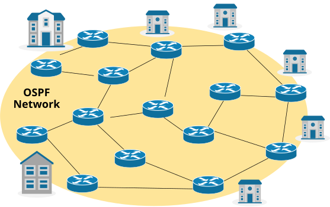

Figure 1. An IP Network

Of course, every organization uses a dynamic routing protocol, and OSPF is among the most popular. It has been around for 30+ years. It has been widely adopted worldwide in enterprise, data center, and service provider networks.

However, for someone new to IP networking, this creates a false impression that OSPF is somehow a centralized network function. The reality is that **each router in the network runs an independent local instance of the OSPF protocol**.

However, using OSPF messages, each router advertises practically every detail about every connected link. This results in all routers collectively accumulating information about every device and network in the environment. Subsequently, every router knows how to reach every IP destination via the optimal network path.

### The OSPF Process

From a single router perspective, OSPF is a process that runs on the device alongside all other processes. It uses a set of tables, databases, and messages to exchange information with other routers. The ultimate goal of the routing process is to update the device's routing table with the best paths, as shown in Figure 2.

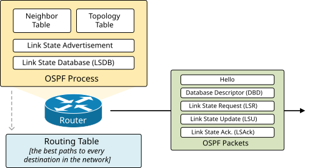

Figure 2. The OSPF Process

By default, the OSPF process is disabled on all Cisco IOS and IOS-XE devices. We start the process using a global configuration command and assigning a process ID. The process ID does not need to match all routers within the network. It is a local identifier used to identify a specific instance of the OSPF routing process running on that router. It is purely local and has no significance outside the router. For example:

```plaintext
Router# conf t
Enter configuration commands, one per line.  End with CNTL/Z.
Router(config)# router ospf ?
  <1-65535>  Process ID
Router(config)# router ospf 1
Router(config-router)# end
Router#
```

Once we enable the OSPF process, the device first tries to assign a router ID. If it does not succeed, the process cannot start, as you can see in the log below.

```plaintext
*Jul  9 14:47:06.725: %OSPF-4-NORTRID: 
OSPF process 1 failed to allocate unique router-id and cannot start
```

### The Router ID

When it initializes, the OSPF process tries to allocate a unique 32-bit identifier called the Router ID (RID). The process cannot generate and send messages without an RID.

Each router uses the following steps when trying to assign the RID:

1. **Step 1.** First, the router checks if a router ID is explicitly configured via the router-id command under the OSPF process.
2. **Step 2.** If no ID is explicitly provided, the router tries to use the highest loopback IP address, which is not in the admin shutdown state.
3. **Step 3.** If the router still cannot assign RID at step 2, it tries to use the highest non-loopback IP address.

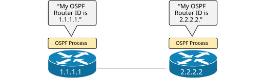

Figure 3. The Router ID

As a general rule of thumb, network engineers explicitly set the router ID using the router-id command.

### Becoming Neighbors

Once the OSPF process on a router has successfully chosen a Router ID, it starts sending Hello messages on all OSPF-enabled interfaces.

When two routers sit on the same VLAN, Serial, or WAN link, they hear each other's Hello messages and become neighbors, as shown below.

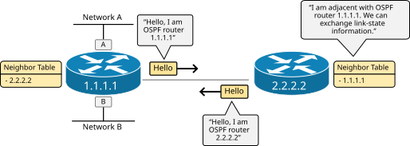

Figure 4. Becoming OSPF neighbors

The neighbor model has two primary functions:

- It allows routers to dynamically discover new OSPF routers on a shared segment without requiring manual configuration from a network administrator.
- It allows the routers to exchange their link-state network knowledge.

The following output shows how we check the neighbors of a router.

```plaintext
R1# sh ip ospf neighbor
Neighbor ID   Pri   State     Dead Time   Address    Interface
2.2.2.2         1   FULL/DR   00:00:38    10.1.1.2   Ethernet0/0
```

### Exchanging Database Information

Once two devices become neighbors, the next step is to exchange their link-state database information. Let's break down what link-state means:

- A link is simply a router interface. Look at the diagram below, for example. Interface A is a link. Interface B is another link. Interface C is another, and so on.
- The link state describes the interface's properties, such as its IP address and mask, interface type, relationship with neighboring routers, and so on.

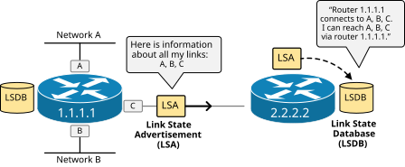

Figure 5. Exchanging Database Information

For example, router 1.1.1.1 has three links: A, B, and C. Using a Link-State Advertisement (LSA), the router shares the link-state information about A, B, and C with its neighboring router 2.2.2.2.

#### LSA flooding

If we look at the database exchange process on a larger scale, we can see how the link-state advertisement process works. Suppose we have just added a new link on router 1.1.1.1, as shown in the diagram below. To ensure that every router knows that a new link with IP 10.1.1.1 that connects to 10.1.1.0/24 exists, router 1.1.1.1 sends a new LSA update to all neighbors. Each router then resends the LSA to all other neighbors until every router receives a copy of the LSA. This process is called the LSA flooding.

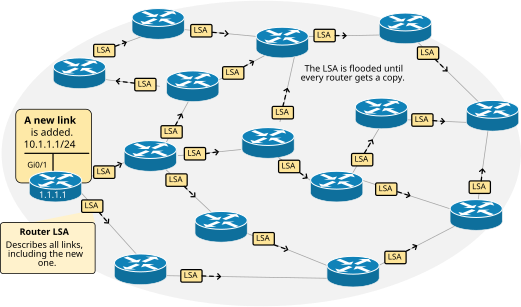

Figure 6. LSA flooding

Of course, there is a loop prevention mechanism that ensures an LSA update does not circle around indefinitely. However, a more important question is—**how does this LSA flooding process scale?** What if we have a network with 250 routers? Every single LSA update must be flooded to all 250 routers, which means, in practice, that every link-state change (for example, a link goes down) creates a flood of LSA across the entire network.

#### The LSDB (Link-State Database)

Every router stores the LSAs it receives into a database called the Link-State Database (LSDB). Since the LSA flooding ensures that every router receives a copy of every LSA, **each router in the OSPF network maintains an identical LSDB** and has a consistent view of the network.

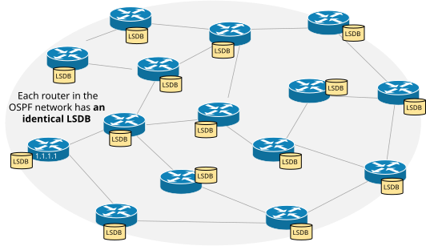

Figure 7. Each router has the same Link-State Database (LSDB)

When a router receives a new LSA, it updates its link-state database and forwards the LSA to its neighbors, ensuring all routers have the same LSDB.

### The SPF Algorithm

Another important aspect of OSPF is that **LSAs do not contain routing information that the router can directly add to its routing table**. An individual LSA is simply one piece of link-state information. All received LSAs make up the Link-state database (LSDB), which contains all information about the entire network. However, the LSDB does not provide routing information. It is a collection of all received LSAs.

The OSPF's mathematical algorithm, SPF, **uses the information in the link-state database as an input to calculate the shortest paths** that the router must add to its routing table, as shown in the diagram below.

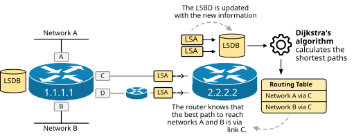

Figure 8. The SPF Algorithm

The SPF uses [Dijkstra's algorithm](https://en.wikipedia.org/wiki/Dijkstra%27s_algorithm) for finding the shortest path between nodes.

Here, it is important to understand that even though the LSDB is the same on all devices in the topology, the SPF algorithm, also known as Dijkstra's algorithm, **uses the LSDB to calculate the shortest path tree for the local router**. This tree represents the best paths to all destinations in the OSPF network from the local router's perspective. For example, every device has different best paths to network A.

#### Link Cost

One of the link-state properties of a link is called "cost." It is a numerical value assigned to each link between routers. This cost represents the "expense" or "distance" of sending packets over that link.

The SPF (Shortest Path First) algorithm uses the link cost to calculate the network's shortest and most efficient path. **Lower cost values indicate preferred links**, leading to optimal routing decisions.

OSPF commonly uses **the link's outgoing bandwidth to determine its cost**. Higher bandwidth links typically have lower costs, making them more attractive for routing decisions. The default formula used by many OSPF implementations for calculating cost is:

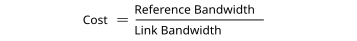

Link Cost formula

The Reference Bandwidth is a fixed value (usually 100 Mbps) that can be adjusted based on network requirements. The Link Bandwidth is the actual bandwidth of the link. For example, the following Ethernet interface has 10Mbps bandwidth, which translates to cost 100/10 = cost 10. Another example is a 100Mbps interface with a cost of 100/100 = 1.

```plaintext
R1# sh ip ospf interface
Ethernet0/0 is up, line protocol is up
  Internet Address 10.1.1.1/24, Interface ID 2, Area 0
  Attached via Network Statement
  Process ID 1, Router ID 1.1.1.1, Network Type BROADCAST, Cost: 10
  Topology-MTID    Cost    Disabled    Shutdown      Topology Name
        0           10        no          no            Base
  Transmit Delay is 1 sec, State BDR, Priority 1
  Designated Router (ID) 2.2.2.2, Interface address 10.1.1.2
  Backup Designated router (ID) 1.1.1.1, Interface address 10.1.1.1
  Timer intervals configured, Hello 10, Dead 40, Wait 40, Retransmit 5
    oob-resync timeout 40
    Hello due in 00:00:05
  Supports Link-local Signaling (LLS)
  Cisco NSF helper support enabled
  IETF NSF helper support enabled
  Can be protected by per-prefix Loop-Free FastReroute
  Can be used for per-prefix Loop-Free FastReroute repair paths
  Not Protected by per-prefix TI-LFA
  Index 1/1/1, flood queue length 0
  Next 0x0(0)/0x0(0)/0x0(0)
  Last flood scan length is 1, maximum is 1
  Last flood scan time is 0 msec, maximum is 1 msec
  Neighbor Count is 1, Adjacent neighbor count is 1
    Adjacent with neighbor 2.2.2.2  (Designated Router)
  Suppress hello for 0 neighbor(s)
```

Let's look at the following diagram as an example of how the cost works.

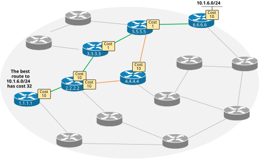

Figure 9. The cost value

Router 1.1.1.1 has multiple paths to reach subnet 10.1.6.0/24. However, the diagram shows the two paths with lower costs. Let's compare them and see why the one in green is the best.

**Route** | **Cumulative Cost**
--- | ---
1.1.1.1 - 2.2.2.2 - 3.3.3.3 - 5.5.5.5 - 6.6.6.6 | 10+10+1+1+10 = 32 (best)
1.1.1.1 - 2.2.2.2 - 3.3.3.3 - 4.4.4.4 - 6.6.6.6 | 10+10+10+1+10 = 41

The SPF algorithm uses the link costs from the LSDB to build a shortest path tree. It adds up the costs of the links along potential paths and selects the path **with the lowest total cost**. The following output shows an example of the best route to 10.1.6.0/24 from the point of view of R1. Notice that the route metric (highlighted in yellow) is 32, which is the total cost of reaching the destination.

```plaintext
R1# sh ip route
Codes: L - local, C - connected, S - static, R - RIP, M - mobile, B - BGP
       D - EIGRP, EX - EIGRP external, O - OSPF, IA - OSPF inter area
       N1 - OSPF NSSA external type 1, N2 - OSPF NSSA external type 2
       E1 - OSPF external type 1, E2 - OSPF external type 2, m - OMP
       n - NAT, Ni - NAT inside, No - NAT outside, Nd - NAT DIA
       i - IS-IS, su - IS-IS summary, L1 - IS-IS level-1, L2 - IS-IS level-2
       ia - IS-IS inter area, * - candidate default, U - per-user static route
       H - NHRP, G - NHRP registered, g - NHRP registration summary
       o - ODR, P - periodic downloaded static route, l - LISP
       a - application route
       + - replicated route, % - next hop override, p - overrides from PfR
       & - replicated local route overrides by connected
Gateway of last resort is not set
      10.0.0.0/8 is variably subnetted, 3 subnets, 2 masks
C        10.1.1.0/24 is directly connected, Ethernet0/0
L        10.1.1.1/32 is directly connected, Ethernet0/0
O        10.1.6.0/24 [110/32] via 10.1.1.2, 00:00:57, Ethernet0/0
```

Now, having seen how the protocol works, let's shift the focus to the scaling side of things. What if the network grows to hundreds or thousands of devices?

### Scaling the LSA-flooding process

We have seen how the LSA flooding process works to ensure that each device in the network maintains the same link-state database (LSDB). However, this LSA flooding process imposes a few scaling limitations:

- **Every LSA update must be flooded to all devices**. What if the network has 1,000+ routers and 10,000+ links? Imagine what the flooding process will look like.
- If a network has 10,000+ links, thousands of LSA updates will occur. **These LSAs must be stored in the link-state database (LSDB)**, which requires a lot of RAM memory. Routers' RAM is expensive - especially back in the old days when routers had a few MB of memory (keeping in mind that the protocol is 30+ years old).
- **Each new LSA triggers an update of the LSDB database**, which initiates a new run of the SPF algorithm, which requires a lot of processing power.
- The SPF algorithm takes more time to run when the link-state database is larger, which makes reacting to topology changes slower.

In short, the protocol requires more resources when scaling. **More routers equal more CPU and RAM and slower convergence time**.

To account for these scaling limitations, the protocol incorporates the concept of areas.

#### Areas

To scale, OSPF implements the area concept. An area **is a segment of the network where routers exchange routing information**. It helps in scaling large networks by dividing them into smaller sections, reducing the amount of routing information each device must process and store.

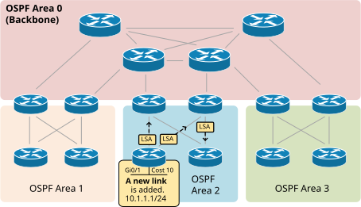

Figure 10. OSPF Areas

The area concept brings the following efficiency improvements:

- **Link state advertisements (LSA) are only flooded into the area**. For example, when we add a new link, as shown in the diagram above, the LSA update is only sent to the routers in Area 2. Compare this process to the one shown in Figure 6 above.
- **Each area has its own link-state database (LSDB)** - Since LSAs are only flooded within an area, only the devices within that area maintain the same LSDB, which makes the database smaller. This is a massive optimization from a performance point of view (required CPU and RAM memory).
- **Changes in one area do not affect the other areas**, which improves the convergence time. The devices in Area 1 do not need to run the SPF algorithm when a new link is added in Area 2, which optimizes the CPU usage.

Areas are a big concept that we discuss in great detail later in the course. However, here, we simply want to emphasize why they are required and important.

We have touched on the main aspects of the Open-Shortest-Path-First protocol. We can now see the key takeaways of this lesson.

## Key Takeaways

- OSPF is a link-state dynamic routing protocol. Its primary function is to calculate the best path to each IP destination in the network.
    - A link is simply **a router interface**.
    - The link state **describes the interface's properties**, such as its IP address and Subnet Mask, interface type, and relationship with neighboring routers.
- Each router in the network runs an independent local instance of the OSPF protocol.
- To start, the process needs a unique 32-bit Router ID.
- Multiple routers become neighbors when they sit on the same VLAN or data link.
    - The function of the neighboring process is to dynamically discover new OSPF routers without requiring manual reconfiguration.
    - Another function of the neighboring process is allowing the routers to exchange link-state information.
- OSPF uses an LSA flooding mechanism to distribute each link-state advertisement to every router in the network.
- The LSA a router receives is stored in a database called the Link-State Database (LSDB).
- When a router receives an LSA, it updates its LSDB and forwards the LSA to its neighbors, ensuring that all routers maintain the same LSDB.
- The LSDB is an input to the Dijkstra algorithm that calculates each network node's shortest paths.
- The concept of areas allows the protocol to scale efficiently.
