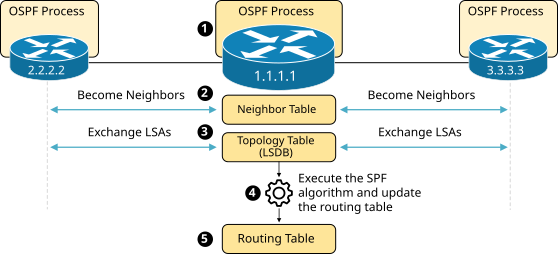
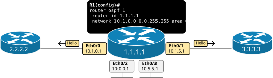
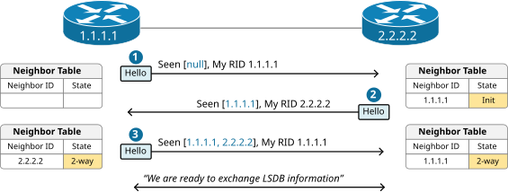
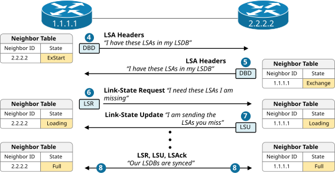
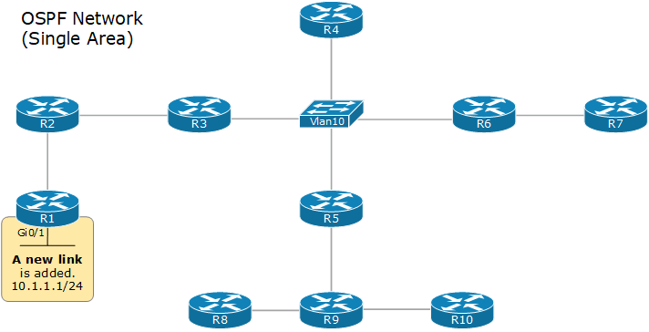
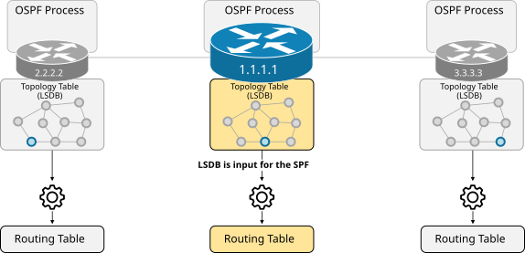
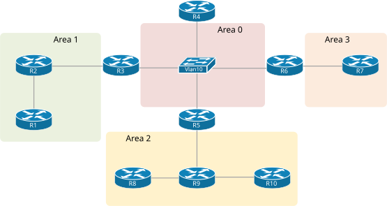

[How does OSPF work?](https://www.networkacademy.io/ccna/ospf/how-does-ospf-work)
==========

# How does OSPF work?

The last lesson introduced the most fundamental OSPF terms, such as LSA, LSDB, SPF, Areas, Cost, and Neighbors. In this lesson, we continue introducing new concepts and terms while zooming in on some of the topics discussed in the last lesson.

## Overview of OSPF Operation

To explain how the link-state protocol works, **we have broken down the OSPF operation into five steps**. Let's walk through each step and see how it works and what its function is in the bigger picture.



Figure 1. OSPF Operation Overview

- **Step 1. Enable the local OSPF process and choose RID**: The first step in the OSPF operation is to enable the local process on each router. When the process initializes, it must allocate a unique Router ID (RID) to be able to send OSPF messages.
- **Step 2. Establish neighbor adjacencies**: Once the routing process is enabled on a router, it starts sending Hello messages on all OSPF-enabled links to determine whether neighbors are present on those segments. If other OSPF-enabled devices sit on the same segment, the router attempts to establish a neighbor adjacency with that device.
- **Step 3. Exchange LSAs and build the topology table (the LSDB):** After the router becomes adjacent to the neighboring OSPF devices, it starts exchanging LSAs. Link-state Advertisements (LSAs) contain each directly connected link's cost and IP settings. Every router floods all LSAs to its neighbors until every device in the OSPF domain has all LSAs. This process is referred to as the LSA-flooding.
    - The router builds the link-state database (LSDB) based on the received LSAs. The LSDB holds all the information about the network's topology (hence, it is called the topology table). Because all LSAs are flooded to every router in the area, all routers in the same area have the same information in their LSDBs.
- **Step 4. Execute the SPF algorithm:** The LSDB serves as an input to the SPF algorithm. The algorithm calculates the best paths based on the advertised cost of each link and creates the SPF tree from the point of view of the local router.
- **Step 5. Update the routing table with the best paths:** Lastly, the router adds the best paths from the SPF tree into the routing table. The router then makes forwarding decisions based on the entries in the routing table.

Now, let's walk through each step in more detail and discuss the most important aspects of the protocol.

## Step 1. The OSPF Process

By default, the OSPF process is disabled on every Cisco IOS-XE device. It is enabled manually using the router ospf command via the CLI.



Figure 2. OSPF Basic Configuration

The diagram above serves as an example of the prerequisite involved in enabling the OSPF process on a device.

### OSPF Versions

First, pay attention to the fact that the protocol has evolved through several versions:

- **OSPFv1** was introduced in 1989. It was an experimental protocol and was never really used in production.
- **OSPFv2** was introduced in 1991 as specified in RFC 1247, later updated by [RFC 2328](https://datatracker.ietf.org/doc/html/rfc2328). It became the standard for IPv4 routing and is most widely adopted. In this course, we primarily discuss version 2.
- **OSPFv3** was introduced in 2008 as specified in RFC 5340, later updated by RFC 5838. It has been designed to support IPv6 natively, but it also supports IPv4.

When you enable the OSPF process with ID 1 using the following command, you enable version 2.

```plaintext
R1(config)# router ospf 1
```

When you enable the process with ID 1 using the command below, you enable version 3.

```plaintext
R1(config)# router ospfv3 1
```

Obviously, in our example shown in Figure 2, we enabled version 2 of the protocol.

### The Process ID

When enabling the process on a router, you must specify a process ID. It is a locally significant number between 1 and 65535 (216-1) as you can see below.

```plaintext
R1(config)# router ospf ?
  <1-65535>  Process ID
```

The OSPF process ID is only locally significant to the router. This means that different routers in the same OSPF network can use different process IDs without affecting OSPF operations.

The process ID allows multiple instances of OSPF to run on the same router. Each OSPF instance can be configured independently with its own set of parameters, areas, and interfaces.

### The Router ID

The OSPF process requires a Router ID (RID) to initialize and be able to send messages. The RID is **a unique 32-bit identifier**. There are two options regarding the RID:

- You can directly configure the RID under the process. This is the recommended approach.
- You can leave the router to choose a RID automatically.
    - The router tries to use the highest loopback IPv4 address.
    - If loopback IP isn't available, it tries to use the highest interface IPv4 address.

We are going to discuss the process of allocating an RID in greater detail later on. For now, let's show an example of configuring a Router ID 1.1.1.1 on the router in the example.

```plaintext
R1(config)# router ospf 1
R1(config-router)# router-id 1.1.1.1
R1(config-router)#
```

Remembering that the router ID must be unique within the entire network is very important.

### The Network Command

The last prerequisite before the router can send messages and form adjacencies with other routers is to specify which interfaces will participate in the OSPF process and which area they will belong to. By default, none of the interfaces are included in the routing process. We include a range of interfaces using the network command with the following syntax.

```plaintext
router ospf 1
 network <ip-address> <wildcard-mask> area <area-id>
```

The network command has two functions:

- It includes the interfaces that fall within the specified range in the OSPF process, meaning the router starts sending OSPF Hello packets to these interfaces.
- It advertises the prefix of the included interfaces within the OSPF domain.

The router checks each interface's IP address against the specified IP address and wildcard mask in the network command. If an interface's IP address falls within the specified range, the interface is included in the OSPF process for the given area.

Look at the example shown in Figure 2. Notice that the router has four interfaces - Eth0/0 through Eth0/3. However, only interfaces Eth0/0 (10.1.0.1) and Eth0/1 (10.1.5.1) are included in the OSPF process because their IP addresses match against the network command network 10.1.0.0 0.0.255.255 area 0. The IP addresses of the other two interfaces do not match against the network command and aren't included. Hence, the router doesn't send Hello messages over ports Eth0/2 and Eth0/3.

## Step 2. The Neighbor Table

Step 1 is basically a prerequisite for every router in the network that wants to run OSPF. When two routers have successfully enabled the routing process, allocated RID, and have an OSPF-enabled interface on the same link, they can become neighbors.

### Becoming OSPF Neighbors

The process of becoming OSPF neighbors can be broken down into two main phases, which we are going to discuss separately.

#### Becoming 2-Way Neighbors

Let's look at the example shown in the diagram below, where two routers, R1 (1.1.1.1) and R2 (2.2.2.2), are directly connected via a link. Both routers have just been configured and the link between them has just been brought up.



Figure 3. Becoming 2-Way Neighbors

- **Step 1.** In the beginning, both devices have an empty neighbor table because none of them have received Hello packets. This is referred to as the **Down state**.
- **Step 2.** When R2 receives the Hello packet from R1 but does not see its own router ID in the Hello message, it transitions to the **Init state**. In this state, R2 records R1's RID in its neighbor table and starts including R1's RID in the Hello messages that it sends on this link.
- **Step 3.** When R1 receives the Hello packet from R2 and sees its own router ID in the Hello message, it transitions its neighbor state with R2 to the **2-Way state**. This means that both routers recognize each other as neighbors. The process also takes place in the other direction until both become in a 2-way state.

Notice that there may be more routers sitting on the same link. In that case, every router includes all the RIDs it hears through received Hello packets in the Hello messages it sends.

#### Becoming Fully Adjacent

Once two routers become 2-way neighbors, they can start exchanging their Link-State Database information.



Figure 4. Becoming Fully Adjacent

- **Steps 4 and 5.** When R1 and R2 are in a 2-way state and decide to exchange their Link-State Databases (LSDBs), they do not simply send the entire LSDB to the remote neighbor. The entire database can be huge, and they may have almost identical LSDB. That's why they first sent a summary list of all the LSAs they have in the LSDB. This is done using Database Description (DBD) packets.
- **Step 6**. In the previous step, R2 sends a list of 50 LSAs that it has in the LSDB. R1 then queries its LSDB and finds that it misses only 5 LSAs from the list. Then R1 sends a Link-State Request (LSR) packet to request those 5 missing LSAs.
- **Step 7**. R2 sends the full five LSAs that R1 requested in the previous step using a Link-State Update (LSU) packet. Notice that one LSU packet can hold multiple LSAs.
- **Step 8**. In the end, the routers transition to Full state, meaning they have exchanged missing LSAs and now have identical LSDBs and views of the topology.

#### OSPF Packets

OSPF uses the following 5 packet types in the process of forming adjacencies and exchanging the LSDB database. The following table explains the function of each packet type. When you go through the table, go back and walk through the process of becoming neighbors again in the context of the packets used.

**OSPF Packet** (encapsulated in IP with protocol number 89) | **Description**
--- | ---
Hello | Routers periodically send Hello packets to build and maintain OSPF neighbor adjacencies. - Hello packets are sent to the link-local address 224.0.0.5 (the all-OSPF-routers address) - The hello messages include a lot of information about the sending router, such as Router ID, Area ID, and the Authentication used. - To become OSPF neighbors, the devices on both sides of a link must agree on some parameters in the Hello messages.
Database Description (DBD) | When two routers become OSPF neighbors, they start exchanging their link-state information. The Database Description (DBD) packet is simply a summary of the router's LSDB. - Routers exchange a summary of their LSDBs to determine if they have the same LSAs or if they are missing some LSAs. - It avoids sending the full LSDB to each OSPF neighbor.
Link-State Request (LSR) | If a router determines that it misses some LSAs, it sends a Link-State Request (LSR) packet to inform the neighbor to send the missing LSAs. - A router sends an LSR packet to request a list of missing LSAs.
Link-State Update (LSU) | There are several types of Link-State Update (LSU) packets, which are simply called LSAs. - A router sends an LSU packet when it wants to flood an LSA or respond to a Link-State Request (LSR). - In case of LSA flooding, the neighbors re-encapsulate the LSA into a new LSU packet and resend it further away.
Link-State Acknowledgment (LSAck) | Link-State Acknowledgments (LSAcks) are sent to confirm the reception of an LSU. Routers must explicitly acknowledge each received LSA. - Notice that multiple LSAs can be acknowledged with a single LSAck. - LSAcks make the LSA-flooding process reliable.

## Step 3. The Topology Table (LSDB)

Once all routers in the network reach a full state, it means that all devices have the same Link-State Database (LSDB). This means that every device has the same view of the topology.

When a router wants to advertise a new link or change in the topology, it sends a link-state advertisement (inside an LSU), which is flooded to all devices in the OSPF domain so that each one has the same topology view. This process is referred to as LSA-flooding.

### The LSA Flooding

The LSA flooding process ensures that all devices have a synchronized link-state database. The following diagram shows an example of the flooding process in a signal area network.



Figure 5. The LSA Flooding (animated)

Upon receiving a new LSA, each device updates its LSDB database and runs the SPF algorithm to calculate the best paths to every network.

This process works well in small and medium networks with less than a hundred routers. However, it has some scaling limitations in large networks with hundreds of routers and thousands of links. Let's walk through some of the sailing limitations, bearing in mind that the protocol is 30 years old.

- The LSDB becomes very large and requires a lot of RAM (back in the day, routers had a few MB of RAM)
- LSA flooding requires a lot of bandwidth (back in the day, links were 2Mbps and even less)
- The SPF algorithm requires a lot of CPU to run, translating to a lot of time to finish. (back in the day, devices had less powerful CPUs)
- Every event in the network (such as the interface going down -> up) forces every device to rerun the SPF algorithm.

## Step 4. The SPF Algorithm

The LSA flooding process ensures that every device has the same LSDB database. However, it is very important to understand from the very beginning that the LSDB does not provide routing information that the router can directly add to its routing table. The LSDB describes the entire network topology - all routers and all links. **It is like a map of the entire city**. However, a map does not tell you the fastest route between point A and point B. The map shows you all available path and their properties (boulevard, highway, street, etc.) However, you must compare different routes yourself and consider each route's capacity to select the fastest - highways are faster than city streets, which are faster than dirt roads, etc.

- LSDB is the map of the city. Every router is at a different place on the map.
- The SPF algorithm uses the map to find the fastest route from the local router to every remote destination.

Let's look at the diagram below, for example. Notice that **each router has the same topology view** of the network. However, every router must run the SPF algorithm to calculate the best route to every remote network from his local point of view. Because every router is at a different point in the topology. (every device is at a different place on the map)



Figure 6. SPF Algorithm

Every router must run the SPF algorithm on its own because the fastest route to network A could be different depending on each router's specific location in the topology. For example, the fastest path from R1 to network A may be different from the fastest path from R2 to network A, and so on.

In that context, OSPF uses the Dijkstra Shortest Path First (SPF) algorithm to process the LSDB and build the best path to every known network **from the local router's point of view**. The best routes the SPF algorithm calculates are then added to the routing table.

### The Area concept

As we have already said, single-area OSPF design suffers when the network grows beyond 50+ routers. The solution to this scaling limitation is to break the network into several smaller network areas. For example, if a large single-area network is analogous to a large city, a network with multiple smaller areas is analogous to multiple smaller interconnected cities.



Figure 7. OSPF Area Design

The area concept has multiple scaling benefits:

- The large LSDB is broken into smaller LSDBs per area.
- Each area has its own LSDB. For example, you only need to know the map of your city and the paths that lead to the other cities. You don't need to know the paths within another city.
- Since the LSDB of each area is much smaller, the OSPF process requires less RAM and CPU and less time to run the SPF.
- Changes in one area require only the routers in that area to perform SPF calculations, significantly reducing the number of times SPF must run.
- The LSA flooding process happens only within the area, reducing the required bandwidth.

## Key Takeaways

This lesson became larger than expected. We touched on the most important aspect of the link-state protocol. However, there is much more when you get into detail about how everything works and fits together. Anyway, let's walk through the most important parts of the lesson.

The protocol works in five main steps:

- **Step 1.** Enable the local routing process and choose RID.
- **Step 2.** Establish neighbor adjacencies.
- **Step 3.** Exchange LSAs and build the topology table (the LSDB).
- **Step 4.** Execute the SPF algorithm.
- **Step 5.** Update the routing table with the best paths.

Neighborship States:

- **Down State**
    - The initial state where no OSPF information has been exchanged between the routers.
- **Init State**
    - A router sends a Hello packet from its interfaces to find OSPF neighbors.
    - If a router receives a Hello packet that contains its router ID in the Neighbor field, it transitions to the 2-Way state.
- **2-Way State**
    - Both routers recognize each other as neighbors.
    - The routers establish a full adjacency based on their roles (DR/BDR election).
- **ExStart State**
    - The routers negotiate the master-slave relationship and the initial sequence number for the DBD (Database Description) packets.
    - The router with the higher router ID becomes the master.
- **Exchange State**
    - The routers exchange DBD packets, which contain summaries of their link-state databases.
    - These summaries include LSA (Link-State Advertisement) headers, which help identify missing or outdated LSAs.
- **Loading State**
    - The routers send LSRs (Link State Requests) for any LSAs they need based on the summaries received in the Exchange state.
    - The neighbors respond with LSU (Link State Update) packets containing the requested LSAs.
- **Full State**
    - Both routers have the same link-state database.
    - They have completed the exchange of LSAs and are fully adjacent.
    - OSPF routing can now occur based on the complete and synchronized link-state database.

## OSPF Packet Types

OSPF uses five different packet types to communicate between routers.

**Type 1: Hello** — These packets are used to discover neighbors, form adjacencies, and maintain neighbor relationships. Hello packets are sent periodically (every 10 seconds by default on broadcast networks). They contain the router ID, hello/dead intervals, area ID, and a list of known neighbors.

**Type 2: Database Description (DBD)** — These packets contain a summary of the router's link-state database. During the Exchange state, routers send DBD packets so each neighbor can compare what LSAs it has versus what the other router has.

**Type 3: Link-State Request (LSR)** — After comparing DBDs, a router uses LSR packets to request specific LSAs that it needs but doesn't have in its own database.

**Type 4: Link-State Update (LSU)** — These packets contain the actual LSAs being sent in response to LSRs. LSUs are also used to flood LSAs when a topology change occurs.

**Type 5: Link-State Acknowledgment (LSAck)** — These packets acknowledge receipt of LSUs, providing reliable delivery of LSAs.

## LSA Types

LSA types are the building blocks of the OSPF link-state database. Different LSA types carry different kinds of information.

| Type | Name | Description |
|------|------|-------------|
| 1 | Router LSA | Describes a router's directly connected links and their costs. Generated by every router and flooded within its area only. |
| 2 | Network LSA | Generated by the DR on multiaccess networks (like Ethernet). Lists all routers attached to the segment. Flooded within the area only. |
| 3 | Summary LSA (Network) | Generated by Area Border Routers (ABRs). Describes networks from one area to another. Used for inter-area routing. |
| 4 | Summary LSA (ASBR) | Generated by ABRs. Identifies the location of an Autonomous System Boundary Router (ASBR). |
| 5 | AS-External LSA | Generated by ASBRs. Describes routes that are external to the OSPF domain (redistributed from other protocols). |
| 7 | NSSA External LSA | Used in Not-So-Stubby Areas (NSSA) to carry external routes. Converted to Type 5 by the ABR. |

For the CCNA exam, you should focus on **LSA Types 1, 2, and 3**. Types 4, 5, and 7 are covered in the CCNP.

## OSPF Verification Commands

Once OSPF is configured, use these commands to verify its operation.

**Show OSPF neighbors:**

```plaintext
R1# show ip ospf neighbor

Neighbor ID     Pri   State           Dead Time   Address         Interface
10.0.0.2          1   FULL/DR         00:00:35    10.1.1.2        GigabitEthernet0/0
10.0.0.3          1   FULL/BDR        00:00:32    10.1.1.3        GigabitEthernet0/0
10.0.0.4          1   FULL/DR         00:00:38    10.1.2.2        GigabitEthernet0/1
```

This shows:
- Neighbor Router IDs, their interface priorities, and states
- FULL means the adjacency is fully established
- DR/BDR shows the neighbor's role on the multiaccess network
- Dead Time counts down from 40 seconds (4x Hello interval)

**Show OSPF interfaces:**

```plaintext
R1# show ip ospf interface gigabitEthernet 0/0
GigabitEthernet0/0 is up, line protocol is up
  Internet Address 10.1.1.1/24, Area 0
  Process ID 1, Router ID 10.0.0.1, Network Type BROADCAST, Cost: 1
  Transmit Delay is 1 sec, State DR, Priority 1
  Designated Router (ID) 10.0.0.1, Interface address 10.1.1.1
  Backup Designated router (ID) 10.0.0.2, Interface address 10.1.1.2
  Timer intervals configured, Hello 10, Dead 40, Wait 40, Retransmit 5
    Hello due in 00:00:03
  Neighbor Count is 1, Adjacent neighbor count is 1
    Adjacent with neighbor 10.0.0.2  (Backup Designated Router)
```

This shows:
- OSPF process and area information
- Network type and cost
- DR/BDR roles
- Hello and Dead timers
- Neighbor adjacency details

**Show OSPF database:**

```plaintext
R1# show ip ospf database

            OSPF Router with ID (10.0.0.1) (Process ID 1)

                Router Link States (Area 0)

Link ID         ADV Router      Age         Seq#       Checksum Link count
10.0.0.1        10.0.0.1        123         0x80000004 0x00A5B5 2
10.0.0.2        10.0.0.2        98          0x80000003 0x00B2C1 3
10.0.0.3        10.0.0.3        145         0x80000002 0x0098D3 2

                Net Link States (Area 0)

Link ID         ADV Router      Age         Seq#       Checksum
10.1.1.2        10.0.0.2        102         0x80000001 0x00D4E2
```

**Show OSPF routes:**

```plaintext
R1# show ip route ospf
     10.0.0.0/8 is variably subnetted, 5 subnets, 3 masks
O       10.0.2.0/24 [110/2] via 10.1.1.2, 00:12:34, GigabitEthernet0/0
O IA    10.0.3.0/24 [110/3] via 10.1.1.2, 00:08:21, GigabitEthernet0/0
O E2    0.0.0.0/0 [110/1] via 10.1.2.2, 00:05:12, GigabitEthernet0/1
```

The codes in the routing table:
- **O** — OSPF intra-area route (Type 1 and 2 LSAs)
- **O IA** — OSPF inter-area route (Type 3 LSA)
- **O E1/E2** — OSPF external route (Type 5 LSA)

## Summary

In this lesson, we covered the detailed operation of OSPF:

- OSPF operation can be broken down into **5 steps**: enable the process, establish adjacencies, exchange LSAs, run SPF, and populate the routing table.
- OSPF uses **5 packet types**: Hello, DBD, LSR, LSU, and LSAck.
- **LSA Types** carry different routing information — Type 1 (Router), Type 2 (Network), Type 3 (Summary), and others for external routes.
- OSPF goes through **7 neighbor states**: Down, Init, 2-Way, ExStart, Exchange, Loading, and Full.
- Key **verification commands** include `show ip ospf neighbor`, `show ip ospf interface`, `show ip ospf database`, and `show ip route ospf`.
