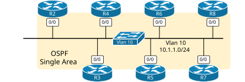
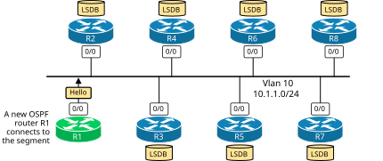
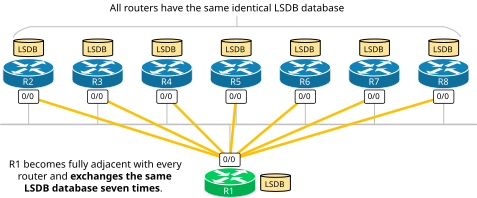
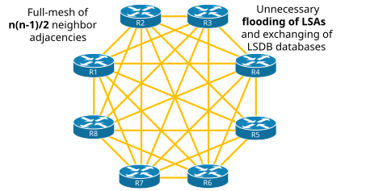
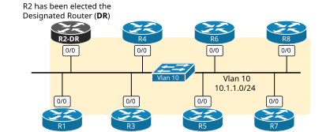
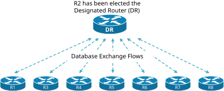
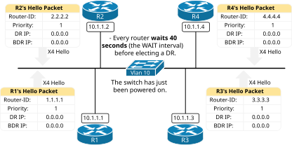
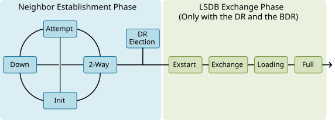
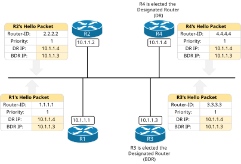
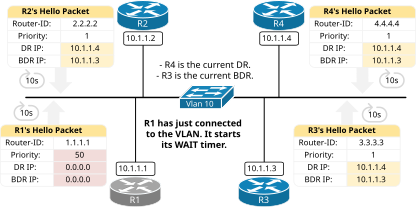

[OSPF DR and BDR](https://www.networkacademy.io/ccna/ospf/dr-and-bdr)
==========

# OSPF DR and BDR

This lesson demonstrates the OSPF concept of a Designated Router (DR) and a Backup Designated router (BDR). We discuss why we need DR and BDR in the first place. Then, we walk through the process of electing DR and BDR on a multiaccess segment and show some advanced examples.

At the end of the lesson, you will find the *Key Takeaways* and *Downloads* sections, where you can get the EVE-NG file we used to demonstrate the capability.

## Why do we need Designated Routers (DR and BDR)?

OSPF works by forming neighbor adjacencies and exchanging the link-state database between routers. Although the process of forming OSPF neighbors is essential to the protocol, it creates some inefficiencies in shared multiaccess segments such as a traditional Ethernet VLAN.

We will use the diagram shown below to explain why we need the concept of a Designated Router and a Backup Designated Router. Seven routers are attached to the same Ethernet segment—Vlan 10 with prefix 10.1.1.0/24.



Figure 1. Initial Toology - Seven OSPF routers on a shared segment.

All routers run OSPF in a single area. The topology is fully converged, and there are no ongoing events.

### The LSDB exchange on shared LANs

Let's see what happens when we connect a new OSPF router to the same Vlan, as shown in the following diagram.



Figure 2. A new router connects to the segment.

R1 starts sending OSPF Hello messages onto the LAN. Every router receives the Hello packet and inserts R1's Router ID in their Hello messages. This results in R1 becoming an OSPF neighbor with all seven routers, as shown in the topology below. Is this a bad thing? Let's continue ahead and see.



Figure 3. Inefficiency of the LSDB exchange process.

Since R1 is a brand-new router that has just been connected to the OSPF domain, its link-state database is basically empty. When R1 becomes a 2-way neighbor with each router, it then transitions to Exstart/Exchange/Loading phases and exchanges link-state information with every router. However, since all seven routers, R2 through R8, are in the same OSPF Area, **they have identical link-state databases (LSDB)**. So, what actually happens is that R1 receives the same LSDB database seven times in a row. Does this seem efficient? Obviously not.

In the past, when routers had only a few MB of RAM and a single slow CPU, this inefficiency was a big deal. (the protocol is 30+ years old) That's why network architects started to think of ways to optimize this process and make it work efficiently on multiaccess networks such as Ethernet LANs.

Let's think about the inefficiency for a while:

- R1 is a brand-new device with an empty LSDB database.
- R2 through R8 all have identical LSDBs.

Logically, it is enough for R1 **to only receive the LSDB from one of the neighbors** since all have identical LSDBs. But from which one? Well, this is the concept of the Designated Router - an automatically elected single router that handles the LSDB exchange on the shared LAN. Every other router exchanges link-state information **only with the DR** instead of separately with all neighbors.

### The LSA flooding on shared LANs

Additionally, every router becomes fully adjacent (neighbor in the state: Full) to every other device in the topology. This means **there are n(n-1)/2 adjacencies on the segment**, as shown in the diagram below. This is also inefficient.



Figure 4. A full mesh of neighbor adjacencies.

Upon a topology change in the area, such as an interface flap, every pair of routers exchanges LSA information, resulting in a massive flood of unnecessary identical LSA updates.

## What is the Designated Router (DR)?

To overcome the inefficiencies we have just seen, OSPF introduced the concept of a Designated Router. When multiple routers sit on the same VLAN, they automatically elect one router to act as the Designated Router.



Figure 5. R2 elected the Designated Router

When a Designated Router is elected for the segment, **routers only exchange database information with the DR,** as shown in the diagram below. This significantly optimizes the LSDB exchange process.



Figure 6. R2 has been elected the Designated Router.

Let's compare this scenario with the one we showed earlier in Figure 4:

- **Without a Designated Router**: With a full mesh of 23 OSPF adjacencies in a full state, 23 different instances of a database exchange will occur. Every router exchanges LSDB with seven others.
- **With a Designated Router**: With the introduction of a designated router (DR), every router performs a full database exchange ONLY with the DR.

This is a massive optimization of the shared LAN segment. Especially back in the old days when routers had a few MB of RAM and a single slow CPU.

## How does OSPF DR and BDR work?

Now, let's zoom in a bit and see how the DR/BDR election process works.

### The Election Process

The DR election process is **based on a parameter in the OSPF Hello packet called Priority**, which has values from 0 to 255 (28).

- By default, every router has Priority 1.
- A router with **a higher priority value** is eligible to be elected as the Designated Router (DR) on the VLAN segment.
- A router with priority 0 **is ignored** in the election process.
- If priorities are equal, the **highest Router ID** breaks the tie.

It is very important to remember the following aspects of the election process from the very beginning:

- **Each router performs the DR/BDR election process locally** with the information collected from neighbors' Hello packets. However, every device's algorithm is the same, so everyone reaches the same result.
- **There is no preemption in the DR/BDR process!** Once a device is elected the DR, another device cannot preempt the role until the current DR's OSPF process restarts. Even if a higher-priority device connects to the LAN, it cannot become DR until the current DR fails.

Let's walk through a couple of scenarios to demonstrate how the election process works.

#### Scenario 1: DR election on a new link

We have a simple topology of four devices connected to the same VLAN via a layer two switch that has just been powered on. This clarification is very important because it means no DR has been elected yet, and the process starts from scratch.



Figure 7. Designated Router election on a new link.

By default, every router sends a Hello packet every 10 seconds. In the Hello packet, every router includes its RID, the RIDs of other neighbors it hears, the default Priority of 1, and an empty DR and BDR IP address. Notice that the DR and BDR IP of 0.0.0.0 indicates that no Designated or Backup Designated routers have been elected yet.

During the WAIT interval of 40 seconds (equal to the DEAD timer or four Hello intervals), **none of the routers can claim themselves as DR or BDR**. Everybody is just listening. Additionally, none of the routers transition to Exstart/Exchange/Loading/Full neighbor states. Everyone is waiting for the DR/BDR election process to finish first.

The following diagram shows the OSPF neighboring states that routers go through before becoming fully adjacent and exchanging their LSDB. On multiaccess segments such as an Ethernet VLAN, routers become fully adjacent only with the DR and the BDR when such are elected.



Figure 8. Neighboring States

During the WAIT time, every router stays in a 2-WAY state with every remote neighbor and waits for the DR election process to finish. For example, during the WAIT time, R1 stays in a 2-WAY state with R2, R3, and R4 (highlighted in blue). Basically, R1 waits to understand who the DR and BDR are and establishes a full OSPF adjacent only to them.

```plaintext
R1# sh ip ospf neighbor
Neighbor ID     Pri   State           Dead Time   Address         Interface
2.2.2.2           1   2WAY/DROTHER    00:00:38    10.1.1.2        Ethernet0/0
3.3.3.3           1   2WAY/DROTHER    00:00:39    10.1.1.3        Ethernet0/0
4.4.4.4           1   2WAY/DROTHER    00:00:38    10.1.1.4        Ethernet0/0
```

Once the WAIT timer has passed, all four routers arrive at the conclusion that R4 is elected the Designated Router and R3 the Backup Designated Router. Since all four routers have the default priority of 1, R4 is elected the DR because it has the highest Router ID (4.4.4.4). R3 is the BDR because it has the second-highest RID. The routers include the DR and BDR IP addresses in their Hello packets, as shown in the diagram below.



Figure 9. The election process is now completed.

If we check the OSPF neighborship of R1 after the WAIT time has passed, we can see that it has established a full adjacency only with the DR (R4) and the BDR (R3), as shown in red. It stays in a 2-WAY state with every other router on the segment, for example with R2.

```plaintext
R1# sh ip ospf neighbor
Neighbor ID     Pri   State           Dead Time   Address         Interface
2.2.2.2           1   2WAY/DROTHER    00:00:39    10.1.1.2        Ethernet0/0
3.3.3.3           1   FULL/BDR        00:00:32    10.1.1.3        Ethernet0/0
4.4.4.4           1   FULL/DR         00:00:31    10.1.1.4        Ethernet0/0
```

We can check what is the configured priority value and WAIT timer for a given VLAN by checking the OSPF parameters on the interface that connects to the VLAN. For example, let's check the values of R1's Eth0/0 interface using the show IP ospf interface command. It gives so much useful information.

```plaintext
R1# sh ip ospf interface e0/0
Ethernet0/0 is up, line protocol is up 
  Internet Address 10.1.1.1/24, Interface ID 2, Area 0
  Attached via Network Statement
  Process ID 1, Router ID 1.1.1.1, Network Type BROADCAST, Cost: 10
  Topology-MTID    Cost    Disabled    Shutdown      Topology Name
        0           10        no          no            Base
  Transmit Delay is 1 sec, State DROTHER, Priority 1,
  Designated Router (ID) 4.4.4.4, Interface address 10.1.1.4
  Backup Designated router (ID) 3.3.3.3, Interface address 10.1.1.3
  Timer intervals configured, Hello 10, Dead 40, Wait 40, Retransmit 5
    oob-resync timeout 40
    Hello due in 00:00:07
  Supports Link-local Signaling (LLS)
  Cisco NSF helper support enabled
  IETF NSF helper support enabled
  Can be protected by per-prefix Loop-Free FastReroute
  Can be used for per-prefix Loop-Free FastReroute repair paths
  Not Protected by per-prefix TI-LFA
  Index 1/1/1, flood queue length 0
  Next 0x0(0)/0x0(0)/0x0(0)
  Last flood scan length is 0, maximum is 1
  Last flood scan time is 0 msec, maximum is 0 msec
  Neighbor Count is 3, Adjacent neighbor count is 2 
    Adjacent with neighbor 3.3.3.3  (Backup Designated Router)
    Adjacent with neighbor 4.4.4.4  (Designated Router)
  Suppress hello for 0 neighbor(s)
```

First, notice the state DROTHER. It means, "I am not the DR nor the BDR; I am simply another device." Next to it, you can see the configured priority. In this example, it is simply the default one.

Further down, highlighted in green, you can see who the currently elected DR and BDR are and what the WAIT timer for the interface is.

Notice that **two routers that are both DROTHER do not become fully adjacent**. They become neighbors in a 2-WAY state and stop there. They do not transition to the Exstart/Exchange/Loading phases (see Figure 8). For example, R1 and R2 are both DROTHER in the context of the Designated Router functionality (they are not the DR nor the BDR). That's why they stay in 2-WAY neighboring states, as you can see in the output below.

```plaintext
R1# sh ip ospf neighbor
Neighbor ID     Pri   State           Dead Time   Address         Interface
2.2.2.2           1   2WAY/DROTHER    00:00:30    10.1.1.2        Ethernet0/0
3.3.3.3           1   FULL/BDR        00:00:32    10.1.1.3        Ethernet0/0
4.4.4.4           1   FULL/DR         00:00:32    10.1.1.4        Ethernet0/0
```

However, it is very important to understand that in the end, both R1 and R2 end up with identical LSDB databases because they both exchange the LSDB with the designated router.

Now, let's look at another scenario where a DR already exists in the segment.

#### Scenario 2: DR election when one already exists

We have an existing topology of three OSPF devices that have been connected to the same VLAN for a long time. DR and BDR have already been elected for the VLAN.



Figure 10. Designated routers have already been elected.

R1 has just been connected to the VLAN. It is configured with an OSPF Priority of 50. Let's see what happens when it connects to the segment and hears the Hello messages of the other OSPF devices.

When R1's interface that connects to the VLAN comes up, it enters the INIT state. The OSPF WAIT timer starts. The device starts listening for OSPF Hello packets from other OSPF-enabled devices on the LAN.

### Full Content Access is for Subscribed Users Only...

- **Learn any CCNA, CCIE or Network Automation topic** with animated explanation.
- **We focus on simplicity.** Networking tutorials and examples written in simple, understandable language.

[Sign up for free ►](https://networkacademy.io/user/register)
