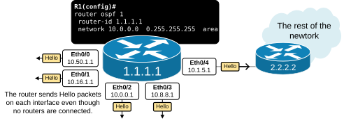
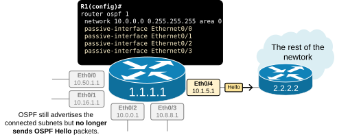
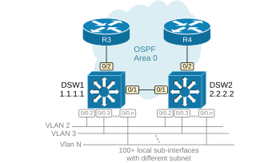
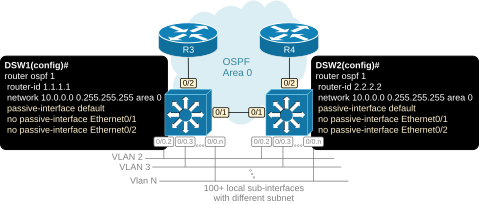

[OSPF Passive Interface](https://www.networkacademy.io/ccna/ospf/passive-interface)
==========

# OSPF Passive Interface

In this lesson, we discuss the topic of the OSPF passive interface. It is a feature that is very commonly used in real-world deployment and is part of the CCNA exam topics that students must be familiar with.

## Why do we need an OSPF passive interface?

A router often **does not need to form neighbor relationships on every interface**. For example, the router in the diagram below has five local interfaces connected to five different Ethernet segments.



Figure 1. OSPF Passive Interface Scenario 1

A remote OSPF router exists only on one of the interfaces, Eth0/4. This interface is called the uplink (leading to other routers). No router is present on the other four interfaces - Eth0/0-Eth0/3. They connect to segments with hosts only.

In such cases, it is obviously **inefficient to constantly send Hello packets on interfaces without routers**. It wastes resources and has security implications. However, to advertise the connected subnets in the routing process, you must enable the OSPF process on every interface, automatically instructing the router to send Hello packets out. So, what is the solution to advertise an interface's subnet but not send and receive Hello packets on the interface?

## What is the OSPF Passive Interface?

The solution is a feature called Passive Interface. A "passive-interface" is a network interface that participates in the OSPF routing process for advertisement purposes but does not send or receive OSPF routing updates. Here's what this entails:

When an interface is configured as an OSPF Passive Interface, it starts behaving like the following:

- The OSPF continues to advertise the interface's connected subnet.
- However, the OSPF process no longer sends Hello packets out on this interface.
- Additionally, the routing process no longer processes Hello packets received on this interface.

Let's look again at the example shown in Figure 1. Since interfaces Eth0/0 through Eth0/3 connect to host subnets with no router, we can configure them as passive interfaces, as shown in the diagram below.



Figure 2. Configure Passive-Interface Option 1

There are two options to configure an OSPF interface as passive. The most direct method involves simply configuring each one directly under the OSPF process, as shown in the example below. Notice in blue that we configure each interface connecting to host subnets as passive.

```plaintext
R1(config)# sh run | section ospf
router ospf 1
 router-id 1.1.1.1
 network 1.1.1.1 0.0.0.0 area 0
 network 10.0.0.0 0.255.255.255 area 0
 passive-interface Ethernet0/0
 passive-interface Ethernet0/1
 passive-interface Ethernet0/2
 passive-interface Ethernet0/3
```

Although the interfaces are configured as passive, they still participate in the routing process for advertisement purposes so they still appear under the **show ip ospf interface brief** command, as you can see in the output below.

```plaintext
R1# show ip ospf interface brief
Interface    PID   Area            IP Address/Mask    Cost  State Nbrs F/C
Lo0          1     0               1.1.1.1/32         1     LOOP  0/0
Et0/0        1     0               10.16.1.254/24     10    DR    0/0
Et0/1        1     0               10.1.1.1/24        10    DR    0/0
Et0/2        1     0               10.55.2.1/24       10    DR    0/0
Et0/3        1     0               10.32.16.1/24      10    DR    0/0
Et0/4        1     0               10.0.0.1/24        10    DR    1/1
```

To verify if the interface is configured as passive, you must check the detailed interface command, as shown below.

```plaintext
R1# sh ip ospf interface Et0/0
Ethernet0/0 is up, line protocol is up
  Internet Address 10.16.1.254/24, Interface ID 2, Area 0
  Attached via Network Statement
  Process ID 1, Router ID 1.1.1.1, Network Type BROADCAST, Cost: 10
  Topology-MTID    Cost    Disabled    Shutdown      Topology Name
        0           10        no          no            Base
  Transmit Delay is 1 sec, State DR, Priority 1
  Designated Router (ID) 1.1.1.1, Interface address 10.16.1.254
  No backup designated router on this network
  Timer intervals configured, Hello 10, Dead 40, Wait 40, Retransmit 5
    oob-resync timeout 40
    No Hellos (Passive interface)
  Supports Link-local Signaling (LLS)
  Cisco NSF helper support enabled
  IETF NSF helper support enabled
  Can be protected by per-prefix Loop-Free FastReroute
  Can be used for per-prefix Loop-Free FastReroute repair paths
  Not Protected by per-prefix TI-LFA
  Index 1/2/2, flood queue length 0
  Next 0x0(0)/0x0(0)/0x0(0)
  Last flood scan length is 0, maximum is 0
  Last flood scan time is 0 msec, maximum is 0 msec
  Neighbor Count is 0, Adjacent neighbor count is 0
  Suppress hello for 0 neighbor(s)
```

## Most Common Scenarios

Let's look at another typical example, which shows the second method of configuring interfaces as passive. Figure 3 shows a traditional distribution layer design where two switches (DSW1 and DSW2) aggregate multiple access Vlans and connect to the WAN portion of the network. Each switch has hundreds of sub-interfaces/interface Vlans connecting end hosts.



Figure 3. Configure Passive-Interface Scenario 2

In our example, we only show 10 sub-interfaces so that the output can fit, but think of it as a scale of hundreds.

```plaintext
DSW1# sh ip int brief
Interface              IP-Address      OK? Method   Status    Protocol
Ethernet0/0            10.10.0.1       YES NVRAM    up        up
Ethernet0/0.1          10.10.1.1       YES manual   up        up
Ethernet0/0.2          10.10.2.1       YES manual   up        up
Ethernet0/0.3          10.10.3.1       YES manual   up        up
Ethernet0/0.4          10.10.4.1       YES manual   up        up
Ethernet0/0.5          10.10.5.1       YES manual   up        up
Ethernet0/0.6          10.10.6.1       YES manual   up        up
Ethernet0/0.7          10.10.7.1       YES manual   up        up
Ethernet0/0.8          10.10.8.1       YES manual   up        up
Ethernet0/0.9          10.10.9.1       YES manual   up        up
Ethernet0/0.10         10.10.10.1      YES manual   up        up
<100+ more sub-interfaces or interface Vlans>       
Ethernet0/1            172.16.1.1      YES NVRAM    up        up
Ethernet0/2            172.16.3.1      YES NVRAM    up        up
Loopback0              1.1.1.1         YES NVRAM    up        up
```

What do you think will happen if we configure the OSPF process on both distribution switches without using the passive-interface feature, as shown in the output below?

```plaintext
! Routing configuration on DSW1 and DSW2
router ospf 1
 router-id 1.1.1.1
 network 1.1.1.1 0.0.0.0 area 0
 network 10.0.0.0 0.255.255.255 area 0
 network 172.16.0.0 0.0.255.255 area 0
```

Since all interfaces participate in the routing process, the switches send Hello packets on each interface, hear each other, and become fully adjacent. This unnecessarily leads to DSW1 and DSW2 becoming OSPF neighbors hundreds of times, as you can see in the putout below. However, the switches are already fully adjacent over their direct link Eth0/1, and their LSDB databases are fully synchronized.

```plaintext
DSW1# sh ip ospf neighbor
Neighbor ID  Pri   State      Dead Time   Address       Interface
2.2.2.2        1   FULL/DR    03:21:38    10.10.10.2    Ethernet0/0.10
2.2.2.2        1   FULL/DR    03:21:39    10.10.9.2     Ethernet0/0.9
2.2.2.2        1   FULL/DR    03:21:36    10.10.8.2     Ethernet0/0.8
2.2.2.2        1   FULL/DR    03:21:37    10.10.7.2     Ethernet0/0.7
2.2.2.2        1   FULL/DR    03:21:38    10.10.6.2     Ethernet0/0.6
2.2.2.2        1   FULL/DR    03:21:37    10.10.5.2     Ethernet0/0.5
2.2.2.2        1   FULL/DR    03:21:38    10.10.4.2     Ethernet0/0.4
2.2.2.2        1   FULL/DR    03:21:37    10.10.3.2     Ethernet0/0.3
2.2.2.2        1   FULL/DR    03:21:35    10.10.2.2     Ethernet0/0.2
2.2.2.2        1   FULL/DR    03:21:35    10.10.1.2     Ethernet0/0.1
2.2.2.2        1   FULL/DR    03:21:35    10.10.0.2     Ethernet0/0
<100+ more routing adjacencies with the same remote neighbor>  
2.2.2.2        1   FULL/BDR   03:22:35    172.16.1.2    Ethernet0/1
3.3.3.3        1   FULL/BDR   03:22:35    172.16.3.2    Ethernet0/2
```

Obviously, this is inefficient from a resources point of view. However, it also has security implications. Thousands of end-hosts can hear the OSPF Hello packets that the switches periodically send on each interface, which can lead to unauthorized adjacencies if OSPF authentication isn't used.

We have already seen the solution to this problem. However, when you want to configure a large number of interfaces as passive, you can use another approach. You can configure the command passive-interface default, which makes ALL interfaces passive. And then, simply disable the passive-interface functionality on the ones that must form an adjacency with remote devices. Figure 4 shows how we apply this logic to the example with the two distribution swithces.



Figure 4. Configure Passive-Interface Option 2

We re-configure both switches with the commands highlighted in blue below.

```plaintext
! Routing configuration on DSW1 and DSW2
router ospf 1
 router-id 1.1.1.1
 network 1.1.1.1 0.0.0.0 area 0
 network 10.0.0.0 0.255.255.255 area 0
 network 172.16.0.0 0.0.255.255 area 0
 passive-interface default
 no passive-interface Ethernet0/1
 no passive-interface Ethernet0/1
```

Now, if we check the neighbor adjacencies of both devices, we can see that they do not form any unnecessary adjacencies over undesired interfaces.

```plaintext
DSW1# sh ip ospf neighbor
Neighbor ID  Pri   State      Dead Time   Address       Interface
2.2.2.2        1   FULL/BDR   04:15:35    172.16.1.2    Ethernet0/1
3.3.3.3        1   FULL/BDR   04:15:35    172.16.3.2    Ethernet0/2
```

However, the passive interfaces still participate in the link-state routing as shown below, and their subnets are advertised to remote neighbors.

```plaintext
DSW1# sh ip ospf interface brief
Interface    PID   Area     IP Address/Mask    Cost  State Nbrs F/C
Lo0          1     0        1.1.1.1/32         1     LOOP  0/0
Et0/0.10     1     0        10.10.10.1/24      10    BDR   1/1
Et0/0.9      1     0        10.10.9.1/24       10    BDR   1/1
Et0/0.8      1     0        10.10.8.1/24       10    BDR   1/1
Et0/0.7      1     0        10.10.7.1/24       10    BDR   1/1
Et0/0.6      1     0        10.10.6.1/24       10    BDR   1/1
Et0/0.5      1     0        10.10.5.1/24       10    BDR   1/1
Et0/0.4      1     0        10.10.4.1/24       10    BDR   1/1
Et0/0.3      1     0        10.10.3.1/24       10    BDR   1/1
Et0/0.2      1     0        10.10.2.1/24       10    BDR   1/1
Et0/0.1      1     0        10.10.1.1/24       10    BDR   1/1
Et0/0        1     0        10.10.0.1/24       10    BDR   0/0
<100+ more sub-interfaces or interface Vlans> 
Et0/1        1     0        172.16.1.1/24      10    DR    0/0
Et0/2        1     0        172.16.3.1/24      10    DR    0/0
```

## Key Takeaways

OSPF Passive Interface is a network interface that participates in the routing process for subnet advertisement purposes but does not send or receive OSPF Hello packets.

Benefits:

- **Resource Efficiency:** On specific interfaces, such as those connected to end devices (e.g., a LAN interface on a router where the other devices are not routers), there may be no need to establish OSPF adjacencies. Using passive interfaces can reduce unnecessary OSPF processing and traffic.
- **Security:** By making an interface passive, you can prevent OSPF adjacencies with unauthorized or unintended devices, which helps secure the routing domain.

In practice, configuring an OSPF passive interface is a common technique for controlling the behavior of OSPF on specific network segments, especially in scenarios where network topology or security considerations make it undesirable to form OSPF neighbor relationships.
